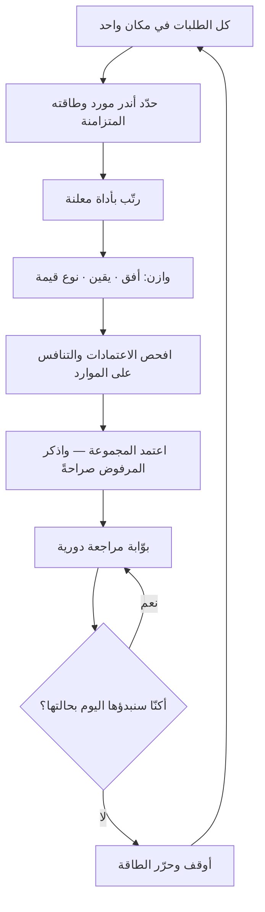

# تحسين المحفظة (Portfolio Optimization)

> [!info] تعريف مختصر
> **تحسين المحفظة** اختيار **مجموعة** المبادرات التي تُنفَّذ معًا، بحيث تحقّق أعلى قيمة ممكنة ضمن القيود المتاحة وبتوزيع مقبول للمخاطر والآجال. **وأهمّ ما فيه أن الوحدة مجموعة لا مبادرة**: فالمشروع الذي يبدو الأعلى قيمة منفردًا قد لا يستحقّ موضعه في المجموعة إن كان يستهلك المورد النادر نفسه الذي تحتاجه ثلاثة غيره. ولهذا لا يُنجَز التحسين بترتيب قائمة تنازليًّا واقتطاع أعلاها، بل بسؤالين معًا: **ما الذي نبدؤه؟ وما الذي نوقفه؟** — والثاني هو الذي يُهمَل، وهو الذي يقرّر النتيجة.

## الشرح العلمي والاحترافي

### 1. التسمية جاءت من المال، والمعنى انتقل

المصطلح استعارة من نظرية المحفظة المالية (**هاري ماركوفيتز**، 1952)، وفكرتها أن الأصل لا يُقيَّم منفردًا بل بأثره على **المجموعة**: فأصلٌ عائده أقلّ قد يستحقّ موضعه لأنه لا يتحرّك مع البقيّة، فيقلّ تذبذب المحفظة كلّها.

والمعنى المنقول إلى المشاريع هو هذا بعينه: **التنويع في نوع المبادرة وأفقها الزمني ودرجة يقينها ليس تردّدًا بل تصميم**. أمّا الآليّات المالية — الارتباط المحسوب والحدّ الكفء — فلا تُنقل، لأن مشاريع المؤسّسة ليست مستقلّة ولا تتوافر لها بيانات تاريخية بتلك الدقّة. **فتُؤخذ الفكرة ولا تُدّعى الرياضيات.**

### 2. القيد الحقيقي ليس المال

هذا أكثر ما يُخطئ فيه اختيار المحافظ: تُبنى المحفظة على الميزانية، ثم تتعثّر على شيء آخر. فالقيد الفعليّ في أكثر المؤسّسات:

| القيد | لماذا يُهمَل |
|---|---|
| **طاقة أشخاص بعينهم** | يُحسَب عدد المطوّرين ولا يُحسَب أن معماريًّا واحدًا مطلوب في ستّة مشاريع |
| **طاقة الجهة المستفيدة** | يُنسى أن التبنّي يحتاج وقت موظّفي العميل، لا وقت الفريق وحده |
| **تحمّل التغيير** | المؤسّسة التي تتلقّى ثلاثة أنظمة جديدة في ربع لا تستوعبها ولو مُوّلت كلّها |
| **الاعتماد المتبادل** | مشروعان يتنافسان على المكوّن نفسه فيتعطّلان معًا |

**والقاعدة العملية:** تُبنى المحفظة على **أندر مورد** لا على الميزانية. والحدّ الذي يمنع الانهيار واحد: **[[WIP Limit|حدّ العمل الجاري]]** على مستوى المؤسّسة لا الفريق.

### 3. ثلاثة أبعاد للموازنة

المحفظة المتّزنة لا تُقاس بمجموع درجاتها بل بتوزيعها على ثلاثة:

1. **الأفق الزمني** — بين ما يُثمر هذا الربع وما يُثمر بعد سنتين. والمحفظة كلّها قصيرة الأفق تأكل مستقبلها، وكلّها بعيدة تفقد تمويلها قبل أن تثمر.
2. **درجة اليقين** — بين ما نعرف كيف يُنفَّذ وما هو رهانٌ عالي العائد. والقاعدة الشائعة أن يبقى للرهانات نصيب صغير معلَن لا أن تُلغى ولا أن تسيطر.
3. **نوع القيمة** — نموّ، وكفاءة تشغيلية، وامتثال إلزامي، وسدادُ دَينٍ تقني. والصنف الرابع أوّل ما يُقتطع في كل جولة، ثم يظهر ثمنه بعد عامين في بطء كل ما بعده.

### 4. الإيقاف أصعب من الاختيار

المحفظة تفسد بالتراكم لا بسوء الاختيار الأوّل: يُبدأ ولا يُوقَف، فتصير الطاقة موزّعة على عشرين شيئًا يتقدّم كلٌّ منها ببطء. **ومانع الإيقاف نفسيّ وتنظيميّ لا تحليليّ**: [[Sunk Cost Fallacy|مغالطة الكلفة الغارقة]] من جهة، وأن الإيقاف يُقرأ اعترافًا بالفشل من جهة أخرى.

**والعلاج بنيويّ:** أن تكون لكل مبادرة **بوّابة مراجعة معلَنة** يُسأل عندها سؤال واحد — *لو عُرضت علينا اليوم بحالتها هذه، أكنّا سنبدؤها؟* فإن كان الجواب لا، فالاستمرار قرارٌ يحتاج مبرّرًا، لا هو الوضع الافتراضي.

### 5. موضعه من أدوات الترتيب

أدوات مثل [[WSJF]] و[[ICE Scoring]] و[[Weighted Scoring|التقييم الموزون]] **ترتّب** المبادرات ولا **تختار** المحفظة. والفرق عمليّ: الترتيب يعطيك تسلسلًا، والاختيار يعطيك مجموعةً تراعي القيود والموازنة والإيقاف. فمن اكتفى بالترتيب واقتطع أعلاه حصل غالبًا على محفظة كلّها من نوع واحد وأفق واحد، تتنافس كلّها على المورد النادر نفسه.

## أين ومتى يُستخدم

- في التخطيط السنوي والربعي على مستوى [[23 - Project Program Portfolio|المحفظة]] لا المشروع.
- عند تجاوز الطلبات للطاقة تجاوزًا بيّنًا — وهو الحال المعتاد لا الاستثناء.
- في [[Project Intake|استقبال المشاريع]]، إذ يجب أن يُقابَل كل طلب جديد بسؤال: **وأيّها نوقف مقابله؟**
- عند خفض الميزانية، فالخفض المتساوي على الجميع أسوأ الخيارات: يُبطئ كل شيء ولا يُنهي شيئًا.
- في مراجعة [[Steering Committee|اللجنة التوجيهية]]، بأن تكون بوّابةَ استمرارٍ لا عرضَ حالة.

## مثال وسيناريو تطبيقي

> [!example] سيناريو ملموس
> مؤسّسة أمامها أربع عشرة مبادرة مقترحة لعام قادم، وميزانية تكفي تسعًا.
>
> **المسار المعتاد:** رُتّبت بالتقييم الموزون، وأُخذت التسع الأعلى. فكانت النتيجة: ثمانٍ منها مبادرات نموّ، وواحدة كفاءة تشغيلية، ولا شيء لسداد الدَّين التقني. وستٌّ منها تحتاج **مهندس البيانات الوحيد** في المؤسّسة.
>
> **وما وقع بعد ستّة أشهر:** أُنجزت اثنتان، وتعثّرت أربع بانتظار المهندس نفسه، وثلاث لم تبدأ.
>
> **المسار البديل:** بُدئ من **أندر مورد** لا من الميزانية. فتبيّن أن طاقة مهندس البيانات تحتمل **ثلاث** مبادرات متزامنة لا ستًّا. ثم وُزّعت المحفظة على الأبعاد الثلاثة صراحةً:
>
> | النوع | العدد | العلّة |
> |---|---|---|
> | نموّ قريب الأفق | 3 | تموّل الباقي |
> | نموّ بعيد الأفق | 1 | رهانٌ معلَن نصيبه محدود |
> | كفاءة تشغيلية | 2 | تُحرّر طاقةً تعود إلى المحفظة |
> | سداد دَين تقني | 1 | يُقصّر زمن كل ما بعده |
>
> **فصارت سبعًا لا تسعًا** — وأُنجزت ستّ منها. والفارق ليس في جودة الاختيار بل في أن الطاقة لم تُوزَّع على ما لا يمكن أن يتقدّم معًا.

## خطوات أو مخطّط

1. اجمع كل الطلبات في مكان واحد ظاهر — فالمحفظة التي نصفها غير معروف لا تُحسَّن.
2. حدّد **أندر مورد** فعليًّا، لا الميزانية وحدها، واحسب ما يحتمله متزامنًا.
3. رتّب المبادرات بأداة معلنة ([[WSJF]] · [[Weighted Scoring]])، وعُدّ الترتيب مُدخلًا لا قرارًا.
4. وازن المجموعة على الأبعاد الثلاثة: الأفق، واليقين، ونوع القيمة.
5. افحص الاعتمادات المتبادلة: أي مبادرتين تتنافسان على المكوّن أو الشخص نفسه؟
6. **اذكر صراحةً ما لن يُنفَّذ** ولماذا، ولا تتركه في منطقة «مؤجَّل» الرمادية.
7. ضع لكل مبادرة بوّابة مراجعة، ويكون السؤال فيها: أكنّا سنبدؤها اليوم بحالتها هذه؟

## ⚠️ مفاهيم خاطئة شائعة

> [!warning]
> - **حسبانه ترتيبًا للأولويات.** الترتيب يعطي تسلسلًا، والتحسين يعطي **مجموعةً** تراعي القيود والموازنة والإيقاف — وأخذ أعلى القائمة ليس اختيار محفظة.
> - **بناء المحفظة على الميزانية.** فالقيد الفعليّ غالبًا طاقة أشخاص بعينهم أو تحمّل المؤسّسة للتغيير، والمال أيسرها توفيرًا.
> - **الظنّ أن أعلى مجموع درجات هو الأفضل.** فالمحفظة كلّها من نوع واحد وأفق واحد هشّة مهما بلغ مجموعها.
> - **نقل رياضيات المحفظة المالية حرفيًّا.** فمشاريع المؤسّسة مترابطة وبياناتها التاريخية شحيحة؛ والمنقول الفكرة — أن التنويع تصميم — لا الحساب.
> - **حسبان «مؤجَّل» رفضًا.** بل هي أخطر خانة في المحفظة: تستهلك انتباهًا ومتابعة وأملًا، ولا تُنتج شيئًا.

## ❌ ممارسات خاطئة في المشاريع

> [!failure]
> - **قبول كل مبادرة جديدة بلا إيقاف مقابلها**، فتتوزّع الطاقة حتى لا يتقدّم شيء بسرعة تُلاحَظ.
> - **الخفض المتساوي عند تقليص الميزانية**، فتُبطَّأ المبادرات كلّها ولا تُنهى أيّها — وهو أسوأ من إلغاء ثلثها.
> - **إهمال صنف سداد الدَّين التقني** في كل جولة، فتظهر كلفته بعد عامين في بطء يمسّ كل مبادرة تالية.
> - **الاستمرار في مبادرة لأن ما أُنفق عليها كثير** — وهي [[Sunk Cost Fallacy|مغالطة الكلفة الغارقة]] بعينها، وأشيع علّة للاستمرار في المحافظ.
> - **إخفاء المرفوض بدل إعلانه**، فيعود صاحبه بالطلب نفسه في كل جولة، وتُستهلك المداولة في إعادة القرار لا في تنفيذه.

## 🔗 مصطلحات ومفاهيم ذات صلة

[[23 - Project Program Portfolio]] | [[WSJF]] | [[ICE Scoring]] | [[Weighted Scoring]] | [[Prioritization]] | [[WIP Limit]] | [[Capacity]] | [[Sunk Cost Fallacy]] | [[Cost of Delay]] | [[Project Intake]] | [[Steering Committee]] | [[Governance]] | [[Technical Debt]] | [[Business Case]]
