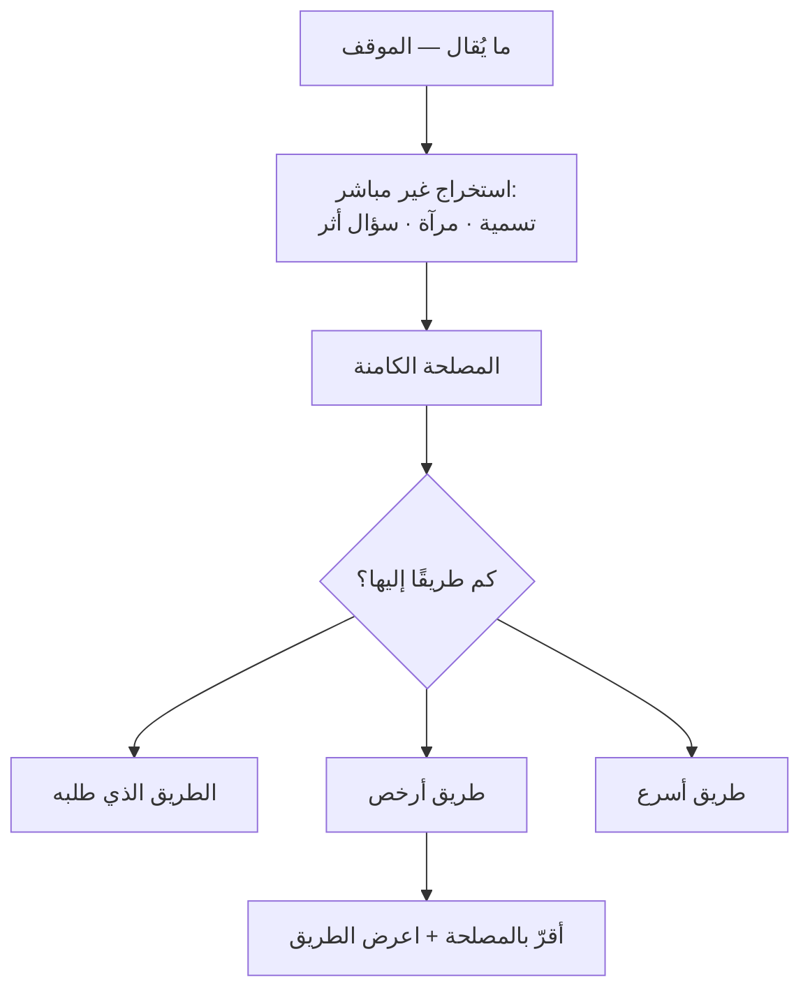

# المواقف مقابل المصالح (Positions vs Interests)
> [!info] تعريف مختصر
> **الموقف** ما يقوله الطرف إنّه يريده؛ و**المصلحة** السبب الكامن الذي يجعله يريده. والموقف قابل للرفض، **والمصلحة غالبًا لها أكثر من طريق** — فمن يرفض الموقف يبدو رافضًا للمصلحة فيُقاوَم، ومن يُقرّ بالمصلحة ويعرض طريقًا آخر يُوافَق غالبًا.

## الشرح العلمي والاحترافي
التمييز المركزي في *Getting to Yes* لـ**فيشر ويوري** (1981)، ومثاله الشهير: أختان تتنازعان برتقالة فتُقسَم نصفين — بينما إحداهما تريد العصير والأخرى تريد القشر للخَبز. **الحلّ الأمثل كان متاحًا، وحجبه أنّ أحدًا لم يسأل عن السبب.**

**وفي بيئة العمل يُترجَم إلى «الطلب مقابل الحاجة»:**

| ما يُقال (الموقف) | المصلحة الأرجح | طرق أخرى إليها |
|---|---|---|
| «أدخِل هذه الميزة في السبرنت الحالي» | أن يظهر مُستجيبًا أمام العميل | عرض مسبق بجدول التنفيذ · جزء صغير قابل للعرض · رسالة منه بموعد محدّد |
| «لا بدّ أن نُعيد كتابة الخدمة من الصفر» | شيء يُعطّله يوميًّا · أو رغبة في تعلّم · أو حرج مهنيّ | إصلاح موضعي · مساحة تجريب · توثيق أنّ الحالة موروثة |
| «أريد تقارير أسبوعية مفصّلة» | لا يعرف ما يجري فيقلق | لوحة مباشرة · تنبيه عند انحراف · اجتماع 15 دقيقة |
| «لن نُغيّر موعد الاجتماع» | استقلالية — قرار فُرِض بلا مشاركة | إشراكه في اختيار الموعد |

**والفرق عن [[Tactical Empathy|التعاطف التكتيكي]] في طريقة الاستخراج لا في المفهوم:** هارفارد تسأل مباشرةً «لماذا هذا مهمّ لك؟» — وهو سؤال ممتاز بين طرفين هادئين متكافئين؛ أمّا مع مدير يفتتح بتهديد فيُقرأ **استجوابًا** فيُنتج تبريرًا دفاعيًّا. ولهذا يُستبدَل به الاستخراج غير المباشر: [[Labeling|تسمية]] · [[Mirroring|مرآة]] · صمت.

## أين ومتى يُستخدم
- كلّ طلب تراه غير معقول — قبل أن ترفضه.
- تعارض بين قسمين يبدو صفريّ المجموع.
- مفاوضات النطاق مع [[Stakeholder Map|أصحاب المصلحة]].
- تحليل اعتراض متكرّر على عملية أو أداة.

## مثال وسيناريو تطبيقي
> [!example] مطوّر يقول: «لا بدّ أن نُعيد كتابة هذه الخدمة من الصفر» — مشروع شهور. **رفض الموقف** («ليس لدينا وقت») يُنتج مقاومة لأنّه يبدو رفضًا لحاجته؛ **وقبوله فورًا** يُنفق شهورًا على حاجة كان يمكن تلبيتها في أيّام. فالتسلسل: [[Mirroring|مرآة]] — «من الصفر؟» — وصمت؛ ثم [[Calibrated Questions|سؤال معايَر]] يطلب **الأثر** لا المبرّر: «ما الذي سيتغيّر في عملنا اليومي بعد إعادة الكتابة؟» فيتبيّن أنّ وحدة التقارير تُبطئ كلّ ميزة جديدة. **فالمصلحة أن يتوقّف الإبطاء اليومي، والطريق إليها ثلاثة أيّام لا ثلاثة شهور.**

## خطوات أو مخطّط
1. اكتب **الموقف** كما قيل حرفيًّا.
2. لا ترفضه ولا تقبله — استخرج **المصلحة** بتسمية أو مرآة أو سؤال عن **الأثر**.
3. اسأل نفسك: **كم طريقًا يُوصل إلى هذه المصلحة؟** — الجواب غالبًا أكثر من واحد.
4. أقرّ بالمصلحة صراحةً، واعرض الطريق الأرخص.
5. إن تعذّر كلّ طريق، فالرفض حينها يُقرأ رفضًا للطريق لا للحاجة.

## ⚠️ مفاهيم خاطئة شائعة
> [!warning]
> - **المصلحة ليست دائمًا معلومة لصاحبها.** كثير من الطلبات حلولٌ ارتجلها صاحبها لمشكلة لم يُسمّها؛ فالسؤال المباشر عنها قد لا يُنتج جوابًا صحيحًا.
> - **ليست كلّ مصلحة مشروعة، ولا كلّ طريق مقبولًا.** الإقرار بالمصلحة لا يعني الالتزام بتلبيتها.
> - **بعض المصالح غير قابلة للإفصاح بنيويًّا** — مدير يعلم أنّ المشروع سيُلغى، أو التزام سياسي لا يُذكَر. وحينها تتوقّف عن الاستخراج وتتعامل مع القيد بوصفه معطى.

## ❌ ممارسات خاطئة في المشاريع
> [!failure]
> - **الرفض على مستوى الموقف** — أشيع خطأ، ويُنتج مقاومة لأنّ صاحبه يسمع رفضًا لحاجته.
> - **السؤال المباشر عن السبب في لحظة استثارة** — «لماذا تحتاج هذا؟» يُقرأ استجوابًا. انظر [[Calibrated Questions]].
> - **الدوران بلا نهاية** — إن أنتجت تسميتان ومرآتان دورانًا حول النقطة نفسها بلا معلومة جديدة، فتوقّف: «مفهوم — فلنعمل على ما نستطيع ضبطه.»
> - **افتراض المصلحة بدل استخراجها** — التخمين المُلبَّس بثقة يُنتج حلًّا لمشكلة غير موجودة.

## 🔗 مصطلحات ومفاهيم ذات صلة
[[Tactical Empathy]] | [[Labeling]] | [[Mirroring]] | [[Calibrated Questions]] | [[Positive Refusal]] | [[Sandwich Method]] | [[Stakeholder Map]] | [[Jobs to be Done]] | [[Problem Statement]]

> [!tip] 💡 إثراء عملي — كورس لعبة العقل
> جدول الدوافع الشائعة خلف الجُمَل التي تسمعها فعلًا في العمل، وقاعدة الطبقتين: [[03 - التعاطف التكتيكي - الفهم غير الموافقة]].
