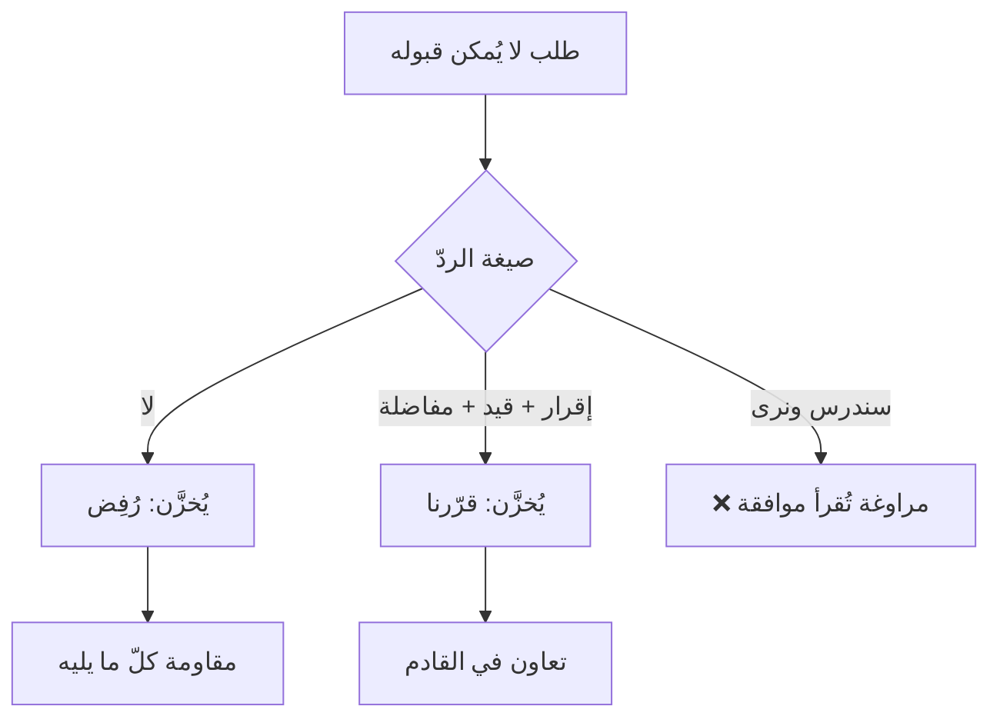

# الرفض الإيجابي وقوّة «لا» (Positive Refusal)
> [!info] تعريف مختصر
> الرفض الإيجابي هو أن تحمي النطاق والالتزام حمايةً كاملة **بلا نطق كلمة «لا»** — بنقل قرار المفاضلة إلى الطرف الآخر أو بوضع شرط واضح، بحيث يُخزَّن في ذاكرته «قرّرنا معًا» لا «رُفِض طلبي».

## الشرح العلمي والاحترافي
المشكلة التي تحلّها الأداة دقيقة: **الدماغ يُخزّن الحكم ويُهمل سببه.** فحين تكون كلمتك الأولى «لا»، يقع التصنيف الثنائي (مقبول/مرفوض) قبل أن يُعالَج تبريرك، ثم يُقرأ ما بعده **دفاعًا عن رفض** لا معطياتٍ محايدة؛ وبعد أسبوعين يبقى «رفض طلبي» ويتلاشى «بسبب التزام السبرنت». وتُفسّر ذلك ثلاث آليات: **أثر الأسبقية** · **انحياز التأكيد بعد التصنيف** · **تلاشي التبرير مع بقاء الحكم**.

| | الرفض السلبي | الرفض الإيجابي |
|---|---|---|
| الصياغة | «لا» · «مستحيل» · «لن ينفع» | «مُدوَّن — فأيّ بند نُؤجّل مقابله؟» |
| من يتّخذ القرار | أنت | **هو، أو أنتما معًا** |
| الكلفة الفورية | صفر | دقائق من الجهد |
| الكلفة المؤجّلة | مقاومة كلّ ما تقوله لاحقًا | صفر |
| **النطاق** | **محميّ** | **محميّ أيضًا** |

**والسطر الأخير هو المهمّ:** الرفض الإيجابي **ليس ليونة ولا تنازلًا** — إنّه الحزم نفسه بغلاف لا يُنتج عداوة.

## أين ومتى يُستخدم
- كلّ طلب خارج النطاق أو خارج السعة من صاحب مصلحة أو عميل أو مدير.
- رفض اقتراح تقني غير مناسب في توقيته — عبر [[Sandwich Method|الساندويتش]].
- تثبيت تقدير تحت ضغط تخفيضه.
- كلّ حالة تحتاج فيها إلى «لا» وتحتاج فيها إلى الشخص غدًا.

## مثال وسيناريو تطبيقي
> [!example] عميل: «أضيفوا هذه اللوحة في السبرنت الحالي — لن تأخذ ساعة.» والرفض السلبي («هذا خارج نطاق العقد») يُنتج أثرين: يحمي النطاق، **ويُخزَّن «رفضوا طلبي»** فيُقاوَم كلّ ما يُقال بعده حتى لو كان صحيحًا؛ ثم إخراج العقد نفسه — كما يُقال — «سيف يقطع كلّ الرؤوس» فيُوقف التفكير ويُقيم الحواجز. أمّا الرفض الإيجابي: **«طلبك مُدوَّن. ولندخله في هذا السبرنت، أيّ بند من الملتزم به تُفضّل أن نُؤجّله؟»** — لم تُقَل «لا»، ولم يُوافَق على شيء، والنطاق محميّ تمامًا، **وقرار المفاضلة انتقل إليه**. وغالبًا سيقول هو: «لا، دعها للقادم» — فيكون قد رفض بنفسه.

## خطوات أو مخطّط
1. **ابدأ بالإقرار لا بالحكم**: «مُدوَّن» · «فكرة جيّدة» · «أفهم أهمّيته».
2. **اذكر القيد بوصفه واقعًا لا رأيًا**: السعة · الالتزام القائم · التبعيّة.
3. **انقل القرار**: بمفاضلة صريحة، أو بشرط محدّد، أو بموعد.
4. **أغلِق بسؤال** لا بجملة خبرية — فالسؤال يُبقي القرار مشتركًا.
5. **تحقّق**: هل ترك ردّي معلومة حاسمة (مفاضلة · شرط · موعد)؟ إن لا، فهو مراوغة لا رفض إيجابي.

## ⚠️ مفاهيم خاطئة شائعة
> [!warning]
> - **«لا تقل لا أبدًا» قاعدة لها استثناءات.** ثلاثة مواضع يجب فيها الوضوح المطلق: **السلامة والأمن** · **الحدّ الأخلاقي أو القانوني** (الغموض هنا يُقرأ قابلية للتفاوض) · **الطلب المُعاد بعد رفض مُبرَّر مرارًا** (التلطيف الرابع يُقرأ ترددًا). والصياغة الأدقّ: لا تقل «لا» **كردّ أوّل**.
> - **ليس تجنّبًا للمواجهة.** من يستخدمه للهروب من كلّ قرار يُنتج بعد أشهر ما هو أسوأ من الرفض المباشر: انعدام ثقة في أنّ كلامه يُترجَم إلى شيء.
> - **قوّة «لا» لها وجه ثانٍ**: أن تصوغ أسئلتك بحيث **يستطيع هو أن يقول «لا»** فيرتاح — انظر [[Psychological Reactance]].

## ❌ ممارسات خاطئة في المشاريع
> [!failure]
> - **الرفض المُغلَّف الذي يُقرأ موافقة** — «سننظر في الأمر ونرى ما يمكن فعله» ليست رفضًا إيجابيًّا بل تأجيلًا، وستعود إليك بعد أسبوعين على هيئة «قلتَ إنّك ستنظر».
> - **إخراج العقد أو توثيق العملية كأوّل سلاح** — ترتيب الأسلحة: تسمية ← تدقيق اتّهام ← مرآة ← أسئلة معايرة ← إزاحة ← مقايضة ← **والعقد آخرها**.
> - **الانقلاب المضادّ** — من يكتشف أنّ لطفه قُرِئ ضعفًا فينتقل إلى الحزم القاسي؛ وكلاهما خطأ على المحور نفسه. المطلوب محور ثانٍ: طريقة رفيقة ومعيار هو الوصول إلى قرار.
> - **الرفض بلا بديل ولا طريق** — إن كانت للطلب **حاجة** مشروعة خلفه، فارفض الطلب ولبِّ الحاجة بطريق آخر. انظر [[Positions vs Interests]].

## 🔗 مصطلحات ومفاهيم ذات صلة
[[Sandwich Method]] | [[Fake Yes]] | [[Calibrated Questions]] | [[Positions vs Interests]] | [[Psychological Reactance]] | [[Scope Creep]] | [[Out of Scope]] | [[Tactical Empathy]] | [[Smart Bartering]]

> [!tip] 💡 إثراء عملي — كورس لعبة العقل
> لماذا يُخزَّن «رفض» بلا سببه، والاستثناءات المشروعة لكلمة «لا»: [[06 - قوّة لا وأنواع نعم الثلاثة]].
