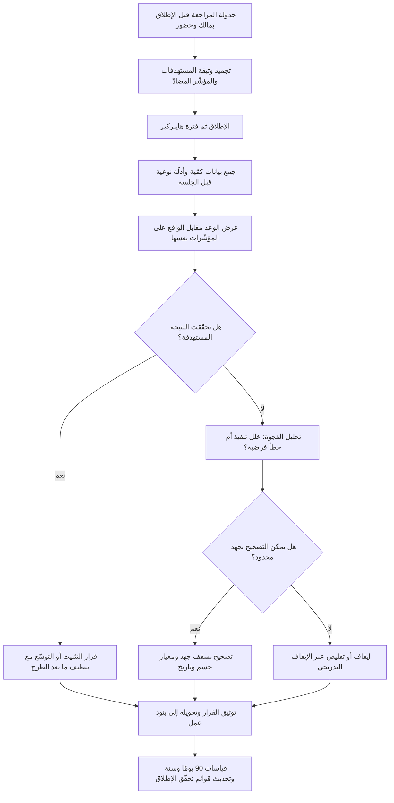

# مراجعة ما بعد الإطلاق (Post-Launch Review)

> [!info] تعريف مختصر
> جلسة مُجدولة سلفًا — غالبًا بعد نحو **٣٠ يومًا** من الإتاحة العامة — تقارن **ما وعدنا به قبل الإطلاق** بـ**ما حدث فعلًا بعده**، على المؤشّرات نفسها التي أُعلنت قبل الإطلاق لا على مؤشّرات تُختار بأثر رجعي. وسمتها الفارقة أنها تنتهي بـ**قرار موثّق ومملوك** — نوسّع، أم نصحّح، أم نُبقي كما هو، أم نتراجع، أم نُوقف الميزة — لا بتقرير يُؤرشَف. فالمراجعة التي لا تُغيّر شيئًا في الخطة أو المنتج أو الموارد لم تكن مراجعة، بل مراسم.

## الشرح العلمي والاحترافي
- **موضوعها المنتج والقيمة، لا الفريق والعملية**: هنا يقع الخلط الأشهر. **الاسترجاع (Retrospective)** يسأل: كيف كانت طريقتنا في العمل وكيف نحسّنها؟ ومراجعة ما بعد الإطلاق تسأل: هل حقّق ما أطلقناه النتيجة التي بُرِّر بها الاستثمار؟ الأولى ملكها الفريق ودورتها قصيرة، والثانية يشارك فيها [[Sponsor]] وأصحاب القرار لأن مخرجها قد يكون إعادة تخصيص موارد أو سحب ميزة. الجمع بينهما في جلسة واحدة يُنتج غالبًا نقاشًا عن العملية يبتلع سؤال القيمة.
- **لماذا ٣٠ يومًا تحديدًا؟** لأنها النافذة التي تتقاطع فيها ثلاثة اعتبارات: أن يكون **أثر الحداثة** (قفزة الاستخدام الأولى بدافع الفضول) قد خفّ فتُقرأ الأرقام على حقيقتها؛ وأن تكون قد مرّت **دورة استخدام كاملة** لأغلب المنتجات (شهر مالي، دورة رواتب، دورة إغلاق)؛ وأن تكون فترة [[Hypercare]] قد انتهت فيمكن التمييز بين مشكلات الإطلاق العابرة والمشكلات البنيوية. وليست الثلاثون رقمًا مقدّسًا: منتج بدورة استخدام ربع سنوية يحتاج 90 يومًا، وميزة يومية الاستخدام قد تكفيها 14.
- **شرط الصحّة الأول: أن تكون التوقّعات مكتوبة قبل الإطلاق**: المراجعة تقارن، والمقارنة تحتاج طرفًا ثابتًا. إن لم تُكتب الأرقام المستهدفة في [[Business Case]] أو وثيقة الإطلاق مسبقًا، فستُقاس النتيجة بذاكرة انتقائية ويُعاد تعريف النجاح ليطابق ما حدث — وهو انحياز معروف يجعل كل إطلاق «ناجحًا». الترياق الوحيد: تجميد المستهدفات قبل الإطلاق ثم فتحها كما هي في الجلسة.
- **البنية الفعّالة للجلسة**: (١) استعراض **الوعد** كما كُتب: الفرضية والمستهدفات وحدود المخاطر؛ (٢) استعراض **الواقع**: أرقام التبنّي والقيمة والاستقرار والتكلفة؛ (٣) تحليل **الفجوة** وأسبابها المرجّحة؛ (٤) الأدلّة النوعية: بلاغات الدعم، مقابلات، ملاحظات المستخدمين — لأن الأرقام تقول ماذا ولا تقول لماذا؛ (٥) **القرار** ومالكه وتاريخه؛ (٦) الدروس التي تُعدّل قواعد الإطلاق القادم.
- **أنواع القرارات الممكنة — ويجب أن تكون كلها مطروحة فعلًا**: توسيع الاستثمار؛ تصحيح محدود بميزانية محدّدة؛ التثبيت والانتقال إلى صيانة؛ التراجع أو الإطفاء عبر [[Sunset and Deprecation]]؛ أو تمديد المراقبة بمعيار حسم جديد وتاريخ محدّد. **إذا كان خيار الإيقاف غير مطروح من حيث المبدأ، فالجلسة تحصيل حاصل**؛ ووجود هذا الخيار مكتوبًا في الأجندة هو ما يمنع تأثير التكاليف الغارقة.
- **حزمة المؤشّرات المتوازنة**: الاعتماد على مؤشّر واحد يُنتج قرارات مضلّلة. الحزمة المعتادة: **تبنّي** (نسبة من وصلوا الميزة، ونسبة من استخدموها أكثر من مرة — راجع [[Adoption]])، **قيمة/نتيجة** مرتبطة بالفرضية الأصلية ([[Outcome vs Output]] و[[North Star Metric]])، **جودة واستقرار** (الحوادث، [[Escaped Defect Rate]]، الالتزام بـ[[SLO]])، **تكلفة** (تشغيل ودعم فعلي مقابل المقدَّر)، **تأثير جانبي** على مؤشّرات أخرى لم تكن مستهدفة — وهذا الأخير أكثر ما يُغفل: ميزة ترفع مؤشّرها وتخفض مؤشّرًا أهمّ منه.
- **الأصل والسياق المنهجي**: الفكرة راسخة في أدبيات إدارة المشاريع تحت اسم **مراجعة ما بعد التنفيذ (Post-Implementation Review)** بوصفها جزءًا من مرحلة الإغلاق، وفي أدبيات المنتج بوصفها إغلاقًا لحلقة الفرضية التي بدأت في [[Product Discovery]] و[[Hypothesis]]. الفرق الجوهري بين التقليدين: الأولى تميل إلى تقييم الالتزام بالنطاق والوقت والكلفة ([[Iron Triangle]])، والثانية تميل إلى تقييم القيمة المتحقّقة. الممارسة الناضجة تجمعهما، لأن مشروعًا سُلّم في وقته وميزانيته ولم يُنتج قيمة ليس نجاحًا.
- **علاقتها بتحقّق الفوائد**: هذه المراجعة أول محطّة في سلسلة **تحقيق الفوائد (Benefits Realization)**؛ فالكثير من الفوائد لا يظهر خلال ٣٠ يومًا (تقليل التكلفة التشغيلية، ارتفاع الاحتفاظ). لذلك من مخرجات الجلسة تحديد **من يقيس ماذا ومتى** بعد ٩٠ يومًا وسنة، وإلّا فُقد أثر القياس بمجرّد تفرّق الفريق.

## أين ومتى يُستخدم
- **بعد اكتمال طرح ميزة عبر [[Progressive Delivery]] ووصولها 100%**: لتقرير هل يُثبَّت المسار الجديد وتُنظَّف المفاتيح، أم يُتراجع.
- **بعد انتهاء [[Hypercare]] مباشرةً**: لتحويل ما تعلّمه الدعم في أيام الضغط إلى قرارات دائمة بدل أن يتبخّر مع عودة الفريق إلى دورته المعتادة.
- **بعد [[Pilot Launch]] وقبل التوسّع**: تكون المراجعة هنا المدخل الرسمي لـ[[Go or No-Go Decision]] الخاصّ بالتوسّع، بأرقام لا انطباعات.
- **عند إغلاق المشروع رسميًّا**: جزء من [[Closure vs Handover]]، إذ لا يكتمل الإغلاق بتسليم المخرجات بل بالتحقّق من أن الفائدة المرجوّة بدأت تتحقّق.
- **بعد تنفيذ خطة [[Go-to-Market]]**: لمقارنة أثر التسويق والتسعير والقنوات بما افتُرض في [[Business Case]].
- **في مراجعة دقّة التقدير والتخطيط**: مقارنة الجهد الفعلي بالمقدَّر تغذّي [[Estimation Variance]] وتحسّن تخطيط الدورات القادمة.
- **حين يقع خلاف بين الفرق حول نجاح الإطلاق**: الجلسة المنضبطة بمستهدفات مجمّدة مسبقًا هي الوسيلة لحسم الخلاف بالبيّنة لا بالسلطة.

## مثال وسيناريو تطبيقي
> [!example] منصّة تعليمية إماراتية أطلقت ميزة «المسارات الموصى بها» لرفع إتمام الدورات. وثيقة الإطلاق سجّلت قبل الإطلاق ثلاثة مستهدفات صريحة: رفع نسبة إتمام الدورة من 34% إلى 45% خلال 30 يومًا؛ تبنّي الميزة لدى 40% من المستخدمين النشطين؛ ألّا تتجاوز الكلفة التشغيلية الإضافية 12,000 درهم شهريًّا.
> **اليوم 30 — الجلسة**، بحضور مدير المنتج والهندسة والدعم و[[Sponsor]]، وأمامهم الوثيقة نفسها لا شرائح جديدة.
> **الواقع**: التبنّي 52% (تجاوز المستهدف)، والكلفة 9,400 درهم (أقل من السقف)، لكن نسبة الإتمام 36% فقط — ارتفاع هامشي بمقدار نقطتين، وبعيد جدًّا عن 45%. الأدلّة النوعية أضافت البُعد الغائب عن الأرقام: 41 بلاغًا لدى الدعم بصيغة متكرّرة «المسار المقترح لا يناسب مستواي»، وست مقابلات أظهرت أن التوصية تعتمد على التسجيل السابق فقط وتتجاهل المستوى المعلن.
> **المفاجأة في المؤشّر الجانبي**: متوسّط عدد الدورات المبدوءة لكل مستخدم ارتفع 21%، بينما نسبة الإتمام ثابتة تقريبًا. أي أن الميزة نجحت في **دفع الناس إلى البدء** ثم تركتهم — فحقّقت مؤشّر نشاط على حساب المؤشّر الذي بُرّرت به أصلًا، وهو تجسيد مباشر لمشكلة [[Outcome vs Output]].
> **النقاش الحاسم**: اقترح فريق التسويق «حملة توعية بالميزة» — وهو حلّ لمشكلة تبنٍّ غير موجودة أصلًا، فالتبنّي تجاوز المستهدف. رُفض المقترح لأنه لا يعالج الفجوة المرصودة.
> **القرار الموثّق**: **تصحيح محدود بدل التوسّع** — إضافة إشارة المستوى إلى منطق التوصية، بسقف جهد شهر واحد وميزانية محدّدة، ومالك مسمّى؛ مع **معيار حسم مكتوب**: إن لم تبلغ نسبة الإتمام 42% خلال 60 يومًا من التصحيح، تُقلَّص الميزة إلى مسار واحد بسيط أو تُوقَف عبر [[Sunset and Deprecation]]. وأُضيفت مراجعة عند 90 يومًا لقياس الاحتفاظ الذي لا يظهر أثره في شهر.
> **الدرس المؤسّسي**: عُدِّلت قائمة تحقّق الإطلاق في الشركة لتشترط إعلان **مؤشّر مضادّ (Counter-metric)** لكل ميزة — مؤشّر يجب ألّا يسوء — لأن غيابه هنا كاد يجعل الجلسة تحتفي بارتفاع «الدورات المبدوءة» بوصفه نجاحًا.

## خطوات أو مخطّط
1. جدول المراجعة **قبل الإطلاق** بتاريخ ومالك وحضور محدّد — لا تُقرّر بعده، لأن الجلسة غير المجدولة سلفًا لا تُعقد.
2. جمّد وثيقة التوقّعات: الفرضية، والمستهدفات الرقمية، والمؤشّر المضادّ، وحدود المخاطر المقبولة.
3. اجمع البيانات قبل الجلسة بأيام ووزّعها مسبقًا، ليكون وقت الجلسة للتفسير والقرار لا للعرض.
4. اجمع الأدلّة النوعية: بلاغات الدعم مصنّفة، ومقابلات قصيرة مع مستخدمين استخدموا الميزة ومع من تركوها.
5. اعرض الوعد والواقع جنبًا إلى جنب على المؤشّرات نفسها، وامنع إدخال مؤشّرات جديدة تُبرّر النتيجة.
6. حلّل الفجوة إلى أسبابها المرجّحة باستخدام [[Root Cause Analysis]]، وفرّق بين خلل التنفيذ وخطأ الفرضية.
7. اطرح كلّ خيارات القرار صراحةً بما فيها الإيقاف، وقرّر واحدًا بمالك وتاريخ ومعيار حسم لاحق.
8. سجّل القرار في [[Decision Log]]، وحوّل بنوده إلى عناصر في الـ Backlog لها أولوية معلنة.
9. حدّد قياسات المدى الأبعد (90 يومًا وسنة) ومن يملكها، لأن الفوائد الكبرى تتأخّر.
10. عدّل قوائم تحقّق الإطلاق ومعايير القبول بناءً على الدرس، ليستفيد الإطلاق القادم فعليًّا.

## ⚠️ مفاهيم خاطئة شائعة
> [!warning]
> - **الخلط بينها وبين الاسترجاع**: الاسترجاع يحسّن **طريقة العمل** وملكه الفريق، وهذه المراجعة تحكم على **قيمة المخرَج** ويشارك فيها من يملك قرار الاستثمار. عقدهما معًا يجعل النقاش ينزلق إلى العمليات ويُهمَل سؤال القيمة تمامًا.
> - **«الإطلاق بلا حوادث يعني النجاح»**: الاستقرار شرط ضروري لا كافٍ. ميزة مستقرّة تمامًا لم تحرّك المؤشّر الذي بُرّرت به هي هدر مُتقَن التنفيذ — وهذا بالضبط ما يميّز [[Validation vs Verification]].
> - **«الأرقام تكفي وحدها»**: المؤشّرات تجيب «ماذا حدث» ولا تجيب «لماذا». بلا بلاغات دعم ومقابلات، تُبنى تفسيرات مريحة وتُتّخذ قرارات تعالج العرض لا السبب.
> - **«المراجعة محكمة لتحديد المسؤول عن الفشل»**: تحويلها إلى محاسبة أشخاص يدفع الجميع إلى تجميل الأرقام وإخفاء الإشارات السلبية قبل الجلسة، فتفقد وظيفتها بالكامل — راجع [[Psychological Safety]].
> - **«ما دمنا أنفقنا كثيرًا فلا معنى للإيقاف الآن»**: انحياز التكاليف الغارقة. ما أُنفق لا يُسترد بالاستمرار؛ القرار الصحيح يُبنى على القيمة المتوقّعة من هنا فصاعدًا مقارنةً ببدائل استخدام الموارد.
> - **«٣٠ يومًا مدّة كافية للحكم على كل شيء»**: كافية للتبنّي والاستقرار وإشارات الاتجاه، وغير كافية للاحتفاظ وأثر الإيرادات وخفض التكلفة التشغيلية. لذلك مخرج الجلسة يجب أن يتضمّن جدولة قياس لاحق لا إغلاقًا نهائيًّا للملف.
> - **«المراجعة للميزات الكبيرة فقط»**: الميزات الصغيرة المتكرّرة هي التي تبني — أو تهدم — المنتج بالتراكم؛ ومراجعة خفيفة بصفحة واحدة أفضل من لا شيء.

## ❌ ممارسات خاطئة في المشاريع
> [!failure]
> - **عقد المراجعة بلا مستهدفات مكتوبة مسبقًا** → يُعاد تعريف النجاح ليطابق ما حدث، فتخرج كل مراجعة بنتيجة «نجاح» ولا يتعلّم أحد شيئًا → **الحل**: اجعل وجود مستهدفات رقمية مجمّدة شرطًا في بوّابة الإطلاق نفسها، لا في المراجعة.
> - **عدم جدولة الجلسة قبل الإطلاق** → ينشغل الفريق بالتالي، وتُؤجَّل الجلسة مرة بعد مرة حتى تفقد معناها أو تُلغى بصمت → **الحل**: أدرج موعد المراجعة ومالكها في قائمة تحقّق الإطلاق، واعتبر الإطلاق غير مكتمل بدونه.
> - **الخروج بـ«توصيات» بلا مالك ولا تاريخ ولا ميزانية** → تُؤرشَف الوثيقة ولا يتغيّر شيء، فيفقد الحضور الجادّون اهتمامهم بالجلسة القادمة → **الحل**: اشترط أن ينتهي الاجتماع بقرار واحد مصنّف (توسيع/تصحيح/تثبيت/إيقاف) بمالك مسمّى وتاريخ، مسجَّل في [[Decision Log]].
> - **حضور فريق التسليم وحده دون [[Sponsor]] وأصحاب القرار** → لا أحد في الغرفة يملك صلاحية إعادة تخصيص الموارد أو الإيقاف، فتُختزل القرارات في تحسينات صغيرة داخل المسموح → **الحل**: اربط مستوى الحضور بحجم القرار الممكن، واجعل حضور صاحب القرار شرطًا لعقد الجلسة.
> - **اختيار المؤشّرات بعد رؤية النتائج** → انتقاء انتهازي يخلق رواية نجاح زائفة يبني عليها القرار التالي أخطاءه → **الحل**: اقفل قائمة المؤشّرات قبل الإطلاق واعرضها كما هي؛ وإن ظهرت حاجة لمؤشّر جديد فاذكره بوصفه ملاحظة لا دليلًا.
> - **إهمال قياس المؤشّر المضادّ والآثار الجانبية** → يُحتفى بارتفاع مؤشّر الميزة بينما يتراجع مؤشّر أهمّ منه (الاحتفاظ، رضا العملاء، حمل الدعم) → **الحل**: اشترط لكل ميزة مؤشّرًا واحدًا على الأقل «يجب ألّا يسوء»، واعرضه في الجلسة إلزاميًّا.
> - **إغفال بيانات الدعم والعمليات** → يُقرأ الإطلاق «نظيفًا» بينما استوعب فريق الدعم الضرر بجهد إضافي غير مرئي، فتتكرّر المشكلة وتتراكم حتى تنفجر → **الحل**: أدرج حجم البلاغات وتصنيفها مقارنةً بخطّ الأساس كبند ثابت في الأجندة، وادعُ ممثّلًا عن الدعم.
> - **إسقاط خيار الإيقاف من الأجندة** → يتحوّل النقاش إلى «كيف نُصلح» فقط، فتستمرّ ميزات ميّتة تستهلك صيانة واختبارًا وانتباهًا لسنوات → **الحل**: اجعل «إيقاف/تقليص» خيارًا مكتوبًا في نموذج الجلسة يجب تقييمه صراحةً وتسجيل سبب رفضه إن رُفض.

## 🔗 مصطلحات ومفاهيم ذات صلة
[[Progressive Delivery]] | [[Feature Flags]] | [[Sunset and Deprecation]] | [[Validation vs Verification]] | [[Hypercare]] | [[Pilot Launch]] | [[Go or No-Go Decision]] | [[Rollback]] | [[Feature Freeze]] | [[Outcome vs Output]] | [[Business Case]] | [[Decision Log]] | [[Adoption]] | [[Escaped Defect Rate]] | [[Root Cause Analysis]] | [[Closure vs Handover]] | [[Estimation Variance]] | [[North Star Metric]] | [[Sponsor]] | [[Psychological Safety]]
