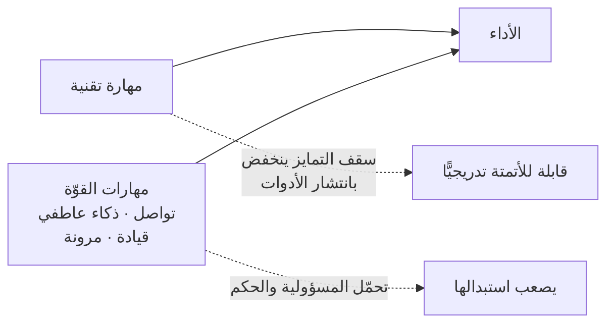

# مهارات القوّة (Power Skills)

> [!info] تعريف مختصر
> **مهارات القوّة** هي التسمية التي اعتمدها معهد إدارة المشاريع (PMI) في *Talent Triangle* المحدَّث (2022) بديلًا عن «المهارات الناعمة (Soft Skills)»، لأنّ وصف «الناعمة» أوحى بأنّها ثانوية. وتشمل التواصل، والقيادة، و[[Emotional Intelligence|الذكاء العاطفي]]، وحلّ الصراع، والمرونة الذهنية. وسبب صعود المصطلح اليوم عملي: **هي المهارات التي تصعب أتمتتها** — والذكاء الاصطناعي يتقدّم في المهارة التقنية أسرع بكثير ممّا يتقدّم في حمل المسؤولية.

## الشرح العلمي والاحترافي
- **مثلّث المواهب عند PMI** بعد التحديث ثلاثة أضلاع: **مهارات القوّة** · **الخبرة الوظيفية والمجالية (Business Acumen)** · **طرق العمل (Ways of Working)**. والتغيير في التسمية ليس تجميليًّا: أعادت PMI ترتيب اعتمادات التطوير المهني لتعكسه.
- **لماذا يصعب استبدالها**: النموذج يُنتج مخرَجًا، لكنّه **لا يتحمّل المسؤولية**. والفرق بين **عامل المعرفة** و**عامل المهمّة** هو أنّ الأوّل يستقبل مُدخلًا فتحدث عنده **معالجة** يدخل فيها الحكم والرؤية والسياق، فيُخرج قرارًا يُسأل عنه — والمُدخل نفسه يُنتج عشرة مخرَجات مختلفة عند عشرة أشخاص. أمّا من يستلم مهمّةً ويسلّمها فمنافسه المباشر أداةٌ أرخص وأسرع.
- **ليست بديلًا عن المهارة التقنية بل مضاعفًا لها.** الادّعاء الصحيح ليس «التقني انتهى»، بل أنّ **العائد الحدّي** للمهارة الإنسانية صار أعلى، لأنّ سقف التمايز التقني انخفض بانتشار الأدوات.
- **أخصّها في أدوار التغيير: الذكاء العاطفي.** قائد التغيير غريب على المؤسسة بحكم موقعه، فيكون **أوّل من تطير رقبته**؛ ولا يحميه إلّا قدرته على قول ما يجب قوله بطريقة لا تُذلّ أحدًا.
- **قابلة للتدريب، بشرط الممارسة الموجَّهة.** خلافًا للانطباع الشائع، هذه المهارات تُكتسب بـ[[Deliberate Practice|التدريب المتعمّد]] وبوجود مرشد يصحّح — لا بقراءة كتاب عن القيادة.
- **مقياسها العملي**: أن تختلف مع شخص اختلافًا كاملًا فيخرج من النقاش **محترمًا لك وفاهمًا لدوافعك** — وتلك هي الدبلوماسية في تعريفها الإجرائي.

## أين ومتى يُستخدم
- في **تخطيط المسار المهني**: أين يستثمر الشخص وقت تطويره في السنوات القادمة.
- عند **الترقّي من دور تنفيذي إلى دور قيادي**: نقطة الانكسار الأشيع.
- في **أدوار التحوّل والاستشارة**: حيث لا تملك سلطة رسمية فتحتاج نفوذًا.
- عند **تصميم برامج التدريب المؤسسي**: كثير منها يغطّي طرق العمل ويُهمل هذا الضلع.

## مثال وسيناريو تطبيقي
> [!example] رفض فكرة دون إذلال صاحبها.
> **الموقف:** موظّف يقترح حلًّا سبق تجريبه وفشل.
> **الردّ الضعيف:** «هذا لن ينجح» ⇒ لن يعود بفكرة أخرى أبدًا. وأذكى الأفكار كثيرًا ما تبدأ أفكارًا ضعيفة.
> **الردّ القويّ:** شكر على الاقتراح ← اعتراف بالجهد ← سرد التجربة السابقة وأسباب فشلها ← دعوة للتفكير معًا في بديل أقلّ مخاطرة.
> **ما تغيّر:** القرار واحد في الحالتين (رفض الفكرة)؛ والفرق كلّه في **احتمال أن يأتيك بفكرته القادمة**.

## خطوات أو مخطّط
1. **شخّص موقعك**: هل تُقاس بمخرَج المهمّة أم بجودة القرار؟
2. **اختر مهارةً واحدة** للربع (لا خمسًا): إعطاء تغذية راجعة، أو إدارة الصراع، أو العرض.
3. **مارسها في مواقف حقيقية** ذات مخاطرة منخفضة أوّلًا.
4. **اطلب تغذيةً راجعة عن نفسك** صراحةً — «ما العيب الذي تراه فيّ؟».
5. **ابحث عن مرشد** يصحّح لك في الوقت الحقيقي؛ فالتقدّم بلا مصحِّح بطيء جدًّا.
6. **قِس بالأثر لا بالشعور**: هل تغيّر سلوك الطرف الآخر؟

## ⚠️ مفاهيم خاطئة شائعة
> [!warning]
> - **قراءتها إلغاءً للمهارة التقنية**: من لا يملك علمًا لا يفرض احترامًا مهما حسُن كلامه.
> - **الظنّ بأنّها سِمات لا مهارات**: «هو شخص لطيف بطبعه» يُلغي إمكان التدريب، وهو خطأ.
> - **حصرها في اللباقة**: القدرة على قول «لا» بوضوح جزء منها.
> - **الخلط بين المجاملة والدبلوماسية**: الأولى تُخفي الرأي، والثانية تُوصله باحترام.

## ❌ ممارسات خاطئة في المشاريع
> [!failure]
> - **ترقية أفضل مهندس إلى قيادة بلا تأهيل**: يخسر المؤسسةُ مهندسًا وتكسب مديرًا متعثّرًا. الحلّ: تأهيل قبل الترقية.
> - **تقييم أداء يقيس المخرَجات فقط**: يُنتج فرقًا سامّة عالية الإنتاجية مؤقّتًا. الحلّ: أدخل التعاون في التقييم.
> - **تدريب يوم واحد بلا متابعة**: أثره ينتهي مع نهاية اليوم. الحلّ: ممارسة مصحوبة بتغذية راجعة.
> - **الاكتفاء بالتدريب دون تغيير الحوافز**: من يُكافَأ على الأمر والسيطرة لن يتغيّر بجلسة.

## 🔗 مصطلحات ومفاهيم ذات صلة
[[Emotional Intelligence]] | [[Active Listening]] | [[Nonviolent Communication]] | [[Deliberate Practice]] | [[Growth Mindset]] | [[Servant Leadership]] | [[Thomas-Kilmann Conflict Modes]] | [[14.3 الصراع وأنماط المقاومة]] | [[13.3 ما لا يحويه دليل سكرم عمدًا]]
