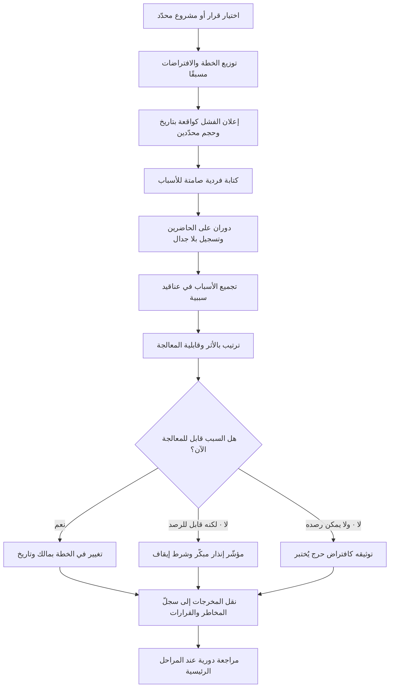

# تشريح الفشل المسبق (Pre-mortem)

> [!info] تعريف مختصر
> أسلوب تحليل مخاطر جماعي يُدار **قبل** انطلاق المشروع أو القرار الكبير، يُطلب فيه من الفريق أن يتخيّل أن الزمن قد تقدّم وأن المشروع قد **فشل فشلًا ذريعًا وموثّقًا**، ثم يُكتب سرد أسباب هذا الفشل كما لو أنها وقعت فعلًا. الحيلة المنهجية هنا ليست في السؤال بل في **زمن السؤال**: تحويل «ما الذي قد يسوء؟» — وهو سؤال احتمالي يسهل تجاهله — إلى «لماذا ساء؟» وهو سؤال تفسيري يُجبر العقل على توليد أسباب ملموسة. يُنسب تعميم هذا الأسلوب في أدبيات اتخاذ القرار إلى عالم النفس الإدراكي **غاري كلاين (Gary Klein)**، وقد أشاعه كذلك دانيال كانمان في كتاباته عن تحسين جودة القرار داخل المؤسسات.

## الشرح العلمي والاحترافي
- **الأساس الإدراكي: الإدراك المتأخّر المُستقبَلي (Prospective Hindsight)**: يستند الأسلوب إلى ملاحظة نفسية مفادها أن الناس يولّدون تفسيرات أغنى وأكثر تحديدًا لحدث **افتُرض وقوعه** مقارنةً بحدث يُطرح كاحتمال. حين تقول «قد يتأخّر المشروع» يقفز الذهن إلى تعميم مطمئن؛ وحين تقول «تأخّر المشروع ستة أشهر، اشرح لماذا» يبدأ الذهن في استرجاع تفاصيل حقيقية: المورّد، البيانات، الموافقة الأمنية، الشخص الوحيد الذي يعرف النظام القديم. تحويل صيغة السؤال هو جوهر الأداة لا زخرفها.
- **إذن اجتماعي للتشاؤم**: أخطر ما في بدايات المشاريع هو الحماس المؤسسي الذي يجعل إبداء الشك سلوكًا مكلفًا اجتماعيًّا — من يعترض يبدو غير متعاون أو «سلبيًّا». الـ Pre-mortem يعالج هذا بجعل ذكر الفشل **هو المهمّة المكلَّف بها الجميع رسميًّا**، فيسقط الثمن الاجتماعي للاعتراض. لهذا يعمل الأسلوب كآلية عملية لتفعيل [[Psychological Safety]] في اللحظة التي تكون فيها أضعف ما تكون.
- **مضادّ مباشر لتفاؤل التخطيط**: تميل التقديرات الأولية إلى التفاؤل المنهجي لأنها تُبنى على مسار مثالي بلا احتكاك. الـ Pre-mortem يضخّ في التخطيط سردًا مضادًّا يجبر الفريق على تسعير الاحتكاك، وهو ما ينعكس مباشرة على [[Contingency Reserve]] و[[Buffer]] و[[Reality Factor]].
- **يختلف عن تحليل المخاطر التقليدي في المُخرَج والمنشأ**: سجلّ المخاطر التقليدي يُملأ غالبًا بمخاطر عامة مستنسخة من مشاريع سابقة («تأخّر المورّد»، «نقص الموارد»). أما الـ Pre-mortem فيُخرج مخاطر **خاصة بهذا المشروع بعينه** لأنها انتُزعت من سرد سببي متّصل. ولذلك تُعامل مخرجاته كمُدخَل خام يُصفَّى ويُنقل إلى [[Risk Register]] و[[RAID Log]]، لا كبديل عنهما.
- **الكتابة الفردية الصامتة قبل النقاش شرط لا تحسين**: إن بدأت الجلسة بالحوار المفتوح فسيهيمن أول رأي وأعلى صوت وأعلى رتبة، وتنكمش مساحة الأفكار (أثر التثبيت والانسياق الجماعي). لذلك يبدأ الأسلوب بدقائق صامتة يكتب فيها كل مشارك قائمته وحده، ثم تُجمع القوائم قبل أي مناقشة.
- **يكشف الافتراضات لا المخاطر فحسب**: كثير من أسباب الفشل التي تظهر ليست «مخاطر» بل **افتراضات صامتة** لم ينتبه أحد إلى أنها افتراضات: أن البيانات نظيفة، أن الجهة الأخرى ستوافق خلال أسبوع، أن المستخدمين يريدون هذا أصلًا. لذا يُوصَل الأسلوب عادةً بـ[[Assumption Mapping]] وتتحوّل الافتراضات الحرجة إلى فرضيات تُختبر ([[Hypothesis]]).
- **موضعه الصحيح في الزمن**: يُدار قبل الالتزام النهائي مباشرة — أي بعد أن يصبح للخطة تفاصيل كافية تستحق النقد، وقبل أن تُوقَّع العقود وتُحجز الموارد بحيث يصبح التراجع مكلفًا. إن أُجري مبكّرًا جدًّا كان مجرّدًا، وإن أُجري متأخّرًا صار طقسًا شكليًّا لأن القرار قد اتُّخذ فعلًا.
- **مخرجه ليس قائمة مخاوف بل قرارات**: الجلسة التي تنتهي بقائمة أسباب فقط هي جلسة فاشلة. المخرج الصحيح ثلاثة أنواع من القرارات: تغييرات في الخطة تُنفَّذ اليوم، إشارات إنذار مبكّر يُتّفق على رصدها ([[Guard Rails]])، وشروط إيقاف مكتوبة ([[Kill Criteria]]).

## أين ومتى يُستخدم
- **قبل اعتماد ميثاق المشروع أو بوابة القرار**: كمُدخَل مباشر لقرار [[Go or No-Go Decision]]، بحيث لا تُتّخذ الموافقة إلا بعد سماع أقوى رواية ممكنة للفشل.
- **قبل إطلاق كبير أو ترحيل بيانات**: يُدار على السيناريو التشغيلي نفسه فتظهر أسباب تُحوَّل إلى خطة [[Rollback]] و[[Hypercare]] وتمارين [[Data Dry Run]].
- **عند بناء خطة المخاطر الأولى**: كوسيلة لملء [[Risk Register]] بمخاطر حقيقية ومحدّدة بدل قوائم معلّبة، ثم تصنيفها عبر [[Probability and Impact Matrix]].
- **عند دخول سوق جديد أو التزام استراتيجي**: تحليل الفشل المفترض يكشف افتراضات السوق والتنظيم قبل صرف رأس المال، بالتوازي مع [[PESTEL]] و[[Market Entry Modes]].
- **قبل التعاقد مع مورّد محوري**: يستخرج سيناريوهات الاعتماد المفرط والانحباس، وهو ما يُغذّي [[Vendor Management]] و[[Vendor Lock-in]].
- **في المشاريع التي يبدو الإجماع فيها مريبًا**: حين يوافق الجميع بسرعة وبلا سؤال، تكون الجلسة أداة لكسر الإجماع المصطنع وفحص [[Confirmation Bias]].

## مثال وسيناريو تطبيقي
> [!example] شركة تجزئة إقليمية مقرّها الرياض قرّرت استبدال نظام نقاط البيع في 74 فرعًا بنظام سحابي جديد، بميزانية 3.2 مليون ريال وجدول زمني 9 أشهر. الخطة اعتُمدت بالإجماع في اللجنة التوجيهية، ولم يُسجَّل أي اعتراض.
> قبل توقيع العقد بأسبوعين، أدار مدير المشروع جلسة Pre-mortem مدّتها 90 دقيقة مع 11 مشاركًا: تقنية، عمليات الفروع، مالية، مشتريات، ومديرَي فرعين ميدانيَّين. الافتتاحية كانت: «نحن الآن في شهر ديسمبر من العام القادم. المشروع أُوقف بعد صرف ثلثي الميزانية، والفروع عادت إلى النظام القديم، وهناك تقرير داخلي يشرح لماذا. اكتب لي فقرات هذا التقرير».
> في الدقائق العشر الصامتة كتب المشاركون 63 سببًا. بعد التجميع وإزالة التكرار بقي 27 سببًا، تجمّعت في ستة عناقيد. ثلاثة منها لم تكن مذكورة في خطة المخاطر الأصلية إطلاقًا:
> ① **ضعف الشبكة في الفروع الطرفية**: مدير فرع ذكر أن فرعه ينقطع عن الإنترنت وسطيًّا مرتين أسبوعيًّا لعشرات الدقائق، وأن النظام القديم يعمل دون اتصال بينما النظام الجديد سحابي بالكامل. هذا السبب وحده كان كفيلًا بإسقاط المشروع في المواسم.
> ② **موسم الذروة**: الجدول الزمني كان يضع موجة الترحيل الكبرى في أسابيع رمضان وعيد الفطر، وهي ذروة المبيعات، حين لا يقبل أحد أي مخاطرة تشغيلية.
> ③ **الاعتماد على شخص واحد**: مواصفات التسعير والعروض الترويجية كانت كلها في رأس موظّف واحد في العمليات لم يوثّق شيئًا، وهو على وشك إجازة طويلة.
> الجلسة لم تُلغِ المشروع، بل غيّرت الخطة قبل التوقيع: أُضيف شرط تعاقدي بوضع دون اتصال (Offline Mode) مع اختبار قبول صريح، وأُزيحت موجة الترحيل الكبرى خارج موسم الذروة، وبدأت ورشة توثيق قواعد التسعير قبل انطلاق التطوير. كما كُتبت ثلاثة شروط إيقاف صريحة، منها: «إن تجاوز متوسط زمن إتمام عملية البيع في الفروع التجريبية 12 ثانية بعد شهر كامل من الاستقرار، نتوقف ونعيد التقييم».
> أدّت هذه التغييرات إلى تأخير البداية 5 أسابيع وزيادة الكلفة التعاقدية 6%، وهو ثمن اعتبرته اللجنة زهيدًا مقابل احتمال تعطّل الفروع في الذروة.

## خطوات أو مخطّط
1. **حدّد موضوعًا واحدًا للجلسة**: مشروع أو إطلاق أو قرار بعينه، وليس «مشاكلنا عمومًا». الغموض يُنتج إجابات عامة.
2. **اجمع تنوّعًا حقيقيًّا**: 6–12 مشاركًا من زوايا مختلفة، وتعمّد وجود من سينفّذ ومن سيتأثّر ميدانيًّا لا مَن يخطّط فقط.
3. **وزّع الخطة قبل الجلسة**: النطاق والجدول والميزانية والافتراضات؛ فالنقد بلا معرفة بالتفاصيل ينتج ضجيجًا.
4. **افتتح بإعلان الفشل كحقيقة واقعة**: صياغة صريحة بزمن ماضٍ وبتاريخ محدّد وبحجم فشل محدّد. لا تقل «تخيّل أنه قد يفشل».
5. **اكتب صامتًا 8–10 دقائق**: كل مشارك يكتب أكبر عدد ممكن من الأسباب منفردًا، دون نقاش ودون تصفية ذاتية.
6. **در على الحاضرين سببًا واحدًا في كل دورة**: يبدأ الأقل رتبة، ويُسجَّل كل سبب كما قيل دون جدال أو دفاع. المُيسّر يمنع النقاش التبريري في هذه المرحلة.
7. **جمّع الأسباب في عناقيد**: ادمج المكرّر وسمِّ كل عنقود بسبب جذري واحد، مستعينًا بمنطق [[Root Cause Analysis]] للنزول من العرض إلى السبب.
8. **قيّم واختر**: رتّب العناقيد بأثرها وقابلية معالجتها، واختر 5–8 منها فقط للمعالجة الفعلية؛ محاولة معالجة كل شيء تعني عدم معالجة أي شيء.
9. **حوّل كل عنقود مختار إلى مخرج قابل للتنفيذ**: إمّا تغيير في الخطة بمالك وتاريخ، أو مؤشّر إنذار مبكّر يُرصد، أو شرط إيقاف مكتوب ([[Kill Criteria]]).
10. **انقل المخرجات إلى سجلّات حيّة**: [[Risk Register]] و[[RAID Log]] و[[Decision Log]]، وحدّد موعد مراجعة لاحقًا لفحص المؤشّرات فعليًّا.
11. **راجع الجلسة عند مراحل رئيسية**: إعادتها عند [[Milestone]] كبير أو عند تغيّر جوهري في النطاق تُبقيها حيّة بدل أن تكون طقسًا لمرّة واحدة.

## ⚠️ مفاهيم خاطئة شائعة
> [!warning]
> - **الظنّ أنه جلسة تشاؤم أو تنفيس**: الهدف ليس التعبير عن القلق بل توليد معلومة تخطيطية. الجلسة التي تنتهي بارتياح نفسي دون تعديل واحد في الخطة لم تؤدِّ وظيفتها.
> - **الخلط بينه وبين المراجعة اللاحقة**: الـ Pre-mortem يسبق التنفيذ ويهدف إلى منع الفشل، بينما [[Blameless Postmortem]] يلي الحادثة ويهدف إلى استخلاص الدرس منها. الاثنان متكاملان لا بديلان، والفرق بينهما فرق في الزمن وفي نوع المعلومة المتاحة.
> - **اعتباره بديلًا عن سجلّ المخاطر**: هو **مولّد** للمخاطر لا مستودع لها. من يترك المخرجات في محضر الجلسة يفقدها خلال أسابيع؛ مكانها الطبيعي [[Risk Register]] مع مالك وتاريخ مراجعة.
> - **تصوّر أنه يُدار مرّة واحدة في عمر المشروع**: الافتراضات تتغيّر مع تقدّم المعرفة، وما كان مستبعدًا في الشهر الأول قد يصبح مرجّحًا في الشهر السادس. الجلسة المتكرّرة عند المحطّات الكبرى أنفع من جلسة افتتاحية يتيمة.
> - **الاعتقاد بأن حضور القيادة يعزّز الجلسة دائمًا**: حضور صاحب القرار قد يفيد في الالتزام بالمخرجات، لكنه يخنق الصراحة إن أبدى دفاعًا عن خطته أثناء الجولة. القاعدة العملية: يحضر ليستمع ويكتب مثل غيره، ولا يعلّق حتى تُستكمل جميع الأسباب.
> - **افتراض أن الأسباب المذكورة كلها صحيحة**: الجلسة تولّد فرضيات فشل لا حقائق. بعضها مبالغ فيه وبعضها ينمّ عن سوء فهم، والمُيسّر مسؤول عن تمييز السبب المعقول من الخوف العام دون أن يخنق التوليد أثناء الجولة نفسها.

## ❌ ممارسات خاطئة في المشاريع
> [!failure]
> - **الخطأ: فتح النقاش الجماعي مباشرة دون كتابة فردية**. لماذا يضرّ: أول رأي يُطرح يثبّت تفكير المجموعة، وأصحاب الرتب الأعلى يحدّدون سقف ما يُقال، فتخرج الجلسة بثلاث أفكار بدل ثلاثين. الحل: اجعل الدقائق العشر الصامتة قاعدة غير قابلة للتفاوض، واجمع الأوراق قبل بدء أي حوار.
> - **الخطأ: دعوة فريق التخطيط فقط دون من ينفّذ ميدانيًّا**. لماذا يضرّ: أخطر أسباب الفشل عملياتية ومحلّية ولا يعرفها إلا من يعمل في الفرع أو خط الإنتاج أو مكتب الخدمة. الحل: اشترط حضور صوتين ميدانيَّين على الأقل، وامنحهما أولوية الكلام في الجولة الأولى.
> - **الخطأ: السماح بالدفاع عن الخطة أثناء الجولة**. لماذا يضرّ: أول ردّ تبريري يُعلّم بقية الحاضرين أن ذكر الأسباب مكلف، فتتوقّف التدفّقات فورًا. الحل: قاعدة صريحة يعلنها المُيسّر — لا نقاش ولا ردّ ولا تصحيح أثناء التسجيل، والدفاع مؤجَّل إلى مرحلة التقييم.
> - **الخطأ: إنهاء الجلسة بقائمة أسباب دون ملّاك ولا تواريخ**. لماذا يضرّ: القائمة تتحوّل إلى وثيقة أرشيفية تُستخرج بعد الفشل لتُقال «كنا نعلم»، وهي أسوأ نتيجة ممكنة لأنها تُثبت أن المعرفة وُجدت ولم تُستعمل. الحل: لا تُغلق الجلسة قبل تحويل أعلى خمسة أسباب إلى بنود بمالك وتاريخ في [[RAID Log]].
> - **الخطأ: إجراؤها بعد توقيع العقود وحجز الموارد**. لماذا يضرّ: يصبح تغيير الخطة مكلفًا سياسيًّا وماليًّا، فتُدار الجلسة كطقس امتثال وتُهمل مخرجاتها بحجّة «فات الأوان». الحل: اجعلها شرطًا مسبقًا في بوابة الموافقة نفسها، لا نشاطًا لاحقًا لها.
> - **الخطأ: خلطها بجلسة حلول فورية**. لماذا يضرّ: أول سبب يُذكر يستهلك 40 دقيقة في نقاش حلوله، فلا يُسمع بقية الأسباب أصلًا، والأخطر أن ما يُسمع أولًا ليس بالضرورة الأهم. الحل: افصل زمنيًّا بين التوليد والتقييم والحلول، ولو في جلستين منفصلتين.
> - **الخطأ: تحويلها إلى ملء استمارة مخاطر جاهزة**. لماذا يضرّ: القوالب المعلّبة توجّه التفكير نحو فئات مألوفة (جدول، ميزانية، موارد) وتحجب الأسباب الغريبة الخاصة بهذا المشروع، وهي غالبًا الأخطر. الحل: ابدأ بصفحة بيضاء وسرد حرّ، ثم صنّف لاحقًا عند النقل إلى السجلّ.

## 🔗 مصطلحات ومفاهيم ذات صلة
[[Backcasting]] | [[Kill Criteria]] | [[Blameless Postmortem]] | [[Intelligent Failure]] | [[Intellectual Humility]] | [[Risk Register]] | [[RAID Log]] | [[Assumption Mapping]] | [[Probability and Impact Matrix]] | [[Root Cause Analysis]] | [[Psychological Safety]] | [[Go or No-Go Decision]] | [[Decision Log]] | [[Confirmation Bias]] | [[Contingency Reserve]]
