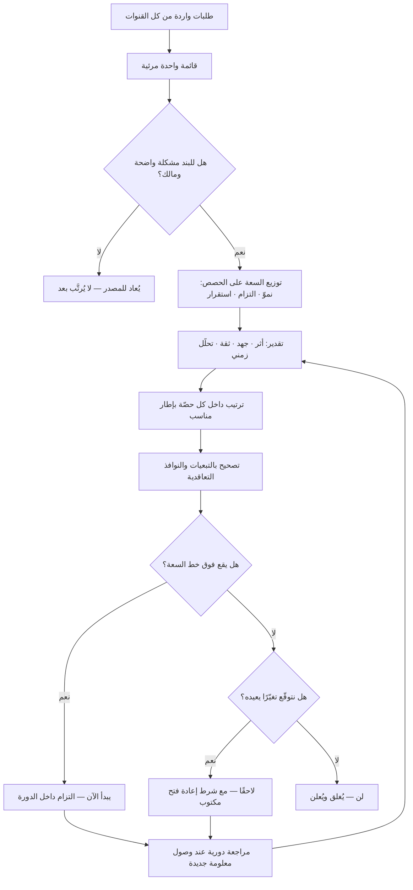

# ترتيب الأولويات (Prioritization)

> [!info] تعريف مختصر
> عملية اتّخاذ قرار متكرّرة تُجيب عن سؤال واحد: **ما العمل الذي نبدأ به الآن، بالسعة المتاحة فعلًا، لأنه يحقّق أعلى قيمة متوقّعة نسبةً إلى كلفته ومخاطره في هذه المرحلة بالذات؟** ترتيب الأولويات ليس تصنيف البنود إلى «مهم» و«أقل أهمية»، بل **ترتيبًا خطّيًّا (Rank) لسلسلة العمل** ينتج عنه بالضرورة أن شيئًا لن يُنجز الآن. أي مخرَج لا يتضمّن قائمة صريحة بما لن يُعمل ليس ترتيب أولويات، بل قائمة أمنيات مُعادة الترتيب.

## الشرح العلمي والاحترافي
- **الأولوية دالّة في السعة لا في الأهمية وحدها**: بند بالغ الأهمية قد لا يستحق أن يبدأ الآن إن كان يستهلك كل [[Capacity]] الفريق ويحجب خمسة بنود أخرى تكتمل في نصف الوقت. لذلك تُقاس الأولوية دائمًا بنسبة (قيمة ÷ جهد) لا بقيمة مطلقة، وتتغيّر إجابة السؤال نفسه إذا تغيّرت السعة أو تغيّر [[WIP Limit]]. هذه هي النقطة التي تفصل الفرق الناضجة عن غيرها: الأولوية عندهم رقم نسبي في سياق، لا صفة ثابتة في البند.
- **كل ترتيب أولويات هو قرار عن التكلفة البديلة**: اختيار بند يعني — حرفيًّا لا مجازًا — التخلّي عن أفضل بديل متاح بالسعة نفسها. ولذلك فإن السؤال الصحيح ليس «هل هذا البند مفيد؟» (الجواب دائمًا نعم تقريبًا)، بل «هل هو أفضل من أفضل شيء آخر يمكننا فعله بالوقت نفسه؟». راجع [[Opportunity Cost]].
- **البعد الزمني: الأولوية تتحلّل مع الوقت**: قيمة كثير من البنود ليست ثابتة، بل تتناقص كلما تأخّر التسليم — نافذة سوقية تُغلق، منافس يسبق، التزام تعاقدي يقترب من موعده. هذا البعد يُقاس عبر [[Cost of Delay]]، وهو ما يجعل بندًا متوسّط القيمة لكنه سريع التحلّل يسبق بندًا أعلى قيمة لكنها مستقرّة. أهمال البعد الزمني هو أشيع خلل في ترتيب الأولويات.
- **الأُطر ليست خوارزميات بل لغات نقاش**: [[RICE Prioritization]] و[[WSJF]] و[[MoSCoW Prioritization]] و[[Kano Model]] لا تُنتج قرارًا صحيحًا آليًّا؛ مدخلاتها تقديرات بشرية قابلة للتحيّز والتلاعب. قيمتها الحقيقية أنها **تُظهر أين يختلف الناس فعلًا**: حين يعطي شخصان البند نفسه تقديرين متباعدين للأثر، فالخلاف ليس في الرقم بل في فهم المشكلة — وهذا هو النقاش المفيد. الإطار أداة كشف اختلاف، لا آلة حساب.
- **الفرق بين الترتيب والتسلسل (Ranking vs. Sequencing)**: الترتيب يُجيب «أيّها أقيَم»، والتسلسل يُجيب «أيّها يجب أن يسبق تقنيًّا أو تعاقديًّا». بند منخفض القيمة قد يتقدّم لأنه [[Dependency]] لثلاثة بنود عالية القيمة. الخلط بينهما ينتج قوائم مرتّبة نظريًّا ومستحيلة التنفيذ عمليًّا.
- **أنواع القيمة ليست جنسًا واحدًا**: هناك قيمة إيراد مباشرة، وقيمة تقليل مخاطرة، وقيمة تعلّم (تقليل عدم اليقين)، وقيمة تمكين (فتح خيارات مستقبلية)، وقيمة صيانة ([[Technical Debt]]). المقارنة بينها ليست حسابية بل حكم تنفيذي، ولهذا تفشل محاولة اختزال كل البنود في عملة واحدة. الحل العملي الشائع هو **تخصيص حصص من السعة** (مثلًا: 60% نموّ، 20% دين تقني، 20% مخاطر وامتثال) ثم ترتيب داخل كل حصّة، بدل مقارنة تفاحات ببرتقال.
- **قرار توقيت لا قرار محتوى**: مخرَج ترتيب الأولويات ليس «نعم/لا» بل «الآن / لاحقًا / لن». الفرق حاسم: «لن» يُغلق النقاش ويحرّر الطاقة، و«لاحقًا» بلا شرط واضح لإعادة النظر يتحوّل إلى مقبرة بنود تُستهلك في مراجعتها ساعات كل ربع. الممارسة الجيّدة أن يُرفق بـ«لاحقًا» **الشرط الذي يعيدها إلى الطاولة** (وصول عدد العملاء إلى كذا، أو صدور تشريع، أو اكتمال بند آخر).
- **ترتيب الأولويات نشاط مستمر لا حدث سنوي**: كلما وصلت معلومة جديدة (نتيجة تجربة، تغيّر سوق، حادثة إنتاج) تغيّر الترتيب. هذا هو معنى أن يكون الـ Backlog حيًّا. لكن التغيير المفرط داخل الدورة الواحدة يقتل الإنجاز، ولهذا تفصل معظم الطرق بين **حرّية إعادة الترتيب خارج الدورة** و**ثبات الالتزام داخلها**.

## أين ومتى يُستخدم
- **في [[Backlog Refinement]] وتخطيط الدورة**: لتحويل قائمة مفتوحة إلى تسلسل قابل للسحب، بحيث يعرف الفريق ما البند التالي دون اجتماع إضافي، عبر [[Pull System]] و[[Replenishment]].
- **في بناء خارطة الطريق واختيار [[Initiative]] الربع**: هنا يكون ترتيب الأولويات على مستوى الحزم الكبرى لا القصص، وتُستخدم فيه [[OKR]] و[[North Star Metric]] كمرجّح.
- **في إدارة الحوادث والطلبات العاجلة**: بتمييز [[Expedite Class]] بسياسة مكتوبة ضمن [[Explicit Policies]]، ومع [[Severity vs Priority]] لفصل خطورة العطل عن أولوية إصلاحه.
- **عند تحديد نطاق [[MVP]] و[[Scope Statement]]**: الأولوية هنا أداة تقليص لا توسيع؛ وهي خط الدفاع الأول ضد [[Scope Creep]] و[[Gold Plating]].
- **في مواجهة قيود السعة والاختناقات**: حين يُكشف [[Bottleneck]] عبر [[Theory of Constraints]]، تُعاد الأولويات بحيث لا يُغذّى القيد بعمل يزيد ازدحامه.
- **في اجتماعات [[Steering Committee]] و[[Go or No-Go Decision]]**: حيث يكون القرار «نستمر أو نوقف» بحدّ ذاته قرار أولوية، وتُوثَّق مبرّراته في [[Decision Log]].

## مثال وسيناريو تطبيقي
> [!example] شركة سعودية متوسّطة تقدّم منصّة لإدارة العيادات. الفريق الهندسي 9 أشخاص، وسعة الربع المقدَّرة 40 بند عمل متوسّط. وصل إلى الطاولة 5 مطالب متزامنة:
> **(أ)** ربط المنصّة بمنصّة حكومية للفوترة، بموعد إلزامي بعد 5 أشهر وغرامة عند التأخير.
> **(ب)** ميزة «الحجز الذكي» طلبها أكبر عميل (يمثّل 18% من الإيراد) وهدّد بالتجديد المشروط.
> **(ج)** إعادة كتابة وحدة التقارير التي تسبّبت في 3 انقطاعات هذا الربع.
> **(د)** تطبيق جوال للمرضى، وهو حلم المؤسّس منذ سنتين.
> **(هـ)** تعريب واجهة لوحة الطبيب بالكامل، طلب متكرّر من 40% من العملاء.
> الفريق طبّق قاعدة الحصص: 50% نموّ، 25% التزام ومخاطر، 25% استقرار ودين تقني. ثم رتّب داخل كل حصّة بمنطق [[Cost of Delay]] لا بمنطق الإلحاح الصوتي.
> النتيجة: البند (أ) دخل أولًا لأن قيمته لا تتناقص فحسب بل تنقلب إلى غرامة، لكنه **قُسِّم** إلى شريحة أولى تُنجز الحد الأدنى التنظيمي في 6 أسابيع بدل 14. البند (ج) أُدرج في حصّة الاستقرار لأن كل انقطاع كان يستهلك ~30 ساعة دعم ويؤجّل عملًا آخر — أي أن تأجيله كان **يستهلك السعة نفسها التي يُدافَع عنها**. البند (ب) دخل حصّة النموّ لكن بعد جلسة اكتشاف قصيرة كشفت أن حاجة العميل الفعلية أضيق من الميزة المطلوبة، فانخفض حجمها من 11 بندًا إلى 4. البند (هـ) أُجّل بشرط صريح: «يُعاد فتحه إذا ظهر التعريب سببًا في خسارة صفقتين خلال الربع». والبند (د) قيل عنه صراحة **«لن — هذا العام»** وأُغلق نقاشه، فتوقّف استهلاك أربع ساعات شهريًّا كانت تُنفق في إحيائه.
> أهم أثر لم يكن في الترتيب نفسه، بل في أن قائمة «لن» أصبحت مكتوبة ومعلنة، فسقطت خمسة نقاشات جانبية كانت تتكرّر كل أسبوعين.

## خطوات أو مخطّط
1. اجمع كل الطلبات في قائمة واحدة مرئية — أولويات موزّعة على قنوات متفرّقة لا يمكن ترتيبها أصلًا.
2. صفِّ البنود غير المؤهّلة: ما لا مشكلة واضحة له ([[Problem Statement]])، وما لا يستوفي [[Definition of Ready]].
3. احسم أولًا **حصص السعة** بين أنواع القيمة، قبل مقارنة أي بندين ببعضهما.
4. قدّر لكل بند: الأثر، الجهد، الثقة، ومعدّل تحلّل القيمة زمنيًّا.
5. طبّق إطارًا مناسبًا داخل كل حصّة ([[RICE Prioritization]] للاكتشاف، [[WSJF]] حين يكون الزمن حاسمًا).
6. صحّح الترتيب بقيود التسلسل: [[Dependency]]، جاهزية فرق أخرى، نوافذ تعاقدية.
7. اقطع الخط: ما فوقه يبدأ الآن، وما تحته يُصنّف «لاحقًا بشرط» أو «لن».
8. وثّق القرار وسببه في [[Decision Log]]، وأعلن قائمة «لن» بوضوح لا يقلّ عن وضوح قائمة «نعم».
9. راجع الترتيب على إيقاع ثابت، وعند وصول معلومة تُغيّر أحد التقديرات جوهريًّا.

## ⚠️ مفاهيم خاطئة شائعة
> [!warning]
> - **«كل شيء أولوية قصوى»**: حين يكون كل شيء أولوية، فلا شيء أولوية — ويتحوّل القرار من الطاولة إلى الفريق المنفّذ الذي سيختار عشوائيًّا أو بحسب الأسهل. التصحيح: افرض ترتيبًا خطّيًّا لا فئات؛ لا يمكن أن يكون بندان في المرتبة الأولى.
> - **الخلط بين الإلحاح والأهمية**: الطلب الذي يصل بصوت أعلى أو من شخص أعلى منصبًا يُقرأ خطأً كأولوية. التصحيح: افصل الإلحاح كمُدخل مستقلّ (Cost of Delay) عن حجم الأثر، ولا تسمح للمصدر بأن يكون مُدخلًا.
> - **اعتبار درجات الأُطر حقيقة موضوعية**: رقم RICE ليس قياسًا بل تقديرًا مركّبًا من تخمينات، وحساسيّته لمُدخل «الثقة» عالية جدًّا. التصحيح: استخدم الرقم لترتيب النقاش لا لإنهائه، وافحص الحالات التي يتباعد فيها التقدير بين الأعضاء.
> - **الظنّ أن الترتيب قرار لمرّة واحدة**: خارطة طريق رُتّبت في يناير وبقيت كما هي في سبتمبر ليست دليل انضباط بل دليل انقطاع عن الواقع. التصحيح: اجعل إعادة الترتيب حدثًا مجدولًا ومحكومًا، لا استثناءً طارئًا.
> - **الظنّ أن الأولوية تعني أن كل شيء آخر سيُنجز لاحقًا**: قوائم «لاحقًا» في معظم المنظّمات لا تُنجَز إطلاقًا. التصحيح: كن صادقًا وسمِّ ما لن يُعمل «لن»، فذلك أرحم بالفريق وبأصحاب الطلب من وعد مؤجَّل إلى الأبد.
> - **الاعتقاد أن ترتيب الأولويات مسؤولية شخص واحد**: القرار النهائي قد يكون لمالك واحد، لكن المُدخلات موزّعة (هندسة، تجارية، امتثال، دعم). التصحيح: اجعل الملكية واضحة والمشاركة إلزامية — قرار بلا مُدخل هندسي يُنتج تقديرات جهد خيالية.
> - **افتراض أن تقسيم البند يخفض قيمته**: كثيرون يرفضون تجزئة بند كبير ظنًّا أن نصفه بلا فائدة. التصحيح: [[Task and Story Slicing]] غالبًا يكشف أن 30% من البند يحقّق 80% من قيمته، وهو أقوى رافعة في ترتيب الأولويات على الإطلاق.

## ❌ ممارسات خاطئة في المشاريع
> [!failure]
> - **الخطأ: ترتيب الأولويات دون معرفة السعة الفعلية.** لماذا يضرّ: تُلتزم قائمة تحتاج ضعف الطاقة المتاحة، فيتأخّر كل شيء بالتساوي وتُفقد مصداقية الخطة كاملة. الحل: ابدأ من سعة مُقاسة من [[Throughput]] التاريخي لا من طموح، واحجز [[Reserve Capacity]] للطارئ.
> - **الخطأ: السماح بإدخال بنود عاجلة دون سياسة مكتوبة.** لماذا يضرّ: كل إدخال طارئ يُزيح عملًا ملتزَمًا ويضاعف الوقت الضائع في تبديل السياق، حتى يصير الاستثناء هو القاعدة. الحل: عرّف [[Expedite Class]] بحصّة قصوى (مثلًا بند واحد في الوقت نفسه) وشرط دخول واضح، واجعل من يُدخل بندًا يختار ما يخرج مقابله.
> - **الخطأ: مقارنة كل أنواع العمل في قائمة واحدة.** لماذا يضرّ: العمل الوقائي (دين تقني، أمن، امتثال) يخسر دائمًا أمام ميزة لها قصّة عميل، فيتراكم حتى ينفجر كحوادث تلتهم السعة. الحل: خصّص حصصًا محمية لكل نوع ورتّب داخلها.
> - **الخطأ: قبول تقديرات الأثر من صاحب الطلب دون فحص.** لماذا يضرّ: كل طالب يقدّر أثر طلبه بأعلى فئة، فيتحوّل الإطار إلى مسرحية أرقام تُعيد إنتاج ميزان القوى نفسه. الحل: اشترط سندًا لكل تقدير أثر (بيانات [[Product Analytics]]، حجم شريحة، تكلفة دعم مقاسة)، واسمح بالتقدير المنخفض دون عقوبة اجتماعية.
> - **الخطأ: إبقاء Backlog يضم مئات البنود المفتوحة.** لماذا يضرّ: كلفة صيانة القائمة تتجاوز فائدتها، ويصبح البحث فيها أصعب من إعادة كتابة البند، وتُخفي القائمةُ الطويلة غيابَ القرار. الحل: أغلق تلقائيًّا ما مضى عليه فترة محدّدة دون تحرّك، مع إعلان أن الإغلاق ليس رفضًا للفكرة بل رفض لتخزينها.
> - **الخطأ: عدم توثيق سبب الترتيب.** لماذا يضرّ: بعد شهرين لا أحد يتذكّر لماذا تقدّم البند، فيُعاد النقاش كاملًا كلما تغيّر شخص أو مزاج. الحل: سطر واحد في [[Decision Log]] لكل قرار كبير: ما البديل الذي رُفض، ولماذا، وما الذي سيغيّر القرار.
> - **الخطأ: خلط قرار الأولوية بقرار الاستمرار.** لماذا يضرّ: بنود بدأت وفقدت جدواها تظلّ في الصدارة لأن «أنفقنا عليها كثيرًا»، وهو [[Sunk Cost Fallacy]] بعينه. الحل: أدرج البنود الجارية في المراجعة الدورية بمنطق «هل نبدؤها اليوم من الصفر؟»، لا بمنطق حماية ما أُنفق.

## 🔗 مصطلحات ومفاهيم ذات صلة
[[Opportunity Cost]] | [[Sunk Cost Fallacy]] | [[Eisenhower Matrix]] | [[HiPPO]] | [[Initiative]] | [[Circuit Breaker]] | [[RICE Prioritization]] | [[WSJF]] | [[MoSCoW Prioritization]] | [[Cost of Delay]] | [[Kano Model]] | [[Capacity]] | [[Backlog Refinement]] | [[Decision Log]] | [[Expedite Class]] | [[Task and Story Slicing]]
