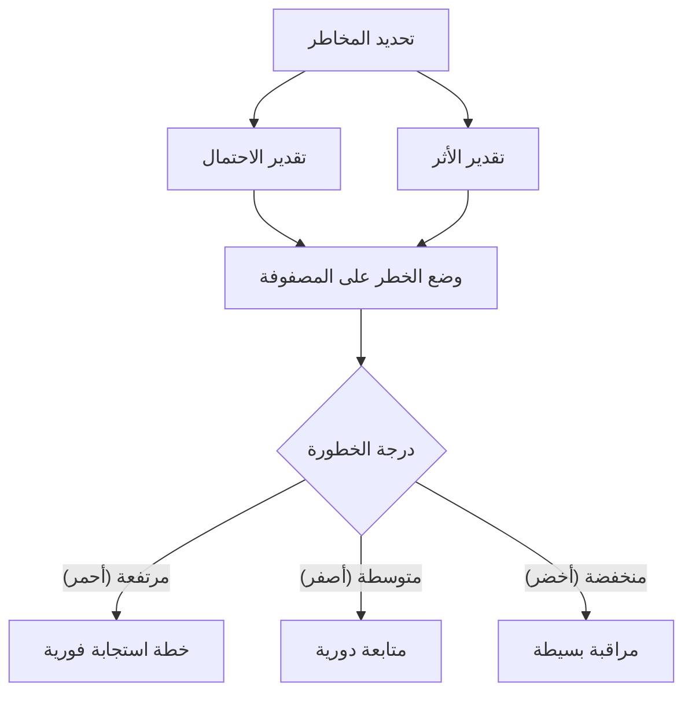

# مصفوفة الاحتمال والأثر (Probability and Impact Matrix)
> [!info] تعريف مختصر
> مصفوفة الاحتمال والأثر (Probability and Impact Matrix) أداة تُستخدم لتصنيف كل خطر بناءً على احتمال وقوعه ودرجة تأثيره على المشروع، من أجل ترتيب المخاطر حسب الأولوية وتحديد أيها يستحق الاهتمام والموارد أولاً.

## الشرح العلمي والاحترافي
المصفوفة عبارة عن جدول ثنائي الأبعاد: المحور الأفقي يمثّل **الاحتمال (Probability)** أن يقع الخطر (مثلاً: منخفض، متوسط، مرتفع، أو نسبة مئوية)، والمحور الرأسي يمثّل **الأثر (Impact)** إذا وقع الخطر فعلاً (منخفض، متوسط، مرتفع، أو تأثير مالي/زمني محدد). كل خلية تقاطع بين الاحتمال والأثر تُعطى درجة أو لوناً (أخضر، أصفر، أحمر) يعبّر عن مستوى الخطورة الإجمالي.

الفكرة الرياضية البسيطة خلفها: **درجة الخطر = الاحتمال × الأثر**. خطر باحتمال مرتفع وأثر مرتفع يقع في المنطقة الحمراء (أولوية قصوى)، بينما خطر باحتمال منخفض وأثر منخفض يقع في المنطقة الخضراء (يمكن تجاهله أو مراقبته فقط).

أهمية هذه الأداة أنها تحوّل تقييم المخاطر من انطباع شخصي غامض ("هذا خطر كبير في رأيي") إلى تصنيف منهجي مرئي يسهل مشاركته مع الإدارة والعميل واتخاذ القرار بناءً عليه. كما تساعد على تخصيص الوقت والموارد للمخاطر التي تستحقها فعلاً بدل توزيعها بالتساوي على كل المخاطر.

## أين ومتى يُستخدم
- في عملية **تحليل المخاطر النوعي (Qualitative Risk Analysis)** ضمن إدارة المخاطر التقليدية (PMBOK) وأيضاً في بيئات Agile عند تقييم المخاطر في بداية كل سبرنت أو إصدار.
- بعد تحديد المخاطر وتسجيلها في [[Risk Register]]، تُستخدم المصفوفة لتصنيف كل خطر وترتيبه حسب الأولوية.
- عند اجتماعات مراجعة المخاطر الدورية، لتحديث موقع كل خطر في المصفوفة بناءً على مستجدات المشروع.
- قبل اتخاذ قرار **الذهاب أو عدم الذهاب (Go or No-Go Decision)** في مرحلة حرجة من المشروع.

## مثال وسيناريو تطبيقي
> [!example] فريق تطوير في شركة "تِكنو" يبني نظام دفع إلكتروني لعميل مصرفي، ولديه ثلاثة مخاطر مسجّلة: (1) تأخر شركة خارجية في تسليم واجهة برمجية (API) للدفع - احتمال مرتفع (70%)، أثر مرتفع (يوقف التطوير بالكامل). (2) نقص خبرة أحد المطورين الجدد في لغة معينة - احتمال متوسط، أثر منخفض (يمكن تعويضه بمراجعة كود إضافية). (3) تغيّر لوائح البنك المركزي أثناء التطوير - احتمال منخفض (10%)، أثر مرتفع جداً (قد يغيّر النطاق بالكامل). عند وضع هذه المخاطر على المصفوفة، يقع الخطر الأول في المنطقة الحمراء فيحصل على خطة استجابة فورية (التواصل الأسبوعي مع المورّد ووضع خطة بديلة). الخطر الثالث رغم انخفاض احتماله يقع في منطقة صفراء/حمراء بسبب شدة أثره، فيُدرج ضمن المراقبة الدورية مع تخصيص [[Contingency Reserve]] له. أما الخطر الثاني فيقع في المنطقة الخضراء ويُكتفى بمتابعته دون إجراء فوري.

## خطوات أو مخطّط
1. حدد قائمة المخاطر المحتملة وسجّلها في سجل المخاطر.
2. لكل خطر، قدّر احتمال وقوعه (مثلاً: منخفض، متوسط، مرتفع أو نسبة مئوية).
3. لكل خطر، قدّر شدة أثره على الجدول الزمني، التكلفة، الجودة، أو النطاق.
4. ضع كل خطر في الخلية المناسبة على المصفوفة بناءً على تقاطع الاحتمال والأثر.
5. صنّف المخاطر حسب اللون/الدرجة: أحمر (أولوية عالية، يحتاج خطة استجابة فورية)، أصفر (متابعة دورية)، أخضر (مراقبة بسيطة).
6. راجع المصفوفة دورياً وحدّث مواقع المخاطر مع تطور المشروع.

## ⚠️ مفاهيم خاطئة شائعة
> [!warning]
> - **الخلط بين درجة الخطورة العالية وضرورة التصرف الفوري لكل المخاطر الحمراء بنفس الطريقة**: بعض المخاطر الحمراء تحتاج تخفيفاً (Mitigation)، وأخرى تحتاج تحويلاً (Transfer) أو تجنباً (Avoidance)، فالدرجة تحدد الأولوية لا نوع الاستجابة.
> - **الاعتقاد أن التقييم رقم ثابت لا يتغير**: احتمال الخطر وأثره يتغيران مع الزمن، فمصفوفة أُعدّت في بداية المشروع قد تصبح غير دقيقة بعد أسابيع.
> - **الظن بأن المصفوفة تُغني عن خطة استجابة تفصيلية**: هي أداة تصنيف وترتيب أولويات فقط، وليست بديلاً عن سجل المخاطر الكامل وخطط الاستجابة.

## ❌ ممارسات خاطئة في المشاريع
> [!failure]
> - **إعداد المصفوفة مرة واحدة في بداية المشروع ثم نسيانها**، مما يجعلها غير مطابقة للواقع بعد فترة. الحل: راجع المصفوفة في كل اجتماع دوري لإدارة المخاطر.
> - **تقدير الاحتمال والأثر بشكل عشوائي دون معايير موحدة بين أعضاء الفريق**، مما يجعل المقارنة بين المخاطر غير موثوقة. الحل: ضع تعريفات واضحة لكل مستوى (مثلاً: "أثر مرتفع = تأخير أكثر من أسبوعين أو تجاوز الميزانية بأكثر من 10%").
> - **التركيز فقط على المخاطر الحمراء وتجاهل المخاطر الصفراء تماماً**، مع أن بعضها قد يتحول إلى أحمر إذا لم تُراقَب. الحل: خصص وقتاً لمراجعة كل المستويات ولو بسرعة أقل للمخاطر الخضراء والصفراء.

## 🔗 مصطلحات ومفاهيم ذات صلة
[[Risk Register]] | [[RAID Log]] | [[Contingency Reserve]] | [[Root Cause Analysis]] | [[Go or No-Go Decision]] | [[Monte Carlo Simulation]] | [[19 - Risk Management]]
