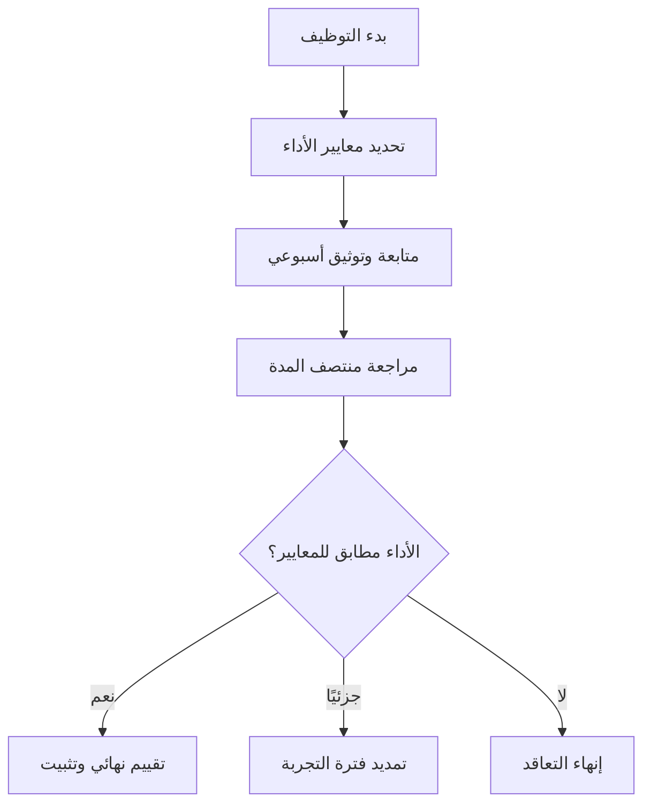

# فترة التجربة (Probation Period)
> [!info] تعريف مختصر
> فترة التجربة (Probation Period) هي مدة زمنية محددة في بداية التوظيف — عادة من شهر إلى ستة أشهر — يقيّم خلالها صاحب العمل أداء الموظف الجديد وملاءمته للوظيفة قبل تثبيته بشكل نهائي.

## الشرح العلمي والاحترافي
- فترة التجربة هي أداة إدارة مخاطر توظيف: تتيح للشركة التحقق من أن الموظف يمتلك فعليًا المهارات والسلوك المهني الذي ادّعاه في المقابلة، قبل الالتزام الكامل به (رواتب، مزايا، حقوق فصل أطول).
- في المقابل، تتيح للموظف نفسه أن يتأكد من ملاءمة بيئة العمل وثقافة الفريق له.
- خلال هذه الفترة تكون شروط إنهاء التعاقد أخف عادة (إشعار أقصر، تعويض أقل) مقارنة بموظف مثبّت، وهذا منصوص عليه غالبًا في عقد العمل وقوانين العمل المحلية.
- في سياق إدارة المشاريع البرمجية، مدير المشروع أو Team Lead غالبًا ما يكون طرفًا أساسيًا في تقييم أداء الموظف الجديد خلال هذه الفترة، لأنه الأقرب لملاحظة جودة عمله اليومي.
- التقييم الجيد لفترة التجربة يعتمد على معايير واضحة ومحددة سلفًا (Explicit Policies)، وليس على انطباعات عامة غير موثقة.

## أين ومتى يُستخدم
- تُستخدم مع كل موظف جديد ينضم إلى فريق التطوير أو إدارة المشاريع، بصرف النظر عن منهجية العمل (Agile أو Waterfall).
- يُلجأ إليها بشكل خاص عند توظيف أدوار حسّاسة مثل مطوّر أول (Senior Developer)، أو Scrum Master، أو Service Delivery Manager، حيث يصعب التحقق من الكفاءة الفعلية إلا بالعمل الحقيقي على مشروع حي.
- تُستخدم أيضًا مع الموظفين المنقولين داخليًا (Internal Transfer) إلى دور جديد مختلف جوهريًا عن دورهم السابق.

## مثال وسيناريو تطبيقي
> [!example] وظّفت شركة "دِفلوجيك" مطوّرة Backend جديدة اسمها سارة، بعقد يتضمن فترة تجربة مدتها 90 يومًا. حدّد مديرها المباشر ثلاثة معايير قياس واضحة منذ اليوم الأول: (1) إنجاز مهام السبرنت بجودة تمر بمراجعة الكود من أول أو ثاني محاولة، (2) الالتزام بحضور الـ Daily Standup والمساهمة الفعّالة فيه، (3) عدم تكرار نفس نوع الأخطاء (Bugs) بعد التوضيح. في اليوم 60 عقد المدير جلسة مراجعة منتصف المدة (Mid-point Review) أطلعها فيها على نقاط قوتها وملاحظتين للتحسين. في اليوم 85 عقد اجتماع تقييم نهائي مع الموارد البشرية، وثبّتت سارة في منصبها لأنها استوفت المعايير الثلاثة بوضوح موثّق.

## خطوات أو مخطّط
1. تحديد معايير أداء واضحة ومكتوبة قبل بدء الموظف بالعمل.
2. توثيق الملاحظات أولًا بأول (لا الاعتماد على الذاكرة عند نهاية الفترة).
3. عقد مراجعة في منتصف الفترة لإعطاء فرصة تصحيح المسار.
4. عقد اجتماع تقييم نهائي رسمي قبل انتهاء الفترة بأيام كافية.
5. اتخاذ القرار: تثبيت، تمديد الفترة، أو إنهاء التعاقد.

## ⚠️ مفاهيم خاطئة شائعة
> [!warning]
> - الاعتقاد أن فترة التجربة مجرد شكليات قانونية دون تقييم فعلي؛ هي في الواقع أداة إدارية يجب استثمارها بجدية.
> - الخلط بين "التقصير في الأداء" و"عدم كفاية الوقت للتأقلم"؛ يجب التمييز بين الاثنين قبل اتخاذ قرار الإنهاء.
> - افتراض أن الموظف يعرف تلقائيًا المعايير المتوقعة منه دون إخباره بها صراحة.

## ❌ ممارسات خاطئة في المشاريع
> [!failure]
> - عدم تحديد معايير تقييم مكتوبة، ثم اتخاذ قرار الإنهاء بناءً على انطباع شخصي غير موثّق — قد يعرّض الشركة لنزاع قانوني. الحل: وثّق المعايير والملاحظات من اليوم الأول.
> - ترك التقييم بالكامل لآخر أسبوع في فترة التجربة دون أي تغذية راجعة مسبقة (Feedback Loop) — يفاجأ الموظف بالقرار. الحل: تغذية راجعة منتظمة وشفافة.
> - تمديد فترة التجربة بشكل متكرر دون سبب واضح كوسيلة ضغط على الموظف بدلًا من اتخاذ قرار حاسم.

## 🔗 مصطلحات ومفاهيم ذات صلة
[[Explicit Policies]] | [[Feedback Loop]] | [[Servant Leadership]] | [[Psychological Safety]] | [[06 - Scrum Master]] | [[Service Delivery Manager]]
