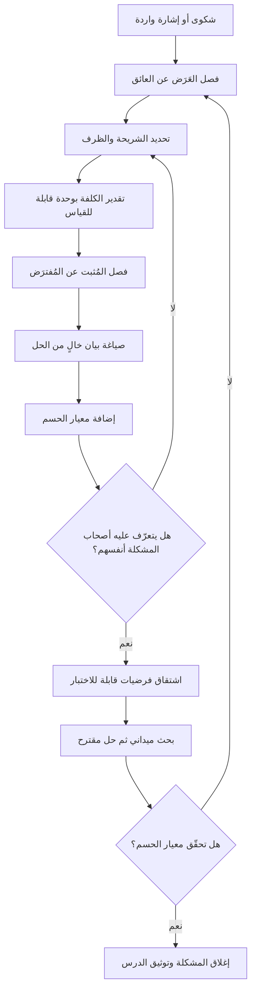

# بيان المشكلة (Problem Statement)

> [!info] تعريف مختصر
> صياغة مكتوبة موجزة تحدّد — قبل اقتراح أي حل — **من** يعاني، و**ما** العائق الذي يقف في طريقه، و**متى وأين** يظهر هذا العائق، و**ما كلفته** المقيسة أو المُقدَّرة، و**كيف نعرف أنه حُلّ**. جوهر بيان المشكلة أنه يصف عالمًا كما هو لا كما نتمنّاه، ويُكتب بلغة خالية من الحل: لا يذكر ميزة ولا تقنية ولا اسم منتج. قيمته العملية أنه يحوّل الشكوى الغامضة («التطبيق بطيء»، «العملاء غير راضين») إلى عبارة محدّدة يمكن الاختلاف عليها، والتحقّق منها، والحكم لاحقًا على ما إذا كان العمل قد أزالها فعلًا.

## الشرح العلمي والاحترافي
- **البيان أداة تقييد للنطاق لا مجرّد مقدّمة توثيقية**: كثير من المستندات تبدأ بفقرة «خلفية» إنشائية لا يقرؤها أحد. بيان المشكلة الجيّد يختلف عنها في أنه **قابل للإبطال**: يمكن لشخص أن يقول «هذا غير صحيح، الشريحة ليست هذه» أو «الكلفة أصغر بكثير مما تدّعي». وهذه القابلية للنقض هي ما يجعله وثيقة هندسية لا بلاغية. إن لم يكن ممكنًا الاختلاف على بيانك، فأنت لم تكتب مشكلة بل كتبت شعارًا.
- **قاعدة خلوّ البيان من الحل (Solution-Free)**: أخطر ما يحدث في بداية المشروع هو تسلّل الحل إلى داخل صياغة المشكلة. جملة مثل «المشكلة أننا لا نملك تطبيق جوال» ليست مشكلة بل حل مُقنّع؛ فهي تُغلق فضاء البدائل قبل فتحه. الصياغة الصحيحة تصف العائق: «العملاء الميدانيون لا يستطيعون تسجيل الزيارة إلا بعد عودتهم إلى المكتب، فتضيع التفاصيل ويتأخّر تحصيل الفاتورة». عندها يبقى التطبيق واحدًا من عدة حلول ممكنة، إلى جانب رسالة نصية، أو نموذج ويب، أو تغيير في الإجراء.
- **العناصر الخمسة الواجبة**: (١) **الشريحة** محدّدة لا «المستخدمون» عمومًا؛ (٢) **العائق** بصيغة سلوكية: ما الذي يحاول الشخص فعله ويتعثّر؟ (٣) **الظرف**: متى وأين ومع أي تكرار؟ (٤) **الكلفة**: ما الذي يُهدر — وقت، مال، فرص، مخاطرة امتثال؟ (٥) **معيار الحسم**: أي رقم أو سلوك إن تغيّر اعتبرنا المشكلة زالت. غياب العنصر الخامس هو أكثر أسباب المشاريع التي «تنتهي» بلا أحد يعرف هل نجحت.
- **التمييز بين العَرَض والمشكلة والسبب الجذري**: العَرَض هو ما يُشتكى منه («تأخّرت الفواتير»)، والمشكلة هي العائق الموصوف بدقّة في سياقه، والسبب الجذري هو ما يولّدها ويُستخرج بتحليل منهجي ([[Root Cause Analysis]]). كتابة البيان لا تعني إتمام التحليل السببي، لكنها تشترط ألّا يُخلط العَرَض بالمشكلة، وأن يُذكر صراحة ما هو مُثبت وما هو مُفترَض.
- **البيان مدخل الفرضيات لا مخرجها**: تسلسل العمل السليم هو: بيان مشكلة ← فرضيات سببية قابلة للاختبار ([[Hypothesis]]) ← تحديد الافتراضات الأخطر ([[Assumption Mapping]]) ← بحث ميداني ([[User Interview]]) ← حل مقترح ثم [[MVP]]. حين يُكتب البيان بعد اختيار الحل يصبح تبريرًا رجعيًّا، وهي ممارسة شائعة جدًّا وضارّة لأنها تُلبس القرار المُتّخذ ثوب البحث.
- **الأصل المنهجي**: الفكرة ليست حديثة ولا مملوكة لمدرسة واحدة؛ فهي حاضرة منذ عقود في هندسة الجودة اليابانية (حيث تُشترط صياغة المشكلة قبل تحليلها في تقرير الصفحة الواحدة المعروف بـ A3، وفي دورة [[PDCA]])، وفي منهجيات حلّ المشكلات الصناعية، وفي أدبيات تصميم الخدمات وتفكير التصميم حيث تُسمّى مرحلة **التعريف (Define)** وتُصاغ غالبًا بصيغة سؤال يبدأ بـ«كيف يمكننا أن…؟» (How Might We). المشترك بين هذه المدارس جميعًا مبدأ واحد: **زمن يُنفق في تعريف المشكلة أرخص بمراتب من زمن يُنفق في بناء الحل الخطأ** — وهو منطق يتماشى مع [[Cost-of-Change Curve]].
- **علاقته بالأصحاب والمصالح**: للمشكلة الواحدة صياغات متعدّدة بحسب من يكتبها. مدير العمليات يراها تأخّرًا في الدورة، والمالية تراها تدفّقًا نقديًّا، والعميل يراها ارتباكًا وقلة ثقة. البيان الناضج يذكر الشريحة الأساسية المتضرّرة صراحة، ويعترف بالمتضرّرين الثانويين، بدل أن يذوب في صياغة توفيقية لا تصف أحدًا ([[Stakeholder Map]]).
- **الإيجاز شرط وظيفي لا جمالي**: البيان الذي لا يمكن قراءته في دقيقة لن يُستخدم في القرارات اليومية. الحجم المعتاد فقرة إلى ثلاث فقرات، مع إحالات إلى الأدلّة التفصيلية بدل حشرها في المتن.

## أين ومتى يُستخدم
- **في افتتاح أي مبادرة أو مشروع**: بوصفه القسم الأول في [[Business Case]] و[[Delivery Charter]]، حيث يُشترط ألّا تُعتمد الميزانية قبل أن يوافق الراعي ([[Sponsor]]) على وصف المشكلة نفسه، لا على وصف الحل فقط.
- **في اكتشاف المنتج**: مدخلًا لجلسات [[Product Discovery]] و[[Continuous Discovery]]، ولبناء شجرة الفرص ([[Opportunity Solution Tree]]) التي تربط النتيجة المرجوّة بالمشكلات الحقيقية قبل الحلول.
- **في تحويل الشكاوى إلى عمل منظّم**: عند تجميع نقاط الألم ([[Pain Point]]) الواردة من الدعم والمبيعات، يُعاد صوغها في بيانات مشكلة موحّدة بدل أن تدخل الـ Backlog على هيئة طلبات ميزات متفرّقة — وهذه إحدى أقوى المضادّات لظاهرة [[Feature Factory]].
- **في صياغة متطلبات نظام**: يوضع بيان المشكلة في صدر [[PRD]] و[[BRD]] ليُقاس كل متطلّب لاحق بمدى مساهمته في إزالته.
- **في مراجعة الأولويات**: بندٌ بلا بيان مشكلة واضح لا يستحق درجة في [[RICE Prioritization]] أو [[WSJF]]، لأن الأثر والقيمة يُشتقّان أصلًا من كلفة المشكلة.
- **في تحليل الأعطال والحوادث**: تبدأ جلسة [[Root Cause Analysis]] بصياغة دقيقة لما حدث ومتى وما نطاق أثره، قبل الانتقال إلى «لماذا»، ومخرجاتها تُغذّي [[Decision Log]] و[[Issue Log]].

## مثال وسيناريو تطبيقي
> [!example] شركة توصيل خليجية متوسطة الحجم، أسطولها 140 مركبة في ثلاث مدن. وصل إلى لجنة التوجيه ([[Steering Committee]]) طلب بميزانية 900 ألف ريال لبناء «تطبيق ذكاء اصطناعي لتحسين المسارات». حين طُلب من مقدّم الطلب كتابة بيان مشكلة خالٍ من الحل، ظهر أن ما بين يديه شكوى واحدة متكرّرة: «التوصيل متأخّر».
> جمع الفريق بيانات أسبوعين فعليّين (نحو 31 ألف شحنة) وأعاد الصياغة على هذا النحو: «**سائقو التوصيل داخل الأحياء السكنية الكبرى في المدينة الشرقية** يقضون في المتوسط 11 دقيقة إضافية لكل شحنة **بين لحظة الوصول إلى الحي ولحظة تسليم الطرد**، بسبب صعوبة تحديد المدخل الصحيح والاتصال بالعميل. يقع هذا في 38% من شحنات الفترة المسائية (17:00–21:00) وحدها. الكلفة التقديرية: نحو 470 ساعة سائق شهريًّا في هذه المنطقة، إضافة إلى 6% من الشحنات تُعاد لليوم التالي. نعتبر المشكلة قد زالت إذا انخفض متوسط زمن ما بعد الوصول إلى أقل من 5 دقائق، وتراجعت نسبة الإعادة إلى ما دون 2%، ولمدة ثلاثة أشهر متصلة.»
> غيّر هذا البيان القرار كلّه. فالوقت الضائع لم يكن في **الطريق** بل **بعد الوصول**، أي أن تحسين المسارات كان سيحلّ مشكلة غير قائمة. جرّب الفريق أولًا حلًّا لا برمجيًّا تقريبًا: رسالة تلقائية للعميل عند اقتراب السائق مسافة 500 متر، مع حقل اختياري لوصف المدخل يُحفظ للمرة القادمة. كلفة التجربة كانت جزءًا صغيرًا من الميزانية المطلوبة، وقُيست على منطقة واحدة لمدة ستة أسابيع كـ[[Pilot Launch]]. النتيجة الداخلية التي رصدها الفريق: انخفاض المتوسط إلى 6 دقائق ونصف، وهو ما لم يبلغ الهدف لكنه أزال 60% من الكلفة بأقل من عُشر الميزانية — وحوّل النقاش من «هل نبني نظامًا؟» إلى «ما الذي تبقّى من الدقائق الأربع، ولمن؟».

## خطوات أو مخطّط
1. اجمع الشكوى كما وردت حرفيًّا، من مصدرها، دون إعادة تفسير مبكّرة.
2. افصل العَرَض عن المشكلة: اسأل «ماذا كان الشخص يحاول أن يفعل حين تعثّر؟».
3. حدّد الشريحة بدقّة: من بالضبط؟ وكم عددهم؟ ومن **لا** يعاني منها؟ (تحديد من لا يعاني يضبط النطاق أكثر من تحديد من يعاني).
4. حدّد الظرف: متى تحدث، وأين، وبأي تكرار، وهل هي موسمية أم دائمة.
5. قدّر الكلفة بوحدة قابلة للقياس: ساعات، ريالات، شحنات مُعادة، مكالمات دعم، مخاطرة امتثال.
6. افصل بوضوح ما هو **مُثبت بالبيانات** عمّا هو **مُفترَض** — وسجّل الافتراضات لتُعالَج لاحقًا في [[Assumption Mapping]].
7. اكتب البيان في فقرة واحدة خالية من أي حل أو تقنية، ثم امسح منها كل صفة إنشائية.
8. أضف معيار الحسم: الرقم أو السلوك الذي إن تحقّق نعتبر المشكلة قد زالت، ومدّة الثبات المطلوبة.
9. اعرضه على من يعاني المشكلة فعلًا — لا على الإدارة فقط — واسأله: هل هذا وصف حياتك؟
10. راجعه بعد كل موجة بحث؛ البيان وثيقة حيّة تُنقَّح، لا نصّ يُجمَّد.

## ⚠️ مفاهيم خاطئة شائعة
> [!warning]
> - **«بيان المشكلة هو الخلفية التاريخية للمشروع»**: خطأ. الخلفية تروي كيف وصلنا إلى هنا؛ البيان يصف العائق القائم اليوم وكلفته. الوثيقتان مختلفتان، وخلطهما يُنتج نصًّا طويلًا بلا قرار.
> - **«كلما اتّسع البيان زادت أهمية المشروع»**: خطأ معكوس. «تحسين تجربة العملاء» بيان بلا شريحة ولا ظرف ولا معيار حسم، ولذلك لا يمكن إثبات نجاحه ولا فشله. البيان الضيّق الدقيق أثمن من الواسع المهيب.
> - **«لا يمكن كتابة بيان مشكلة قبل توفّر بيانات كاملة»**: خطأ. البيان يُكتب بأفضل المعروف حاليًّا، بشرط تمييز المُثبت من المُفترَض صراحة. انتظار اليقين الكامل هو نفسه قرار — بالبقاء في الوضع القائم.
> - **«ذكر الحل في البيان يوضّح الفكرة»**: خطأ. ذكر الحل يُغلق فضاء البدائل ويحوّل البحث اللاحق إلى بحث عن أدلّة مؤيّدة فقط، أي إلى [[Confirmation Bias]] مؤسّسي.
> - **«البيان المكتوب مرة يبقى صالحًا طوال المشروع»**: خطأ. الفهم يتغيّر مع كل موجة بحث؛ والبيان الذي لم يُنقَّح مطلقًا خلال مشروع طويل مؤشّر على أن البحث لم يؤثّر في شيء.
> - **«بيان المشكلة والسبب الجذري شيء واحد»**: خطأ. البيان يصف الظاهرة وكلفتها؛ السبب الجذري يفسّر لماذا تحدث. القفز إلى السبب قبل ضبط الوصف يقود إلى تحليل عميق لمشكلة خاطئة.

## ❌ ممارسات خاطئة في المشاريع
> [!failure]
> - **كتابة البيان بعد اختيار الحل**: الخطأ أن الفريق يقرّر بناء نظام ثم يؤلّف مشكلة تبرّره. لماذا يضرّ: يُفقد البحث وظيفته النقدية، ويحوّل الأدلّة إلى زينة، ويجعل الفشل غير قابل للاكتشاف حتى بعد الإطلاق. الحل: افرض تسلسلًا موثّقًا في [[Decision Log]] — بيان مؤرّخ قبل أي مقترح حل، ولا تُعتمد ميزانية على بيان مكتوب بعد المقترح.
> - **صياغة البيان بلغة الإدارة العليا وحدها**: الخطأ أن البيان يوصف بمقاييس مالية مجرّدة لا يتعرّف عليها من يعيش المشكلة. لماذا يضرّ: الفريق التنفيذي لا يستطيع اشتقاق قرارات تصميم من «انخفاض الإيرادات 4%». الحل: اكتب طبقتين مترابطتين — طبقة سلوكية تصف تعثّر الشخص، وطبقة أثر تصف انعكاسها على الأعمال ([[Business Impact]]).
> - **إغفال معيار الحسم**: الخطأ أن البيان ينتهي عند وصف المعاناة. لماذا يضرّ: المشروع يُسلَّم ويُغلق دون أن يعرف أحد هل زالت المشكلة، فتتكرّر الشكوى بعد أشهر بعنوان جديد وميزانية جديدة. الحل: اشترط رقمًا وحدًّا زمنيًّا لثباته، واربطه بمؤشّر قائم ([[KPI]]) بدل اختراع مؤشّر خاص بالمشروع.
> - **الخلط بين عدّة مشكلات في بيان واحد**: الخطأ أن يُحشر تأخّر التسليم وضعف الجودة وارتباك الفواتير في فقرة واحدة. لماذا يضرّ: يستحيل تصميم حل أو قياس أثر لمجموعة مشكلات متباينة الأسباب، وينتهي المشروع بنطاق زاحف ([[Scope Creep]]). الحل: بيان واحد لكل مشكلة، وقائمة مرتّبة بالأولوية بينها.
> - **الاعتماد على شكاوى المبيعات وحدها مصدرًا للمشكلة**: الخطأ أن يُبنى البيان على ما ينقله فريق المبيعات عن صفقة خُسرت. لماذا يضرّ: الصفقة الخاسرة عيّنة منحازة لأقصى درجة، وتوصف غالبًا بلغة الحل المطلوب لا بلغة العائق. الحل: تحقّق من كل بيان بمصدرين مستقلّين على الأقل، أحدهما سلوكي (بيانات استخدام أو تذاكر دعم) لا لفظي.
> - **تجميد البيان في شريحة عرض تُؤرشف**: الخطأ أن يُكتب مرة في جلسة انطلاق ثم لا يُرى مجدّدًا. لماذا يضرّ: يعود الفريق تدريجيًّا إلى نقاش الميزات، وتنقطع صلة العمل اليومي بسبب وجوده. الحل: ضع البيان في صدر لوح العمل وفي أعلى [[PRD]]، واجعل مراجعة كل بند أولوية تبدأ بسؤال: أي بيان مشكلة يخدم هذا البند؟
> - **استخدام صياغة المشكلة سلاحًا في صراع تنظيمي**: الخطأ أن تُصاغ المشكلة لتحميل إدارة بعينها المسؤولية. لماذا يضرّ: يتحوّل النقاش إلى دفاع، فتُخفى البيانات وتُجمَّل، ويُفقد الأمان النفسي اللازم للاكتشاف ([[Psychological Safety]]). الحل: صف النظام والعملية لا الأشخاص، واذكر أثر المشكلة على المتضرّر النهائي بدل نسبتها إلى قسم.

## 🔗 مصطلحات ومفاهيم ذات صلة
[[Hypothesis]] | [[Assumption Mapping]] | [[User Interview]] | [[The Mom Test]] | [[Confirmation Bias]] | [[Pain Point]] | [[Root Cause Analysis]] | [[Product Discovery]] | [[Opportunity Solution Tree]] | [[Business Case]] | [[Jobs to be Done]] | [[Outcome vs Output]]
