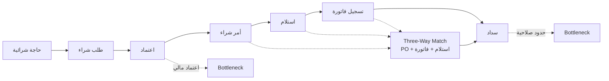

# من الشراء إلى السداد (Procure to Pay)

> [!info] تعريف مختصر
> **`Procure to Pay`** هو [[Value Stream|تدفّق القيمة]] الممتدّ من نشوء حاجة شرائية حتى **سداد المورّد**. وهو التوأم العكسي لـ[[Order to Cash]]: الأول يُدخل النقد والثاني يُخرجه. وأثره لا يظهر في الإيراد بل في **التكلفة وعلاقة المورّدين وتوفّر البضاعة** — ولهذا يُقلَّل من شأنه في المشاريع، رغم أن تعثّره يُسقط `Order to Cash` نفسه: لا تستطيع أن تبيع ما لم تشترِه في وقته.

## الشرح العلمي والاحترافي

- **الخطوات الستّ القياسية**:
  ```
  طلب شراء → اعتماد → أمر شراء للمورّد → استلام البضاعة → تسجيل الفاتورة → السداد
  ```

- **المطابقة الثلاثية (`Three-Way Match`)** — قلب التدفّق: قبل السداد يجب أن تتطابق ثلاث وثائق: **أمر الشراء** و**إشعار الاستلام** و**فاتورة المورّد**. وأي اختلاف بينها يوقف السداد. وهذه المطابقة هي المصدر الأول للانتظار في التدفّق، وهي في الوقت نفسه **الضابط الرقابي الذي لا يجوز التنازل عنه** — فالتسريع هنا يكون بأتمتة المطابقة لا بإلغائها.

- **لماذا انتظاره أطول من `O2C` غالباً؟** لأن كل خطوة فيه تنطوي على **اعتماد مالي**: اعتماد الطلب، ثم اعتماد الاستلام، ثم اعتماد السداد. والاعتماد المالي أبطأ من التشغيلي لأنه يحمل مسؤولية قانونية ويرتبط بحدود صلاحية. ولهذا فإن أزمنة الانتظار فيه تُقاس بالأيام لا بالساعات.

- **الاختناقات النمطية**:
  | الاختناق | السبب الجذري | العلاج |
  |---|---|---|
  | تأخّر اعتماد الطلب | المدير غير متاح ولا تفويض | سلسلة اعتماد بحدود صلاحية + تفويض آلي عند الغياب |
  | عدم مطابقة الاستلام | فروق كميات أو أصناف | استلام بالباركود + تحمّل انحراف معلن |
  | تأخّر تسجيل الفاتورة | مراجعة مالية يدوية | التقاط آلي + مطابقة ثلاثية مؤتمتة |
  | تأخّر السداد | تجميع دفعات وحدود صلاحية | جدولة سداد + تكامل بنكي |

- **مؤشّراته**: `PO Cycle Time` (من الطلب إلى أمر الشراء) · `Invoice Match Rate` (نسبة الفواتير المطابقة آلياً) · `On-Time Payment Rate` · `Maverick Spend` (الشراء خارج النظام).

- **`Maverick Spend` — المؤشّر الذي يكشف الحقيقة**: الشراء الذي يتمّ خارج الدورة الرسمية («اشتريناه بسرعة لأن الاعتماد كان بطيئاً»). وارتفاعه ليس مشكلة انضباط بل **عَرَضٌ لبطء التدفّق**: الناس تلتفّ حول النظام حين يعوقها. ولذلك فهو أصدق مقياس لصحّة `P2P` من أي مؤشّر آخر.

- **علاقته بالتدفّقات الأخرى**: يُغذّي `Inventory Replenishment` (توفّر البضاعة) الذي يُغذّي [[Order to Cash]] (القدرة على التسليم). ولهذا فإن معالجة تأخّر الطلبات في `O2C` دون النظر في `P2P` قد تعالج عَرَضاً سببه في تدفّق آخر تماماً.

- **موقعه في التقسيم المرحلي**: نادراً ما يدخل المرحلة الأولى كاملاً، لأن أثره المالي غير مباشر. لكن **جزءاً منه يدخل إجبارياً**: الاستلام وتحديث المخزون — إذ بدونهما لا يعمل `O2C`. وهذا مثال نموذجي على أن التقسيم يكون **بالدورة لا بالوحدة**.

## أين ومتى يُستخدم
- في **تحليل التدفّقات** ضمن مشاريع الأنظمة المؤسسية، عادةً كتدفّق ثانٍ أو ثالث.
- عند **تحليل تكلفة التشغيل** ومصادر الهدر غير الظاهرة في الإيراد.
- في **مشاريع الحوكمة والامتثال**، إذ إن المطابقة الثلاثية ضابط رقابي أساسي.
- عند **تشخيص نقص المخزون المتكرّر** — وسببه غالباً في `P2P` لا في المخزون نفسه.
- في **إدارة علاقات المورّدين**: تأخّر السداد يرفع الأسعار ويقصّر مهل التوريد.

## مثال وسيناريو تطبيقي
> [!example] شركة توزيع — تدفّق يبدو ثانوياً ويُسقِط التدفّق الرئيسي
> | الخطوة | زمن العمل | زمن الانتظار | المشكلة |
> |---|---|---|---|
> | إنشاء طلب شراء | 20 د | 5 س | مراجعة يدوية |
> | **اعتماد الطلب** | 10 د | **يوم** | المدير غير متاح |
> | إرسال للمورّد | 15 د | 4 س | تأخّر المراجعة |
> | استلام البضاعة | ساعتان | 6 س | عدم مطابقة |
> | تسجيل الفاتورة | 30 د | 8 س | مراجعة مالية |
> | **السداد** | 20 د | **3 أيام** | تأخّر الاعتماد |
> | **الإجمالي** | **≈ 3.6 ساعة** | **يعتمد على وحدة اليوم** | |
>
> **ملاحظة منهجية مهمّة:** الجدول يخلط الساعات بالأيام دون تعريف «اليوم». والأثر جوهري:
> | تعريف اليوم | كفاءة التدفّق |
> |---|---|
> | 24 ساعة (تقويمي) | **≈ 2.9%** |
> | 8 ساعات (عمل) | **≈ 6.1%** |
>
> **والصحيح للعميل هو التقويمي** — لأن أمر الشراء المعلّق ليلاً معلّق فعلاً، والمورّد لا يفرّق.
>
> **الاكتشاف الأهمّ:** فريق المشروع بدأ بمعالجة «تأخّر الطلبات» في [[Order to Cash]]، وركّز على اعتماد الطلب هناك (8 ساعات انتظار). لكن جزءاً من التأخير كان مصدره **نفاد البضاعة** — وسببه أن دورة الشراء تستغرق أربعة أيام انتظار في خطوتين فقط (اعتماد الطلب والسداد).
>
> **النتيجة:** أُدخل جزء من `P2P` إلى المرحلة الأولى — تحديداً الاستلام وتحديث المخزون وسلسلة اعتماد بحدود صلاحية — رغم أن التدفّق ككلّ كان مُخطَّطاً للمرحلة الثانية. **وهذا هو معنى التقسيم بالدورة لا بالوحدة.**

## خطوات أو مخطّط
1. ارسم الخطوات من نشوء الحاجة حتى **السداد**.
2. ثبّت وحدة الزمن — التقويمي هو الصحيح.
3. سجّل الاعتمادات المالية بوصفها اختناقات متوقّعة لا استثناءات.
4. احسب [[Flow Efficiency]] وقارنه بـ[[Order to Cash]].
5. افحص `Maverick Spend` — فهو يكشف ما لا تكشفه المقابلات.
6. حدّد الحدّ الأدنى من `P2P` الذي يحتاجه `O2C` للعمل، وأدخله المرحلة الأولى.
7. أتمت المطابقة الثلاثية بدل إلغائها.
8. اربط تأخّر الاعتمادات بـ[[SLA]] وسياسة تفويض معلنة.



## ⚠️ مفاهيم خاطئة شائعة
> [!warning]
> - **اعتباره تدفّقاً ثانوياً**: تعثّره يُسقط [[Order to Cash]] عبر نفاد البضاعة.
> - **الظنّ بأن تسريعه يعني إلغاء المطابقة الثلاثية**: المطابقة ضابط رقابي؛ التسريع يكون بأتمتتها.
> - **قراءة `Maverick Spend` كمشكلة انضباط**: هو عَرَض لبطء الدورة لا سوء نيّة.
> - **خلط وحدات الزمن**: يضاعف أو ينصّف كفاءة التدفّق ويفسد كل مقارنة.
> - **افتراض أن تأخّر السداد يوفّر نقداً**: يرفع الأسعار ويقصّر مهل التوريد فيكلّف أكثر.

## ❌ ممارسات خاطئة في المشاريع
> [!failure]
> - **تأجيل التدفّق كاملاً إلى المرحلة الثانية**: يترك `O2C` بلا مخزون موثوق. الحلّ: أدخِل الاستلام وتحديث المخزون في المرحلة الأولى.
> - **معالجة اختناقات `O2C` دون فحص `P2P`**: يعالج العَرَض ويترك السبب. الحلّ: ارسم التدفّقين معاً قبل قرار المرحلة.
> - **بناء سلسلة اعتماد بلا تفويض عند الغياب**: يجعل غياب مدير واحد يوقف الشراء كلّه. الحلّ: تفويض آلي وحدود صلاحية معلنة.
> - **إهمال قياس `Maverick Spend`**: يخفي أصدق مؤشّر على صحّة التدفّق. الحلّ: قِسه قبل المشروع وبعده.
> - **أتمتة التدفّق فوق عملية معطوبة**: يسرّع الفوضى. الحلّ: بسّط سلسلة الاعتماد أولاً ثم أتمتها.

## 🔗 مصطلحات ومفاهيم ذات صلة
[[Order to Cash]] | [[Value Stream]] | [[Flow Efficiency]] | [[Value Stream Mapping]] | [[Financial Loss Analysis]] | [[SLA]] | [[06 - Value Streams]]
