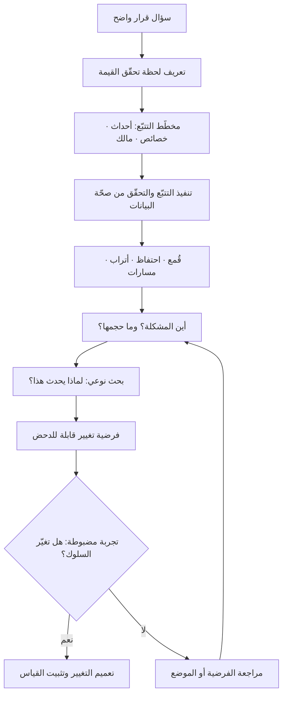

# تحليلات المنتج (Product Analytics)

> [!info] تعريف مختصر
> ممارسة قياس **سلوك المستخدم الفعلي داخل المنتج** — ما الذي فُتح، وما الذي اكتمل، وأين توقّف الناس، وكم استغرقوا، ومن عاد ومن لم يعد — بهدف تحويل الاستخدام من انطباع إلى بيانات قابلة للفحص. جوهر قيمتها أنها تجيب بدقة عالية عن سؤالَي **«أين تقع المشكلة؟»** و**«ما حجمها؟»**، وهي بطبيعتها عاجزة عن الإجابة عن سؤال **«لماذا؟»**. الأرقام تحدّد موضع النزيف ولا تشخّص سببه؛ التشخيص يحتاج بحثًا نوعيًّا (مقابلات، ملاحظة، اختبار قابلية استخدام). ومن هنا فإن تحليلات المنتج ليست بديلًا عن [[Product Discovery]] بل نصفه الكمّي.

## الشرح العلمي والاحترافي
- **الفرق الجوهري بينها وبين تحليلات الويب التقليدية**: تحليلات الويب التقليدية وُلدت لخدمة التسويق، ووحدتها التحليلية هي **الجلسة وزيارة الصفحة** — كم زائرًا، من أين أتوا، كم صفحة شاهدوا. تحليلات المنتج وُلدت لخدمة بناء المنتج، ووحدتها التحليلية هي **المستخدم عبر الزمن والحدث الذي قام به**. الفارق ليس تقنيًّا فحسب بل معرفي: الأولى تقيس اكتساب الانتباه، والثانية تقيس تحقّق القيمة. فريق يقيس منتجًا بأدوات تسويقية سيرى ازدهارًا في الزيارات بينما ينهار الاستخدام العميق دون أن يظهر ذلك في أي لوحة.
- **النموذج الأساسي: المستخدم — الحدث — الخاصية**: البنية التحتية لأي نظام تحليلات منتج تقوم على ثلاثة عناصر. **المستخدم** بمعرّف ثابت يربط جلساته وأجهزته. و**الحدث (Event)** وهو فعل ذو معنى تجاري لا تقني ("أنشأ مشروعًا"، "دعا زميلًا"، "أكمل الدفع") — لا "نقر على الزر رقم 3". و**الخاصية (Property)** وهي البيانات الوصفية المرافقة للحدث أو للمستخدم (الخطة، حجم الفريق، القناة، نوع الجهاز) وهي ما يسمح بالتقطيع والمقارنة لاحقًا. جودة التحليلات تُحسم عند تصميم هذه الطبقة، لا عند اختيار الأداة.
- **مخطّط التتبّع (Tracking Plan) هو المستند الحاكم**: وثيقة تُعرَّف فيها الأحداث وأسماؤها وخصائصها ومَن يملكها ومتى تُطلق، وتُراجَع قبل البرمجة لا بعدها. غياب هذا المستند هو السبب الأول لفساد بيانات المنتج: أسماء متضاربة (`signup` و`sign_up` و`SignUp`)، أحداث تُطلق مرتين، خصائص مفقودة في المنصّة الواحدة دون الأخرى. وهو من هذه الزاوية تطبيق مباشر لمبدأ [[Single Source of Truth]] على طبقة القياس، ويشترك مع [[Master Data]] في أن الفوضى فيه تكلفتها تراكمية ولا تُصحَّح بأثر رجعي.
- **الأدوات التحليلية الأربع الأساسية**: (١) **القُمع (Funnel)** ويقيس التسرّب بين خطوات متسلسلة نحو هدف. (٢) **الاحتفاظ (Retention)** ويقيس عودة المستخدم عبر الزمن، وهو المقياس الأصدق عن القيمة الحقيقية لأنه لا يُشترى بالإعلانات. (٣) **الأتراب (Cohorts)** وهي تجميع المستخدمين حسب سمة مشتركة (شهر التسجيل، القناة، الخطة) لمقارنة سلوكهم — وهي التي تكشف ما يخفيه المتوسط العام. (٤) **مسارات الاستخدام (Paths / Flows)** وتُظهر التسلسل الحقيقي الذي يسلكه الناس مقابل التسلسل الذي تخيّله المصمّم.
- **حدودها المعرفية الصارمة**: البيانات السلوكية **ارتباطية** بطبيعتها. أن يرتفع الاحتفاظ عند من دعا زميلًا في أول أسبوع لا يعني أن الدعوة سبب الاحتفاظ؛ فقد يكون الاثنان أثرًا لسبب ثالث هو الجدّية المسبقة. تحويل هذه الملاحظة إلى استنتاج سببي ("لنجبر الجميع على الدعوة") خطأ منهجي متكرّر ومكلف. الطريق الوحيد إلى السببية هو **التجربة المضبوطة** (اختبار A/B) أو البحث النوعي، لا حجم العيّنة.
- **الفرق بين مقياس مضلّل ومقياس صحّي**: تُسمّى المقاييس التي ترتفع دائمًا ولا يترتّب على تغيّرها قرار **مقاييس الغرور (Vanity Metrics)** — إجمالي التسجيلات التراكمي، إجمالي المشاهدات. المقياس الصالح للإدارة يكون **نسبيًّا** (نسبة لا رقمًا مطلقًا)، **قابلًا للتقطيع** إلى شرائح، و**قابلًا للانخفاض**؛ فالمقياس الذي يستحيل أن ينخفض لا يخبرك بشيء. هذا التمييز مرتبط مباشرة بـ[[Outcome vs Output]] وبمنطق [[North Star Metric]].
- **الخصوصية ليست ملحقًا اختياريًّا**: القياس السلوكي يعني جمع بيانات شخصية، وهو محكوم بأنظمة حماية البيانات. في السياق السعودي تحديدًا يخضع ذلك لـ[[PDPL]]، وتترتّب عليه التزامات عملية: أساس نظامي للمعالجة، تقليل البيانات المجمّعة إلى ما يخدم غرضًا محدّدًا، إخفاء هوية أو ترميز المعرّفات حيث أمكن، وضبط العلاقة مع مزوّد أداة التحليلات بوصفه معالجًا للبيانات وفق [[Controller vs Processor]]، مع توثيق الأنشطة في [[ROPA]]. إرسال بريد المستخدم أو رقم هويته كخاصية حدث إلى أداة خارجية دون سند هو خرق شائع وسهل الوقوع فيه.
- **الكمّي والنوعي يعملان في حلقة لا بالتناوب**: الترتيب العملي الناضج هو: التحليلات تُظهر **أين** يسقط الناس ← البحث النوعي يشرح **لماذا** ← تُصاغ فرضية ← تُختبر بتجربة ← تعود التحليلات لقياس الأثر. من يبدأ بالنوعي وحده يبني على حكايات فردية، ومن يبقى في الكمّي وحده يُحسن قياس فشله دون أن يفهمه.

## أين ومتى يُستخدم
- **في تحديد موضع التسرّب داخل رحلة المستخدم**: بربط القُمع بمراحل [[User Journey Map]] لمعرفة الخطوة التي تفقد أكبر نسبة، وهي غالبًا ليست الخطوة التي يظنّها الفريق.
- **في قياس التبنّي بعد الإطلاق**: للتمييز بين ميزة استُخدمت مرة بدافع الفضول وأخرى دخلت العادة اليومية — وهو ما يفرّق بين رقم إطلاق وبين [[Adoption]] حقيقي، ويكمّل قياس [[Time to Value]].
- **في اختبار فرضيات الاكتشاف**: كطبقة تحقّق كمّية بعد [[Continuous Discovery]] وبعد ترتيب الفرص في [[Opportunity Solution Tree]].
- **في مراجعة الأهداف الدورية**: كمصدر بيانات لـ[[OKR]] و[[KPI]] بدلًا من التقديرات، وكحكم موضوعي على [[North Star Metric]].
- **في اكتشاف الميزات الميتة قبل حذفها**: قبل أي قرار تقليم يجب أن يُعرف من يستخدم الميزة فعلًا وكم يساوون، وهو مدخل مباشر لعلاج [[Feature Creep]].
- **في التحقق من فرضية ملاءمة المنتج للسوق**: منحنى الاحتفاظ الذي يستوي عند مستوى ثابت بدل أن ينحدر إلى الصفر هو أقوى مؤشّر كمّي على [[Product-Market Fit]].
- **في كسر حلقة مصنع الميزات**: التحليلات تجعل سؤال «هل غيّرت هذه الميزة سلوكًا؟» ممكن الإجابة، وهو السؤال الذي يهرب منه [[Feature Factory]].

## مثال وسيناريو تطبيقي
> [!example] منصّة سعودية لإدارة الفواتير للمنشآت الصغيرة. بعد حملة تسويقية، وصل عدد التسجيلات في شهر واحد إلى 6,400 حساب، واحتفلت الإدارة بالرقم. بعد 60 يومًا كان عدد الحسابات التي أصدرت فاتورة واحدة على الأقل في الأسبوع الأخير: 410 فقط.
> بنى الفريق مخطّط تتبّع من 11 حدثًا أساسيًّا فقط (تسجيل، تفعيل بريد، إدخال بيانات المنشأة، ربط الرقم الضريبي، إنشاء أول عميل، إصدار أول فاتورة، إرسال فاتورة، تحصيل، دعوة محاسب…) مع خاصيتين لكل حدث: حجم المنشأة والقناة.
> أظهر القُمع الصورة بوضوح: 92% أكملوا التسجيل، 78% فعّلوا البريد، **ثم انهار الرقم إلى 24% عند خطوة ربط الرقم الضريبي**. ومن يتجاوز هذه الخطوة، تصل نسبته إلى إصدار أول فاتورة 81%. أي أن المشكلة كلها محصورة في خطوة واحدة.
> لكن التحليلات لم تقل **لماذا**. كانت فرضية الفريق الأولى أن الشاشة معقّدة، وكاد يبدأ في إعادة تصميمها. أُجريت بدل ذلك 9 مكالمات قصيرة مع مستخدمين توقّفوا عند الخطوة نفسها، فتبيّن سببان لم يخطرا للفريق: أن كثيرًا من أصحاب المنشآت لا يحفظون الرقم الضريبي ولا يعرفون من أين يجلبونه في تلك اللحظة، وأن بعضهم ظنّ أن إدخاله يعني التزامًا ضريبيًّا فوريًّا فتراجع خوفًا.
> الحل لم يكن إعادة تصميم الشاشة، بل جعل الخطوة **مؤجَّلة**: يُسمح بإصدار فواتير مسوّدة قبل الربط، مع رسالة توضّح الغرض. أعاد الفريق القياس على تَرب (Cohort) الشهر التالي: نسبة الوصول إلى أول فاتورة ارتفعت من 19% إلى 52%، والاحتفاظ في الأسبوع الرابع من 6% إلى 21%. الأرقام حدّدت الموضع، والمقابلات كشفت السبب، والتجربة أثبتت الأثر — ولا واحد منها كان يكفي وحده.

## خطوات أو مخطّط
1. تحديد السؤال التجاري أولًا: ما القرار الذي سيتغيّر بناءً على هذا القياس؟ إن لم يوجد قرار، لا تقِس.
2. تعريف اللحظة التي تتحقّق فيها القيمة للمستخدم (Activation Moment) بصياغة سلوكية دقيقة وقابلة للرصد.
3. كتابة **مخطّط التتبّع**: قائمة أحداث بأسماء موحّدة، وخصائص كل حدث، ومالك كل حدث، وشرط إطلاقه.
4. تنفيذ التتبّع في المنتج ومراجعته بوصفه جزءًا من [[Definition of Done]] لا مهمّة لاحقة.
5. التحقّق من صحّة البيانات قبل الاعتماد عليها: مقارنة عيّنة يدوية بالأرقام، وفحص التكرار والفقد بين المنصّات.
6. بناء لوحات أساسية محدودة: قُمع التفعيل، منحنى الاحتفاظ بالأتراب، استخدام الميزات الأساسية.
7. قراءة الأرقام لتحديد **الموضع والحجم**، وصياغة سؤال «لماذا» بدل الافتراض.
8. تشغيل بحث نوعي مركّز على الموضع المكتشف ([[Root Cause Analysis]] للسلوك لا للأعطال فقط).
9. صياغة فرضية تغيير قابلة للدحض، ثم اختبارها بتجربة مضبوطة أو [[Pilot Launch]].
10. قياس الأثر على المقياس المستهدف، وتوثيق النتيجة في [[Decision Log]] سواء نجحت أم فشلت.

## ⚠️ مفاهيم خاطئة شائعة
> [!warning]
> - **«الأرقام تخبرنا لماذا يفعل المستخدمون ذلك»**: لا تفعل. البيانات السلوكية تصف ما حدث وأين ومتى وبأي حجم فقط. أي جملة تبدأ بـ«المستخدمون توقّفوا هنا **لأن**…» هي فرضية غير مثبتة حتى تُختبر، لا قراءة في البيانات.
> - **الخلط بين الارتباط والسببية**: «من فعل X يبقى أكثر، إذن ادفعوا الجميع لفعل X» — استنتاج شائع وخاطئ، لأن الفئة التي فعلت X قد تكون مختلفة أصلًا في دوافعها. التصحيح: لا سببية بلا تجربة مضبوطة أو تفسير نوعي مقنع.
> - **اعتبار أن كثرة الأحداث المُتتبَّعة تعني نضجًا تحليليًّا**: تتبّع 400 حدث بلا مخطّط ينتج ضوضاء لا يثق بها أحد ولا يُتّخذ عليها قرار. 15 حدثًا موثوقًا أنفع بمراحل.
> - **قياس الزيارات والجلسات بوصفها مقاييس منتج**: هذه مقاييس اكتساب انتباه لا مقاييس قيمة. ارتفاعها مع ثبات الاحتفاظ يعني أنك تدفع مالًا لتُري المزيد من الناس منتجًا لا يخدمهم.
> - **الظنّ بأن ارتفاع استخدام ميزة يعني نجاحها**: قد يعني عكس ذلك تمامًا — كثرة زيارة صفحة المساعدة أو تكرار المحاولة على شاشة واحدة مؤشّر إخفاق لا إقبال. المؤشّر يُقرأ في سياق المهمّة المقصودة لا معزولًا.
> - **معاملة أداة التحليلات كمشروع تقني ينتهي بالتركيب**: التركيب هو 10% من العمل؛ الباقي حوكمة الأسماء، وصيانة المخطّط عند كل ميزة جديدة، وتنظيف البيانات الفاسدة.
> - **افتراض أن البيانات محايدة**: ما تختار قياسه يحدّد ما تراه، وما لا تقيسه يصبح غير موجود في نقاشات الفريق. اختيار المقاييس قرار استراتيجي محمّل بالقيم، لا عملية تقنية بريئة.

## ❌ ممارسات خاطئة في المشاريع
> [!failure]
> - **الخطأ: إضافة التتبّع بعد الإطلاق كمهمّة "لاحقة"** → **لماذا يضرّ**: البيانات لا تُولَّد بأثر رجعي؛ كل يوم بلا تتبّع هو يوم مفقود إلى الأبد، وتصبح مقارنة "قبل وبعد" مستحيلة → **الحل**: اجعل تعريف الأحداث جزءًا من [[Definition of Ready]] للميزة، وتنفيذها ومراجعتها شرطًا في [[Definition of Done]].
> - **الخطأ: بناء لوحة معلومات ضخمة بعشرات المؤشّرات لعرضها على الإدارة** → **لماذا يضرّ**: تتحوّل التحليلات إلى طقس تقاريري لا يغيّر قرارًا، ويضيع المؤشّر الحاسم بين الزينة → **الحل**: لكل لوحة سؤال واحد وقرار واحد مرتبط بها؛ واحذف أي مؤشّر لم يُغيّر قرارًا خلال ربع كامل.
> - **الخطأ: الاعتماد على المتوسط العام في قراءة السلوك** → **لماذا يضرّ**: المتوسط يخفي أن شريحة صغيرة نشطة جدًّا ترفع الرقم بينما الأغلبية غير مفعّلة أصلًا، فيبدو المنتج بصحّة جيدة وهو ليس كذلك → **الحل**: اقرأ بالأتراب والشرائح والوسيط والمئينات كما في [[Percentiles and Median vs Average]].
> - **الخطأ: إرسال بيانات تعريف شخصية (بريد، جوال، هوية) كخصائص أحداث إلى أدوات خارجية** → **لماذا يضرّ**: مخالفة نظامية مباشرة ومخاطرة تعاقدية وسمعية جسيمة → **الحل**: رمّز المعرّفات، وقلّل البيانات إلى الغرض، وضبط العلاقة التعاقدية وفق [[Controller vs Processor]] والتزامات [[PDPL]] وسجّلها في [[ROPA]].
> - **الخطأ: تشغيل تجربة A/B وإيقافها فور ظهور نتيجة مُرضية** → **لماذا يضرّ**: النظر المتكرّر إلى النتائج قبل اكتمال العيّنة يولّد فروقًا وهمية، فتُبنى قرارات على ضجيج إحصائي → **الحل**: حدّد مسبقًا حجم العيّنة ومدّة التجربة والمقياس الأساسي، والتزم بها ولو خالفت هواك.
> - **الخطأ: استخدام البيانات لتبرير قرار متّخذ سلفًا** → **لماذا يضرّ**: يُفسد ثقة الفريق بالأرقام كلها حين يكتشف أن الشريحة اختيرت لتناسب النتيجة → **الحل**: اكتب الفرضية ومعيار النجاح **قبل** النظر إلى البيانات، وسجّل النتائج المخيّبة بالوضوح نفسه ضمن [[Radical Transparency]].
> - **الخطأ: قياس النشاط الداخلي (عدد الإصدارات، عدد الميزات) بدل سلوك المستخدم** → **لماذا يضرّ**: يمنح إحساسًا زائفًا بالتقدّم بينما لا يتغيّر شيء عند العميل → **الحل**: اربط كل عنصر عمل بمقياس سلوكي متوقّع، تطبيقًا صريحًا لـ[[Outcome vs Output]].

## 🔗 مصطلحات ومفاهيم ذات صلة
[[North Star Metric]] | [[KPI]] | [[Outcome vs Output]] | [[Product Discovery]] | [[Continuous Discovery]] | [[Adoption]] | [[Product-Market Fit]] | [[Feature Factory]] | [[Percentiles and Median vs Average]] | [[PDPL]] | [[Fake Door Test]] | [[Dual-Track Agile]] | [[Feature Creep]]
