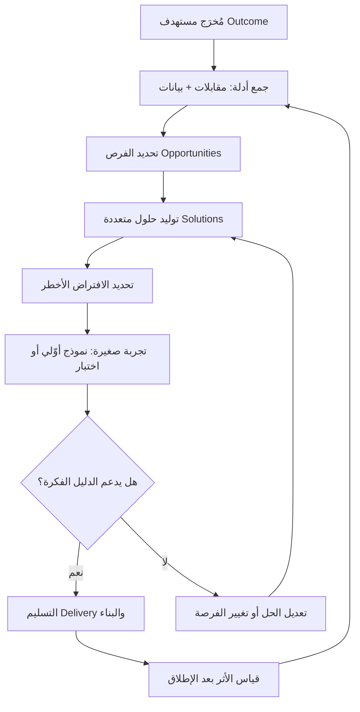

# اكتشاف المنتج (Product Discovery)

> [!info] تعريف مختصر
> اكتشاف المنتج (Product Discovery) هو مجموعة الأنشطة التي يقوم بها فريق المنتج ليقرّر **ماذا يستحق أن يُبنى أصلًا**، قبل أن يُستهلك وقت الهندسة والتصميم في بنائه. هو النقيض المكمّل للتسليم (Delivery) الذي يُعنى بـ**بناء الشيء بشكل صحيح**؛ فالاكتشاف يُعنى بـ**بناء الشيء الصحيح**. جوهره تقليل المخاطر مبكرًا وبتكلفة زهيدة: بدل أن نكتشف بعد ستة أشهر من التطوير أن أحدًا لا يريد الميزة، نكتشف ذلك خلال أيام عبر مقابلة أو نموذج أوّلي أو تجربة صغيرة.

## الشرح العلمي والاحترافي

- **الثنائية الأساسية: الاكتشاف والتسليم.** يقسّم أدب إدارة المنتجات الحديث عمل الفريق إلى مسارين متلازمين: مسار **الاكتشاف (Discovery)** الذي يجيب عن سؤال "ما المشكلة التي تستحق الحل، وأي حل يستحق البناء؟"، ومسار **التسليم (Delivery)** الذي يجيب عن سؤال "كيف نبني هذا الحل ببنية سليمة وجودة عالية ونُطلقه؟". الأول يتعامل مع **عدم اليقين**، والثاني يتعامل مع **التنفيذ**. الخلط بينهما هو مصدر معظم الهدر في المنتجات الرقمية: يُطلب من فريق هندسي أن "ينفّذ" قائمة ميزات لم يختبر أحد افتراضاتها.

- **الأسئلة الأربعة التي يجيب عنها الاكتشاف.** الصياغة الشائعة في أدبيات المنتج (وأشهرها ما رسّخه مارتي كاجان Marty Cagan في *Inspired*) تختصر عمل الاكتشاف في اختبار أربعة أنواع من المخاطر:
  1. **القيمة (Value Risk) — هل يريده المستخدم؟** هل المشكلة حقيقية ومؤلمة بما يكفي ليهتم أحد بحلّها؟ هل يختار المستخدم هذا الحل على البدائل، بما فيها بديل "لا أفعل شيئًا"؟
  2. **قابلية الاستخدام (Usability Risk) — هل يستطيع استخدامه؟** حتى لو أراد المستخدم القيمة، قد يعجز عن الوصول إليها بسبب تعقيد الواجهة أو غموض المفهوم.
  3. **الجدوى التقنية (Feasibility Risk) — هل نستطيع بناءه؟** هل التقنية والبيانات والوقت والمهارات المتاحة تسمح ببنائه بجودة مقبولة؟
  4. **جدوى العمل (Business Viability Risk) — هل يخدم العمل؟** هل يتوافق الحل مع نموذج الإيراد، والقيود القانونية، والامتثال، والمبيعات، والدعم، والعلامة التجارية؟ ميزة يحبّها المستخدمون وتُفلس الشركة ليست حلًّا.

- **الاكتشاف نشاط متوازٍ ومستمرّ، لا مرحلة تنتهي.** هذه هي الفكرة المحورية التي تفصل الفهم الحديث عن الفهم التقليدي. في النموذج التقليدي (الشلّالي) يُوضع "الاكتشاف" في بداية المشروع بوصفه مرحلة بحث وتحليل متطلبات، تُختتم بوثيقة تُسلَّم للتطوير ثم يُغلق الباب. في النموذج الحديث، الاكتشاف **مسار موازٍ يعمل كل أسبوع بالتوازي مع التسليم**: بينما يبني الفريق ما تقرّر، يكون في الوقت نفسه يستكشف ما سيُقرَّر لاحقًا ويتحقّق من أثر ما أُطلق. هذا التصوّر هو ما يُعبَّر عنه بمسارَي الاكتشاف والتسليم المتوازيين (Dual-Track)، وهو امتداد طبيعي لـ[[Continuous Discovery]].

- **أدوات الاكتشاف.** الاكتشاف ليس أداة واحدة بل صندوق أدوات يُنتقى منه بحسب نوع الخطر المراد تقليصه:
  - **مقابلات المستخدمين (User Interviews)**: محادثات مفتوحة تستكشف السياق والسلوك الفعلي والألم الحقيقي، لا الآراء والتمنيات. تُدار بأسئلة عن **ما حدث فعلًا** ("احكِ لي عن آخر مرة حاولت فيها…") لا عن **ما سيحدث افتراضًا**.
  - **تحليل البيانات (Analytics)**: قراءة السلوك الكمّي — أين يتوقف المستخدمون، أي مسار يسلكون، ما نسبة الإكمال. البيانات تخبرك **بماذا يحدث**، والمقابلات تخبرك **لماذا يحدث**؛ ولا غنى عن أيهما.
  - **النماذج الأوّلية (Prototypes)**: من الرسم الورقي إلى النموذج التفاعلي عالي الدقة. غايتها اختبار الفكرة بكسر من كلفة بنائها، خصوصًا مخاطر القيمة وقابلية الاستخدام.
  - **التجارب الصغيرة (Experiments)**: صفحات هبوط، اختبارات A/B، إطلاقات محدودة على شريحة صغيرة، تجارب "الباب المزيّف" (Fake Door). غايتها انتزاع دليل سلوكي حقيقي بدل الاعتماد على التصريح اللفظي.
  - **مراجعة الأدلة القائمة**: تذاكر الدعم، شكاوى العملاء، مكالمات المبيعات، سجلات البحث داخل المنتج. كثير من "الاكتشاف" متاح مجانًا وغير مقروء.

- **الاكتشاف الحقيقي مقابل الاكتشاف الصوري.** الاكتشاف الصوري (Fake Discovery) هو أن تسأل العميل "ماذا تريد؟" ثم تنفّذ إجابته حرفيًّا وتسمّي ذلك بحثًا. المشكلة ليست أن العميل يكذب، بل أن العميل **خبير في مشكلته لا في الحل**؛ فهو يصف الحل الذي يتخيّله من داخل حدود ما يعرفه. مهمة الفريق أن يستخرج من كلامه **المشكلة والسياق والدافع**، ثم يتولّى هو مسؤولية تصميم الحل واختباره. الاكتشاف الحقيقي يسأل عن السلوك الماضي والألم والبدائل الحالية والتكلفة التي يتحمّلها المستخدم اليوم، ثم يترجم ذلك إلى فرص، ثم إلى حلول تُختبر.

- **الاكتشاف عملية تقليص مخاطر، لا عملية جمع يقين.** لن يصل الفريق إلى يقين كامل قبل البناء، والسعي إلى ذلك شلل. المعيار العملي: هل انخفض الخطر بما يكفي ليصبح الاستثمار في البناء قرارًا معقولًا؟ لذلك يُقاس نضج الاكتشاف بـ**سرعة التعلّم لكل وحدة جهد**، لا بحجم التقارير المُنتَجة.

## أين ومتى يُستخدم

- **قبل الالتزام بأي مبادرة كبيرة**: عندما يُقترح مشروع أو ميزة تتطلّب أسابيع أو أشهرًا من العمل، يكون الاكتشاف هو الحاجز الذي يمنع إنفاق ميزانية ضخمة على افتراض غير مختبَر.
- **عند دخول سوق أو شريحة عملاء جديدة**: حيث تكون معرفة الفريق بالسياق ضعيفة، ويرتفع خطر إسقاط افتراضات السوق القديم على سوق مختلف. يرتبط هذا مباشرة بـ[[Customer and Market Validation]].
- **عند بناء [[MVP]]**: الاكتشاف هو ما يحدّد أي جزء من المنتج هو فعلًا "الحدّ الأدنى القابل للحياة"، وأي جزء مجرد رغبة داخلية.
- **عند تراجع مؤشر أداء دون تفسير واضح**: انخفاض التبنّي ([[Adoption]]) أو الاحتفاظ لا يُعالَج بميزة جديدة، بل باكتشاف يشرح سبب السلوك أولًا.
- **بشكل أسبوعي دائم داخل فريق المنتج الناضج**: بوصفه إيقاعًا لا حدثًا، بالتوازي مع سباقات التسليم.
- **عند امتلاء الـ Backlog بطلبات متضاربة من الجهات المعنية**: الاكتشاف يحوّل النقاش من "طلب من قال" إلى "أي فرصة تخدم المُخرَج المستهدف"، وهو ما تنظّمه [[Opportunity Solution Tree]].

## مثال وسيناريو تطبيقي

> [!example] فريق منتج في شركة برمجيات محاسبية للشركات الصغيرة تلقّى طلبًا متكرّرًا من فريق المبيعات: "العملاء يريدون تطبيق جوّال". قُدّر بناء التطبيق بستة أشهر وفريق كامل. قبل الالتزام، قرّر الفريق تخصيص أسبوعين للاكتشاف.
>
> بدأوا بـ**تحليل البيانات**: تبيّن أن 8% فقط من الجلسات تأتي من متصفّح الجوّال، وأن هذه الجلسات تتركّز في شاشتين اثنتين فقط — عرض حالة الفواتير، وإرسال تذكير بالدفع. ثم أجروا **ثماني مقابلات** مع عملاء طلبوا التطبيق. السؤال لم يكن "ما الذي تريده في التطبيق؟" بل "احكِ لي عن آخر مرة احتجت فيها فتح النظام وأنت خارج المكتب". تكرّرت الحكاية نفسها: صاحب العمل في اجتماع أو في الطريق، يريد أن يعرف هل وصلت دفعة عميل معيّن، ويريد أن يرسل تذكيرًا بضغطة واحدة. لم يذكر أحدهم رغبة في إدخال قيود محاسبية من الهاتف.
>
> الفرصة الحقيقية إذن لم تكن "تطبيق جوّال" (حلّ)، بل "**أحتاج أن أعرف حالة تحصيلاتي وأتصرّف بشأنها وأنا بعيد عن المكتب**" (فرصة). اختبر الفريق نموذجًا أوّليًّا تفاعليًّا لشاشتين متجاوبتين مع الجوّال مع خمسة مستخدمين، ثم أطلق نسخة ويب متجاوبة خلال ثلاثة أسابيع بدل ستة أشهر. بعد الإطلاق تابعوا **مؤشر الأثر** الذي حدّدوه مسبقًا: نسبة الفواتير التي أُرسل بشأنها تذكير خلال 48 ساعة من استحقاقها. حين ارتفع المؤشر ارتفاعًا واضحًا وثبت، صار لدى الفريق **دليل** يبرّر الاستثمار اللاحق في تطبيق أصيل — لا مجرد طلب متكرّر من المبيعات.

## خطوات أو مخطّط

1. **حدّد المُخرَج المستهدف (Outcome)** الذي تسعى إليه، لا الميزة. راجع [[Outcome vs Output]].
2. **اجمع الأدلة المتاحة أصلًا**: بيانات الاستخدام، تذاكر الدعم، ملاحظات المبيعات، مقابلات سابقة — قبل إنفاق جهد جديد.
3. **قابل المستخدمين بانتظام** واسأل عن السلوك الماضي والسياق والألم، لا عن الحلول المتخيَّلة.
4. **استخرج الفرص** (احتياجات وآلام حقيقية) وصنّفها ورتّبها بحسب أثرها المتوقّع على المُخرَج.
5. **ولّد حلولًا متعدّدة لكل فرصة** — لا حلًّا واحدًا؛ الحل الأول نادرًا ما يكون الأفضل.
6. **حدّد الافتراض الأخطر** في كل حل: أي الأخطار الأربعة (قيمة، استخدام، جدوى تقنية، جدوى عمل) قد يُسقط الفكرة كلها؟
7. **صمّم أرخص تجربة** تختبر هذا الافتراض تحديدًا: نموذج أوّلي، اختبار قابلية استخدام، صفحة هبوط، إطلاق محدود.
8. **قرّر بناءً على الدليل**: ابنِ، أو عدّل، أو أوقِف. توثيق قرار الإيقاف لا يقلّ قيمة عن قرار البناء.
9. **بعد التسليم، قِس الأثر الفعلي** وأعِد التغذية إلى الاكتشاف؛ فالحلقة لا تُغلق.

## ⚠️ مفاهيم خاطئة شائعة

> [!warning]
> - **"الاكتشاف مرحلة تسبق المشروع وتنتهي"**: هذا هو الفهم الشلّالي. الاكتشاف نشاط متوازٍ ومستمرّ يعمل كل أسبوع بجوار التسليم، لأن الافتراضات لا تتوقّف عن التولّد.
> - **"الاكتشاف مسؤولية الباحث أو مدير المنتج وحده"**: الاكتشاف الفعّال عمل جماعي يشارك فيه المصمّم والمهندس؛ فالمهندس هو من يقيّم الجدوى التقنية، وكثيرًا ما يقترح حلًّا أرخص بعشر مرات إن سمع المشكلة مباشرة بدل أن يتسلّمها مترجمة.
> - **"الاكتشاف يعني سؤال العميل ماذا يريد"**: العميل خبير في مشكلته لا في الحل. تنفيذ ما يطلبه حرفيًّا اكتشاف صوري لا اكتشاف.
> - **"الاكتشاف يبطئ الفريق"**: الاكتشاف يؤجّل أسابيع من البناء ليمنع أشهرًا من البناء الخاطئ. الإبطاء الحقيقي هو إعادة بناء ما لم يُستخدم.
> - **"إن كانت لدينا بيانات كثيرة فلا نحتاج مقابلات"**: البيانات الكمّية تكشف **ماذا** يحدث لا **لماذا**؛ والقرار يحتاج الاثنين.
> - **"الاكتشاف للمنتجات الجديدة فقط"**: المنتجات الناضجة تحتاجه أكثر، لأن تراكم الافتراضات القديمة فيها أكبر والسوق حولها يتغيّر.

## ❌ ممارسات خاطئة في المشاريع

> [!failure]
> - **تسليم الفريق قائمة ميزات جاهزة وتسمية ذلك "متطلبات"**: يُلغي الاكتشاف من أصله ويحوّل الفريق إلى مصنع تنفيذ، فيُبنى ما لم يُختبر. الحل: تسليم الفريق **مُخرَجًا مستهدفًا ومشكلة**، وترك مساحة اختيار الحل له مع مسؤولية إثبات الأثر.
> - **إجراء الاكتشاف بعد اتخاذ القرار لتبريره**: يتحوّل البحث إلى بحث عن أدلة مؤيّدة (Confirmation Bias) وتُتجاهل الإشارات المخالفة. الحل: تحديد **معيار الفشل مسبقًا** — ما النتيجة التي ستجعلنا نلغي الفكرة؟ — قبل بدء أي تجربة.
> - **اختبار الحل ونسيان المشكلة**: يقيس الفريق قابلية استخدام واجهة لحل لا أحد يحتاجه أصلًا، فيخرج بنتائج ممتازة لمنتج فاشل. الحل: التحقّق من خطر القيمة أولًا، ثم قابلية الاستخدام.
> - **الاكتشاف بلا ربط بقرار**: مقابلات وتقارير وورش تنتهي إلى ملف عرض تقديمي لا يغيّر أولوية واحدة. الحل: ربط كل جولة اكتشاف بقرار محدّد ستُتّخذ نتيجته (بناء / تعديل / إيقاف)، وتدوين القرار مع سببه.
> - **الاعتماد على عميل واحد كبير بوصفه صوت السوق**: يُبنى المنتج تفصيلًا على حالة استثنائية لا تتكرّر، فيفقد قابلية التوسّع. الحل: تنويع عيّنة المقابلات عبر شرائح مختلفة، وفصل الطلبات التعاقدية الخاصة عن اتجاه المنتج العام.
> - **حذف الاكتشاف تحت ضغط الموعد النهائي**: يُنظر إليه بوصفه ترفًا يُضحّى به أولًا، فتُنفق كامل المدة على بناء غير مؤثر. الحل: تقليص **حجم** الاكتشاف لا إلغاؤه — مقابلتان ونموذج أوّلي في يومين خير من صفر دليل.

## 🔗 مصطلحات ومفاهيم ذات صلة
[[Continuous Discovery]] | [[Opportunity Solution Tree]] | [[Jobs to be Done]] | [[Customer and Market Validation]] | [[MVP]] | [[Value Proposition Canvas]] | [[Pilot Launch]] | [[Product Thinking]]
