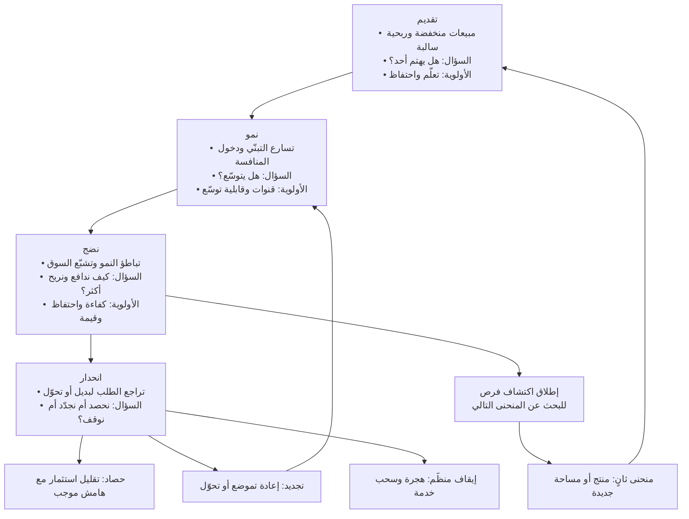

# دورة حياة المنتج (Product Life Cycle)

> [!info] تعريف مختصر
> نموذج تسويقي كلاسيكي يصف مسار المنتج في السوق عبر أربعة أطوار متعاقبة — **التقديم (Introduction)** ثم **النمو (Growth)** ثم **النضج (Maturity)** ثم **الانحدار (Decline)** — يُرسم عادةً كمنحنى للمبيعات أو الإيراد عبر الزمن، ويُقرأ معه منحنى ثانٍ للربحية يتخلّف عن الأول. قيمته العملية ليست في التنبؤ بالمواعيد، بل في أنه **يغيّر معايير الأولوية والقياس والاستثمار في كل طور**: ما يُعدّ قرارًا صحيحًا في طور النمو قد يكون تبديدًا في النضج، وما يُعدّ حكمة في النضج قد يكون قتلًا مبكرًا في التقديم. **تنبيه أساسي: هذا مفهوم سوقي طويل المدى (سنوات)، ولا علاقة له بـ«دورة عمل الفريق»** — الإيقاع القصير للتسليم مثل السبرنت أو دورة كانبان.

## الشرح العلمي والاحترافي
- **الأصل والمنشأ**: النموذج جزء من أدبيات التسويق الكلاسيكية التي استقرّت منذ ستّينيات القرن الماضي، وشاع في كتب مبادئ التسويق ومقالات مراجعات الأعمال، ويُدرَّس اليوم بوصفه أحد النماذج الأساسية في تحليل المنتج والمحفظة. صيغته الشائعة أربعة أطوار، وتضيف بعض الصياغات طورًا سابقًا للتطوير (Development) أو تفصّل الانحدار إلى انسحاب وإيقاف خدمة (End of Life).
- **طور التقديم**: المبيعات منخفضة، والكلفة لكل عميل مرتفعة، والربحية سالبة غالبًا. المهمة الحقيقية هنا **التعلّم لا النمو**: التحقّق من أن هناك من يهتم فعلًا، والوصول إلى [[Product-Market Fit]]. المقاييس الصحيحة سلوكية — الاحتفاظ، تكرار الاستخدام، عمق الاستخدام — لا حجم التسجيلات. أخطر خطأ في هذا الطور ضخّ ميزانية تسويق كبيرة على منتج لا يحتفظ بمستخدميه، فتُشترى قاعدة تتسرّب.
- **طور النمو**: التبنّي يتسارع، وتدخل المنافسة، وتتحسّن الوحدة الاقتصادية مع الحجم. تتحوّل الأولوية من «هل يعمل؟» إلى **«هل يتوسّع؟»**: قنوات الاكتساب، قابلية التوسّع التقني، تجربة التهيئة، توسيع الشرائح المجاورة، والتسعير. التسويات التقنية هنا مقبولة بوعي، لكن يجب تسجيلها بوصفها [[Technical Debt]] مع نيّة سداد، لا نسيانها.
- **طور النضج**: يتباطأ النمو ويقترب السوق من التشبّع، وتصبح المنافسة على الحصّة والسعر. تتحوّل الأولوية إلى **الكفاءة والدفاع وتوسيع القيمة**: خفض الكلفة التشغيلية، رفع الاحتفاظ، تقليل التخلّي، التوسّع في التسعير حسب القيمة، فتح شرائح أو أسواق جديدة، والاستثمار في الاعتمادية ([[SLA]] و[[SLO]]). أهم قرار في النضج هو **متى نبدأ البحث عن المنحنى التالي** عبر [[Opportunity Discovery]] — والبدء يجب أن يكون قبل ظهور الانحدار، لأن انتظاره يعني البدء بلا رأس مال ولا وقت.
- **طور الانحدار**: تتراجع المبيعات لتغيّر تقني أو سلوكي أو تنظيمي أو لظهور بديل أفضل. الخيارات ليست خيارًا واحدًا: الحصاد (تقليل الاستثمار مع إبقاء الخدمة مربحة)، أو التجديد (إعادة تموضع أو تحوّل جوهري)، أو الإيقاف المنظَّم مع خطة هجرة العملاء وسحب الخدمة. الفشل الأشيع هنا ليس الانحدار نفسه بل **إنكاره**: مواصلة إضافة ميزات إلى منتج فقد سبب وجوده.
- **المنحنى وصفي لا حتمي**: النموذج يصف أنماطًا شائعة، ولا يفرض أن كل منتج سيمر بالأطوار بالترتيب أو بالمدد نفسها. منتجات تموت في التقديم، وأخرى تعيش نضجًا يمتد عقودًا، وأخرى تعود إلى النمو بعد تجديد حقيقي. ولهذا يُستعمل بوصفه **عدسة تشخيص** لا جدولًا زمنيًّا؛ ومحاولة استنتاج «كم بقي لنا» من شكل المنحنى استعمال خاطئ.
- **صعوبة تحديد الطور آنيًّا**: من الصعب معرفة الطور الحالي في لحظته؛ فتباطؤ ربع واحد قد يكون موسميًّا أو نتيجة عطل في قناة اكتساب لا بداية نضج. لذلك يُقرأ الطور بعدّة مؤشّرات معًا لا بمؤشّر واحد: معدّل نمو المستخدمين الجدد، ونسبة الإيراد من عملاء جدد مقابل قائمين، وحساسية السعر، وكثافة المنافسة، ومعدّل الاحتفاظ، وتشبّع الشريحة المستهدفة.
- **مستوى التطبيق يحدّد المعنى**: قد تكون **الفئة** في نضج بينما **منتجك** داخلها في تقديم، أو العكس. الخلط بين مستوى الفئة ومستوى المنتج ومستوى الميزة ينتج قراءة استراتيجية مضلّلة تمامًا.
- **علاقته بـ[[Product Maturity]]**: هذا الأخير يصف عادةً درجة اكتمال المنتج أو المنظّمة من الداخل (اكتمال القدرات، رسوخ العمليات)، بينما دورة الحياة تصف **موقع المنتج في السوق عبر الزمن**. منتج ناضج داخليًّا قد يكون في طور تقديم سوقيًّا، ومنتج في نضج سوقي قد يكون هشًّا تقنيًّا من الداخل.

## ⚠️ تمييز جوهري: دورة حياة المنتج ≠ دورة عمل الفريق
> [!warning] هذا أكثر خلط شائع حول المصطلح، ويستحق فصلًا صريحًا
> - **الأفق الزمني**: دورة حياة المنتج تُقاس بالسنوات وأحيانًا بالعقود؛ ودورة عمل الفريق تُقاس بالأيام والأسابيع (سبرنت من أسبوع إلى أربعة، أو تدفّق مستمر في [[03 - Kanban]]).
> - **موضوع الوصف**: الأولى تصف **سلوك السوق تجاه المنتج** (الطلب، التبنّي، المنافسة، الإيراد)؛ والثانية تصف **آلية إنتاج الفريق الداخلية** (تخطيط، تنفيذ، مراجعة، تحسين).
> - **من يملكها**: الأولى مسألة استراتيجية تخصّ قيادة المنتج والتسويق والإدارة التنفيذية؛ والثانية مسألة تشغيلية تخصّ الفريق ومدرّبه.
> - **قابلية التحكّم**: لا يستطيع الفريق أن «يقرّر» أن ينتقل المنتج من النضج إلى النمو — الطور نتيجة تفاعل السوق مع رهانات الاستراتيجية. أمّا دورة العمل فقابلة للتعديل بقرار داخلي خلال أسبوعين ([[10 - Sprint Retrospective]]).
> - **المخرج**: دورة الحياة تُنتج قرارات استثمار وتموضع وتخصيص موارد؛ ودورة العمل تُنتج [[Increment]] قابلًا للتسليم.
> - **أثر الخلط عمليًّا**: (أ) فريق يظنّ أن «إنهاء دورة الحياة» يعني إغلاق السبرنت، فيتوقّف عن التفكير الاستراتيجي أصلًا. (ب) قيادة تطلب «تسريع دورة حياة المنتج» وتقصد تسريع التسليم، فيُختصر البحث والاختبار ظنًّا أنها إبطاء. (ج) تقرير يخلط منحنى إيراد سنوي بمخطط [[17 - Burndown Chart]] فيُقرأ تباطؤ سوقي كخلل في إنتاجية الفريق، فتُعالَج مشكلة استراتيجية بضغط تشغيلي على الفريق — وهو أسوأ علاج ممكن.
> - **القاعدة التمييزية المختصرة**: إن كان الجواب على «ما الذي يتغيّر هنا؟» هو **الطلب والمنافسة**، فأنت في دورة حياة المنتج؛ وإن كان **طريقة عملنا وإيقاع تسليمنا**، فأنت في دورة عمل الفريق.

## أين ومتى يُستخدم
- **في تخطيط الاستثمار وتوزيع الفرق على المنتجات**: يوجّه [[Product Strategy]] إلى نمط مختلف من الرهانات في كل طور.
- **عند اختيار مقاييس النجاح**: [[North Star Metric]] ومؤشّرات [[KPI]] تختلف جذريًّا بين طور يحتاج دليل احتفاظ وطور يحتاج كفاءة تشغيل.
- **في ترتيب أولويات الـ Backlog**: وزن معايير [[RICE Prioritization]] أو [[WSJF]] ليس ثابتًا؛ ففي النمو يعلو وزن الوصول والتوسّع، وفي النضج يعلو وزن خفض الكلفة والاحتفاظ.
- **في تخطيط [[Go-to-Market]] والتسعير**: التسعير في التقديم أداة تعلّم، وفي النمو أداة اختراق، وفي النضج أداة هامش ودفاع.
- **في قرارات [[Technical Debt]]**: قبول الدين مبرّر في التقديم والنمو المبكر، ومكلف جدًّا في النضج حيث تُصبح الاعتمادية هي المنتج.
- **عند التخطيط لإيقاف منتج أو ميزة**: يوجّه خطة الانسحاب والهجرة والتواصل مع العملاء و[[Closure vs Handover]].
- **في مراجعة المحفظة (Portfolio Review)**: لتفادي أن تكون كل منتجات الشركة في الطور نفسه، فتنكشف الإيرادات دفعة واحدة.
- **عند رصد المنحنى التالي**: يحدّد التوقيت المناسب لإطلاق دورة [[Opportunity Discovery]] بحثًا عن نافذة جديدة قبل بدء الانحدار.

## مثال وسيناريو تطبيقي
> [!example] شركة سعودية تقدّم منصّة حجز مواعيد للعيادات، عمرها سبع سنوات.
> **السنة 1–2 (تقديم)**: 40 عيادة، إيراد سنوي 900 ألف ريال، خسارة تشغيلية. الفريق ركّز على مؤشّر واحد: نسبة العيادات التي ما زالت تستخدم النظام بعد 90 يومًا (كانت 44%، ورُفعت إلى 71% قبل التفكير في التوسّع). قرارات مؤجَّلة عمدًا: التطبيق المستقل، التقارير المتقدّمة، التكامل المحاسبي.
> **السنة 3–4 (نمو)**: 620 عيادة، إيراد 11 مليون ريال، نمو سنوي 140%. تحوّلت الأولوية إلى القنوات وقابلية التوسّع: زمن التهيئة نزل من 9 أيام إلى يومين، وأُضيفت شراكة توزيع مع مورّد أجهزة، وقُبل دين تقني معلوم في وحدة الإشعارات ووُثّق في سجلّ مخصّص. دخل ثلاثة منافسين السوق في هذه الفترة.
> **السنة 5–6 (نضج)**: 1,450 عيادة، إيراد 24 مليون ريال، لكن النمو تباطأ إلى 9% سنويًّا، ونسبة الإيراد من عملاء جدد نزلت من 61% إلى 18%، وارتفعت حساسية السعر (34% من التجديدات طلبت خصمًا). تحوّلت الاستراتيجية إلى: سداد الدين التقني في الإشعارات، ورفع الجاهزية إلى [[SLO]] معلن، وإطلاق مستوى تسعير أعلى مبني على القيمة، وخفض كلفة الخدمة لكل عميل 22%. **الأهم**: أُطلقت دورة اكتشاف فرص بالتوازي، رصدت نافذة تنظيمية وسلوكية في مساحة مجاورة (إدارة المطالبات التأمينية) وبدأ رهان منحنى ثانٍ بفريق صغير مستقل — بينما كان المنتج الأساسي ما يزال مربحًا.
> **السنة 7 (بداية انحدار جزئي)**: أطلق منافس نموذج تسعير مجاني مدعومًا بإيراد من طرف آخر، فنزل الإيراد 7%. لأن المنحنى الثاني كان قد بدأ قبل عامين، لم يكن القرار اضطراريًّا: حُصد المنتج الأساسي (تجميد الميزات الجديدة، إبقاء الصيانة والدعم، هامش موجب)، ووُجّه الاستثمار إلى المنتج الثاني الذي كان قد بلغ 4.6 مليون ريال ونموًّا 90%.
> **ما كان سيحدث لو خُلط بين دورة الحياة ودورة العمل**: في السنة الخامسة كانت القراءة الخاطئة الجاهزة هي «الفريق تباطأ» — والعلاج الخاطئ زيادة عدد البنود في السبرنت وتقصير المهل. الحقيقة أن سرعة الفريق لم تتغيّر إطلاقًا؛ ما تغيّر هو تشبّع السوق. وضغط التسليم على فريق يعمل في سوق مشبّع ينتج إرهاقًا و[[Technical Debt]] ولا ينتج ريالًا واحدًا إضافيًّا.

## خطوات أو مخطّط
1. **حدّد مستوى التحليل**: الفئة، أم المنتج، أم ميزة بعينها؟ لا تخلط المستويات في تحليل واحد.
2. **اجمع مؤشّرات الطور**: نمو المستخدمين الجدد، نسبة الإيراد من الجدد مقابل القائمين، الاحتفاظ والتخلّي، حساسية السعر، عدد المنافسين، نسبة اختراق الشريحة المستهدفة.
3. **حدّد الطور الحالي بأكثر من مؤشّر**، ولا تحكم من ربع واحد.
4. **اضبط تعريف النجاح للطور**: تعلّم واحتفاظ في التقديم؛ توسّع واكتساب في النمو؛ كفاءة ودفاع وقيمة في النضج؛ حصاد أو تجديد أو إيقاف منظَّم في الانحدار.
5. **أعد ضبط أوزان الأولوية** في نموذج التسجيل المستخدم بما يوافق الطور.
6. **أعد ضبط سياسة [[Technical Debt]]**: سقف مقبول أعلى في التقديم، وسداد منهجي عند دخول النضج.
7. **راقب إشارات الانتقال المبكّرة**: تباطؤ النمو رغم ثبات الإنفاق، ارتفاع كلفة الاكتساب، تكرار طلبات الخصم، دخول بديل بنموذج تسعير مختلف.
8. **أطلق [[Opportunity Discovery]] للمنحنى التالي عند بلوغ النضج لا عند الانحدار**، وموّله من فائض المنتج الحالي.
9. **إن تأكّد الانحدار**، اختر بوضوح بين الحصاد والتجديد والإيقاف، وضع خطة هجرة وتواصل و[[Closure vs Handover]].
10. **راجع تصنيف الطور سنويًّا** ووثّق التغيير وأسبابه في [[Decision Log]].

## ⚠️ مفاهيم خاطئة شائعة
> [!warning]
> - **الخلط بينها وبين دورة عمل الفريق**: أشيع خطأ في المصطلح. دورة الحياة ظاهرة سوقية تُقاس بالسنوات ولا يتحكّم بها الفريق؛ ودورة العمل إيقاع تسليم داخلي يُقاس بالأسابيع ويُعدَّل بقرار في [[10 - Sprint Retrospective]]. راجع القسم المخصّص أعلاه.
> - **اعتبار المنحنى قانونًا حتميًّا للتنبؤ**: النموذج وصفي يفيد في التشخيص، ولا يخبرك بمدّة أي طور. استخدامه لتقدير «كم سنة بقيت للمنتج» إسقاط لا يستند إلى شيء.
> - **الخلط مع منحنى تبنّي المبتكرات (Innovation Adoption Curve)**: ذاك يصنّف **الفئات السلوكية للمتبنّين** (مبتكرون، متبنّون أوائل، أغلبية…)، وهذه تصف **مسار المبيعات عبر الزمن**. النموذجان متكاملان لكنهما يجيبان عن سؤالين مختلفين.
> - **الظنّ أن الانحدار فشل بالضرورة**: الانحدار مرحلة طبيعية لكل منتج تقريبًا. الفشل هو إنكاره أو مواجهته بلا خطة، لا حدوثه.
> - **افتراض أن كل أجزاء المنتج في الطور نفسه**: في منتج واحد قد تكون وحدة في نضج وأخرى في تقديم؛ التعامل معها بسياسة واحدة يخنق الجديد ويُبدّد على القديم.
> - **الخلط مع [[Product Maturity]]**: الأخير يصف اكتمال القدرات والعمليات من الداخل، ودورة الحياة تصف الموقع في السوق. منتج «ناضج» تقنيًّا قد يكون في طور تقديم سوقيًّا تمامًا.
> - **الظنّ أن الطور يُحدَّد من الإيراد وحده**: الإيراد مؤشّر متأخّر يمكن أن يستمر بالنمو بفعل رفع الأسعار أو الصفقات الكبيرة بينما يكون التبنّي قد بدأ في التراجع فعلًا.

## ❌ ممارسات خاطئة في المشاريع
> [!failure]
> - **إنفاق تسويقي كبير في طور التقديم قبل إثبات الاحتفاظ**: لماذا يضرّ: يُشترى تدفّق مستخدمين يتسرّب فورًا، فيُستهلك رأس المال وتُشوَّه المؤشّرات ويبدو المنتج ناجحًا لأشهر قبل الانهيار. الحل: اربط فتح صنبور التسويق بعتبة احتفاظ معلنة سلفًا كشرط صريح.
> - **الاستمرار بمنطق النمو بعد دخول النضج**: يُضاف المزيد من الميزات لدفع نمو لم يعد السوق قادرًا على منحه. لماذا يضرّ: يرتفع تعقيد المنتج وكلفة صيانته وتنخفض جودة التجربة، بينما لا يتحرّك الإيراد. الحل: أعد ضبط تعريف النجاح ومقاييسه عند تأكيد الانتقال، وحوّل الاستثمار إلى الاحتفاظ والكفاءة وتوسيع القيمة.
> - **تأجيل البحث عن المنحنى التالي إلى ما بعد ظهور الانحدار**: لماذا يضرّ: البحث عن فرصة جديدة يحتاج وقتًا ورأس مال، وكلاهما يشحّ بالضبط حين يبدأ الانحدار. الحل: أطلق [[Opportunity Discovery]] بفريق صغير مموَّل من فائض النضج، واحمِ ميزانيته من ضغوط الربع.
> - **تفسير تباطؤ السوق بأنه تباطؤ في أداء الفريق**: لماذا يضرّ: تُعالَج مشكلة استراتيجية بضغط تشغيلي، فيرتفع الإرهاق و[[Technical Debt]] ومعدّل دوران الموظفين دون أي أثر على الإيراد. الحل: افصل في التقارير بين مؤشّرات السوق ومؤشّرات التدفّق ([[Throughput]] و[[Cycle Time]])، ولا تعرضهما في لوحة واحدة توحي بعلاقة سببية.
> - **إبقاء منتج منحدر على قيد الحياة بدافع اعتباري**: لماذا يضرّ: يستنزف انتباه أفضل المهندسين ويعطّل موارد كان يمكن أن تموّل المنحنى التالي، ويكلّف أكثر مما يظهر في دفتر الأستاذ. الحل: اتخذ قرارًا صريحًا ([[Go or No-Go Decision]]) بين الحصاد والتجديد والإيقاف، ووثّقه بمعايير مالية وزمنية.
> - **الإيقاف المفاجئ للمنتج دون خطة هجرة**: لماذا يضرّ: يضرّ بالسمعة ويعرّض الشركة لمخاطر تعاقدية، ويؤثّر على مبيعات منتجاتها الأخرى لدى العملاء أنفسهم. الحل: خطّة إيقاف معلنة بمدد إشعار وأدوات تصدير بيانات ومسار هجرة و[[Closure vs Handover]] موثّق.
> - **قياس كل الأطوار بلوحة مؤشّرات واحدة**: لماذا يضرّ: تُحاسَب فرق منتجات ناشئة بمؤشّرات إيراد وكفاءة تناسب النضج، فتُقتل الرهانات المبكرة قبل أن تُعطي إشارة. الحل: خصّص لكل طور مجموعة مؤشّرات معلنة، وصرّح بأن مؤشّرات الطور المبكر تعلّمية بطبيعتها.
> - **تجاهل تنوّع المحفظة**: لماذا يضرّ: حين تكون كل المنتجات في الطور نفسه ينكشف الإيراد كلّه دفعة واحدة عند أي تحوّل سوقي. الحل: راجع المحفظة سنويًّا بخريطة أطوار، واستهدف توزيعًا متعمَّدًا بين تقديم ونمو ونضج.

## 🔗 مصطلحات ومفاهيم ذات صلة
[[Product Strategy]] | [[Product Vision]] | [[Opportunity Discovery]] | [[Iteration]] | [[Product Maturity]] | [[Product-Market Fit]] | [[Go-to-Market]] | [[Technical Debt]] | [[North Star Metric]] | [[Adoption]] | [[Time to Value]] | [[Closure vs Handover]] | [[Go or No-Go Decision]] | [[Pilot Launch]]
