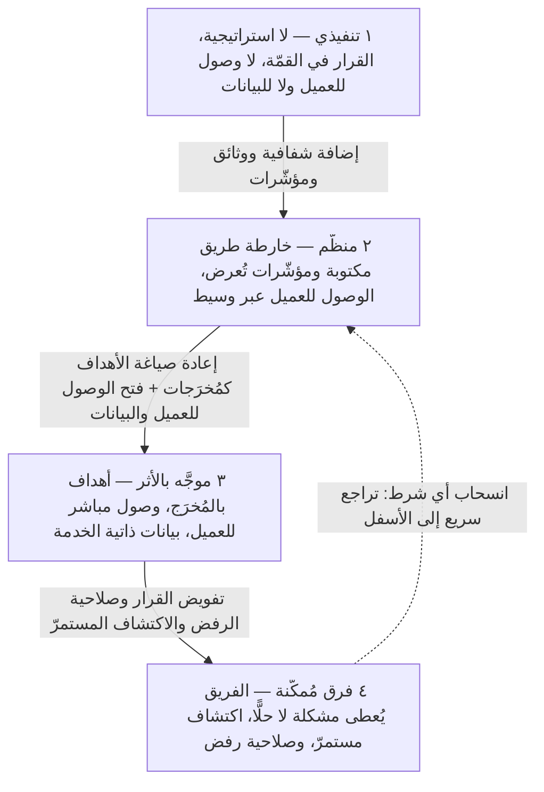

# نضج المنتج والمؤسّسة (Product Maturity)

> [!info] تعريف مختصر
> **نضج المنتج** (Product Maturity) — أو بتعبير أدقّ **نضج المؤسّسة في ممارسة إدارة المنتج** (Product Operating Maturity) — هو المستوى الذي بلغته المؤسّسة في طريقة اتّخاذ قرارات المنتج: من يقرّر ماذا يُبنى، وعلى أيّ أساس، وبأيّ قدر من القرب من العميل والبيانات. أهمّية المفهوم أنه **الشرط الذي يحدّد ما يمكن أن يكونه دور مدير المنتج داخل المؤسّسة**: ففي مستوى منخفض، لا يمكن للدور أن يتجاوز إدارة المتطلّبات والجداول مهما بلغت كفاءة شاغله؛ وفي مستوى مرتفع، يصير الدور مسؤولًا عن نتيجة عمل لا عن قائمة تسليمات. الخلاصة العملية: **كثير ممّا يبدو ضعف كفاءة فردية هو في الحقيقة نقص شرط مؤسّسي**.

## الشرح العلمي والاحترافي
- **لماذا "نضج المؤسّسة" لا "نضج المنتج"**: يُستعمل المصطلح أحيانًا للدلالة على مرحلة المنتج في دورة حياته (إطلاق، نموّ، نضج، أفول)، وهو معنى مختلف تمامًا. المقصود هنا هو نضج **الممارسة**: بنية القرار والحوافز والوصول إلى المعلومة. التمييز مهمّ لأن منتجًا ناضجًا تجاريًّا قد تديره مؤسّسة منخفضة النضج في الممارسة، والعكس صحيح.
- **النضج سلوك لا هيكل تنظيمي**: وجود مسمّى "مدير منتج" أو فريق باسم "المنتج" ليس دليلًا على النضج. المؤشّر الحقيقي هو الإجابة على سؤال بسيط: **حين يصل عمل جديد إلى الفريق، هل يصل كحلّ محدّد أم كمشكلة مطلوب حلّها؟**
- **النضج ليس خطًّا واحدًا متجانسًا**: من الشائع أن تكون المؤسّسة في مستوى مرتفع على بُعد (بيانات ممتازة مثلًا) ومنخفضة على آخر (لا تفويض بالقرار). التقييم الأنفع يكون لكل شرط على حدة، لا بوسم المؤسّسة برقم واحد.
- **النضج يتغيّر بالسياق داخل المؤسّسة الواحدة**: فريق يعمل على منتج داخلي قد يكون مُمكَّنًا، بينما فريق آخر في الشركة نفسها يعمل تحت التزامات تعاقدية يعمل في مستوى أدنى — وهذا قد يكون صحيحًا لا خطأً.
- **علاقته بالأنماط المضادّة**: [[Feature Factory|مصنع الميزات]] هو الشكل النموذجي للمستويين الأوّل والثاني؛ والانتقال إلى المستوى الثالث هو بالضبط الانتقال من قياس المخرجات إلى قياس [[Outcome vs Output|المخرَج والأثر]].

### سلّم المستويات الأربعة
1. **تنفيذي (Delivery / Feature Team)** — لا استراتيجية منتج معلنة، والقرار في القمّة. يصل العمل إلى الفريق كحلول جاهزة وتواريخ ملتزم بها. لا وصول مباشر للعميل ولا للبيانات؛ ودور "مدير المنتج" عمليًّا هو نقل المتطلّبات وتنسيق الجدول. النجاح = التسليم في الموعد.
2. **منظَّم (Structured)** — توجد [[15 - Roadmap|خارطة طريق]] مكتوبة و[[KPI|مؤشّرات]] تُعرض دوريًّا، وثمّة عملية أولويات معلنة. الوصول إلى العميل يمرّ عبر وسيط (المبيعات، الدعم، فريق أبحاث). البيانات تصل عبر طلب لفريق التحليلات. القرار ما يزال في الأعلى لكنه صار مُبرَّرًا وموثّقًا.
3. **موجَّه بالأثر (Outcome-Driven)** — تُصاغ الأهداف بالأثر لا بقائمة الميزات ([[OKR]] حقيقية)، وللفريق **وصول مباشر للعميل** و**بيانات ذاتية الخدمة** (Self-Service Analytics). ما زال نطاق المشكلة يأتي من الأعلى غالبًا، لكن اختيار الحلّ صار للفريق، والقياس بعد الإطلاق ممارسة معتادة.
4. **فرق مُمكَّنة (Empowered Teams)** — يُعطى الفريق **مشكلة لا حلًّا**، ويمارس **اكتشافًا مستمرًّا** ([[Product Discovery]]) بالتوازي مع التسليم، ويملك **صلاحية رفض** الطلبات التي لا تخدم المُخرَج المتّفق عليه. القيادة تحدّد الاتجاه والحدود، والفريق يُحاسَب على النتيجة. راجع [[Empowerment]] و[[Self-Organizing Team]].

### الشروط الأربعة لوجود دور منتج حقيقي
لا يوجد دور منتج فعلي — مهما كان المسمّى — ما لم تتوفّر هذه الشروط الأربعة مجتمعة؛ وغياب أيّها يحدّد سقف ما يمكن للدور فعله:
1. **استراتيجية واضحة**: اتجاه معلن وأولويّات مفهومة تجعل من الممكن أصلًا أن تُقال كلمة "لا". بلا استراتيجية، كل الطلبات متساوية، ويصبح مدير المنتج موزّع طلبات.
2. **وصول للعميل**: قدرة على التحدّث مباشرة مع المستخدمين ومشاهدة استخدامهم للمنتج. بلا هذا الشرط، تُبنى القرارات على آراء منقولة عبر وسطاء، وتضيع فيها المشكلة الأصلية.
3. **وصول للبيانات**: قدرة على الحصول على الأرقام دون وساطة أو انتظار أسابيع. بلا هذا الشرط، لا يمكن إغلاق حلقة "أطلقنا → ماذا تغيّر؟"، فيستحيل الخروج من منطق النواتج.
4. **تفويض بالقرار**: صلاحية حقيقية لاختيار الحلّ وتحديد الأولوية وقول "لا". بلا هذا الشرط، تتحوّل الشروط الثلاثة الأولى إلى معرفة بلا أثر — يعرف الفريق ما ينبغي فعله ولا يستطيع فعله، وهو أشدّ أنماط الإحباط.

### النقطة الجوهرية
- **تشخيص خاطئ شائع**: مؤسّسات كثيرة تستنتج من ضعف نتائج المنتج أن مديري المنتج لديها ضعاف، فتستبدلهم أو تدرّبهم — بينما المشكلة الفعلية غياب شرط مؤسّسي. تبديل الأشخاص داخل نظام لم يتغيّر يُنتج النتيجة نفسها.
- **الترقية مسؤولية قيادية**: الانتقال من مستوى إلى آخر يتطلّب تغيير التمويل والحوافز وحقوق القرار — وكلّها بيد القيادة لا بيد الفرد.
- **لكنّ الفرد ليس عاجزًا**: المسار العملي هو **بناء الدليل وكسب التفويض تدريجيًّا**: قياس أثر ميزة واحدة، عرض النتيجة كتعلّم، طلب توسعة صغيرة في الصلاحية مبنيّة على سجلّ، ثم تكرار الدورة. التفويض يُمنح غالبًا لمن أثبت حسن استعماله، لا لمن طالب به مبدئيًّا.
- **التراجع أسهل من التقدّم**: يكفي انسحاب شرط واحد — تشديد الوصول للبيانات، أو سحب صلاحية الرفض تحت ضغط ربع سنوي — ليعود الفريق سريعًا إلى مستوى أدنى.

### تنبيه للإنصاف
- **المستوى الأدنى ليس "خطأً" دائمًا**: شركة خدمات تنفّذ عقودًا محدّدة النطاق والتاريخ قد تكون عقلية المشروع هي **الصحيحة** لها؛ فمعيار نجاحها التعاقدي هو التسليم وفق النطاق المتّفق عليه، ولا معنى لمطالبتها بـ"فرق مُمكَّنة تختار الحلّ". وكذلك المنتجات الخاضعة لتنظيم صارم أو لمواصفات سلامة حيث تكون الصرامة مطلوبة لا مذمومة.
- **معيار الحكم**: السؤال ليس "في أي مستوى نحن؟" بل **"هل مستوانا متوافق مع طبيعة عملنا؟"**. الخلل الحقيقي يقع عند عدم التوافق: مؤسّسة تعمل بمنطق العقود الثابتة على منتج حيّ يُفترض أن يتعلّم من السوق.
- **الصعود ليس مجّانيًّا**: كل مستوى أعلى يتطلّب استثمارًا في البيانات والبحث والقدرات، وتحمّلًا لغموض أكبر في التقارير قصيرة المدى. القفز مستويين دفعة واحدة يفشل عادةً لأن الحوافز القديمة تبقى قائمة تحت الشعارات الجديدة.

## أين ومتى يُستخدم
- **قبل قبول وظيفة أو تكليف بدور منتج**: تقييم المستوى والشروط الأربعة يكشف مسبقًا سقف الدور، ويمنع الالتحاق بوظيفة عنوانها "مدير منتج" ومضمونها تنسيق متطلّبات.
- **في التشخيص التنظيمي قبل تبنّي أي إطار عمل**: إدخال [[02 - Scrum|سكرم]] أو [[Shape Up]] في مؤسّسة عند المستوى الأوّل ينتج شكلًا بلا مضمون. الترتيب الصحيح: عالج نقص الشروط أوّلًا، ثم اختر الإطار الملائم للمستوى.
- **في تخطيط تطوير المؤسّسة**: يُستخدم السلّم كخريطة طريق تنظيمية: أيّ شرط ينقصنا؟ ما أرخص خطوة تُقرّبنا من الشرط التالي؟
- **في محادثات [[Governance|الحوكمة]] والتفويض**: يوفّر لغة مشتركة لمناقشة حقوق القرار بين القيادة والفرق دون أن تتحوّل المناقشة إلى نزاع شخصي.
- **في تفسير الإخفاقات المتكرّرة**: عند تكرار النتائج الضعيفة رغم تبديل الأشخاص، يوجّه المفهوم التحقيق نحو النظام لا نحو الأفراد.
- **في تحديد التوقّعات مع [[Sponsor|الراعي]]**: يساعد على الاتّفاق صراحةً على ما يُحاسَب عليه الفريق في المستوى الحالي: تسليم النطاق، أم تحريك مؤشّر أثر.

## مثال وسيناريو تطبيقي
> [!example] شركة برمجيات متوسّطة عيّنت مدير منتج جديدًا لمنتج قائم. بعد ستّة أشهر، وُصف أداؤه بأنه "دون التوقّعات": خارطة الطريق تتغيّر باستمرار، والميزات تُطلق ولا يُعرف أثرها، والفريق منهك.
> **التشخيص وفق الشروط الأربعة**: (١) الاستراتيجية — غير معلنة؛ الأولوية عمليًّا لأكبر عميل يشتكي. (٢) الوصول للعميل — ممنوع؛ كل التواصل يمرّ عبر مديري الحسابات "حمايةً للعلاقة". (٣) الوصول للبيانات — بطلب رسمي لفريق التحليلات، بمهلة أسبوعين. (٤) التفويض — لا صلاحية رفض؛ أي طلب من الإدارة يدخل الباكلوغ مباشرة. النتيجة: المؤسّسة عند المستوى الثاني، والدور المطلوب من شاغله دور مستوى رابع. الفجوة ليست في الشخص.
> **الخطوة الأولى — دليل لا مطالبة**: بدل طلب صلاحيات، اختار مدير المنتج ميزة واحدة أُطلقت قبل ثلاثة أشهر وطلب رقمًا واحدًا: نسبة الحسابات التي استخدمتها أكثر من مرّة. جاء الرقم منخفضًا جدًّا، فعرضه بصياغة "ما الذي افترضناه ولم يصحّ؟" لا كاتّهام.
> **الخطوة الثانية — شرط قابل للتحقيق**: طلب وصولًا للقراءة فقط إلى لوحة تحليلات موجودة أصلًا — طلب صغير الكلفة، سهل الموافقة، لكنه يفتح الشرط الثالث.
> **الخطوة الثالثة — الوصول للعميل عبر باب مفتوح**: بدل المطالبة بحقّ عام، طلب حضور أربع مكالمات عملاء مجدولة أصلًا لفريق الدعم، مستمعًا فقط. خلال شهرين تحوّل الاستماع إلى مشاركة، ثم إلى مقابلات مستقلّة.
> **الخطوة الرابعة — تحويل بند واحد**: أعاد صياغة بند واحد في خارطة الطريق من ميزة محدّدة إلى مشكلة مصاغة بمُخرَج، واقترح حلًّا أصغر بكثير حقّق الهدف نفسه. حين ظهرت النتيجة، صار لديه سجلّ يستند إليه.
> **بعد ثلاثة أرباع**: صارت الأهداف الربعية تُكتب بالمُخرَج، ودخل الفريق فعليًّا المستوى الثالث. لم يُمنح صلاحية الرفض دفعةً واحدة، لكن صار رفضه المُبرَّر مقبولًا لأن سجلّ قراراته صار مرئيًّا. تغيّر النظام لا الشخص.

## خطوات أو مخطّط
1. **قيّم المستوى الحالي بصدق**، وباستخدام سلوك ملموس لا نيّات معلنة: كيف يصل العمل إلى الفريق؟ من يقرّر ما يُبنى؟ متى قيل "لا" آخر مرّة؟
2. **افحص الشروط الأربعة منفردة** (استراتيجية، عميل، بيانات، تفويض) وحدّد أضعفها؛ فهو غالبًا العنق الحقيقي للزجاجة.
3. **تحقّق من التوافق مع طبيعة العمل**: هل المستوى الحالي مناسب لنموذج المؤسّسة (خدمات تعاقدية مقابل منتج حيّ)؟ إن كان مناسبًا، فالمشكلة في التوقّعات لا في المستوى.
4. **اختر شرطًا واحدًا وابدأ بأرخص خطوة تجاهه**: وصول للقراءة فقط إلى البيانات، أو حضور مكالمة عميل واحدة أسبوعيًّا.
5. **ابنِ الدليل**: قِس أثر عمل واحد بعد إطلاقه، واعرض النتيجة كتعلّم مشترك لا كنقد للإدارة.
6. **اطلب توسعة صغيرة في التفويض مقابل السجلّ المُثبَت**، لا مطالبة مبدئية بالصلاحيات كاملة.
7. **ثبّت المكتسب في العملية**: اجعل القياس بندًا في [[Definition of Done|تعريف الإنجاز]]، واكتب الأهداف بالمُخرَج، وأضف عمود "لماذا" إلى خارطة الطريق.
8. **أعد التقييم دوريًّا**: راجع الشروط الأربعة كل ربع، فالتراجع سريع وصامت عند أوّل ضغط.

## ⚠️ مفاهيم خاطئة شائعة
> [!warning]
> - **الخلط بين نضج الممارسة ونضج المنتج في دورة حياته**: المصطلح هنا يصف بنية القرار داخل المؤسّسة، لا مرحلة المنتج في السوق (نموّ/نضج/أفول).
> - **الظنّ أن وجود مسمّى "مدير منتج" يعني وجود ممارسة منتج**: المسمّى مجّاني؛ الشروط الأربعة ليست كذلك. المؤشّر الحاسم هو صيغة وصول العمل: مشكلة أم حلّ جاهز.
> - **اعتبار المستوى الرابع هدفًا صحيحًا لكل مؤسّسة**: الفرق المُمكَّنة تناسب من يملك منتجًا حيًّا ومساحة تجريب؛ أمّا في تنفيذ عقود محدّدة أو أنظمة عالية المخاطر، فالانضباط بالنطاق قد يكون المعيار الصحيح.
> - **افتراض أن النضج يُقاس برقم واحد للمؤسّسة كلّها**: الأدقّ تقييم كل شرط على حدة، ولكل مجال أو فريق على حدة.
> - **الاعتقاد بأن الترقية تحتاج إعادة هيكلة كبرى أوّلًا**: أكثر التحوّلات نجاحًا تبدأ بخطوة صغيرة تُنتج دليلًا، لا بإعلان تحوّل شامل يصطدم بالحوافز القائمة.
> - **تفسير مقاومة القيادة على أنها سوء نيّة**: القيادة غالبًا تُقيَّم بمقاييس تسليم قصيرة المدى؛ ومطالبتها بالتخلّي عن التحكّم دون تقديم بديل مطمئن (شفافية ومقاييس أثر) طلب غير واقعي.
> - **الظنّ أن الوصول للبيانات وحده يكفي**: بيانات بلا تفويض تُنتج فريقًا يعرف الصواب ولا يستطيع فعله — وهو أسرع طريق لفقدان أفضل الكفاءات.

## ❌ ممارسات خاطئة في المشاريع
> [!failure]
> - **تحميل الفرد مسؤولية نقص شرط مؤسّسي**: تقييم مدير منتج بأنه "لا يقود بما يكفي" بينما يفتقر إلى الوصول للعميل والبيانات وصلاحية القرار. الحل: قبل أي تقييم أداء، افحص الشروط الأربعة صراحةً، واجعل ما ينقص منها بندًا في خطّة القيادة لا في خطّة تحسين الأداء الفردي.
> - **استيراد ممارسات مستوى أعلى دون شروطها**: تبنّي [[OKR]] أو الاكتشاف المستمرّ في مؤسّسة لا تملك بيانات ولا تفويضًا، فتتحوّل الممارسة إلى طقس توثيقي يستهلك الوقت ويُفقد المصداقية. الحل: طابق الممارسة مع المستوى الفعلي، وأدخل الشرط الناقص قبل الممارسة المعتمدة عليه.
> - **إعلان "التحوّل إلى فرق مُمكَّنة" مع إبقاء الحوافز القديمة**: الشعار الجديد فوق نظام يكافئ الالتزام بالجدول وعدد الميزات يُنتج ارتباكًا وسخرية داخلية. الحل: غيّر معيار التقييم والتقارير أوّلًا؛ الحوافز هي التي تحدّد السلوك لا الإعلانات.
> - **منح التفويض كلّه دفعة واحدة بلا حدود ولا مقاييس**: تفويض بلا اتجاه استراتيجي ولا حدود واضحة يُنتج فوضى أولويات، فتسحبه القيادة بعد أوّل إخفاق ويصعب استعادته. الحل: فوّض تدريجيًّا ضمن حدود معلنة (ميزانية، نطاق، مخاطر) مع مقاييس أثر متّفق عليها.
> - **قياس النضج باستبيان داخلي معلن النتائج**: الأسئلة المباشرة عن الاستراتيجية والتفويض تُجاب بما يُرضي الإدارة. الحل: قِس بسلوك ملموس — متى قيل "لا" آخر مرّة؟ كم ميزة حُذفت هذا العام؟ كم مقابلة عميل أجراها الفريق مباشرة الشهر الماضي؟
> - **مطالبة شركة خدمات تعاقدية بتبنّي نموذج الفرق المُمكَّنة حرفيًّا**: تعارض مع نموذج عملها وعقودها، ينتهي بفشل التبنّي وفقدان الثقة بالمفهوم كلّه. الحل: كيّف المفهوم — طبّقه على المنتجات الداخلية أو الأصول القابلة لإعادة الاستخدام، وأبقِ منطق النطاق الثابت حيث يفرضه العقد.
> - **إهمال إعادة التقييم بعد نجاح التحوّل**: المكاسب تتآكل بصمت عند أوّل ضغط ربعي، فيعود العمل حلولًا جاهزة من الأعلى دون أن يلاحظ أحد. الحل: مراجعة ربعية صريحة للشروط الأربعة، مع مؤشّر واحد لكل شرط يُعرض على القيادة.

## 🔗 مصطلحات ومفاهيم ذات صلة
[[Empowerment]] | [[Governance]] | [[Product Thinking]] | [[Outcome vs Output]] | [[Self-Organizing Team]] | [[Product Discovery]] | [[Sponsor]] | [[Feature Factory]]

> [!tip] 💡 إثراء عملي — كورس الإنتاجية
> تحديد المرحلة بمؤشّرات موضوعية، والنسب المقترحة لكلّ مرحلة، ولماذا **النمو أخطرها**: [[08 - توزيع التدفّق ومراحل حياة المنتج]].
