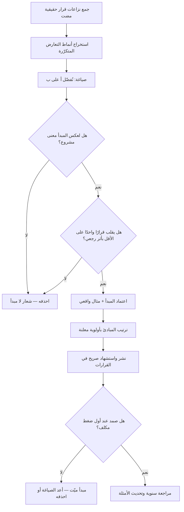

# مبادئ المنتج (Product Principles)

> [!info] تعريف مختصر
> مجموعة صغيرة من الجُمل المكتوبة والمعلنة سلفًا، وظيفتها **حسم المفاضلة عند تعارض قيمتين مرغوبتين**. لا تصف ما نريد فعله — فكلّنا يريد كل شيء — بل تحدّد **ماذا نُقدّم على ماذا حين لا يمكن الجمع بينهما**. اختبار صحّة أي مبدأ بسيط وقاسٍ: إن كان عكسه سخيفًا أو مرفوضًا بالبداهة، فليس مبدأً بل شعارًا. «نهتمّ بالجودة» ليس مبدأً لأن أحدًا لا يقول عكسه؛ أما «نؤخّر الإطلاق شهرًا قبل أن نُطلق ميزة تُربك مستخدمًا واحدًا» فمبدأ، لأن له عكسًا مشروعًا يتبنّاه آخرون بوعي. المبادئ **تسبق النزاع** لا تُكتب أثناءه، وهذا ما يمنحها قوّتها.

## الشرح العلمي والاحترافي
- **الوظيفة الحقيقية: توزيع سلطة القرار لا تزيين الحائط**: في أي منتج ينمو، يتجاوز عدد القرارات اليومية قدرة أي شخص على مراجعتها. بلا مبادئ مكتوبة، يُحسم كل نزاع صغير إمّا برفعه إلى الأعلى (فيتحوّل القائد إلى عنق زجاجة) أو بغلبة الأعلى صوتًا (فتضطرب هوية المنتج). المبادئ تُمكّن أي مهندس أو مصمّم من اتخاذ قرار متّسق مع البقية دون سؤال أحد، وهي بهذا المعنى **آلية تمكين** ([[Empowerment]]) لا آلية سيطرة.
- **موقعها في هرم النوايا**: الرؤية تصف الوجهة بعيدة المدى، والاستراتيجية تصف الرهانات المختارة للوصول، والأهداف ([[OKR]]) تحدّد ما نسعى إليه هذا الربع، والمبادئ تحدّد **كيف نختار حين تتعارض هذه كلها في قرار محدّد**. المبادئ هي الطبقة الوحيدة التي تعمل عند لحظة التعارض، ولهذا هي أثبتها زمنيًّا: الأهداف تتغيّر كل ربع، والمبادئ تُراجَع مرة في السنة أو أقل.
- **البنية الفعّالة للمبدأ: «نُفضّل أ على ب»**: الصياغة الأقوى تعترف صراحة بالتضحية. مثال: «نُفضّل بساطة المستخدم المبتدئ على قوّة المستخدم الخبير»، «نُفضّل تعديل ما لدينا على إضافة الجديد»، «نُفضّل قرارًا عكسيًّا سريعًا على قرار مثالي بطيء». هذه الصيغة تجعل المبدأ **قابلًا للتطبيق مباشرة** في نقاش محدّد، بعكس الصياغات المطلقة التي يمكن لكل طرف أن يستشهد بها لصالحه.
- **العدد الصغير شرط للفاعلية**: خمسة مبادئ تُحفظ وتُستدعى في الاجتماع؛ خمسة عشر مبدأً تصير قائمة تُنسى ويُنتقى منها ما يناسب الموقف. وحين تتعدّد المبادئ، تتعارض فيما بينها فتُعيد إنتاج المشكلة التي جاءت لحلّها. القاعدة العملية: 3 إلى 7 مبادئ، مع **ترتيب معلن بينها** عند تعارضها.
- **الفرق بينها وبين القيم المؤسسية**: القيم تصف سلوك الناس تجاه بعضهم (النزاهة، الاحترام، التعاون) وتنطبق على المؤسسة كلها. مبادئ المنتج تصف **قرارات بناء المنتج** وتنطبق على المفاضلات التقنية والتصميمية. الخلط بينهما يُنتج مبادئ فضفاضة لا تحسم شيئًا في مراجعة تصميم.
- **الفرق بينها وبين السياسات الصريحة**: [[Explicit Policies]] قواعد تشغيلية محدّدة تنظّم تدفّق العمل («لا يدخل عنصر مسار التطوير قبل استيفاء معايير الجاهزية»). المبادئ **قواعد مفاضلة قيمية** تُطبَّق على قرارات مفتوحة لم يسبق مواجهتها. السياسة تجيب عن «كيف نعمل»، والمبدأ يجيب عن «ماذا نُقدّم حين نضطر للاختيار». وكلاهما يشترك في أن الكتابة والإعلان شرط وجوده.
- **آلية الاختبار قبل التبنّي**: قبل اعتماد أي مبدأ يُطبَّق أثر رجعي على **ثلاثة قرارات نزاعية حقيقية مضت**. إن كان المبدأ سيقود إلى القرار نفسه في الحالات الثلاث، فهو وصف لواقع قائم لا أداة توجيه. وإن كان سيقلب قرارًا واحدًا على الأقل، فهو مبدأ حيّ له أثر. هذا الاختبار يكشف بسرعة المبادئ الزينيّة.
- **كلفة المبدأ الذي لا يُطبَّق**: أسوأ من غياب المبادئ وجود مبادئ معلنة تُخترق عند أول ضغط. فالفريق يتعلّم أن المكتوب لا يعني شيئًا، ويصير أي إعلان مؤسسي لاحق موضع تهكّم، ويُستنزف رصيد المصداقية. لهذا يُفضَّل تبنّي مبدأين يُلتزم بهما فعلًا على سبعة تُعلن وتُخرَق.
- **صلتها بالحد من التضخّم**: المبادئ من أقوى الأدوات المؤسسية لمقاومة [[Feature Creep]]، لأنها تحوّل الرفض من موقف شخصي لمدير المنتج («هو لا يريد») إلى قرار مؤسسي معلن سلفًا («هذا يخالف مبدأنا المنشور منذ سنتين»). وهذا التحويل يقلّل الاحتكاك الشخصي ويزيد الاتساق.

## أين ومتى يُستخدم
- **في مراجعة التصميم وقرارات الواجهة**: كمرجع يحسم النقاش بين البساطة والقدرة، أو بين السرعة والاكتمال.
- **في ترتيب الأولويات**: كطبقة كيفية فوق الأطر الكمّية مثل [[RICE Prioritization]] و[[WSJF]] و[[MoSCoW Prioritization]]، لأن هذه الأطر لا تحسم تعارض القيم بل ترتّب الأثر المُقدَّر.
- **عند رفض طلبات أصحاب المصلحة**: لتحويل الرفض إلى قرار مؤسسي مُعلن يقلّل الاحتكاك ويُستشهد به في [[Stakeholder Map]] الحسّاسة.
- **في تمكين الفرق المستقلّة**: بحيث يقرّر [[Self-Organizing Team]] دون رفع كل مفاضلة إلى الأعلى، ويمارس [[Leadership at Every Level]] بحدود واضحة.
- **مع حدود الأمان التشغيلية**: تعمل جنبًا إلى جنب مع [[Guard Rails]] التي تحدّد ما لا يجوز تجاوزه، بينما تحدّد المبادئ ما يُقدَّم على ما ضمن المساحة المسموحة.
- **في مواءمة الفرق المتعدّدة على منتج واحد**: لضمان أن ثلاثة فرق تبني ثلاثة أجزاء تنتج تجربة متّسقة، وهو جوهر [[Alignment]].
- **عند دخول أعضاء جدد**: كأداة تسريع فهم "كيف نقرّر هنا" في أسابيع بدل أشهر من الاستنتاج بالملاحظة.
- **في توثيق القرارات المهمّة**: بذكر المبدأ الحاكم لكل قرار داخل [[Decision Log]]، ما يجعل السجلّ قابلًا للمراجعة والتعلّم.

## مثال وسيناريو تطبيقي
> [!example] شركة سعودية تقدّم منصّة محاسبية للمنشآت الصغيرة، ولديها ثلاثة فرق منتج (الفوترة، التقارير، التطبيق الجوّال). تكرّر نمط مزعج: كل تعارض بين البساطة والمرونة يُرفع إلى مدير المنتج العام، فصار سقف قراراته 30–40 قرارًا أسبوعيًّا، وتراكم الانتظار حتى بلغ متوسط زمن حسم القرار 6 أيام. والأسوأ أن الفرق الثلاثة اتّخذت اتجاهات متعارضة: فريق الفوترة يميل للتبسيط الشديد، وفريق التقارير يضيف خيارات لكل حالة.
> عُقدت ورشة يومين استُخرجت فيها أنماط القرار من **14 نزاعًا حقيقيًّا مضى** بمراجعة سجلّاتها. خرجت الشركة بأربعة مبادئ مرتّبة بالأولوية:
> 1. **نُفضّل صاحب المنشأة غير المحاسب على المحاسب المحترف** — حين يتعارض وضوح الشاشة لغير المتخصّص مع عمق الأداة للمحترف، نختار الأول ونوفّر للمحترف مسارًا متقدّمًا منفصلًا.
> 2. **نُفضّل الافتراض الذكي على السؤال** — أي خيار يمكن استنتاجه من البيانات لا يُطرح كسؤال في الإعداد، ويبقى قابلًا للتغيير لاحقًا.
> 3. **نُفضّل التوافق النظامي على سرعة الإطلاق** — لا تُطلق ميزة مالية قبل اكتمال مراجعتها الضريبية والتنظيمية، ولو أخّر ذلك الإصدار.
> 4. **نُفضّل تحسين المسار الأساسي على إضافة مسار جديد** — لا تُضاف ميزة جديدة ما دام في المسار الأساسي خلل مقيس.
> **الاختبار بأثر رجعي** كشف أن المبدأ الأول كان سيقلب 5 قرارات من 14 مضت، والرابع كان سيمنع بناء ميزتين استُخدمتا لاحقًا بنسبة أقل من 3%. أي أن المبادئ كانت ستوفّر ما يقارب 11 أسبوع تطوير في العام السابق وحده.
> **موقف تطبيقي بعد التبنّي**: طلب عميل كبير (يمثّل نحو 8% من الإيراد) إضافة 14 حقلًا اختياريًّا في شاشة إنشاء الفاتورة. سابقًا كان الطلب سيُنفَّذ بلا نقاش. هذه المرة استُشهد بالمبدأ الأول والرابع، وقُدّم بديل يحقّق حاجة العميل الفعلية: قالب فاتورة مخصّص يُعدّه العميل مرة واحدة ويُطبَّق تلقائيًّا، دون إثقال الشاشة على 4,000 منشأة أخرى. قبل العميل البديل.
> **موقف مضاد يستحقّ الذكر**: بعد أشهر، اقتضى المبدأ الثالث تأجيل إطلاق مهمّ 5 أسابيع لاستكمال مراجعة تنظيمية، وضغطت المبيعات بشدّة للاستثناء. التزمت الإدارة بالمبدأ. هذا الالتزام في اللحظة المكلفة هو ما حوّل الجُمل الأربع من ورقة إلى سلطة فعلية؛ ولو مُنح الاستثناء لانتهت صلاحية المبادئ الأربعة جميعًا في ذلك اليوم.

## خطوات أو مخطّط
1. جمع 10–20 نزاع قرار حقيقيًّا مضى، من سجلّات ومراجعات لا من الذاكرة.
2. تصنيف النزاعات إلى أنماط متكرّرة: بساطة مقابل قدرة، سرعة مقابل جودة، عميل واحد مقابل القاعدة، إلخ.
3. صياغة كل مبدأ بصيغة «نُفضّل أ على ب» مع ذكر التضحية صراحةً لا التلميح إليها.
4. تطبيق **اختبار العكس**: هل لعكس المبدأ معنى يتبنّاه فريق عاقل آخر؟ إن كان لا، فاحذفه.
5. اختبار كل مبدأ بأثر رجعي على ثلاثة قرارات مضت، وحذف ما لا يقلب أي قرار.
6. تقليص القائمة إلى 3–7 مبادئ، وترتيبها بأولوية معلنة لحلّ تعارضها فيما بينها.
7. إرفاق مثال واقعي واحد بكل مبدأ يوضّح تطبيقه في موقف حقيقي، لأن المثال يُفهم أسرع من الصياغة.
8. الإعلان والنشر في مكان يراه الجميع، وإدراجها ضمن تعريف الأعضاء الجدد.
9. الاستشهاد بها صراحةً في كل قرار خلافي وتوثيق ذلك في [[Decision Log]].
10. مراجعتها سنويًّا: أي مبدأ لم يُستشهد به مرة واحدة خلال عام إمّا ميّت أو غير معروف، وكلاهما يستوجب الحذف أو إعادة الصياغة.

## ⚠️ مفاهيم خاطئة شائعة
> [!warning]
> - **الخلط بين المبدأ والشعار**: «نضع المستخدم أولًا» و«نحبّ الجودة» لا تحسم أي نزاع لأن أحدًا لا يتبنّى عكسها. المبدأ الحقيقي يعترف بتضحية محدّدة ويقبل عكسه كخيار مشروع لفريق آخر.
> - **الظنّ بأنها تصف ما نحن عليه**: المبادئ أداة **توجيه** للمستقبل لا وصف للحاضر. مبدأ لا يغيّر شيئًا في سلوك الفريق هو مجرّد توثيق لعادة قائمة.
> - **اعتبارها بديلًا عن الاستراتيجية**: المبادئ تحسم **كيف نختار**، والاستراتيجية تحدّد **أين نلعب وعلى ماذا نراهن**. فريق بمبادئ ممتازة وبلا استراتيجية سيتّخذ قرارات متّسقة في اتجاه خاطئ.
> - **الظنّ بأن كثرتها تعني نضجًا**: كل مبدأ إضافي يقلّل احتمال استحضار القائمة كاملة ويزيد احتمال التعارض الداخلي؛ فوق سبعة تفقد القائمة وظيفتها الحاسمة.
> - **اعتبارها أبدية لا تُمسّ**: المبادئ أثبت من الأهداف لكنها ليست خالدة؛ تغيّر مرحلة نضج المنتج أو شريحته المستهدفة قد يستوجب قلب مبدأ رأسًا على عقب، وهذا سليم إن تمّ بوعي ومعلَنًا.
> - **الخلط بينها وبين حدود الأمان**: [[Guard Rails]] تحدّد ما **يُمنع** تجاوزه (حدود صلبة)، بينما المبادئ ترشد الاختيار **داخل** المساحة المسموحة. الأولى نظام حماية، والثانية بوصلة قرار.
> - **الظنّ بأن كتابتها من مهام القيادة وحدها**: مبادئ تُفرَض من أعلى دون مشاركة من يطبّقها يوميًّا تُقابَل بالتجاهل المهذّب. الاستخراج الجماعي من قرارات حقيقية يمنحها شرعية التطبيق.

## ❌ ممارسات خاطئة في المشاريع
> [!failure]
> - **الخطأ: صياغة المبادئ في ورشة قيادية منفصلة عن ممارسي العمل** → **لماذا يضرّ**: تخرج جُمل عامة لا تصف مفاضلات حقيقية، ولا يشعر الفريق بملكيتها فيتجاهلها → **الحل**: استخرجها من نزاعات قرار حقيقية بمشاركة من عاشوها، وصادق عليها القيادة بدل أن تخترعها.
> - **الخطأ: منح استثناء لعميل كبير أو ضغط مبيعات عند أول اختبار جدّي** → **لماذا يضرّ**: يتعلّم الجميع أن المبادئ تنطبق حين لا تكلّف شيئًا، فتفقد كل قيمتها دفعة واحدة → **الحل**: عالج الاستثناء علنًا: إمّا الالتزام بالمبدأ، أو تعديله رسميًّا للجميع، لا خرقه بصمت.
> - **الخطأ: كتابتها ونشرها ثم عدم الاستشهاد بها في أي قرار** → **لماذا يضرّ**: المبدأ غير المستحضَر في لحظة النزاع غير موجود عمليًّا، وتتحوّل الصفحة إلى أثاث تنظيمي → **الحل**: اجعل ذكر المبدأ الحاكم حقلًا إلزاميًّا في توثيق أي قرار خلافي.
> - **الخطأ: تبنّي مبادئ منقولة حرفيًّا من شركة أخرى** → **لماذا يضرّ**: مبادئ الشركات مشتقّة من سياقها وسوقها ومرحلة نضجها، ونقلها ينتج تناقضًا بين المكتوب والممارَس اليومي → **الحل**: استلهم الصياغة لا المحتوى، واشتقّ مبادئك من قراراتك أنت.
> - **الخطأ: تعديل المبادئ كل ربع مع تغيّر الأهداف** → **لماذا يضرّ**: يفقدها ثباتها الذي هو مصدر قوّتها، ويجعلها تابعًا للضغط الآني بدل أن تكون ضابطًا له → **الحل**: راجعها سنويًّا أو عند تحوّل استراتيجي كبير فقط، وسجّل سبب أي تعديل.
> - **الخطأ: ترك المبادئ متساوية بلا ترتيب عند تعارضها** → **لماذا يضرّ**: عند تعارض مبدأين يعود النزاع إلى نقطة الصفر ويستشهد كل طرف بما يناسبه → **الحل**: أعلن ترتيبًا صريحًا بين المبادئ، ونصّ على أيّها يُقدَّم عند التصادم.
> - **الخطأ: استخدامها لتبرير قرار متّخذ سلفًا** → **لماذا يضرّ**: يُفسد الثقة بالأداة كلها حين يلاحظ الفريق أن المبدأ يُستدعى انتقائيًّا حسب الحاجة → **الحل**: اشترط ذكر المبدأ **قبل** حسم القرار لا في تبريره اللاحق، وأتِح لأي عضو الاعتراض بالاستناد إلى المبدأ نفسه ضمن [[Psychological Safety]].

## 🔗 مصطلحات ومفاهيم ذات صلة
[[Explicit Policies]] | [[Guard Rails]] | [[OKR]] | [[North Star Metric]] | [[Decision Log]] | [[Team Working Agreement]] | [[Alignment]] | [[Empowerment]] | [[Self-Organizing Team]] | [[Product Thinking]] | [[MoSCoW Prioritization]] | [[Feature Creep]] | [[Working Backwards]]
