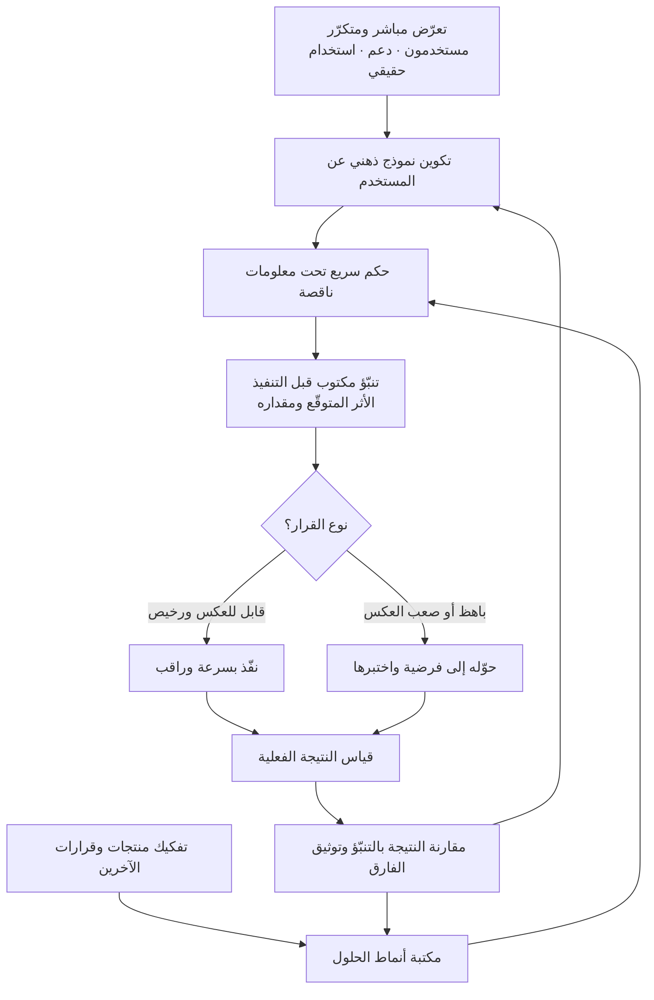

# الحسّ المنتَجي (Product Sense)

> [!info] تعريف مختصر
> القدرة على إصدار أحكام سليمة بشأن المنتج **في ظروف معلومات ناقصة ووقت محدود**: أي المشكلات تستحق الحل، وأي الحلول سيتبنّاه الناس فعلًا، وما الذي يجب حذفه، وأي التفاصيل حاسمة وأيّها هامشي. هو ليس ذوقًا فطريًّا ولا موهبة تولد مع صاحبها، بل **حدس مدرَّب (Trained Intuition)**: نمط من التعرّف السريع يتشكّل من تعرّض متكرّر لمواقف حقيقية مقترن بتغذية راجعة صادقة وسريعة. ولهذا يمكن بناؤه عمدًا، ويمكن قياسه تقريبًا، ويمكن أن يتآكل إن انقطع صاحبه عن المستخدمين والنتائج.

## الشرح العلمي والاحترافي
- **الأساس المعرفي: الحدس الخبير**: في أدبيات علم النفس المعرفي، الحدس ليس قدرة غامضة بل **استدعاء لأنماط مخزّنة** بُنيت عبر التعرّض المتكرّر. والشرط المعروف لتكوّن حدس موثوق هو توفّر بيئة منتظمة بما يكفي لتكون فيها أنماط قابلة للتعلّم، **وتغذية راجعة واضحة وسريعة** عن صواب الأحكام. حين يغيب أحد الشرطين، يتولّد شعور بالثقة دون دقّة فعلية. هذا يفسّر لماذا يظلّ بعض من أمضوا عشر سنوات في المنتج بلا حسّ منتَجي: كانوا يسلّمون مخرجات ولا يرون أثرها، فلم تكتمل حلقة التعلّم أصلًا.
- **مما يتركّب فعلًا** — الحسّ المنتَجي ليس عنصرًا واحدًا بل خمسة مكوّنات قابلة للتنمية كلٌّ على حدة:
  1. **نموذج ذهني عن المستخدم**: تمثيل داخلي دقيق لظرف المستخدم ودوافعه وقيوده وما سيفعله فعلًا لا ما يقوله. مصدره التعرّض المباشر: مقابلات، جلسات دعم، مشاهدة استخدام حقيقي.
  2. **مكتبة أنماط الحلول**: ذخيرة من الحلول التي نجحت وفشلت في سياقات متعدّدة، تسمح بالقول «هذا يشبه حالة رأيتها، وسبب فشلها كان كذا».
  3. **الحكم على المفاضلات**: القدرة على تقدير ما يُكسب وما يُخسر عند كل قرار — عمق مقابل بساطة، سرعة مقابل متانة، شمول مقابل وضوح.
  4. **الحسّ الكمّي (Data Sense)**: القدرة على تقدير حجم الأثر تقريبًا قبل القياس، وقراءة المؤشّر بوصفه إشارة مشكوكًا فيها لا حقيقة نهائية، وتمييز الارتباط من السببية.
  5. **الحسّ الجمالي والحرفي (Craft)**: الحساسية للتفاصيل التي تصنع الفارق في التجربة — الصياغة النصية، زمن الاستجابة، حالات الفراغ والخطأ، ما يجب ألّا يُعرض أصلًا.
- **علاقته بالتفكير المنتَجي**: [[Product Thinking]] هو **الإطار المنهجي الصريح** (نبدأ من المشكلة، نربط الحل بالنتيجة، نتحقّق قبل البناء). أمّا الحسّ المنتَجي فهو **السرعة والدقّة في تطبيق هذا الإطار حين لا يوجد وقت لتطبيقه كاملًا**. المنهج يمكن تعليمه في يوم؛ والحسّ يحتاج مئات القرارات المُتابَعة. من يملك المنهج بلا حسّ يصل إلى إجابات معقولة لكن ببطء وبكلفة بحث مرتفعة؛ ومن يدّعي الحسّ بلا منهج يصل بسرعة إلى إجابات غير قابلة للمراجعة.
- **كيف يُبنى — الشروط الأربعة**: **(١) تعرّض عالي التواتر** لمستخدمين حقيقيين لا لتقارير عنهم؛ ساعة مقابلة أسبوعيًّا تفعل ما لا تفعله عشر لوحات مؤشّرات. **(٢) تنبّؤ مكتوب قبل النتيجة**: أن تسجّل تقديرك للأثر قبل الإطلاق ثم تقارنه بما حدث — وهذه أقوى ممارسة منفردة لبناء الحسّ، لأنها تمنع إعادة كتابة الذاكرة بعد ظهور النتيجة (التحيّز الرجعي). **(٣) حلقة تغذية راجعة قصيرة**: كلما طال الزمن بين القرار ورؤية أثره، ضعف التعلّم؛ ولهذا يرتبط بناء الحسّ ببنية القياس ([[Product Analytics]]) و[[Feedback Loop]]. **(٤) نقد جماعي منظَّم**: عرض القرارات على زملاء يختلفون معك، ونقد منتجات الآخرين بوصفه تمرينًا («لماذا اتُّخذ هذا القرار؟ ما البديل؟ ما الذي كان سيُكسر؟»).
- **كيف يُقاس تقريبًا**: لا يوجد مقياس مباشر، لكن هناك وكلاء عملية: **دقّة التنبؤ** (نسبة الحالات التي وقع فيها الأثر داخل نطاق تقديرك المسبق)، **معدّل نقض الفرضيات مبكّرًا** (هل تكتشف الخطأ في أسبوع أم بعد إطلاق كامل؟)، **نسبة الميزات المستخدَمة فعلًا مما بُني**، و**جودة الأسئلة المطروحة في مراجعة التصميم** لا جودة الإجابات فقط. في المقابلات المهنية يُختبر الحسّ عادةً بسؤال مفتوح («حسّن منتجًا ما لفئة ما») حيث يكون المقيَّم هو بنية التفكير: تحديد المستخدم، ثم المهمّة، ثم المفاضلات، ثم معيار النجاح — لا الفكرة النهائية.
- **لماذا ليس موهبة فطرية**: ثلاثة أسانيد عملية: **(أ)** يتحسّن بالتدريب المقصود بشكل قابل للملاحظة خلال شهور؛ **(ب)** أنه **سياقي لا مطلق** — من يملك حسًّا ممتازًا في منتجات الاستهلاك قد يكون حكمه رديئًا في برمجيات المؤسسات أو في الأدوات المالية، لأن مكتبة أنماطه بُنيت في بيئة أخرى، والموهبة الفطرية لا تُفترض أن تكون محدودة بمجال؛ **(ج)** أنه **يتآكل** حين ينقطع صاحبه عن المستخدمين ويصعد في التسلسل الإداري — والقدرات الفطرية لا تتآكل بالابتعاد عن الممارسة بهذا الشكل. ما يُظنّ موهبة هو غالبًا **تعرّض مبكّر وكثيف** لم يلاحظه أحد.
- **حدوده وأخطاره**: الحسّ عرضة للتحيّزات المعرفية، وأخطرها [[Confirmation Bias]] وميل الخبير إلى تعميم نمط نجح في سياق مختلف. ولهذا القاعدة المهنية: **الحسّ يقترح، والدليل يحكم**. استخدامه الصحيح أن يختصر مساحة البحث ويولّد فرضيات أفضل وأسرع ([[Hypothesis]])، لا أن يستبدل التحقّق. وكلما ارتفعت كلفة الخطأ أو ندرت البيانات المشابهة، وجب أن يقلّ الاعتماد عليه.
- **مسألة تنظيمية لا فردية فقط**: منظّمات تبني الحسّ لدى فرقها بإجراءات صريحة (تعرّض إلزامي للمستخدمين، نشر نتائج كل إطلاق مقابل التوقّع، نقد تصميم أسبوعي، توثيق القرارات وأسبابها في [[Decision Log]])؛ ومنظّمات تقتله بفصل من يقرّر عمّن يرى الأثر، وهي البنية النمطية لـ[[Feature Factory]].

## أين ومتى يُستخدم
- **عند تقليص خيارات كثيرة إلى قليل قابل للاختبار**: قبل صرف ميزانية بحث، يُستخدم الحسّ لاستبعاد ما لا يستحق الاختبار أصلًا.
- **في القرارات منخفضة الكلفة وسريعة العكس**: حيث تكون كلفة الاختبار المنهجي أعلى من كلفة الخطأ نفسه — انظر [[Cost of Experimentation]].
- **في تحديد نطاق [[MVP]] وفي [[Task and Story Slicing]]**: تمييز الجوهري من الزائد قرار حكم في جوهره.
- **في مراجعات التصميم وتفاصيل التجربة**: صياغة الرسائل، حالات الفراغ والخطأ، ما يُخفى وما يُظهر — وهي تفاصيل نادرًا ما يحسمها اختبار.
- **في تقييم الطلبات الواردة من أصحاب المصلحة**: التمييز بين طلب يعبّر عن حاجة حقيقية وطلب يعبّر عن حل تخيّله صاحبه.
- **في تفسير نتائج غامضة من [[Product Analytics]]**: حين يتحرّك مؤشّران في اتجاهين متعاكسين، الحكم لا الرقم هو ما يحسم التفسير الأرجح.
- **في التوظيف والترقية داخل فرق المنتج والتصميم**: يُختبر عادةً بأسئلة تصميم مفتوحة وبمراجعة قرارات سابقة اتخذها المرشّح.
- **في اللحظات التي لا تحتمل انتظار بيانات**: أعطال، أزمات سمعة، نافذة سوقية ضيّقة ([[Opportunity Discovery]]).

## مثال وسيناريو تطبيقي
> [!example] فريق منتج في شركة توصيل طلبات في الرياض. المؤشّر: 23% من الطلبات تُلغى بعد التأكيد وقبل الاستلام، بكلفة تشغيلية تقارب 410 آلاف ريال شهريًّا.
> **الاستجابة الأولى (بلا حسّ منتَجي)**: طُرحت أربعة حلول في اجتماع واحد — رسوم إلغاء، تقليل مهلة الإلغاء إلى دقيقتين، تنبيه تحذيري قبل الإلغاء، خصم للاحتفاظ بالطلب. كلها حلول **تجعل الإلغاء أصعب**، أي أنها تعالج السلوك لا سببه، وكلها كانت ستنجح ظاهريًّا في خفض الرقم.
> **ما فعله مديرا منتج يملكان حسًّا مدرَّبًا**: قبل أي نقاش حلول، كتب كل منهما تنبّؤه: «ما السبب الأكبر للإلغاء، وما نسبته التقريبية؟» أحدهما توقّع أن السبب الأول هو تجاوز زمن الوصول المتوقّع بنسبة تقارب النصف؛ والآخر توقّع أن السبب الأول هو اكتشاف عدم توفّر صنف بعد التأكيد. ثم قضيا يومًا في الاستماع إلى 30 مكالمة دعم مسجّلة ومراجعة 200 طلب ملغى.
> **ما ظهر**: 54% من الإلغاءات وقعت خلال 4 دقائق من التأكيد — أي قبل أن يبدأ أي تأخير أصلًا؛ وهذا **نقض التنبّؤين معًا**. وبمراجعة الجلسات تبيّن أن المستخدم كان يكتشف بعد التأكيد أن العنوان المحفوظ هو عنوان قديم، أو أن الرسوم النهائية ظهرت أعلى ممّا توقّع لأن رسوم التوصيل لم تكن ظاهرة إلا في الشاشة الأخيرة.
> **دور الحسّ في الحكم**: القرار الذي اتُّخذ لم يكن «امنع الإلغاء» بل **«اجعل ما يُكتشف متأخّرًا يُكتشف مبكّرًا»**: إظهار الرسوم كاملة في شاشة السلة، وتأكيد العنوان بخطوة واحدة قبل الدفع لا بعده. هذا حكم مبني على نمط متكرّر يعرفه من مارس المنتج طويلًا: **الإلغاء المبكّر ليس تردّدًا، بل مفاجأة**.
> **النتيجة بعد ستة أسابيع**: نزل الإلغاء من 23% إلى 11%، دون أي رسوم أو قيود. والأهم داخليًّا: سُجّل التنبّؤان الخاطئان في وثيقة القرارات — لأن الخطأ الموثَّق هو ما يبني مكتبة الأنماط، بينما النجاح غير المفسَّر لا يعلّم شيئًا.

## خطوات أو مخطّط
1. **قبل كل قرار، اكتب تنبّؤك**: ما الذي تتوقّع حدوثه ومقداره التقريبي وسببه — بجملة واحدة وتاريخ.
2. **اذهب إلى المصدر**: ساعة أسبوعية على الأقل مع مستخدمين حقيقيين ([[User Interview]] بمنهج [[The Mom Test]])، أو استماع لمكالمات دعم، أو مشاهدة استخدام فعلي.
3. **ابنِ مكتبة الأنماط عمدًا**: فكّك منتجات أخرى وسجّل «ما القرار المتّخذ هنا؟ وما البديل؟ ولماذا اختير هذا؟».
4. **عند الحكم، فكّك المشكلة بترتيب ثابت**: من المستخدم؟ ما مهمّته ([[Jobs to be Done]])؟ ما البديل الحالي؟ ما المفاضلة؟ ما معيار النجاح؟
5. **ميّز نوع القرار**: قابل للعكس ومنخفض الكلفة ← احكم بالحسّ وأطلق بسرعة؛ باهظ أو صعب العكس ← تحقّق بالدليل ولو تأخّرت.
6. **بعد النتيجة، قارن بالتنبّؤ صراحةً** وسجّل الفارق وسببه في [[Decision Log]].
7. **اعرض أحكامك على من يخالفك**، واطلب صيغة النقض لا التأييد لتفادي [[Confirmation Bias]].
8. **راقب تآكل حسّك**: إن مرّ شهر بلا تماس مباشر مع مستخدم، اعتبر حكمك أقل موثوقية وارفع نصيب الدليل في قراراتك.

## ⚠️ مفاهيم خاطئة شائعة
> [!warning]
> - **اعتباره موهبة فطرية**: يتحسّن بالتدريب المقصود، وهو سياقي مقيّد بمجال، ويتآكل عند الانقطاع عن الممارسة — وثلاثتها تناقض فرضية الفطرة. ما يُظنّ موهبة هو في الغالب تعرّض مبكّر وكثيف لم يُلاحَظ.
> - **الخلط بينه وبين الذوق الجمالي**: الحسّ الجمالي مكوّن واحد من خمسة. من يملك ذوقًا بصريًّا رفيعًا وحده قد يصنع منتجًا جميلًا يحلّ مشكلة لا وجود لها.
> - **اعتباره بديلًا عن البيانات**: الصياغة الصحيحة أنه **يقترح** ويولّد فرضيات أفضل وأسرع، بينما **الدليل يحكم**. استخدامه لإلغاء نتيجة قياس واضحة ليس حسًّا بل عنادًا.
> - **الخلط بينه وبين [[Product Thinking]]**: الأخير منهج صريح يمكن تعليمه في يوم؛ والحسّ سرعة ودقّة في تطبيقه حين لا يتوفّر وقت لتطبيقه كاملًا.
> - **افتراض أنه ينتقل تلقائيًّا بين المجالات**: مكتبة الأنماط مبنيّة في بيئة محدّدة؛ الانتقال من منتج استهلاكي إلى منتج مؤسسي أو مالي يستوجب إعادة بناء واعية للنموذج الذهني، وافتراض العكس مصدر شائع لقرارات سيّئة تصدر بثقة عالية.
> - **الظنّ أن سنوات الخبرة تكفي لتوليده**: بلا تغذية راجعة عن أثر القرارات، تُنتج السنوات ثقة لا دقّة. عشر سنوات في تسليم مخرجات دون رؤية نتائجها هي سنة واحدة مكرّرة عشر مرّات.
> - **اعتباره صفة فردية فقط**: هو أيضًا قدرة تنظيمية؛ فبنية المؤسسة إمّا أن تبنيه بالتعرّض والتغذية الراجعة أو تقتله بفصل من يقرّر عمّن يرى الأثر.

## ❌ ممارسات خاطئة في المشاريع
> [!failure]
> - **استخدام «حسّي يقول» لإنهاء النقاش**: الخطأ أن يُستعمل الحسّ سلطةً لا حجّة. لماذا يضرّ: يمنع المراجعة ويحوّل قرارات المنتج إلى تراتب وظيفي، ويقتل مساهمة من هم أقرب إلى المستخدم. الحل: اشترط أن يُصاغ أي حكم حدسي كفرضية قابلة للنقض: «أتوقّع كذا، لأن كذا، وسأعتبره خاطئًا إذا كذا».
> - **فصل صاحب القرار عن المستخدم**: مدير منتج يقرّر من التقارير فقط. لماذا يضرّ: ينهار النموذج الذهني تدريجيًّا فتبقى الثقة وتغيب الدقّة، وهو أخطر تركيب ممكن. الحل: اجعل ساعة تماس مباشر أسبوعية التزامًا مجدولًا لا نشاطًا اختياريًّا يُلغى عند الضغط.
> - **عدم تسجيل التوقّعات قبل الإطلاق**: لماذا يضرّ: بعد ظهور النتيجة يعيد الجميع تفسير ما توقّعوه («كنت أعرف أن هذا سيحدث»)، فلا يتكوّن أي تعلّم رغم كثرة الإطلاقات. الحل: اجعل خانة «الأثر المتوقّع ومقداره» حقلًا إلزاميًّا في نموذج كل إطلاق، وراجعها علنًا بعد القياس.
> - **الاعتماد على الحسّ في قرارات باهظة أو غير قابلة للعكس**: كتغيير نموذج تسعير أو إعادة هيكلة بيانات. لماذا يضرّ: كلفة الخطأ تتجاوز بكثير كلفة التحقّق، والحسّ أضعف ما يكون في الحالات النادرة قليلة السوابق. الحل: صنّف القرارات مسبقًا حسب قابلية العكس، واشترط دليلًا للفئة الباهظة.
> - **تعميم نمط نجح في سياق مختلف**: نقل حل من منتج استهلاكي إلى منتج مؤسسي لأنه «أثبت نجاحه». لماذا يضرّ: تختلف بنية القرار ودورة الشراء ومن يستخدم عمّن يدفع، فينهار النمط لأسباب لا علاقة لها بجودته. الحل: عند كل استعارة، اكتب صراحةً الشروط التي جعلت النمط ينجح، وتحقّق من توفّرها هنا.
> - **إقصاء المصمّمين والمهندسين عن نقاش الحكم**: لماذا يضرّ: أوسع مكتبة أنماط في الفريق موزّعة لا محتكرة، وتضييق دائرة الحكم يخفض جودته ويُضعف الالتزام بالتنفيذ. الحل: اجعل مراجعة الحكم جلسة مشتركة منتظمة تُطرح فيها البدائل قبل الاستقرار على واحد.
> - **بناء نظام حوافز يكافئ حجم التسليم لا الأثر**: لماذا يضرّ: يتعلّم الفريق إغلاق البنود بسرعة، وتنقطع حلقة التغذية الراجعة التي يُبنى عليها الحسّ، فتتحوّل المؤسسة إلى [[Feature Factory]]. الحل: اربط التقييم بمؤشّرات أثر ([[Outcome vs Output]])، وانشر نتائج كل إطلاق مقارنةً بتوقّعه.

## 🔗 مصطلحات ومفاهيم ذات صلة
[[Product Vision]] | [[Product Strategy]] | [[Opportunity Discovery]] | [[Iteration]] | [[Product Thinking]] | [[Product Discovery]] | [[Jobs to be Done]] | [[The Mom Test]] | [[User Interview]] | [[Product Analytics]] | [[Hypothesis]] | [[Confirmation Bias]] | [[Outcome vs Output]] | [[Feedback Loop]] | [[Cost of Experimentation]]
