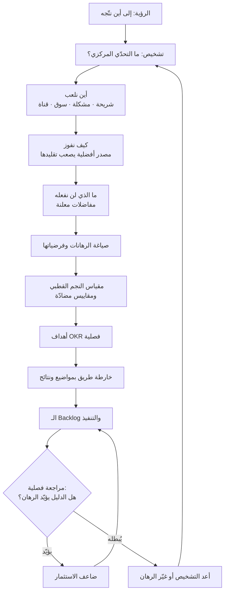

# استراتيجية المنتج (Product Strategy)

> [!info] تعريف مختصر
> مجموعة **الخيارات المترابطة** التي تحدّد كيف يصل المنتج من واقعه اليوم إلى الحالة المستقبلية التي ترسمها [[Product Vision]]: **أين نلعب** (أي شريحة، أي مشكلة، أي قناة، أي سوق)، **وكيف نفوز** (ما الميزة التي تجعل اختيارنا أفضل من البدائل ويصعب تقليدها)، **وما الذي لن نفعله** صراحةً. الاستراتيجية ليست خطة زمنية ولا قائمة مشاريع؛ هي منظومة تشخيص وقرارات مفاضلة (Trade-offs) تُنتج تركيزًا. وأبسط علامة على غيابها أن تجد وثيقة تسمّى «الاستراتيجية» ولا يظهر فيها شيء واحد جرى التخلّي عنه عمدًا.

## الشرح العلمي والاحترافي
- **البنية الثلاثية للاستراتيجية**: في أدبيات الاستراتيجية المؤسسية المستقرّة، أي استراتيجية جيّدة تتكوّن من ثلاثة عناصر متلازمة: **(١) تشخيص (Diagnosis)** يحدّد طبيعة التحدّي الحقيقي ويميّز العَرَض من السبب؛ **(٢) سياسة موجِّهة (Guiding Policy)** تختار منهج التعامل مع التحدّي وتستبعد مناهج أخرى؛ **(٣) إجراءات متماسكة (Coherent Actions)** يعزّز بعضها بعضًا بدل أن تتنافس على الموارد. غياب أي عنصر يحوّل الوثيقة إلى ما يُسمّى «استراتيجية زائفة»: أهداف طموحة وشعارات دون تشخيص ودون مفاضلات.
- **سؤالا «أين نلعب» و«كيف نفوز»**: هذان السؤالان هما القلب التشغيلي لأي استراتيجية منتج. «أين نلعب» يحسم الشريحة والجغرافيا والمشكلة والقناة ونموذج الإيراد. «كيف نفوز» يحسم مصدر الأفضلية: هل هو تجربة استخدام يصعب تقليدها؟ أم كلفة أدنى؟ أم بيانات تتراكم وتُحسّن المنتج مع كل مستخدم؟ أم شبكة تتعاظم قيمتها؟ أم عمق تكامل مع الأنظمة القائمة؟ الإجابة الضعيفة نمطية: «جودة أعلى وسعر أفضل وخدمة أسرع» — وهي إجابة يقولها كل منافس، أي إنها ليست إجابة.
- **الاستراتيجية = مفاضلات، لا أولويات فقط**: ترتيب البنود بحسب الأهمّية ليس استراتيجية؛ الاستراتيجية أن تقرّر أن شيئًا مهمًّا **لن يُنجز** لأن إنجازه يُضعف رهانك الأساسي. المفاضلة الحقيقية مؤلمة بالتعريف: تخسر عميلًا محتملًا، أو قطاعًا كاملًا، أو مصدر إيراد قريب. وثيقة تحتوي طموحات فقط بلا خسارة معلنة هي قائمة رغبات مصقولة.
- **الاستراتيجية سلسلة رهانات، لا نبوءة**: لأن المستقبل غير معروف، تُصاغ الاستراتيجية الجيّدة بوصفها **رهانات مبنيّة على فرضيات قابلة للإبطال**. لكل رهان: ما الذي نعتقده؟ وما الذي يجب أن يكون صحيحًا ليصحّ الرهان؟ وما الدليل الذي سيُبطله؟ هذه الصياغة تصل الاستراتيجية بـ[[Assumption Mapping]] و[[Hypothesis]] وتجعلها قابلة للتعلّم بدل أن تكون التزامًا عاطفيًّا.
- **علاقتها بـ[[OKR]]**: الاستراتيجية تحدّد الاتجاه والمفاضلات، والـ OKR يترجمها إلى **التزام قابل للقياس في نافذة زمنية**. الهدف (Objective) ينبغي أن يكون نصًّا مأخوذًا من رهان استراتيجي معلن، والنتائج الرئيسة (Key Results) هي الدليل الكمّي على أن الرهان يتقدّم. الاختبار: إن أمكن تحقيق كل الـ OKR دون أن تتقدّم الاستراتيجية خطوة، فالربط شكلي والـ OKR صار جدول متابعة نشاط. والعكس بالمثل: استراتيجية لا تُنتج سوى OKR عامّة («تحسين تجربة المستخدم») لم تنزل بعد إلى مستوى القرار.
- **علاقتها بـ[[15 - Roadmap]]**: خارطة الطريق هي **التعبير الزمني** عن الاستراتيجية، لا بديلها. الاستراتيجية تجيب: لماذا هذه المسارات وليس غيرها؟ وخارطة الطريق تجيب: بأي ترتيب ومتى تقريبًا. ولهذا تكون خارطة الطريق الصحّية مبنيّة على **مواضيع ونتائج (Themes/Outcomes)** مشتقّة من الرهانات، لا على قوائم ميزات بتواريخ ثابتة — وهذا هو الفرق بين خارطة طريق استراتيجية وبين جدول تسليم مُقنَّع. علاقة السلسلة كاملة: [[Product Vision]] ← Product Strategy ← [[OKR]] ← [[15 - Roadmap]] ← [[13 - Backlog]].
- **الاستراتيجية تتغيّر أبطأ من الخطة وأسرع من الرؤية**: الرؤية تصمد سنوات، والاستراتيجية تُراجَع عادةً سنويًّا أو عند إشارة قوية (تحوّل تقني، دخول منافس، تغيير تنظيمي، بلوغ [[Product-Market Fit]] أو الإخفاق في بلوغه)، وخارطة الطريق تتحرّك كل ربع. الخلط بين هذه الإيقاعات مصدر شائع للإرباك التنظيمي.
- **تختلف باختلاف الطور**: استراتيجية منتج في طور البحث عن ملاءمة المنتج للسوق مختلفة جذريًّا عن استراتيجية منتج في طور التوسّع أو النضج — انظر [[Product Life Cycle]] و[[Product Maturity]]. في الطور الأول تكون الاستراتيجية أساسًا عن **التعلّم والتضييق**؛ وفي التوسّع عن **القنوات والوحدة الاقتصادية**؛ وفي النضج عن **الدفاع والكفاءة وتوسيع القيمة**. تطبيق منطق طور على طور آخر خطأ شائع ومكلف.
- **تُقاس بجودة القرارات لا بجمال الوثيقة**: الاختبار العملي لأي استراتيجية أن تعرض عليها خمسة قرارات حقيقية معلّقة، فإن حسمت أربعة منها فهي استراتيجية، وإن كانت كل القرارات تظل «تحتاج نقاشًا مع القيادة» فما لديك عرضٌ تقديمي لا استراتيجية.

## أين ومتى يُستخدم
- **عند التخطيط السنوي وتوزيع الميزانيات وحصص الفرق**: لأن قرار «كم فريقًا لهذا المسار» هو الترجمة الأصدق للاستراتيجية، أوضح من أي وثيقة.
- **في اشتقاق [[OKR]] الفصلية**: لضمان أن الأهداف تخدم رهانًا معلنًا لا تحسينًا محليًّا مريحًا.
- **في بناء ومراجعة [[15 - Roadmap]]**: لتحويل الرهانات إلى مواضيع زمنية، ولتبرير ما استُبعد منها.
- **عند تحكيم الأولويات بين مبادرات متنافسة**: تُستخدم قبل نماذج التسجيل مثل [[RICE Prioritization]] أو [[WSJF]] أو [[Cost of Delay]]، إذ تحدّد الاستراتيجية أي البنود يستحق أن يدخل الحساب أصلًا.
- **عند دخول سوق أو جغرافيا جديدة**: بالتقاطع مع [[Market Entry Modes]] و[[CAGE Framework]] و[[PESTEL]] و[[Go-to-Market]].
- **في التفاوض مع أصحاب المصلحة والرعاة**: الاستراتيجية توفّر لغة الرفض المهني — «هذا خارج رهاننا الحالي» أقوى وأقل استفزازًا من «لا نستطيع».
- **عند تقرير الاستمرار أو التوقّف ([[Go or No-Go Decision]])**: لأن الرهان المصاغ بفرضيات قابلة للإبطال يجعل قرار الإيقاف قرارًا معرفيًّا لا انهزامًا شخصيًّا.
- **في تحديد ما يُبنى داخليًّا وما يُشترى**: قرارات التكامل والاعتماد على أطراف ثالثة بالتقاطع مع [[Vendor Lock-in]] و[[TCO]] هي قرارات استراتيجية بامتياز لا قرارات هندسية فقط.

## مثال وسيناريو تطبيقي
> [!example] شركة تقنية في الرياض تقدّم منصّة لإدارة العقارات المؤجَّرة. بعد سنتين: 1,800 عميل مسجَّل، إيراد سنوي متكرّر 6.2 مليون ريال، لكن هامش التشغيل سالب ومعدّل التخلّي السنوي 34%. الفريق يخدم ثلاث شرائح في وقت واحد: أفراد يملكون شقة أو شقتين، ومكاتب عقارية متوسّطة (20–200 وحدة)، ومحافظ مؤسسية كبيرة تتجاوز 3,000 وحدة. خارطة الطريق فيها 46 بندًا موزّعة على الشرائح الثلاث، وكل ربع تنتقل الأولوية إلى الشريحة التي اشتكى عميلها بصوت أعلى.
> **التشخيص** الذي خرجت به المراجعة: المشكلة ليست ضعف الميزات، بل أن المنتج يخدم ثلاث مهام مختلفة بثلاث تجارب متضاربة وبنية بيانات واحدة مُثقلة. الأرقام كشفت أن الأفراد يمثّلون 61% من الحسابات و7% من الإيراد و72% من تذاكر الدعم؛ بينما المكاتب المتوسّطة تمثّل 22% من الحسابات و58% من الإيراد وأدنى معدّل تخلٍّ (11%).
> **السياسة الموجِّهة**: التركيز الكامل على المكاتب العقارية المتوسّطة، والفوز عبر ميزة يصعب تقليدها هي **التسوية المالية الآلية بين المالك والمستأجر والمكتب** — وهي أعمق نقطة ألم لهذه الشريحة وأكثرها ارتباطًا بأنظمة قائمة يصعب استبدالها.
> **ما لن نفعله** (معلن في [[Non-Goals]]): لا خطّة مجانية للأفراد، ولا مناقصات مؤسسية تتطلّب تخصيصًا، ولا تطبيق مستقل للمستأجر في هذه المرحلة.
> **الرهانات والفرضيات**: (١) إن غطّينا التسوية الآلية فسينخفض التخلّي إلى ما دون 15% — يُبطله بقاء التخلّي فوق 20% بعد ربعين. (٢) إن أوقفنا خدمة الأفراد فسينخفض حمل الدعم 50% دون خسارة تُذكر في الإيراد — يُبطله تجاوز الإيراد المفقود 12%.
> **الترجمة**: هدف [[OKR]] للربع صار «أن يصبح إغلاق الشهر المالي في المكتب العقاري عملية بلا تدخّل يدوي»، بنتائج رئيسة قابلة للقياس، وأُعيد بناء [[15 - Roadmap]] حول ثلاثة مواضيع فقط بدل 46 بندًا.
> **النتيجة بعد ثلاثة أرباع**: عدد الحسابات نزل من 1,800 إلى 1,240 (خروج مقصود للأفراد)، لكن الإيراد المتكرّر ارتفع إلى 8.9 مليون ريال، والتخلّي نزل إلى 12%، وتذاكر الدعم انخفضت 63%. الملاحظة الجوهرية: أهم قرار في هذه الاستراتيجية كان قرار خسارة، لا قرار إضافة.

## خطوات أو مخطّط
1. **ابدأ بالرؤية**: تأكّد من وجود [[Product Vision]] واضحة، فالاستراتيجية بلا وجهة تصير تحسينًا عشوائيًّا كفؤًا.
2. **شخّص الوضع بصدق**: بيانات الاستخدام ([[Product Analytics]])، اقتصاديات الوحدة، أصوات المستخدمين ([[User Interview]] و[[Jobs to be Done]])، الخارج ([[PESTEL]])، وقدرات الفريق وقيوده.
3. **حدّد التحدّي المركزي الواحد**: أي عائق لو حُلّ لفتح الطريق أمام بقية الأهداف؟ لا تكتب أكثر من تحدٍّ واحد أو اثنين.
4. **اختر أين تلعب**: شريحة، مشكلة، جغرافيا، قناة، نموذج إيراد.
5. **اختر كيف تفوز**: حدّد مصدر الأفضلية واشرح لماذا يصعب تقليده خلال 12–18 شهرًا.
6. **أعلن المفاضلات**: اكتب ما ستتخلّى عنه صراحةً في [[Non-Goals]] مع كلفته المتوقّعة.
7. **حوّل كل خيار إلى رهان بفرضيات**: ما يجب أن يكون صحيحًا، وما الدليل الذي يُبطله، ومتى نراجعه.
8. **اربطها بالقياس**: [[North Star Metric]] ومقاييس مضادّة، ثم [[OKR]] فصلية مشتقّة من الرهانات.
9. **اعرضها على خارطة الطريق**: أعد بناء [[15 - Roadmap]] بمواضيع ونتائج، واحذف ما لا يخدم رهانًا.
10. **اختبرها بقرارات حقيقية**: مرّر عليها خمسة قرارات معلّقة؛ إن لم تحسم أغلبها فأعد إلى الخطوة 3.
11. **راجعها بإيقاع معلن**: مراجعة فصلية للدلائل، ومراجعة سنوية للرهانات نفسها، وسجّل كل تغيير في [[Decision Log]].

## ⚠️ مفاهيم خاطئة شائعة
> [!warning]
> - **اعتبار خارطة الطريق استراتيجية**: [[15 - Roadmap]] تصف **متى وبأي ترتيب**، والاستراتيجية تصف **لماذا هذا وليس غيره**. قائمة بنود بتواريخ لا تشرح أي مفاضلة ليست استراتيجية بل جدول تسليم.
> - **اعتبار الأهداف الطموحة استراتيجية**: «مضاعفة الإيراد» و«ريادة السوق» و«تجربة استخدام عالمية» أهداف ونوايا لا اختيارات. الاستراتيجية تبدأ عند السؤال: بأي مفاضلة سنبلغ ذلك، وما الذي سنخسره مقابله؟
> - **الخلط بين الاستراتيجية و[[Product Vision]]**: الرؤية وجهة ثابتة نسبيًّا لا تُغلَق، والاستراتيجية مسار متغيّر إليها. تعديل الاستراتيجية عند تغيّر الواقع صحّة تنظيمية، أما تعديل الرؤية بالوتيرة نفسها فعرض مرضي.
> - **الظنّ أن الاستراتيجية تُصاغ مرّة ثم تُنفَّذ**: الاستراتيجية منظومة رهانات تتعلّم؛ تُراجَع بدليل لا بمزاج، وتُعدَّل حين يُبطَل رهان لا حين يشتكي عميل كبير.
> - **الاعتقاد بأن الشركات الصغيرة لا تحتاج استراتيجية**: العكس أصحّ — كلما قلّت الموارد ارتفعت كلفة التشتّت. الشركة الصغيرة لا تملك ترف خدمة ثلاث شرائح بربع فريق.
> - **الظنّ أن الاستراتيجية مسؤولية مدير المنتج وحده**: الهندسة والتصميم والمبيعات والدعم يملكون معلومات تحدّد جدوى الرهانات؛ استراتيجية تُكتب في غرفة مغلقة تُنفَّذ بأداء شكلي.
> - **الخلط بين الاستراتيجية والتموضع التسويقي (Positioning)**: التموضع جزء من «كيف نفوز» ويخصّ الإدراك في ذهن السوق، لكنه لا يغطّي قرارات الشريحة والقناة والمفاضلات الداخلية وتخصيص الموارد.

## ❌ ممارسات خاطئة في المشاريع
> [!failure]
> - **استراتيجية بلا خسارة معلنة**: الخطأ أن تُكتب الوثيقة كأهداف وطموحات دون أي بند مستبعَد. لماذا يضرّ: تبقى كل الاحتمالات مفتوحة، فتُوزَّع الموارد بالتساوي على مسارات متنافسة ولا يبلغ أيّها كتلة حرجة. الحل: اشترط في كل استراتيجية قسمًا صريحًا للمستبعدات ([[Non-Goals]]) مع كلفة كل استبعاد.
> - **بناء الاستراتيجية على طلبات أكبر العملاء**: لماذا يضرّ: أكبر عميل يمثّل حالته لا السوق، فينجرّ المنتج إلى التخصيص ويتحوّل الفريق إلى [[Feature Factory]] لحساب واحد بينما تتآكل الملاءمة لبقية الشريحة. الحل: افصل بين التزام تعاقدي فردي وبين قرار استراتيجي، ووثّق التخصيصات بوصفها كلفة معلومة لا اتجاهًا.
> - **صياغة استراتيجية غير قابلة للإبطال**: عبارات مثل «نركّز على الجودة والابتكار» لا يمكن أن تكون خاطئة أبدًا. لماذا يضرّ: ما لا يمكن إبطاله لا يمكن التعلّم منه، وتضيع سنة كاملة قبل اكتشاف أن الرهان كان خاسرًا. الحل: لكل رهان اكتب «سنعتبره مبطَلًا إذا…» بمؤشّر وعتبة وتاريخ.
> - **ربط شكلي بين الاستراتيجية و[[OKR]]**: تُكتب الأهداف الفصلية من واقع ما يعمل عليه الفريق أصلًا ثم تُنسب إلى الاستراتيجية. لماذا يضرّ: يبدو التنسيق كاملًا على الورق بينما لا يتقدّم أي رهان فعليًّا. الحل: ابدأ من الرهان واسأل «ما الدليل الذي نريد أن نملكه بعد 90 يومًا؟» ثم اشتقّ النتائج الرئيسة منه.
> - **إعادة كتابة الاستراتيجية كل ربع**: لماذا يضرّ: لا يبلغ أي رهان مدى النضج الكافي لإعطاء إشارة، ويتعلّم الفريق أن يتجاهل الاستراتيجية لأنها ستتغيّر قبل التنفيذ. الحل: ثبّت أفق الاستراتيجية سنويًّا، واسمح للتكتيك أن يتغيّر فصليًّا، وحدّد مسبقًا الإشارات التي تستدعي مراجعة مبكرة.
> - **حجب الاستراتيجية عن الفرق المنفّذة**: تُشارَك مع القيادة فقط بحجّة السرّية. لماذا يضرّ: تُتّخذ آلاف القرارات الصغيرة يوميًّا داخل الفرق بلا معيار، فتُنتج تشتّتًا لا يظهر إلا بعد أشهر. الحل: انشر نسخة كاملة داخليًّا، وميّز البنود الحساسة تجاريًّا وحدها إن لزم.
> - **الخلط بين قدرة التنفيذ والاختيار الاستراتيجي**: يُختار الرهان لأن الفريق يجيده لا لأنه يفوز. لماذا يضرّ: تُبنى أفضلية في موضع لا يهمّ السوق، وتترك المشكلة المركزية دون معالجة. الحل: افصل في النقاش بين سؤال «هل هذا هو الرهان الصحيح؟» وسؤال «هل نملك القدرة عليه؟» — والثاني يُعالَج بالتوظيف أو الشراكة لا بتغيير الرهان.
> - **تجاهل الطور الذي يمرّ به المنتج**: تطبيق استراتيجية توسّع على منتج لم يبلغ [[Product-Market Fit]] بعد. لماذا يضرّ: يُنفَق رأس مال ضخم على تضخيم قناة تبيع منتجًا لا يحتفظ بمستخدميه، فتتسارع الخسارة بدل الإيراد. الحل: اربط نمط الاستراتيجية بالطور صراحةً وفق [[Product Life Cycle]] و[[Product Maturity]].

## 🔗 مصطلحات ومفاهيم ذات صلة
[[Product Vision]] | [[Opportunity Discovery]] | [[Product Life Cycle]] | [[Product Sense]] | [[OKR]] | [[15 - Roadmap]] | [[Non-Goals]] | [[North Star Metric]] | [[Product-Market Fit]] | [[PESTEL]] | [[Market Entry Modes]] | [[Go-to-Market]] | [[WSJF]] | [[RICE Prioritization]] | [[Assumption Mapping]] | [[Product Principles]]
