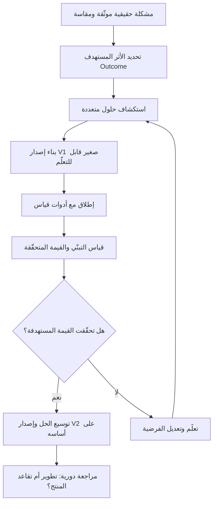

# التفكير المنتَجي (Product Thinking)

> [!info] تعريف مختصر
> التفكير المنتَجي (Product Thinking) هو عقلية تنظر إلى ما نبنيه بوصفه **منتجًا مستمرًّا له دورة حياة** يتطوّر عبر إصدارات متتابعة، لا مشروعًا ينتهي عند لحظة التسليم. جوهره أن النجاح لا يُقاس بإنجاز نطاق العمل في الوقت والميزانية، بل بالقيمة المتحقّقة فعليًا للمستخدم والعمل، وبمدى التبنّي ([[Adoption]]) والاستمرار في الاستخدام. وهو يبدأ من **المشكلة** لا من الحل المطلوب مسبقًا.

## الشرح العلمي والاحترافي

- **الفرق الجوهري بين عقلية `Project` وعقلية `Product`**: عقلية المشروع تفترض أن للعمل تاريخ بداية وتاريخ نهاية، وأن النجاح يعني تسليم النطاق المتفق عليه ضمن الجدول والميزانية، ثم يُفكَّك الفريق ويُنقل إلى مبادرة أخرى. أما عقلية المنتج فتفترض أن ما بنيناه سيبقى حيًّا: يُستخدَم، ويتعطّل، ويُحسَّن، ويُوسَّع، ويُتقاعد يومًا ما. النجاح فيها ليس لحظة، بل منحنى يمتد عبر الزمن.
- **الإصدارات المتتابعة (V1 / V2 / V3)**: في عقلية المنتج لا يوجد "تسليم نهائي"، بل سلسلة إصدارات كل منها يحمل فرضية جديدة عن القيمة. الإصدار الأول ([[MVP]]) ليس نسخة ناقصة من المنتج النهائي، بل أصغر شيء يمكن أن يُنتج تعلّمًا حقيقيًا عن سلوك المستخدم. ما يبنيه الفريق في V2 يُقرَّر بناءً على ما تعلّمه من V1، لا بناءً على وثيقة متطلبات كُتبت قبل عام.
- **استقرار الفريق مع المنتج (Stable Product Teams)**: في نموذج المشروع يتحرّك الناس بين المبادرات ويُبنى الفريق حول العمل. في نموذج المنتج يبقى الفريق مع المنتج ويتحرّك العمل إليه. ميزة ذلك تراكم المعرفة السياقية (Domain Knowledge)، وانخفاض كلفة نقل المعرفة، وامتلاك الفريق لعواقب قراراته بدل تسليمها لجهة أخرى.
- **سلسلة القيمة `Output → Outcome → Value`**: المخرَج (Output) هو ما نبنيه فعليًا — شاشة، تقرير، خدمة تكامل. الأثر (Outcome) هو التغيّر السلوكي الناتج — أصبح الموظفون يقدّمون الطلب إلكترونيًا بدل الورق. القيمة (Value) هي الأثر التجاري أو المؤسسي — انخفضت تكلفة معالجة الطلب وتحسّن رضا العميل. التفكير المنتَجي يرفض التوقف عند الحلقة الأولى، ويقرأ نجاح العمل من الحلقة الثالثة (انظر [[Outcome vs Output]]).
- **البدء من المشكلة لا من الحل**: أخطر ما يقع فيه الفريق أن يستلم "قائمة ميزات" بوصفها متطلبات. التفكير المنتَجي يعيد صياغة الطلب إلى مشكلة قابلة للفحص: من المتضرر؟ ما حجم الألم؟ ما تكلفة بقاء الحال على ما هو عليه؟ ثم يستكشف عدة حلول ممكنة قبل الالتزام بواحد. أدوات مثل [[Value Proposition Canvas]] و[[Customer and Market Validation]] تخدم هذه المرحلة تحديدًا.
- **حلقة التغذية الراجعة ([[Feedback Loop]]) بوصفها آلية حوكمة**: في عقلية المشروع تُغلَق الحلقة بتقرير إغلاق. في عقلية المنتج تبقى الحلقة مفتوحة: قياس، تعلّم، تعديل خارطة الطريق ([[15 - Roadmap]]). قِصَر هذه الحلقة هو ما يميّز المنتجات التي تتحسّن عن المنتجات التي تتقادم.
- **المقولة المحورية**: **التفكير المنتَجي بلا إدارة تسليم فكرة جميلة بلا حماية، وإدارة التسليم بلا تفكير منتَجي مجرّد رقابة.** بمعنى أن رؤية القيمة من دون انضباط في الجدول والتكلفة والمخاطر تبقى نيّة حسنة لا تصل إلى المستخدم؛ وأن الانضباط الإداري من دون سؤال "لماذا نبني هذا؟" يتحوّل إلى متابعة نسب إنجاز لعمل قد يكون بلا قيمة أصلًا. النضج المهني هو الجمع بينهما لا المفاضلة.

## أين ومتى يُستخدم

- **عند تحويل مبادرة داخلية إلى منتج مؤسسي**: حين تبني المؤسسة نظامًا داخليًا (موارد بشرية، رواتب، خدمات مشتركين) وتريد ألّا يتوقف عند التسليم، فتُعيّن مالك منتج ([[05 - Product Owner]]) وميزانية تشغيل مستمرة بدل ميزانية مشروع لمرة واحدة.
- **عند صياغة خارطة الطريق**: التفكير المنتَجي يحوّل [[15 - Roadmap]] من قائمة ميزات بتواريخ ثابتة إلى سلسلة نتائج مطلوبة عبر فصول زمنية (Now / Next / Later)، ما يترك مساحة للتعلّم.
- **عند تحديد أولويات الـ Backlog**: بدل ترتيب البنود حسب من طلبها أو حسب سهولة تنفيذها، تُرتَّب حسب حجم المشكلة التي تعالجها وأثرها المتوقّع على التبنّي والقيمة.
- **عند تعريف نجاح المشروع في ميثاق البدء**: كتابة معايير نجاح تتضمن مؤشرات تبنٍّ واستخدام بعد ٣ و٦ أشهر من الإطلاق، لا الاكتفاء بمعايير "التسليم في الموعد".
- **عند التفاوض على النطاق مع صاحب المصلحة**: التفكير المنتَجي يمنح المدير لغة مختلفة: بدل "هذا خارج النطاق"، يقول "هذه المشكلة حقيقية، لكن أثرها أقل من البند القائم؛ فلنضعها في الإصدار التالي".
- **عند تقييم منتج قائم**: مراجعة دورية تسأل هل ما زال هذا المنتج يستحق الاستثمار، أم دخل مرحلة التقاعد (Sunset)؟ هذا سؤال لا وجود له أصلًا في عقلية المشروع.

## مثال وسيناريو تطبيقي

> [!example] **بوابة الخدمات الذاتية للموظفين — نفس النظام بعقليتين مختلفتين**
>
> **العقلية الأولى (Project)**: وافقت الإدارة على مشروع بميزانية ٦٠٠ ألف ريال ومدة ٨ أشهر لبناء بوابة تضم ٤٥ خدمة موظف. سلّم الفريق ٤٤ خدمة من أصل ٤٥ في الشهر الثامن بتجاوز ٤٪ فقط في الميزانية، فأُعلن المشروع ناجحًا وفُكِّك الفريق. بعد ستة أشهر أظهر القياس أن ٢١٪ فقط من الموظفين (٦٣٠ من ٣٠٠٠) استخدموا البوابة، وأن ٧٨٪ من طلبات الإجازة ما زالت تُقدَّم عبر البريد الإلكتروني للموارد البشرية. لا أحد مسؤول عن هذا الرقم، لأن المشروع "أُغلق".
>
> **العقلية الثانية (Product)**: الميزانية نفسها تُقسَّم إلى ١٨٠ ألف ريال لإصدار أول (V1) يغطي ٦ خدمات فقط هي الأكثر تكرارًا (تشكّل ٧٤٪ من حجم الطلبات الشهرية البالغ ٤٢٠٠ طلب)، ويُطلق خلال ١٠ أسابيع. يُقاس التبنّي أسبوعيًا؛ بعد ٦ أسابيع من الإطلاق يبلغ ٥٨٪ من الموظفين، وتكشف بيانات الاستخدام أن ٣١٪ من محاولات تقديم طلب الإجازة تُهجَر عند شاشة اختيار البديل. يعالج V2 هذه العقبة تحديدًا (وهي لم تكن في وثيقة المتطلبات الأصلية أبدًا) فيرتفع التبنّي إلى ٧٩٪، وينخفض متوسط زمن اعتماد الطلب من ٣.٢ يوم إلى ٧ ساعات. ما تبقّى من الميزانية (٤٢٠ ألف) يُوجَّه بناءً على بيانات حقيقية، فيُكتشف أن ١٩ خدمة من الـ ٤٥ المخطَّطة أصلًا لا يُطلبها أحد أكثر من ٥ مرات سنويًا — فتُلغى، ويُعاد توجيه كلفتها إلى التكامل مع نظام الرواتب الذي ظهر بوصفه الطلب الأول للمستخدمين.
>
> النتيجة: نفس المال والزمن تقريبًا، لكن الفرق في التبنّي بين ٢١٪ و٧٩٪ هو الفرق بين استثمار مُهدَر واستثمار مُثمر — والسبب ليس مهارة تقنية، بل عقلية.

## خطوات أو مخطّط

1. **صياغة المشكلة قبل الحل**: توثيق المشكلة بلغة المستخدم وحجمها الكمّي (كم شخصًا؟ كم مرة؟ كم يكلّف بقاؤها؟) قبل أي حديث عن الميزات.
2. **تحديد الأثر المستهدف**: تعريف التغيّر السلوكي المطلوب ومؤشره القابل للقياس ([[Outcome vs Output]])، مع خط أساس ورقم هدف وأفق زمني.
3. **استكشاف حلول متعددة**: توليد ٢–٤ خيارات حلّ مختلفة الكلفة والمخاطرة، بدل الالتزام المبكر بالخيار الأول.
4. **بناء أصغر إصدار قابل للتعلّم ([[MVP]])**: اختيار الشريحة التي تحمل أكبر قدر من الفرضية غير المتحقَّق منها، لا الشريحة الأسهل تنفيذًا.
5. **الإطلاق مع أدوات القياس**: عدم إطلاق أي إصدار دون تتبّع استخدام وقياس تبنٍّ متفق عليه مسبقًا مع أصحاب المصلحة.
6. **قياس التبنّي والقيمة**: مقارنة الأرقام الفعلية بالهدف بعد فترة اندماج معقولة (٤–٨ أسابيع عادةً)، لا في اليوم التالي للإطلاق.
7. **التعلّم وتحديث خارطة الطريق**: تعديل [[15 - Roadmap]] بناءً على ما تعلّمناه، بما في ذلك **حذف** ميزات مخطَّطة ثبت أنها بلا قيمة.
8. **التكرار عبر الإصدارات**: العودة إلى الخطوة الأولى بفرضية جديدة، مع بقاء الفريق نفسه مع المنتج.

## ⚠️ مفاهيم خاطئة شائعة

> [!warning]
> - **الظن بأن التفكير المنتَجي يعني إلغاء الخطط والجداول**: التفكير المنتَجي لا يلغي الالتزام بالمواعيد ولا الميزانيات، بل يغيّر ما نلتزم به: نلتزم بنتيجة وبفترة زمنية، لا بقائمة ميزات جامدة. مدير مشروع ناضج يظل مسؤولًا عن الكلفة والمخاطر والاعتماديات.
> - **اعتبار "المنتج" حكرًا على الشركات الرقمية والتطبيقات الاستهلاكية**: الأنظمة الداخلية للمؤسسات والحكومات هي منتجات أيضًا — لها مستخدمون، ومنافس صامت (الطريقة القديمة، ملفات Excel)، ودورة حياة، وتكلفة إهمال.
> - **الخلط بين التفكير المنتَجي ووجود مسمّى "مالك منتج"**: تعيين [[05 - Product Owner]] لا يخلق عقلية منتج إذا ظل يُقاس بعدد بنود الـ Backlog المُغلقة ولم يُمنح صلاحية قول "لا" أو إعادة ترتيب الأولويات.
> - **الاعتقاد بأن الاستماع للمستخدم يعني تنفيذ كل ما يطلبه**: التفكير المنتَجي يستمع للمشكلة ويحتفظ بمسؤولية اختيار الحل؛ المستخدم خبير في ألمه، لا بالضرورة في علاجه.
> - **الظن بأن الإصدار الأول يجب أن يكون رديئًا لأنه MVP**: الحد الأدنى يتعلق بـ**نطاق** الوظائف لا بـ**جودتها**؛ إصدار أول ضيق لكن متقن أنجح بكثير من إصدار واسع مهترئ.

## ❌ ممارسات خاطئة في المشاريع

> [!failure]
> - **إغلاق المشروع وتفكيك الفريق فور التسليم**: تختفي المعرفة السياقية في اللحظة التي يبدأ فيها المستخدمون باكتشاف المشاكل الحقيقية، فتُترك الأخطاء بلا معالجة ويتراجع التبنّي. **الحل**: تخصيص فترة رعاية مكثّفة ([[Hypercare]]) ثم فريق تشغيل وتطوير مستمر بميزانية سنوية، مع تسليم معرفة موثّق لا شفهي.
> - **قياس نجاح الفريق بعدد الميزات المُطلقة**: يدفع الفريق إلى إنتاج كمّ سطحي من الوظائف بدل حل المشكلات العميقة، ويخلق منتجًا مزدحمًا يصعب استخدامه. **الحل**: ربط تقييم الأداء بمؤشرات أثر ([[KPI]] مبنية على Outcome) مثل نسبة التبنّي وزمن إنجاز المهمة.
> - **كتابة وثيقة متطلبات شاملة ثم تجميدها ١٨ شهرًا**: تُبنى ميزات على افتراضات فقدت صلاحيتها، وتُستهلك الميزانية في عمل لا يريده أحد. **الحل**: تجزئة العمل إلى إصدارات ذات أفق ٦–١٢ أسبوعًا، مع مراجعة الأولويات بعد كل إصدار على ضوء بيانات الاستخدام.
> - **تجاهل قياس ما بعد الإطلاق تمامًا**: تُفترض القيمة ولا تُثبَت، فتتكرر الأخطاء نفسها في المشروع التالي لأن أحدًا لم يتعلّم منها. **الحل**: تعريف مؤشر [[Adoption]] ومؤشر قيمة واحد على الأقل **قبل** الإطلاق، مع تقرير قياس مجدول بعد ٣٠ و٩٠ يومًا.
> - **إسناد رؤية المنتج إلى لجنة من أصحاب المصلحة**: تتحوّل خارطة الطريق إلى تسوية سياسية بين الإدارات، ويُبنى لكل إدارة جزؤها بلا اتساق ولا أولوية واضحة. **الحل**: مالك منتج واحد مفوَّض بالقرار، ولجنة بدور استشاري لا تنفيذي، وقواعد أولوية معلنة ومكتوبة.
> - **الاكتفاء بالتفكير المنتَجي وإهمال انضباط التسليم**: يتحوّل الفريق إلى نقاش دائم حول القيمة والفرضيات بلا شيء يصل للمستخدم، وتتآكل ثقة الإدارة. **الحل**: إبقاء انضباط الجدول والمخاطر والاعتماديات قائمًا، وربط كل فرضية بموعد إطلاق ملموس تُقاس عنده.

## 🔗 مصطلحات ومفاهيم ذات صلة
[[Outcome vs Output]] | [[MVP]] | [[05 - Product Owner]] | [[15 - Roadmap]] | [[Customer and Market Validation]] | [[Adoption]] | [[Value Proposition Canvas]] | [[Feedback Loop]]
