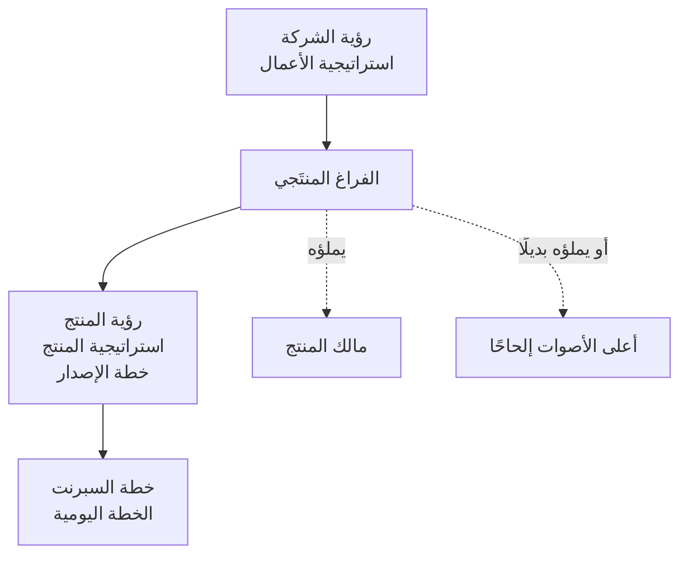

# الفراغ المنتَجي (Product Vacuum)

> [!info] تعريف مختصر
> الفراغ المنتَجي هو **المسافة بين رؤية المؤسسة واستراتيجيّتها من جهة، وبين التنفيذ اليومي من جهة أخرى** — والدور الذي وُجد ليملأها هو **مالك المنتج**. والمصطلح من كتاب *The Professional Product Owner* (دون ماكغريل ورالف يوكلمان). وحين لا يملأه أحد، لا يبقى الفراغ فارغًا: **يمتلئ بصوت أعلى أصحاب المصلحة صراحةً**.

## الشرح العلمي والاحترافي
- **البنية ثلاث طبقات**: في الأعلى رؤية الشركة و[[Product Strategy|استراتيجية الأعمال]]؛ وفي الأسفل خطّة السبرنت والخطّة اليومية؛ وفي الوسط **رؤية المنتج واستراتيجيّته وخطّة الإصدار**. الطبقتان الطرفيّتان تُنتجهما المؤسسة والفريق تلقائيًّا؛ **الطبقة الوسطى وحدها هي التي لا تُنتج نفسها**.
- **لماذا يُنتج غيابُها فوضى محدّدة**: بلا طبقة وسطى لا يوجد معيار يُرتَّب به العمل، فيحلّ محلّه معيار بديل جاهز — **الإلحاح**. ومن هنا الجواب المتكرّر على سؤال «بناءً على ماذا رتّبت؟»: «بناءً على صاحب المصلحة الذي صوته أعلى».
- **ليس فراغًا في المعلومات بل في القرار.** كثيرًا ما تكون الاستراتيجية مكتوبة والخطط موجودة، والمفقود هو **من يملك سلطة الترجمة بينهما** — فيتحوّل مالك المنتج إلى **وكيل (Proxy)** ينقل ولا يقرّر، وهي حالة تُبقي الفراغ قائمًا رغم امتلاء الدور بشخص.
- **شرطه المؤسسي: أهداف مرتّبة في الأعلى.** إن لم تكن أولويّات المؤسسة نفسها مرتّبةً ومُنزَّلة إلى الإدارة الوسطى، فإنّ مالك المنتج يملأ فراغًا **بلا مرجع** — فيصير ترتيبه اجتهادًا شخصيًّا مهما بلغت كفاءته.
- **علاقته بـ[[Alignment|التوائم]]**: الفراغ المنتَجي هو الموضع الذي يتحوّل فيه التوائم من شعار إلى آليّة — لأنّه المكان الذي تُترجَم فيه جملة استراتيجية واحدة إلى عشرات بنود قائمة الأعمال.

## أين ومتى يُستخدم
- عند **تشخيص فريق يُنتج بكفاءة ولا يُحدث أثرًا**: الفجوة غالبًا في الطبقة الوسطى لا في التنفيذ.
- عند **تعريف دور مالك منتج جديد**: ما القرارات التي يملكها فعلًا؟
- في **مراجعة سبب فشل ترتيب الأولويات** رغم وجود إطار (RICE، [[WSJF]]، [[MoSCoW Prioritization|موسكو]]): الإطار يحتاج هدفًا يُرتَّب نحوه.
- عند **التحوّل الرشيق**: كثير من التحوّلات تُنشئ طقوس سكرم وتترك الطبقة الوسطى فارغة.

## مثال وسيناريو تطبيقي
> [!example] مالك منتج يُسأل: بناءً على ماذا؟
> **الوضع:** شركة منتج بها ثلاثة أصحاب مصلحة كبار، ومالك منتج يستقبل طلباتهم ويحوّلها قصص مستخدم.
> **العَرَض:** كلّ سبرنت يُسلَّم كاملًا، ومؤشّرات الأعمال لا تتحرّك؛ وحين يُسأل عن معيار الترتيب يجيب: «حسب من طلب أوّلًا/بأعلى صوت».
> **التشخيص:** الفراغ المنتَجي مفتوح — لا رؤية منتج ولا خطّة إصدار تربط أهداف الرُّبع بقائمة الأعمال.
> **التدخّل:** (١) تثبيت هدفَي أعمال للرُّبع ونشرهما إلى الإدارة الوسطى · (٢) صياغة رؤية منتج وخطّة إصدار من ثلاثة أشهر · (٣) شرط جديد لدخول أيّ بند: إلى أيّ هدف يخدم؟ · (٤) تفويض صريح لمالك المنتج برفض ما لا يخدم هدفًا.
> **الأثر:** انخفض عدد البنود الداخلة إلى النصف تقريبًا، وصار سؤال «بناءً على ماذا؟» له جواب واحد يمكن للفريق ولأصحاب المصلحة تكراره.

## خطوات أو مخطّط
1. **ارسم الطبقات الثلاث** لمؤسستك واكتب ما هو موجود فعلًا في كلّ منها.
2. **حدّد من يملك قرار الطبقة الوسطى** — بالاسم، لا بالمسمّى الوظيفي.
3. **اختبر الملكية**: هل يستطيع أن يقول «لا» لصاحب مصلحة كبير ويُسنَد قراره؟
4. **أرسِ أهداف الرُّبع** أوّلًا؛ فبلا هدف لا يوجد ترتيب بل تفضيل.
5. **اربط كلّ بند بهدف**؛ وما لا يرتبط يُؤجَّل أو يُرفض صراحةً.
6. **راجع الطبقة الوسطى دوريًّا** مع تغيّر الاستراتيجية، فهي ليست وثيقة تُكتب مرّة.

## ⚠️ مفاهيم خاطئة شائعة
> [!warning]
> - **الظنّ بأنّ الفراغ يُملأ بوثيقة**: يُملأ بـ**قرارات متكرّرة**، والوثيقة أثرها لا سببها.
> - **افتراض أنّ وجود مالك منتج يعني امتلاء الفراغ**: الوكيل الذي ينقل ولا يقرّر لا يملأ شيئًا.
> - **اعتباره مشكلة مالك المنتج وحده**: إن لم تُرتّب المؤسسة أهدافها، فالفراغ مؤسسي لا فردي.
> - **الخلط بينه وبين نقص التوثيق**: المشكلة سلطة لا معلومات.

## ❌ ممارسات خاطئة في المشاريع
> [!failure]
> - **تعيين مالك منتج بلا تفويض**: يُنتج مسؤولية بلا صلاحية. الحلّ: تفويض صريح من الإدارة قبل الدور.
> - **إسناد ترتيب الأولويات إلى اجتماع أسبوعي لأصحاب المصلحة**: يعيد إنتاج معيار الصوت الأعلى. الحلّ: معيار مكتوب معلَن.
> - **بناء خارطة طريق دون أهداف أعمال**: خارطة جميلة بلا مرجع. الحلّ: الأهداف أوّلًا.
> - **إبقاء الرؤية في مستوى الإدارة العليا**: الفريق ينفّذ بلا معنى. الحلّ: تنزيل الرؤية إلى كلّ مستوى.

## 🔗 مصطلحات ومفاهيم ذات صلة
[[Product Vision]] | [[Product Strategy]] | [[Prioritization]] | [[Alignment]] | [[Business Case]] | [[OKR]] | [[Stakeholder Map]] | [[13.2 التغذية الراجعة والتمكين وحضور أصحاب المصلحة]]
