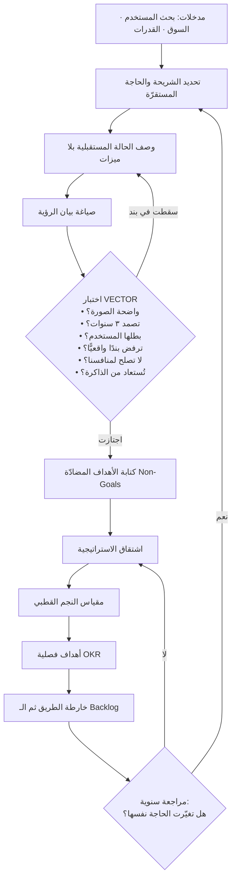

# رؤية المنتج (Product Vision)

> [!info] تعريف مختصر
> وصفٌ موجز وثابت نسبيًّا للحالة المستقبلية التي يسعى المنتج إلى إحداثها في حياة مستخدميه أو في سوقه — لا لما سيبنيه الفريق، بل لما سيصير عليه العالم إن نجح. الرؤية تجيب عن سؤال **«لماذا يستحق هذا المنتج أن يوجد، ولمن، وما الفرق الذي يُحدثه؟»**، وتعمل كنقطة تثبيت (Anchor) تُقاس عليها قرارات الاستراتيجية والأولويات والنطاق. هي مقصودة الغموض في **الكيف**، ومقصودة الوضوح في **من ولماذا وما التغيير**، ولهذا تصمد سنواتٍ بينما تتغيّر الخطط تحتها مرارًا.

## الشرح العلمي والاحترافي
- **الرؤية حالة مستقبلية، لا قائمة قدرات**: الفرق الجوهري بين رؤية حقيقية وبين شعار تسويقي أن الرؤية تصف **وضعًا للمستخدم** بعد أن يوجد المنتج ويعمل بنجاح، لا خصائص المنتج نفسه. «منصّة متكاملة لإدارة الشحن مع تتبّع لحظي وتقارير ذكية» ليست رؤية، بل وصف حزمة ميزات. أما «أن يعرف صاحب المتجر الصغير أين شحنته الآن دون أن يتّصل بأحد» فهي حالة مستقبلية يمكن التحقّق من بلوغها. الاختبار العملي: إن كانت الجملة تظل صحيحة لو حُذف اسم منتجك ووُضع اسم منافسك، فهي ليست رؤية بل وصف فئة.
- **الرؤية أعلى من الاستراتيجية، والاستراتيجية أعلى من خارطة الطريق**: هناك تراتب معياري في أدبيات إدارة المنتج: الرؤية (إلى أين نتّجه ولماذا) ← [[Product Strategy]] (أين نلعب وكيف نفوز للوصول إلى هناك) ← الأهداف القابلة للقياس مثل [[OKR]] ← [[15 - Roadmap]] (متى وبأي ترتيب) ← [[13 - Backlog]] (ماذا بالضبط). كل طبقة تستمدّ شرعيّتها من التي فوقها. خللٌ شائع أن يبدأ الفريق من الطبقة الرابعة صعودًا، فتصير «الرؤية» تلخيصًا لاحقًا لما يُبنى أصلًا — وهذا يُفقدها وظيفتها كليًّا لأنها لم تعد قادرة على رفض أي شيء.
- **الرؤية أداة رفض قبل أن تكون أداة إلهام**: قيمتها التشغيلية الحقيقية تظهر لحظة الاختيار بين بديلين جيّدين. رؤية لا تجعل بندًا واحدًا في الـ Backlog يبدو خارج المسار هي رؤية بلا حواف. ولهذا تُقرأ الرؤية عمليًّا مع [[Non-Goals]]: ما نحن لسنا بصدده يوضّح الرؤية أكثر ممّا يوضّحها تعدادُ الطموحات.
- **ثباتها النسبي مقصود**: خارطة الطريق تتغيّر كل ربع، والاستراتيجية قد تتغيّر سنويًّا عند تحوّل السوق، أما الرؤية فتُصمَّم لتبقى ٣–٥ سنوات أو أكثر. سبب الثبات ليس العناد، بل أن الرؤية مربوطة بحاجة إنسانية مستقرّة — قريبًا من منطق [[Jobs to be Done]]: المهمّة أثبت من الحل. رؤية تحتاج تعديلًا كل ربع تكون في الغالب مكتوبة على مستوى الحل لا مستوى الحاجة.
- **تمييزها عن الرسالة (Mission)**: هناك التباس شائع، والفصل الأكثر قبولًا في الممارسة أن **الرؤية = الحالة المستقبلية المنشودة (الوجهة)**، بينما **الرسالة = ما نفعله يوميًّا وبأي دور نسهم في بلوغ تلك الوجهة (الدور)**. الرؤية تُصاغ بصيغة عالم بعد النجاح، والرسالة تُصاغ بصيغة نشاط مستمر. تنبيه مهم: بعض المؤسسات والأطر تعكس هذين التعريفين تمامًا، فلا فائدة من الجدل الاصطلاحي؛ الفائدة في أن يتّفق الفريق على مسمّياته ويثبت عليها.
- **تمييزها عن الهدف (Goal) وعن [[North Star Metric]]**: الهدف مقيَّد بزمن وقابل للقياس ويُغلق («رفع الاحتفاظ الشهري إلى 40% بنهاية العام»)، والرؤية لا تُغلق ولا تُقاس مباشرة. أمّا مقياس النجم القطبي فهو **الوكيل الكمّي الأقرب** للرؤية: رقم واحد يُفترض أن ارتفاعه دليل على اقترابنا من الحالة المستقبلية. الرؤية تعطي المعنى، والنجم القطبي يعطي التغذية الراجعة، والهدف يعطي الالتزام الزمني.
- **الرؤية أداة تنسيق تنظيمي (Alignment) في الأساس**: كلما كبرت المنظمة، ارتفعت كلفة أن يتّخذ كل فريق قرارًا معقولًا محليًّا لكنه متناقض مع قرارات الآخرين. الرؤية المشتركة تخفض هذه الكلفة لأنها تسمح باللامركزية دون تشتّت: يقرّر الفريق بنفسه لأنه يعرف الوجهة. ولهذا تُقاس جودة نشر الرؤية بسؤال بسيط: لو سألت خمسة أشخاص من فرق مختلفة، هل تحصل على خمس إجابات متقاربة أم خمسة منتجات مختلفة؟
- **أشكال الصياغة الشائعة**: (١) **جملة الرؤية** المختصرة؛ (٢) **صندوق المنتج/الملصق التخيّلي (Product Box / Design the Box)** حيث يتخيّل الفريق غلاف المنتج وعنوانه الإعلاني بعد سنتين؛ (٣) **قالب بيان الرؤية المنظَّم** الشائع في أدبيات المنتج الرشيق بصيغة: «لـ [الفئة] الذين [الحاجة/الظرف]، فإن [اسم المنتج] هو [الفئة] الذي [المنفعة الأساسية]، وبخلاف [البديل الحالي] فإنه [الفارق الجوهري]»؛ (٤) **البيان الصحفي المستقبلي** بمنهج [[Working Backwards]]، حيث يُكتب الإعلان الصحفي وأسئلة العملاء الشائعة قبل بناء أي شيء. الأشكال متكافئة وظيفيًّا؛ الاختيار بينها مسألة ملاءمة ثقافة الفريق.
- **اختبار جودة الرؤية (VECTOR)** — يمكن فحص أي صياغة بستة أسئلة: **(V) Vivid** هل تُنتج صورة ذهنية واحدة لدى القارئ؟ **(E) Enduring** هل تصمد ٣ سنوات دون إعادة كتابة؟ **(C) Customer-anchored** هل بطلها المستخدم لا المنتج ولا الشركة؟ **(T) Testable-by-exclusion** هل ترفض بندًا واقعيًّا واحدًا على الأقل؟ **(O) Ownable** هل تظل صحيحة لو استُبدل اسمنا باسم منافس؟ (إن ظلّت صحيحة فهي فاشلة في هذا البند) **(R) Repeatable** هل يمكن استرجاعها من الذاكرة بعد سماعها مرّة؟ رؤية تسقط في بندين أو أكثر تحتاج إعادة صياغة لا إعادة تسويق.

## أين ومتى يُستخدم
- **عند تأسيس منتج جديد أو خطّ عمل جديد**: قبل كتابة [[PRD]] أو تحديد نطاق [[MVP]]، لأن الحدّ الأدنى الصالح يُشتقّ من الوجهة لا من قدرة الفريق على البناء.
- **عند بناء وتحديث [[15 - Roadmap]]**: كل موضوع (Theme) في خارطة الطريق يجب أن يكون قابلًا لتبرير وجوده بالإشارة إلى الرؤية، وإلا فهو بند يتيم.
- **في صياغة [[OKR]] الفصلية أو السنوية**: الرؤية تمنع أن تتحوّل الأهداف إلى تحسينات محلية متفرّقة لا تتراكم في اتجاه واحد.
- **في تحكيم أولويات الـ Backlog**: تُستعمل كمرشّح أولي قبل نماذج التسجيل الكمّي مثل [[RICE Prioritization]] أو [[WSJF]] — فالبند الذي لا يخدم الرؤية لا يستحق أن يُحسب له مجموع نقاط أصلًا.
- **في إقناع الرعاة والمستثمرين ([[Sponsor]] و[[Business Case]])**: الرؤية توفّر الإطار السردي الذي تُفهم داخله الأرقام؛ الأرقام وحدها تبرّر مشروعًا، والرؤية تبرّر رهانًا متعدّد السنوات.
- **في التوظيف والاحتفاظ بالكفاءات**: المهندسون والمصمّمون الأقوى يختارون المشكلات لا المهام؛ الرؤية هي أوضح تعبير عن حجم المشكلة التي يُدعَون إليها.
- **عند مواجهة [[Scope Creep]] أو [[Feature Creep]]**: أقوى ردّ على طلب خارج المسار ليس «لا وقت لدينا» بل «هذا لا يقرّبنا من حيث نريد أن نكون».

## مثال وسيناريو تطبيقي
> [!example] شركة سعودية ناشئة تبني منصّة لإدارة عيادات الأسنان الصغيرة. في السنة الأولى كانت «الرؤية» المكتوبة على جدار المكتب: «أن نكون المنصّة الأولى لإدارة العيادات في المنطقة».
> النتيجة التشغيلية: خلال ثلاثة أرباع، وافق الفريق على 34 طلب ميزة من عملاء مختلفين — نظام محاسبي، نظام رواتب، مخزون، تسويق بالرسائل، تطبيق ولاء للمرضى — لأن كل واحدة منها كان يمكن تبريرها بأنها تخدم «أن نكون الأولى». وصل الفريق إلى منتج بـ 9 وحدات، ومتوسط زمن تهيئة العميل الجديد (Onboarding) صار 26 يومًا، ومعدّل التخلّي في أول 90 يومًا 38%. المصمّمون كانوا يسألون في كل اجتماع تصميم: «ما الذي نحن عليه بالضبط؟».
> في مراجعة استراتيجية أعاد الفريق كتابة الرؤية على مستوى الحالة المستقبلية للمستخدم بدل مستوى الموقع السوقي: **«أن يقضي طبيب الأسنان في عيادة صغيرة يومه في العلاج لا في المتابعة الإدارية — لا مكالمات تأكيد مواعيد، ولا بحث في دفتر، ولا مريض يختفي بلا أثر.»** وأضاف قائمة [[Non-Goals]] صريحة: «لسنا نظامًا محاسبيًّا، ولسنا أداة تسويق، ولسنا سجلًّا طبيًّا شاملًا للمستشفيات.»
> أثر ذلك خلال ربعين: أُسقطت 21 طلبًا من قائمة الـ Backlog لا لضيق الوقت بل لخروجها عن الرؤية، وتركّز العمل على ثلاثة مسارات فقط (تأكيد المواعيد الآلي، استعادة المرضى المتغيّبين، ملف مريض سريع الفتح). حُدّد [[North Star Metric]] بوصفه «عدد ساعات العيادة الإدارية الموفَّرة أسبوعيًّا»، وارتفع من 3.1 إلى 7.4 ساعة لكل عيادة. زمن التهيئة نزل إلى 4 أيام، والتخلّي في 90 يومًا إلى 17%. لم يتغيّر حجم الفريق ولا الميزانية — تغيّر ما يُقاس عليه القبول والرفض.

## خطوات أو مخطّط
1. اجمع المدخلات قبل الصياغة: بحث المستخدمين ([[User Interview]] و[[Jobs to be Done]])، وقراءة السياق الخارجي ([[PESTEL]])، وواقع القدرات الداخلية، وموقع المنتج في [[Product Maturity]].
2. حدّد **من** بدقّة: أي شريحة مستخدمين بالضبط؟ الرؤية التي تخاطب «الجميع» لا توجّه أحدًا.
3. حدّد **الحالة المستقبلية**: صف يومًا في حياة هذا المستخدم بعد أن ينجح المنتج، بلا ذكر ميزات.
4. صُغ الجملة بأحد القوالب (بيان الرؤية المنظَّم، أو البيان الصحفي المستقبلي بمنهج [[Working Backwards]]، أو صندوق المنتج).
5. مرّرها على اختبار **VECTOR** الستة، وأعد الصياغة عند سقوطها في أي بند.
6. اكتب [[Non-Goals]] المقابلة — لكل رؤية حدود، والحدود جزء من الرؤية لا ملحق بها.
7. اشتقّ منها: [[Product Strategy]] ثم [[North Star Metric]] ثم [[OKR]] ثم [[15 - Roadmap]].
8. انشرها واختبر استيعابها: اسأل أفرادًا من فرق مختلفة أن يعيدوا صياغتها بكلماتهم، وقِس التشتّت في إجاباتهم.
9. راجعها سنويًّا بسؤال واحد: هل تغيّرت الحاجة الإنسانية التي بُنيت عليها؟ إن لم تتغيّر، لا تُعدّل الرؤية — عدّل الاستراتيجية.

## ⚠️ مفاهيم خاطئة شائعة
> [!warning]
> - **الخلط بين الرؤية والشعار التسويقي**: الشعار موجَّه للخارج ووظيفته أن يُتذكَّر ويُحبّ؛ والرؤية موجَّهة للداخل أولًا ووظيفتها أن تُرشد القرار. جملة جميلة لا تُسقط أي بند من الـ Backlog هي شعار مهما وُضع تحتها عنوان «رؤيتنا».
> - **الظنّ أن الرؤية والاستراتيجية شيء واحد**: الرؤية تقول **إلى أين**، و[[Product Strategy]] تقول **من أين نبدأ وكيف نفوز وما الذي لن نفعله**. فريق يملك رؤية بلا استراتيجية يملك اتجاهًا بلا طريق؛ وفريق يملك استراتيجية بلا رؤية يملك خططًا سريعة التبدّل بلا معيار لتقييمها.
> - **الظنّ أن الرؤية هدف قابل للتحقّق والإغلاق**: الهدف يُنجَز ويُشطَب؛ الرؤية تُقارَب ولا تُغلَق. «إطلاق النسخة 3.0 في الربع الثالث» ليست رؤية بل معلَم ([[Milestone]]).
> - **اعتبار الرؤية مسؤولية القيادة العليا وحدها**: الصياغة النهائية قد تكون بيد قيادة المنتج، لكن رؤية لم يشارك في تشكيلها من سيبني ويصمّم ويبيع تُستقبَل بوصفها إعلانًا داخليًّا، وتُنسى في أول ضغط.
> - **الاعتقاد بأن غموض الرؤية عيب مطلق**: الرؤية غامضة عمدًا في **الكيف** لتترك للفريق مساحة اكتشاف الحل؛ لكنها يجب أن تكون حادّة تمامًا في **من** و**أي تغيير**. الخطأ ليس الغموض، بل الغموض في الموضع الخطأ.
> - **افتراض أن الرؤية الطموحة تكفي لتحريك الفريق**: بلا ترجمة إلى [[OKR]] ومقاييس، تتحوّل الرؤية إلى خطاب موسمي يُتلى في اللقاءات الفصلية ثم يُغلق الاجتماع ويعود الجميع إلى قائمة الطلبات نفسها.
> - **الخلط بين الرؤية ورؤية الشركة**: للشركة رؤية تغطّي محفظتها كلها، ولكل منتج داخلها رؤية أضيق تخدمها. إسقاط رؤية الشركة كما هي على منتج واحد ينتج بيانًا عامًّا لا يفصل في شيء.

## ❌ ممارسات خاطئة في المشاريع
> [!failure]
> - **كتابة الرؤية بعد بناء خارطة الطريق لتبريرها**: الخطأ أن تُشتقّ الرؤية من الخطط القائمة صعودًا. لماذا يضرّ: تفقد الرؤية قدرتها على رفض أي شيء، لأن كل ما هو قائم صار جزءًا من تعريفها. الحل: اكتب الرؤية أولًا، ثم اعرض عليها خارطة الطريق الحالية وسجّل كم بندًا لا يصمد أمامها — إن كان الجواب صفرًا فالرؤية معطّلة.
> - **صياغة رؤية على مستوى الموقع السوقي («أن نكون الأول/الرائد»)**: لماذا يضرّ: هذه صياغة تصلح لأي شركة في أي قطاع، ولا تحسم أي مفاضلة داخلية، وتدفع نحو التوسّع الأفقي بلا حدود. الحل: أعد الصياغة على مستوى الحالة المستقبلية للمستخدم، واجعل الريادة نتيجة متوقّعة لا هدفًا معلنًا.
> - **تعديل الرؤية كلما تغيّرت الأولويات الفصلية**: لماذا يضرّ: يفقد الفريق نقطة التثبيت، ويصبح كل تحوّل تكتيكي «تحوّلًا استراتيجيًّا»، فيستنزف رأس المال المعنوي للفريق ويربك الشركاء. الحل: افصل صراحةً بين تعديل الاستراتيجية (مسموح ومتوقّع) وتعديل الرؤية (حدث نادر يستدعي مبرّرًا موثّقًا في [[Decision Log]]).
> - **نشر الرؤية مرّة واحدة ثم افتراض أنها معروفة**: لماذا يضرّ: الفهم المشترك يتآكل مع كل موظف جديد وكل إعادة تنظيم، فتظهر تفسيرات متوازية تنتج قرارات متعارضة بحسن نيّة. الحل: اجعل الرؤية بندًا ثابتًا في تهيئة الموظفين الجدد وفي افتتاح كل مراجعة فصلية، وقس استيعابها باستطلاع قصير بدل افتراضه.
> - **الاكتفاء برؤية بلا [[Non-Goals]]**: لماذا يضرّ: رؤية بلا حدود تُفسَّر توسّعيًّا في كل نقاش، فيصير كل طلب عميل «داخل الرؤية». الحل: انشر مع كل رؤية قائمة صريحة بثلاثة إلى خمسة أشياء لن نفعلها، وراجعها مع الرؤية.
> - **استخدام الرؤية لقمع الاعتراضات المبنيّة على بيانات**: لماذا يضرّ: حين يقال «هذا ما تقتضيه الرؤية» ردًّا على مؤشرات سلبية من [[Product Analytics]] أو من مقابلات المستخدمين، تتحوّل الرؤية إلى عقيدة تحصّن القرار من التعلّم. الحل: الرؤية توجّه الوجهة، والبيانات تحكم على الطريق؛ إن تكرّر تصادمهما فالمشكلة في الاستراتيجية لا في البيانات.
> - **رؤية بلا مؤشّر يقرّبها من القياس**: لماذا يضرّ: يستحيل معرفة إن كنّا نقترب أو نبتعد، فتُقيَّم الفرق على المخرجات (Output) لا الأثر ([[Outcome vs Output]]). الحل: اربط الرؤية بـ[[North Star Metric]] واحد وبمقياسين مضادّين يمنعان تحسينه على حساب شيء آخر.

## 🔗 مصطلحات ومفاهيم ذات صلة
[[Product Strategy]] | [[Opportunity Discovery]] | [[Product Sense]] | [[Product Life Cycle]] | [[North Star Metric]] | [[OKR]] | [[15 - Roadmap]] | [[Non-Goals]] | [[Product Principles]] | [[Working Backwards]] | [[Product Thinking]] | [[Outcome vs Output]] | [[Jobs to be Done]] | [[Alignment]]
