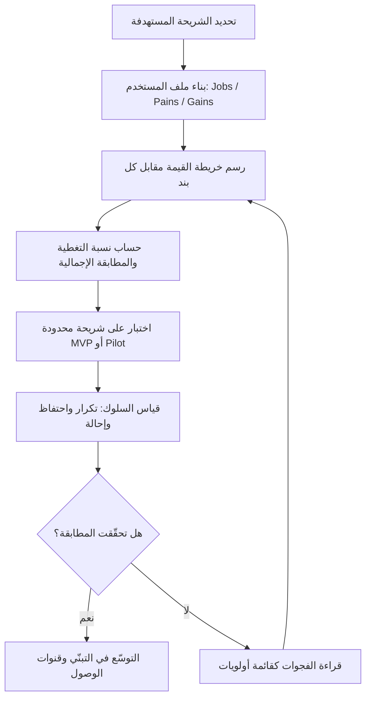

# مطابقة المنتج للحاجة (Product-Market Fit)

> [!info] تعريف مختصر
> مطابقة المنتج للحاجة (Product-Market Fit — اختصارًا PMF) هي درجة تطابق ما يقدّمه المنتج فعلًا مع ما يحتاجه السوق أو المستخدم فعلًا. ليست حالة ثنائية «موجودة أو غائبة» بل **طيف قابل للقياس**: كلما ارتفعت نسبة تغطية المنتج للوظائف والآلام والمكاسب الحقيقية للمستخدم، ارتفعت درجة المطابقة. ودليلها الوحيد المعتبر هو **سلوك المستخدمين** — استخدامهم المتكرّر وبقاؤهم وإحالتهم لغيرهم — لا إعجابهم اللفظي ولا حماس فريق البناء.

## الشرح العلمي والاحترافي
- الفكرة المركزية: أغلب المنتجات لا تفشل لأنها بُنيت بشكل رديء، بل لأنها بُنيت لحاجة غير موجودة أو غير مؤلمة بما يكفي. المطابقة هي الجسر بين «ما نستطيع بناءه» و«ما يستحق أن يُبنى».
- **قياس المطابقة داخل [[Value Proposition Canvas]]**: اللوحة مقسومة نصفين — **ملف المستخدم (Customer Profile)** الذي يحوي `Jobs` (الوظائف التي يحاول المستخدم إنجازها) و`Pains` (الآلام والعقبات) و`Gains` (المكاسب المرغوبة)؛ و**خريطة القيمة (Value Map)** التي تحوي المنتجات والخدمات ومسكّنات الألم (Pain Relievers) ومولّدات المكاسب (Gain Creators). المطابقة (Fit) هي درجة انطباق النصف الثاني على الأول، وتُقاس بنسبة التغطية في كل بُعد.
- **مثال محسوب على التغطية**: بعد جلسة بحث مع المستخدمين، رُصدت 9 وظائف و9 آلام و9 مكاسب. فحص المنتج الحالي أظهر:
  - الوظائف (`Jobs`): 8 من 9 مغطّاة ≈ **89%**
  - الآلام (`Pains`): 7 من 9 معالَجة ≈ **78%**
  - المكاسب (`Gains`): 8 من 9 محقّقة ≈ **89%**
  - المطابقة الإجمالية = المتوسط ≈ **85%**
- **كيف تُقرأ الفجوات المتبقّية**: النسبة ليست درجة مدرسية بل **قائمة أولويات جاهزة**. البنود الخمسة غير المغطّاة (وظيفة + ألمان + مكسب) هي بالضبط ما يجب أن يتصدّر الـ Backlog. والأهم أن الأبعاد ليست متساوية الوزن: **الآلام أثقل من المكاسب** لأنها محرّك الشراء الأقوى، ولهذا فإن 78% في `Pains` تستحق معالجة قبل رفع 89% في `Gains` إلى 100%. وينبغي كذلك ترجيح كل بند بشدّته وتكراره: ألم حادّ يتكرّر يوميًا لدى 60% من المستخدمين أهم من ثلاثة آلام هامشية نادرة.
- **مستويات المطابقة** — ترتيب لا يجوز قفزه:
  1. **Problem-Solution Fit**: إثبات أن المشكلة حقيقية ومؤلمة وأن الحل المقترح يعالجها فعلًا لدى شريحة محدّدة. يُختبَر بمقابلات وتجارب صغيرة و[[MVP]] قبل الاستثمار الكبير، وهو ميدان [[Customer and Market Validation]].
  2. **Product-Market Fit**: إثبات أن السوق يتبنّى الحل تلقائيًا ويستمر عليه — الطلب يسحب المنتج بدل أن يدفعه التسويق. هنا تظهر مؤشرات الاحتفاظ والنمو العضوي.
  3. (ولاحقًا) **Channel/Business-Model Fit**: قدرة قنوات الوصول ونموذج الإيراد على خدمة هذا الطلب باقتصاديات صحّية.
- **المؤشرات السلوكية للمطابقة** — الدليل الحقيقي:
  - **التكرار (Frequency)**: هل يعود المستخدم من تلقاء نفسه وبأي وتيرة مقارنة بطبيعة الحاجة؟
  - **الاحتفاظ (Retention)**: هل يستقرّ منحنى البقاء بعد الأسابيع الأولى عند مستوى غير صفري؟ منحنى ينحدر إلى الصفر يعني غياب مطابقة مهما ارتفع عدد التسجيلات.
  - **الإحالة (Referral)**: هل يوصي المستخدمون بالمنتج تلقائيًا؟ ويُقاس جزئيًا بـ[[NPS]].
  - **ألم فقدان المنتج**: السؤال الكلاسيكي «ما مدى انزعاجك لو اختفى المنتج غدًا؟» — وتُعتبر نسبة 40% فأكثر ممن يجيبون بـ«منزعج جدًا» إشارة عملية شائعة على وجود مطابقة.
  - **العمق والاعتماد**: هل أدخل المستخدم بياناته وعمله الحقيقي في المنتج، أم بقي يجرّبه على الهامش؟
- **ما لا يصلح دليلًا**: عبارات المجاملة في المقابلات، عدد التسجيلات المدفوع بحملة إعلانية، الإعجاب بالتصميم، أو حماس الفريق. المستخدمون يجاملون بالكلام ويصدقون بالسلوك — ولهذا يجب قياس الأثر لا الأنشطة ([[Outcome vs Output]]).
- **تطبيقه في المشاريع المؤسسية**: هنا لا يوجد «سوق مفتوح» يتبنّى المنتج أو يهجره، بل مستخدمون داخليون قد يُلزَمون باستخدام النظام. لذلك تتحوّل المطابقة إلى **مطابقة لاحتياج المستخدمين الداخليين**، وتُقاس بمؤشرات مختلفة: [[Adoption]] الطوعي مقابل الإجباري، بقاء الحلول الالتفافية (شيتات Excel الموازية أدلّ دليل على غياب المطابقة)، معدل إتمام العملية داخل النظام، انخفاض تذاكر الدعم، ورضا المستخدم الداخلي. ونظام مؤسسي يُستخدَم بالإكراه بينما يُدار العمل الحقيقي خارجه هو نظام بلا مطابقة، مهما بلغت نسبة «الالتزام» في التقارير.

## أين ومتى يُستخدم
- **قبل الاستثمار الكبير في البناء**: للتحقّق من أن المشكلة تستحق الحل، عبر [[Pilot Launch]] أو [[MVP]] محدود الشريحة.
- **عند تحديد أولويات خارطة الطريق**: فجوات التغطية في [[Value Proposition Canvas]] تُترجَم مباشرة إلى بنود ذات قيمة مثبتة بدل أفكار مقترحة داخليًا.
- **عند تفسير ضعف التبنّي رغم اكتمال البناء**: إن كان المنتج مكتملًا وخاليًا من العيوب ومع ذلك لا يُستخدم، فالمشكلة في المطابقة لا في التنفيذ.
- **عند دخول شريحة أو سوق جديد**: المطابقة ليست دائمة ولا منقولة — منتج مطابق لشريحة قد لا يطابق أخرى، ويجب إعادة القياس لكل شريحة.
- **في المشاريع الداخلية قبل التعميم على المؤسسة**: قياس المطابقة مع قسم واحد أولًا يمنع فرض نظام مرفوض على آلاف المستخدمين.
- **دوريًا بعد الإطلاق**: المطابقة تتآكل بتغيّر حاجات المستخدمين ودخول بدائل جديدة، فتستوجب مراجعة منتظمة.

## مثال وسيناريو تطبيقي
> [!example] منصّة لإدارة طلبات الشراء داخل شركة متوسطة. بعد 14 مقابلة مع مستخدمين من ثلاثة أقسام، بُنِيَ ملف المستخدم في [[Value Proposition Canvas]]: 9 وظائف، 9 آلام، 9 مكاسب.
> **قياس المطابقة للنسخة الحالية**: الوظائف 8/9 ≈ 89%، الآلام 7/9 ≈ 78%، المكاسب 8/9 ≈ 89% → **مطابقة إجمالية ≈ 85%**.
> **قراءة الفجوات**: الوظيفة غير المغطّاة هي «متابعة حالة الطلب بعد إرساله للمالية». والألمان غير المعالَجين: «إعادة إدخال البيانات نفسها في كل طلب متكرّر»، و«عدم معرفة سبب الرفض». والمكسب المفقود: «تقرير شهري بمصروفات القسم».
> **الترجيح**: أظهرت البيانات أن ألم «عدم معرفة سبب الرفض» يتكرّر لدى 62% من المستخدمين شهريًا ويولّد 41% من تذاكر الدعم، بينما «التقرير الشهري» يخصّ 4 مديري أقسام فقط. فرُتّبت الأولوية بحسب الشدّة والتكرار لا بحسب سهولة التنفيذ.
> **المؤشرات السلوكية قبل المعالجة**: 210 مستخدمين مُلزَمين بالنظام، لكن 38% منهم يحتفظون بملف Excel موازٍ، ومتوسط الاستخدام 1.2 مرة أسبوعيًا، و[[NPS]] الداخلي = −12. أي أن «الالتزام» 100% بينما المطابقة الحقيقية منخفضة.
> **بعد معالجة الفجوتين الأثقل** (إظهار سبب الرفض + استنساخ الطلبات المتكرّرة): ارتفعت المطابقة المحسوبة إلى ≈ 93%، وانخفض استخدام ملفات Excel الموازية من 38% إلى 9%، وانخفضت تذاكر الدعم 44%، وارتفع NPS الداخلي إلى +31. الدليل الحاسم لم يكن النسبة المحسوبة بل **اختفاء الحلول الالتفافية** — أوضح مؤشر سلوكي على المطابقة في البيئة المؤسسية.

## خطوات أو مخطّط
1. تحديد الشريحة المستهدفة بدقّة — لا يمكن قياس مطابقة لـ«الجميع».
2. بناء ملف المستخدم عبر بحث ميداني ومقابلات: استخراج `Jobs` و`Pains` و`Gains` بكلمات المستخدم لا بافتراضات الفريق ([[Pain Point]]، [[User Journey Map]]).
3. ترجيح كل بند بشدّته وتكراره ونسبة من يعانيه.
4. رسم خريطة القيمة: ما الذي يقدّمه المنتج فعلًا مقابل كل بند؟
5. حساب نسبة التغطية في كل بُعد ثم المطابقة الإجمالية، وتوثيق البنود غير المغطّاة.
6. اختبار الفرضيات على شريحة محدودة عبر [[MVP]] أو [[Pilot Launch]].
7. قياس المؤشرات السلوكية: التكرار، الاحتفاظ، الإحالة، وألم الفقدان — لا الآراء اللفظية.
8. معالجة الفجوات بترتيب الأثر المرجّح، ثم إعادة القياس واعتبار المطابقة هدفًا متجدّدًا لا محطة نهائية.

## ⚠️ مفاهيم خاطئة شائعة
> [!warning]
> - **اعتبار المطابقة حالة ثنائية تُبلَغ مرة واحدة**: هي طيف متغيّر يتآكل بتبدّل الحاجات ودخول البدائل، ويستوجب إعادة قياس دورية.
> - **الاكتفاء بالإعجاب اللفظي دليلًا**: عبارة «الفكرة رائعة» في مقابلة لا تساوي شيئًا أمام سلوك فعلي متكرّر؛ الالتزام يُقاس بوقت المستخدم أو ماله أو بياناته لا بكلامه.
> - **الخلط بين النمو والمطابقة**: أعداد تسجيل مرتفعة مدفوعة بإنفاق إعلاني قد تخفي انحدار منحنى الاحتفاظ إلى الصفر — وهو غياب مطابقة لا نجاح.
> - **الظن بأن المطابقة تُبلَغ بإضافة ميزات أكثر**: كثرة الميزات تُشتّت وتزيد كلفة الصيانة؛ المطابقة تأتي من معالجة الآلام الأثقل بعمق، لا من توسيع القائمة.
> - **الظن بأن المفهوم لا يخصّ المشاريع المؤسسية لغياب سوق مفتوح**: بل يخصّها بشدّة، إذ يتحوّل السؤال إلى مطابقة احتياج المستخدمين الداخليين، ودليل غيابها الأوضح هو بقاء الحلول الالتفافية خارج النظام.
> - **قراءة نسبة التغطية كدرجة نجاح**: النسبة أداة توجيه أولويات لا شهادة إنجاز، ولا معنى لها بلا ترجيح بشدّة كل بند وتكراره.

## ❌ ممارسات خاطئة في المشاريع
> [!failure]
> - **بناء المنتج كاملًا قبل أي تحقّق من الحاجة**: يستهلك أشهرًا وميزانيات على فرضية غير مختبَرة، ويجعل التراجع مكلفًا نفسيًا وماليًا. الحل: إثبات Problem-Solution Fit أولًا عبر [[Customer and Market Validation]] و[[MVP]] قبل الالتزام بالبناء الكامل.
> - **قياس النجاح بعدد التسجيلات أو نسبة الالتزام الإجباري**: مؤشرات سطحية تخفي هجرًا فعليًا أو استخدامًا شكليًا. الحل: اعتماد الاحتفاظ والاستخدام المتكرّر و[[Adoption]] الطوعي مؤشرات أساسية.
> - **إجراء البحث مع أصحاب المصلحة بدل المستخدمين الفعليين**: المدير يصف العملية كما ينبغي أن تكون، والمستخدم يعيشها كما هي — والفارق بينهما هو موضع الفجوة. الحل: مقابلة من ينفّذ العمل يوميًا وملاحظته أثناء الأداء الحقيقي.
> - **تجاهل الفجوات المكتشفة لأن معالجتها مكلفة**: يترك المنتج مطابقًا جزئيًا فيبقى التبنّي هشًّا مهما أُضيف من ميزات جانبية. الحل: التعامل مع البنود غير المغطّاة كقائمة أولويات ملزمة مرتّبة بالأثر المرجّح.
> - **التوسّع في التسويق أو التعميم المؤسسي قبل تحقّق المطابقة**: يضاعف كلفة الاكتساب ويحرق سمعة المنتج لدى شريحة واسعة يصعب استرجاعها. الحل: التوسّع فقط بعد استقرار منحنى الاحتفاظ في [[Pilot Launch]] محدود.
> - **إسقاط الحلول الالتفافية من التقارير**: بقاء ملفات Excel موازية أوضح دليل على غياب المطابقة، وإخفاؤه يزيّف نجاح المشروع. الحل: رصد الحلول الالتفافية صراحةً كمؤشر رسمي، واعتبار انخفاضها هدفًا معلنًا.

## 🔗 مصطلحات ومفاهيم ذات صلة
[[Value Proposition Canvas]] | [[Customer and Market Validation]] | [[MVP]] | [[Pain Point]] | [[NPS]] | [[Adoption]] | [[Pilot Launch]] | [[User Journey Map]]
