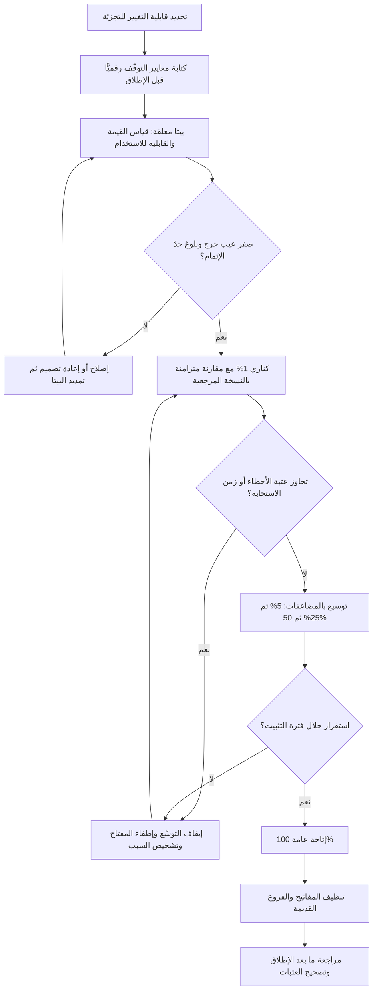

# التسليم المتدرّج (Progressive Delivery)

> [!info] تعريف مختصر
> منهج إطلاق يستبدل الحدث الواحد الكبير («الإطلاق للجميع دفعة واحدة») بسلسلة **حلقات متوسّعة** من الجمهور، تُفتح كل حلقة منها فقط بعد أن تُثبت الحلقة السابقة سلامتها وفق **معيار رقمي معلن مسبقًا**. جوهره أنه يحوّل الإطلاق من قرار واحد عالي المخاطر إلى سلسلة قرارات صغيرة قابلة للنقض، فيتحدّد **حجم الضرر الأقصى** لأي عطل سلفًا بدل أن يتحدّد بالحظّ. يقوم عمليًّا على [[Feature Flags]] كبنية تحتية للاستهداف والإطفاء، وعلى مراقبة لحظية تُغذّي قرار المضيّ في كل حلقة.

## الشرح العلمي والاحترافي
- **المبدأ الحاكم: تقليل نصف قطر الانفجار (Blast Radius)**: لا يدّعي المنهج أن الأعطال لن تقع، بل يفترض وقوعها ويصمّم لأجل أن تكون تكلفتها محدودة ومحسوبة. إن كان احتمال عطل غير مكتشَف في الاختبار قائمًا دائمًا، فالفرق بين اكتشافه لدى 1% من المستخدمين واكتشافه لدى 100% هو فرق بين حادثة وأزمة.
- **الثلاثي الذي يتكوّن منه المنهج**: (١) **آلية استهداف** تحدّد من يرى ماذا — عبر المفاتيح؛ (٢) **قياس** يربط كل حلقة بمؤشّرات صحّة تقنية وسلوكية؛ (٣) **بوّابة قرار** عند كل حلقة تجيب: نوسّع، أم نثبت، أم نتراجع. غياب أي ضلع من الثلاثة يحوّل المنهج إلى «إطلاق بطيء» بلا فائدة، لأن البطء وحده لا يحمي من شيء.
- **الإطلاق التدريجي المُبرمَج (Canary Release)** — «إطلاق الكناري»، والتسمية مستعارة من طيور الكناري التي كانت تُحمَل إلى مناجم الفحم بوصفها إنذارًا مبكّرًا لتسرّب الغازات: يُوجَّه جزء صغير جدًّا من حركة المرور الحقيقية أو من المستخدمين إلى النسخة الجديدة بينما تبقى الأغلبية على القديمة، وتُقارَن النسختان جنبًا إلى جنب على المؤشّرات نفسها في الوقت نفسه. المستخدمون هنا **لا يعلمون** أنهم في الحلقة الأولى، والاختيار عشوائي أو بحسب منطقة/خادم. **معيار التوقّف الرقمي المعتاد**: يقارَن معدّل الأخطاء ومدّة الاستجابة في نسخة الكناري بالنسخة المرجعية خلال نافذة زمنية محدّدة (مثلًا 30–60 دقيقة)؛ فإن ارتفع معدّل الأخطاء عن العتبة المتّفق عليها (مثلًا تجاوز 1% مطلقًا، أو زاد بمقدار يفوق ضعف قيمة النسخة المرجعية)، أو ارتفعت المئوية 95 لزمن الاستجابة فوق حدّ [[SLO]] المعلن — يُوقَف التوسّع فورًا ويُعاد التوجيه إلى القديم. أهم شرطين لصحّة القياس: أن تكون الشريحة **كبيرة كفاية إحصائيًّا** (شريحة 0.1% في منتج صغير قد لا تنتج ولو خطأً واحدًا في ساعة، فتُقرأ الحلقة "ناجحة" وهي فارغة من المعلومة)، وأن تدوم **مدّة كافية** لتشمل تفاوت الحمل بين ساعات اليوم — راجع [[Percentiles and Median vs Average]] لفهم لماذا لا يُقاس هذا بالمتوسّط.
- **الإصدار التجريبي (Beta Release)**: مرحلة يُفتح فيها المنتج أو الميزة لجمهور **يعلم أنه يجرّب** ويقبل بعدم الاكتمال مقابل الوصول المبكّر وقناة تغذية راجعة مباشرة. تنقسم عادةً إلى بيتا **مغلقة** (قائمة مدعوّين محدّدة، أنسب لالتقاط الملاحظات النوعية العميقة) وبيتا **مفتوحة** (تسجيل ذاتي، أنسب لاختبار الحمل والتنوّع الواقعي للأجهزة والبيئات). الفارق الجوهري عن الكناري أنه يقيس **الملاءمة والقيمة والقابلية للاستخدام** لا الاستقرار التقني فحسب — أي يجيب سؤال [[Validation vs Verification]] من جهة التحقّق من صحّة الشيء المبني. **معيار التوقّف الرقمي المعتاد**: عتبة مركّبة تجمع الحدّ الأقصى للعيوب الحرجة (مثلًا: صفر عيب من درجة حرجة، وأقل من عدد متّفق عليه من العيوب المتوسّطة المفتوحة — راجع [[Severity vs Priority]])، مع حدّ أدنى للتفاعل (مثلًا: أن يُكمل 60% من المشتركين المهمّة الأساسية مرة واحدة على الأقل)، وحدّ أدنى لحجم التغذية الراجعة المعالَجة. إن لم تُبلَغ العتبة تُمدَّد البيتا أو يُعاد التصميم؛ ولا تُختتم البيتا بالتاريخ وحده.
- **الطرح بالنسبة المئوية (Percentage Rollout)**: الشكل الأشهر — 1% ثم 5% ثم 25% ثم 50% ثم 100%، مع فترة «تثبيت» بين كل حلقتين لا تقلّ عن دورة استخدام طبيعية واحدة. المهمّ ليس الأرقام بحدّ ذاتها بل أن تكون **متضاعفة لا خطّية**، لأن الأعطال النادرة لا تظهر إلا مع تغيّر رتبة الحجم.
- **علاقته بأنماط النشر الأخرى**: يُخلط المنهج كثيرًا بنمط **Blue-Green** (بيئتان متطابقتان يُحوَّل بينهما الحمل دفعة واحدة). الفرق أن الأخير **ثنائي**: إمّا الكل هنا أو الكل هناك، فيعطي تراجعًا سريعًا لكنه لا يعطي تدرّجًا في التعرّض. التسليم المتدرّج يعطي الاثنين لكنه يفرض على النظام أن يتحمّل **تشغيل نسختين في وقت واحد** — وهذا قيد معماري حقيقي على قواعد البيانات والواجهات البرمجية.
- **الأصل والسياق**: المصطلح تبلور في أوساط هندسة التسليم والـ [[SRE]] بوصفه امتدادًا طبيعيًّا لـ [[CI and CD]]: بعد أن حُلّت مشكلة «كيف نوصل الكود بسرعة وأمان إلى الخوادم»، بقيت مشكلة «كيف نوصله إلى المستخدمين بأمان» — وهذه إجابتها. الفكرة الجامعة أنه يضيف **التحكّم التدريجي في الجمهور والقياس** فوق أتمتة النشر.
- **ما لا يحلّه هذا المنهج**: لا يحمي من تغييرات لا تقبل التجزئة (هجرة بيانات لمرّة واحدة، تغيير تعاقدي، تحديث تنظيمي إلزامي بتاريخ ملزم)، ولا من الأعطال البطيئة الظهور التي تحتاج أسابيع، ولا من مشكلات القيمة التي لا تظهر في المؤشّرات قصيرة المدى. لهذه الحالات تبقى الحاجة إلى [[Pilot Launch]] و[[UAT]] و[[Post-Launch Review]].

## أين ومتى يُستخدم
- **في إطلاق ميزات عالية المخاطر في أنظمة ذات قاعدة مستخدمين كبيرة**، حيث تكلفة العطل الشامل تفوق كثيرًا تكلفة بطء الطرح.
- **عند تغيير مكوّن في المسار الحرج** (بوّابة دفع، مصادقة، تسعير): يبدأ بكناري ضيّق لأن الخطأ هنا يمسّ المال والثقة مباشرة، ويُقاس مقابل [[SLO]] معلن.
- **قبل قرار الإتاحة العامة في خطة [[Go-to-Market]]**: تُستخدم البيتا لجمع أدلّة قيمة حقيقية تدخل في [[Go or No-Go Decision]] بدل الاعتماد على انطباع الفريق.
- **مع الميزات التي تحتاج تحقّقًا من القيمة لا الاستقرار فقط**: البيتا المغلقة أداة اكتشاف متأخّر تُغذّي [[Product Discovery]] بملاحظات من استخدام حقيقي.
- **في الأنظمة المؤسسية متعدّدة الفروع**: يُبدأ بفرع أو منطقة واحدة ضمن [[Pilot Launch]]، ثم يُوسَّع جغرافيًّا مع خطة تدريب مصاحبة.
- **في فترة [[Hypercare]] التالية للإطلاق**: يتزامن التوسّع في الحلقات مع كثافة الدعم، فيبقى حجم المتأثّرين في حدود قدرة فريق الدعم على الاستيعاب.
- **حين لا يمكن محاكاة الحمل الحقيقي في بيئة الاختبار**: توسيع الحلقات هو اختبار حمل تدريجي واقعي عندما تعجز [[Staging vs Production Environment]] عن تمثيل الإنتاج بصدق.

## مثال وسيناريو تطبيقي
> [!example] جهة حكومية خليجية تُحدّث بوّابة خدمات إلكترونية يستخدمها نحو 1.2 مليون مستفيد شهريًّا، والتغيير هو استبدال محرّك التحقّق من الهوية بالكامل. المخاطرة عالية: أي خلل يعني عجز المستفيدين عن الدخول إلى خدمات إلزامية.
> **الحلقة صفر — بيتا مغلقة (أسبوعان)**: 300 مستخدم مدعوّ من موظفي الجهة وشركاء مختارين، يعلمون أنهم يجرّبون ولديهم قناة بلاغات مباشرة. معيار الانتقال المعلن: صفر عيب حرج مفتوح، وأقل من 10 عيوب متوسّطة، وأن يُكمل 70% من المدعوّين دورة تحقّق كاملة. النتيجة: 3 عيوب حرجة (فشل التحقّق لحاملي فئة معيّنة من الوثائق) و14 متوسّطًا. لم يُنتقل، وأُصلحت العيوب، ومُدّدت البيتا أسبوعًا.
> **الحلقة الأولى — كناري 1% (48 ساعة)**: توجيه 1% من الجلسات إلى المحرّك الجديد مع بقاء 99% على القديم، ومقارنة لحظية. معيار التوقّف: معدّل فشل التحقّق لا يتجاوز 1.5% (المرجع التاريخي 1.1%)، والمئوية 95 لزمن الاستجابة لا تتجاوز 2.5 ثانية. النتيجة بعد 6 ساعات: معدّل الفشل 1.3% — ضمن الحدّ؛ لكن المئوية 95 بلغت 4.1 ثانية في ساعة الذروة (٩–١١ صباحًا). أُوقف التوسّع، وشُخّص السبب: غياب فهرس على جدول التحقّق. أُصلح، وأُعيدت الحلقة.
> **الحلقتان الثانية والثالثة**: 5% لمدة 72 ساعة (شملت يوم ذروة أسبوعية)، ثم 25% لمدة 72 ساعة. عند 25% ظهر عطل لم يظهر قبله: تعارض في تخزين الجلسات مع نسخة التطبيق القديمة على أجهزة قديمة — أثّر في نحو 900 مستخدم. خُفِّض التعرّض إلى 5% خلال 4 دقائق عبر تبديل المفتاح، لا عبر [[Rollback]] كامل للنشر.
> **الإتمام**: 50% ثم 100% على أسبوع، بإجمالي 24 يومًا من أول حلقة. حصيلة المستخدمين الذين تأثّروا بأعطال حقيقية: نحو 1,400 من 1.2 مليون (أقل من 0.12%). ولو أُطلق التغيير دفعة واحدة، لكان العطلان الأول والثاني قد ضربا مئات الآلاف في يوم عمل واحد، وهو ما يتحوّل عادةً إلى أزمة إعلامية لا حادثة تقنية.

## خطوات أو مخطّط
1. حدّد ما إذا كان التغيير قابلًا للتجزئة أصلًا؛ فالتغييرات التعاقدية أو الإلزامية بتاريخ محدّد لا تُطرح تدريجيًّا.
2. جهّز البنية التحتية: مفاتيح استهداف تعتمد على معرّف ثابت للمستخدم، وقدرة على تشغيل النسختين معًا.
3. اكتب **معايير التوقّف والمضيّ رقميًّا قبل الإطلاق** ووقّعها مع أصحاب القرار — بعد الإطلاق تصبح المعايير قابلة للتفاوض تحت الضغط.
4. عرّف مؤشّرات كل حلقة: تقنية (معدّل الأخطاء، زمن الاستجابة، الاستهلاك) وسلوكية (إتمام المهمّة، الارتداد، بلاغات الدعم).
5. ابدأ ببيتا داخلية أو مغلقة لالتقاط العيوب الفادحة بأقل تكلفة اجتماعية.
6. انتقل إلى كناري ضيّق مع مقارنة متزامنة بالنسخة المرجعية على النافذة الزمنية نفسها.
7. وسّع بمضاعفات (1 ← 5 ← 25 ← 50 ← 100) مع فترة تثبيت لا تقلّ عن دورة استخدام كاملة.
8. عند كل حلقة اتّخذ قرارًا صريحًا ومسجَّلًا: توسيع، أم تثبيت، أم تقليص، أم إطفاء — وسجّله في [[Decision Log]].
9. بعد 100%: ثبّت الوضع مدّة كافية، ثم نظّف المفاتيح والفروع القديمة.
10. أغلق الدورة بـ[[Post-Launch Review]] تقارن ما توقّعته المعايير بما حدث فعلًا، وتُصحّح العتبات للإطلاق القادم.

## ⚠️ مفاهيم خاطئة شائعة
> [!warning]
> - **«التسليم المتدرّج يعني الإطلاق ببطء»**: البطء ناتج جانبي لا هدف. الهدف هو **التعلّم عند كل حلقة**؛ فالطرح البطيء بلا قياس ولا بوّابة قرار يجمع تأخير التسليم مع مخاطر الإطلاق الشامل، ويعطي شعورًا زائفًا بالأمان.
> - **«الكناري والبيتا اسمان لشيء واحد»**: الكناري يقيس **الاستقرار التقني** عبر جمهور لا يعلم أنه في تجربة ومقارنة إحصائية بنسخة مرجعية؛ والبيتا تقيس **القيمة والقابلية للاستخدام** عبر جمهور متطوّع يعلم ويتغاضى. الأول لا يكشف مشكلات القيمة، والثانية لا تكشف مشكلات الحمل — واستبدال أحدهما بالآخر يترك أحد النوعين من المخاطر مكشوفًا تمامًا.
> - **«شريحة 1% تعني حماية 99%»**: صحيح في عدد المتأثّرين، وغير صحيح إن كانت الشريحة تحوي عملاء حسّاسين أو معاملات عالية القيمة. الحماية تُقاس بأثر المتأثّرين لا بعددهم فقط؛ لذلك تُستثنى عادةً الحسابات الحرجة من الحلقات الأولى.
> - **«إن لم تظهر أعطال في الحلقة فالميزة ناجحة»**: غياب الأعطال يثبت السلامة لا القيمة. ميزة مستقرّة تمامًا ولا يستخدمها أحد فشلت، وهذا لا يُلتقط إلا بمؤشّرات [[Outcome vs Output]] و[[Product Analytics]].
> - **«يمكن نقل المستخدم بين الحلقات كيفما اتّفق»**: تنقّل المستخدم بين نسختين يفسد القياس ويخلق تجربة مربكة («الميزة اختفت!»). يجب تثبيت التخصيص بمعرّف ثابت طوال الطرح.
> - **«المنهج بديل عن الاختبار قبل الإنتاج»**: هو طبقة أخيرة لالتقاط ما لا يمكن محاكاته، لا تعويض عن ضعف [[Regression Testing]] أو غياب [[Definition of Done]]. من يستبدل الاختبار بالكناري ينقل كلفة الجودة إلى المستخدم ويستهلك ثقته.
> - **«الطرح المتدرّج يُغني عن خطة التراجع»**: تقليص الشريحة يوقف نزف المستخدمين الجدد، لكنه لا يعالج بيانات كُتبت بصيغة جديدة ولا آثارًا خارجية أُرسلت. تبقى خطة [[Rollback]] مطلوبة ومختبَرة.

## ❌ ممارسات خاطئة في المشاريع
> [!failure]
> - **بدء الطرح دون معيار توقّف رقمي مكتوب مسبقًا** → عند ظهور خلل يتحوّل النقاش إلى اجتهاد وسياسة («هل 2.4% كثير؟»)، وغالبًا يُغلَّب ضغط الموعد فيستمرّ التوسّع → **الحل**: اكتب العتبات ووقّعها قبل الحلقة الأولى، واجعل تجاوزها موقفًا آليًّا لا مادّة نقاش.
> - **اختيار شريحة أولى صغيرة إحصائيًّا إلى حدّ العبث** → 0.1% في منتج متوسّط قد لا ينتج بيانات كافية لأي استنتاج، فتُقرأ الحلقة "نظيفة" وهي فارغة، ثم ينفجر العطل عند التوسّع → **الحل**: احسب الحدّ الأدنى للشريحة والمدّة بحيث تُنتج حجم أحداث كافيًا للحكم، لا نسبة مريحة نفسيًّا.
> - **القفز من 5% إلى 100% لضغط موعد تسويقي** → يُلغى المكسب كله في الخطوة الأخيرة، وتظهر أعطال الحجم (تشبّع الاتصالات، الطوابير، الأقفال) التي لا تظهر إلا بتغيّر رتبة الحجم → **الحل**: اجعل ترتيب الحلقات جزءًا من التزام [[Go or No-Go Decision]]، وعامل حذف حلقة كتغيير نطاق يحتاج موافقة صريحة.
> - **إجراء الحلقات في أوقات هادئة فقط** → تمرّ كل الحلقات بنجاح ثم ينهار النظام في أول ذروة حقيقية لأن الاختبار لم يشمل الحمل الفعلي → **الحل**: اشترط أن تغطّي كل حلقة دورة استخدام كاملة تتضمّن ساعة الذروة ويوم الذروة.
> - **تشغيل بيتا مفتوحة بلا قناة تغذية راجعة ولا التزام بالمعالجة** → يبلّغ المشاركون ثم لا يرون أثرًا، فتتوقّف البلاغات ويفقد الفريق مصدره الوحيد للمعلومة النوعية، وتُشوَّه سمعة المنتج قبل إطلاقه → **الحل**: عرّف قناة واحدة، والتزم بزمن استجابة معلن، وانشر ملخّص «ماذا غيّرنا بسببكم» دوريًّا.
> - **مراقبة المؤشّرات التقنية فقط وإهمال إشارات الدعم والسلوك** → قد تكون كل الرسوم خضراء بينما المستخدمون عاجزون عن إتمام مهمّتهم بسبب خلل في التصميم لا في الكود → **الحل**: أدرج في بوّابة كل حلقة مؤشّرًا سلوكيًّا (معدّل إتمام المهمّة) ومؤشّر حجم بلاغات الدعم مقارنةً بخطّ الأساس.
> - **إبقاء النسختين تعملان معًا شهورًا بلا تاريخ إنهاء** → يتضاعف عبء الصيانة والاختبار ويتراكم [[Technical Debt]]، ويصير كل إصلاح لاحق مطلوبًا مرّتين → **الحل**: حدّد سقفًا زمنيًّا لمرحلة التعايش منذ التخطيط، وضع بند إزالة النسخة القديمة في الـ Backlog مع تاريخ.
> - **إعلان الانتصار عند بلوغ 100% وإنهاء المتابعة** → تُهمَل الأعطال بطيئة الظهور (تسريبات الذاكرة، تضخّم الجداول) ويُفوَّت التحقّق من القيمة أصلًا → **الحل**: اربط بلوغ 100% ببدء نافذة [[Hypercare]] ثم بـ[[Post-Launch Review]] مجدولة سلفًا.

## 🔗 مصطلحات ومفاهيم ذات صلة
[[Feature Flags]] | [[Pilot Launch]] | [[Rollback]] | [[Hypercare]] | [[Go or No-Go Decision]] | [[Feature Freeze]] | [[Post-Launch Review]] | [[Validation vs Verification]] | [[Sunset and Deprecation]] | [[CI and CD]] | [[SLO]] | [[Staging vs Production Environment]] | [[Product Analytics]] | [[Severity vs Priority]] | [[Percentiles and Median vs Average]] | [[Go-to-Market]]
