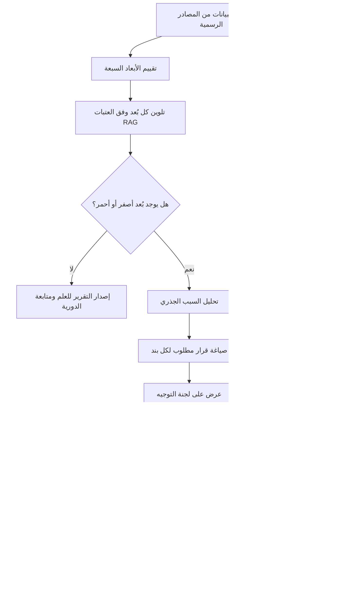

# تقرير صحّة المشروع (Project Health Report)

> [!info] تعريف مختصر
> تقرير صحّة المشروع (Project Health Report) وثيقة إدارية دورية تُجيب عن سؤال واحد حاسم: **"هل المشروع ماشٍ صح؟"** — لا "أين وصلنا؟". يقيس التقرير عافية المشروع عبر مجموعة أبعاد (نطاق، وقت، تكلفة، جودة، بيانات، مخاطر، جاهزية)، ويمنح كل بُعد لونًا (أخضر/أصفر/أحمر) يُقرأ بوصفه **قرارًا مطلوبًا** لا وصفًا للحالة. جمهوره الأساسي هو الإدارة العليا ولجنة التوجيه ([[Steering Committee]])، وغايته تمكينهم من التدخّل قبل وقوع الضرر لا بعده.

## الشرح العلمي والاحترافي
- **الفرق الجوهري عن تقرير الحالة ([[Status Report]])**: تقرير الحالة يصف **الماضي** — ماذا أنجزنا هذا الأسبوع، ما المهام المغلقة، ما المفتوح. جمهوره الفريق وأصحاب المصلحة التشغيليون، ولغته لغة سرد. أما تقرير الصحّة فيصف **الاتجاه والمآل** — إلى أين يتّجه المشروع بناءً على معطياته الحالية، وما الذي يجب أن يتغيّر الآن حتى لا نصل إلى نهاية سيّئة.
- التشبيه الأدق: تقرير الحالة هو **المرآة الخلفية** (Rear-view Mirror) — يريك الطريق الذي قطعته بدقّة، لكنه لا يمنعك من الاصطدام. أما تقرير الصحّة فهو **الزجاج الأمامي** (Windshield) — يريك ما هو قادم: منعطف حاد، طريق مغلق، مطبّ. القيادة بالمرآة الخلفية وحدها ممكنة نظريًا وكارثية عمليًا، وكثير من المشاريع تُدار بهذه الطريقة تحديدًا: تقارير أسبوعية أنيقة عن الماضي، وصدمة مفاجئة عند الاستحقاق.
- **الأبعاد السبعة المقيَّمة بالألوان**: النموذج الاحترافي الشائع يقيّم صحّة المشروع عبر سبعة أبعاد، لكل منها مؤشر لوني ([[RAG Status]]):
  1. **النطاق (Scope)**: هل ما نبنيه ما زال هو ما اتُّفق عليه؟ يُقاس بحجم وتيرة طلبات التغيير ([[Change Request]]) ومدى زحف النطاق (Scope Creep).
  2. **الوقت (Time)**: هل الجدول واقعي بعد؟ يُقاس بانحراف المعالم الرئيسية ومؤشر أداء الجدول ([[CPI and SPI]] — SPI).
  3. **التكلفة (Cost)**: هل الإنفاق يتناسب مع الإنجاز الفعلي؟ يُقاس عبر [[EVM]] ومؤشر أداء التكلفة (CPI).
  4. **الجودة (Quality)**: هل ما نسلّمه يستوفي معيار القبول؟ يُقاس بكثافة العيوب، معدل إعادة الفتح، ودرجة الجودة مقابل الهدف.
  5. **البيانات (Data)**: بُعد يُهمَل كثيرًا وهو قاتل صامت في مشاريع الأنظمة والتحوّل الرقمي — نسبة اكتمال البيانات ونظافتها وجاهزيتها للترحيل.
  6. **المخاطر (Risk)**: هل المخاطر العليا في [[RAID Log]] تحت السيطرة أم أن بعضها تحوّل إلى قضايا فعلية؟
  7. **الجاهزية (Readiness)**: جاهزية المؤسسة نفسها — التدريب، إدارة التغيير، جاهزية المستخدمين لاختبار القبول [[UAT]] وللتشغيل.
- **قراءة اللون كقرار لا كوصف**: الفارق المهني الحقيقي هنا. الأخضر لا يعني "كل شيء جميل" بل يعني **"لا يلزمك قرار في هذا البُعد الآن"**. الأصفر لا يعني "قلقون قليلًا" بل **"يلزم قرار وقائي هذا الأسبوع وإلا صار أحمر"**. الأحمر لا يعني "فشلنا" بل **"يلزم تدخّل تنفيذي فورًا: موارد، أو تخفيض نطاق، أو تمديد جدول"**. حين تُقرأ الألوان بهذا المنطق، يتحوّل الاجتماع من عرض إلى قرار.
- **مبدأ عدم التجميع الأعمى**: من الأخطاء المنهجية إنتاج لون واحد "لصحّة المشروع" بمتوسط الأبعاد. مشروع فيه ستة أبعاد خضراء وبُعد بيانات أحمر ليس مشروعًا "أصفر"، بل مشروع **معرّض للانهيار من نقطة واحدة**. اللون المُجمَّع يُخفي المخاطر بدل كشفها.
- **التقرير أداة حوكمة ([[Governance]]) لا أداة رقابة على الأفراد**: قيمته تسقط تمامًا إذا صار مدير المشروع يخشى وضع لون أحمر لئلا يُلام. الثقافة الصحّية هي التي تُكافئ الإنذار المبكّر.

## أين ومتى يُستخدم
- **في المشاريع متوسطة وكبيرة الحجم** ذات الرعاية التنفيذية، حيث لا يستطيع الراعي ([[Sponsor]]) متابعة التفاصيل اليومية ويحتاج صورة قرارية مكثّفة.
- **قبل اجتماع لجنة التوجيه مباشرة**: التقرير هو المُدخل الرئيسي لجدول أعمال [[Steering Committee]]، ويُرسل قبل الاجتماع بـ 48 ساعة على الأقل حتى يأتي الأعضاء مستعدين للقرار لا للقراءة.
- **عند بوّابات المراحل** ([[Stage Gate]]) وقرارات [[Go or No-Go Decision]]: لا يُتّخذ قرار الانتقال إلى مرحلة جديدة دون قراءة صحّة الأبعاد كلها.
- **في المشاريع متعددة الموردين** حيث يعتمد النجاح على أطراف خارجية ([[Vendor Management]])، ويحتاج التقرير إلى إبراز الاعتماديات المتبادلة.
- **عند تسلّم مشروع متعثّر** (Project Recovery): أول عمل يقوم به مدير المشروع الجديد هو إصدار تقرير صحّة أساس (Baseline Health Report) يوثّق الوضع الحقيقي قبل تدخّله.
- **الدورية المعتادة**: شهريًا في المشاريع المستقرّة، وأسبوعيًا في المراحل الحرجة (ما قبل الإطلاق، الترحيل، UAT)، مع إصدار استثنائي فوري عند تحوّل أي بُعد إلى الأحمر دون انتظار الموعد.

## مثال وسيناريو تطبيقي
> [!example] **مشروع تطبيق نظام ERP في شركة توزيع، الميزانية 2.4 مليون ريال، مدّة 11 شهرًا، وقد بلغ الشهر السابع. لوحة الصحّة الشهرية جاءت كالتالي:**
>
> | البُعد | اللون | القراءة الرقمية |
> |---|---|---|
> | النطاق (Scope) | 🟡 أصفر | 34 طلب تغيير في 3 أشهر مقابل 12 مخطَّطة؛ 9 منها ما زالت دون تقدير |
> | الوقت (Time) | 🟢 أخضر | SPI = 0.97، المعلم القادم في موعده |
> | التكلفة (Cost) | 🟢 أخضر | CPI = 1.02، الإنفاق 61% مقابل إنجاز 63% |
> | الجودة (Quality) | 🟡 أصفر | درجة الجودة 82 مقابل هدف 85 |
> | البيانات (Data) | 🔴 أحمر | اكتمال بيانات الأصناف 65% فقط مقابل هدف 95% قبل الترحيل |
> | المخاطر (Risk) | 🟡 أصفر | خطران عاليان مفتوحان بلا مالك مُعتمد |
> | الجاهزية (Readiness) | 🟢 أخضر | 88% من المستخدمين أنهوا التدريب الأساسي |
>
> **القراءة القرارية**: الوقت والتكلفة أخضران، وهو ما كان سيجعل تقرير حالة تقليدي يبدو مطمئنًا تمامًا. لكن الزجاج الأمامي يقول شيئًا آخر: البيانات عند 65% تعني أن اختبار القبول المقرّر بعد ستة أسابيع سيُجرى على بيانات ناقصة، فيولّد عيوبًا وهمية تستهلك الجدول وتُسقط الجودة أكثر تحت هدف 85. والنطاق الأصفر (34 طلب تغيير) هو **السبب الجذري** لضغط الجودة، لا حدثًا منفصلًا.
>
> **القرار في لجنة التوجيه**: `Conditional Go` — يُسمح بالانتقال إلى مرحلة تجهيز UAT بشرطين مُوثَّقين في [[Decision Log]]: (1) خطة عمل لتنظيف البيانات ترفع الاكتمال إلى 90% خلال 4 أسابيع بتخصيص موظفَين متفرغين من قسم المشتريات؛ (2) تجميد نطاق مؤقّت (Scope Freeze) لطلبات التغيير غير الحرجة حتى ما بعد الإطلاق، مع مراجعة الأثر بعد أسبوعين. لو غاب تقرير الصحّة، لكان المشروع دخل UAT بثقة زائفة مبنيّة على لونين أخضرين.

## خطوات أو مخطّط
1. **تحديد الأبعاد ومعايير الألوان مسبقًا**: يُتّفق في بداية المشروع على العتبات الرقمية لكل لون (مثلًا: SPI أقل من 0.90 = أحمر) حتى لا يصير التلوين اجتهادًا شخصيًا.
2. **جمع البيانات من مصدرها الرسمي**: أداة إدارة العمل، سجل [[RAID Log]]، تقارير [[EVM]]، لوحة العيوب — لا من الانطباعات.
3. **حساب كل بُعد وتلوينه** وفق العتبات المتفق عليها، مع كتابة سطر تفسيري واحد لكل لون غير أخضر.
4. **تحديد السبب الجذري للتحوّل اللوني** لا العرَض فقط (لماذا صارت الجودة صفراء؟ بسبب كثرة التغييرات، لا بسبب ضعف المختبِرين).
5. **اقتراح قرار مطلوب لكل بند أصفر/أحمر**، مع مالك محدد وتاريخ استحقاق — تقرير بلا طلب قرار هو تقرير حالة متنكّر.
6. **إرسال التقرير قبل الاجتماع بـ 48 ساعة** لأعضاء [[Steering Committee]].
7. **إدارة الاجتماع كجلسة قرار**: تُناقش البنود الحمراء والصفراء فقط، وتُوثَّق القرارات في [[Decision Log]].
8. **تتبّع تنفيذ القرارات في التقرير التالي**: يُعرض في صدر التقرير ما تقرّر سابقًا وما نُفِّذ منه فعلًا.

## ⚠️ مفاهيم خاطئة شائعة
> [!warning]
> - **اعتباره نسخة مطوّلة من تقرير الحالة**: الاثنان مختلفان في الجمهور والسؤال والزمن. تقرير الحالة يجيب "أين وصلنا؟" للفريق، وتقرير الصحّة يجيب "هل نحن على المسار الصحيح؟" للإدارة. دمجهما في وثيقة واحدة يُنتج تقريرًا طويلًا لا يقرأه أحد ولا يُنتج قرارًا.
> - **الظن بأن اللون الأخضر هدف بحدّ ذاته**: الأخضر ليس جائزة بل ادّعاء يجب أن يكون قابلًا للإثبات بالأرقام. لوحة كلّها أخضر لأشهر متتالية في مشروع معقّد ليست علامة تفوّق بل علامة على أن التقييم غير أمين أو أن العتبات مُتساهلة.
> - **الاعتقاد بأن الأحمر يعني الفشل**: الأحمر هو **نظام الإنذار يعمل بنجاح**. المشروع الذي يبلّغ عن الأحمر مبكرًا يُنقَذ غالبًا؛ والمشروع الذي يُخفيه ينهار فجأة.
> - **افتراض أن التقرير مهمة إدارية شكلية يمكن أن ينتجها أحد المنسّقين بنسخ ولصق**: التقرير الحقيقي يتطلّب حكمًا مهنيًا في تحديد السبب الجذري وصياغة القرار المطلوب.
> - **الخلط بينه وبين [[Project Dashboard]]**: اللوحة تعرض المؤشرات لحظيًا وباستمرار، والتقرير يقدّم تفسيرًا وحكمًا وقرارًا مطلوبًا في نقطة زمنية محددة. اللوحة مادة خام، والتقرير منتج تحليلي.

## ❌ ممارسات خاطئة في المشاريع
> [!failure]
> - **الإبلاغ الوردي (Watermelon Reporting)**: تقرير أخضر من الخارج أحمر من الداخل، ينتج عن خوف مدير المشروع من ردّ فعل الإدارة. الحل: تثبيت عتبات لونية رقمية موضوعية لا تخضع للتقدير الشخصي، وترسيخ ثقافة تُكافئ الإنذار المبكّر وتُحاسب على الإخفاء لا على اللون الأحمر.
> - **تقرير بلا طلب قرار**: صفحات جميلة من الرسوم والنسب تنتهي دون سؤال واحد موجّه للجنة، فيتحوّل الاجتماع إلى استعراض ينتهي بـ"شكرًا، نراكم الشهر القادم". الحل: إلزام كل بند غير أخضر بصيغة صريحة: "المطلوب من اللجنة: قرار كذا، بحلول تاريخ كذا".
> - **إهمال بُعد البيانات والجاهزية**: التركيز على المثلث التقليدي (نطاق/وقت/تكلفة) وحده، فتُفاجأ المؤسسة عند الإطلاق ببيانات غير صالحة ومستخدمين غير مدرَّبين. الحل: إدراج البيانات والجاهزية كبُعدين إلزاميين لهما مالك ومقياس رقمي منذ التخطيط.
> - **تجميع الأبعاد في لون واحد**: متوسط الألوان يُخفي نقطة الانهيار الوحيدة خلف أغلبية خضراء. الحل: عرض الأبعاد منفصلة دائمًا، واعتماد قاعدة "أسوأ بُعد يحكم مستوى الانتباه".
> - **تغيير العتبات أثناء المشروع لتحسين المظهر**: خفض الهدف من 95% إلى 70% ليتحول الأحمر إلى أخضر هو تزوير إداري. الحل: أي تعديل على العتبات يمرّ عبر لجنة التوجيه ويُوثَّق في [[Decision Log]] مع مبرره.
> - **إصدار التقرير في يوم الاجتماع**: يمنع الأعضاء من التحضير فيتحوّل الوقت إلى قراءة جماعية بدل نقاش. الحل: قاعدة الـ 48 ساعة، وملخّص تنفيذي من صفحة واحدة في صدر التقرير.

## 🔗 مصطلحات ومفاهيم ذات صلة
[[RAG Status]] | [[Steering Committee]] | [[Go or No-Go Decision]] | [[RAID Log]] | [[KPI]] | [[Project Dashboard]] | [[EVM]] | [[CPI and SPI]] | [[Status Report]] | [[Decision Log]] | [[Governance]] | [[Change Request]]
