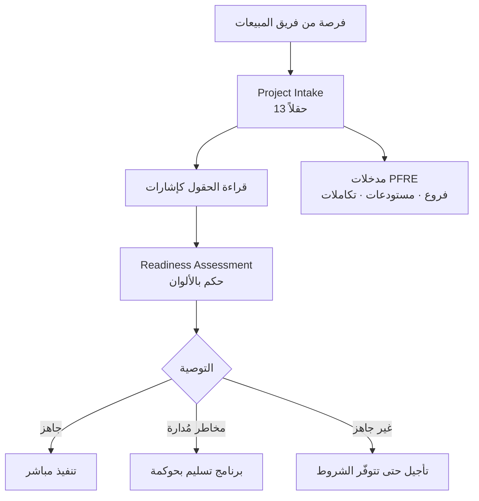

# استقبال المشروع (Project Intake)

> [!info] تعريف مختصر
> **`Project Intake`** هو الرادار الأول للمشروع: نموذج مُهيكَل يُملأ **قبل أي التزام تعاقدي أو جدول زمني**، غرضه تحويل الانطباع الأولي عن المشروع إلى معطيات مكتوبة تكشف حجمه الحقيقي وبيئة تشغيله ومخاطره المبكّرة. وهو لا يجيب على «ماذا سنبني؟» بل على **«ما الذي ندخل فيه؟»** — ومخرجه قرار واحد حاسم: هل نبدأ كتنفيذ مباشر، أم كبرنامج تسليم يحتاج حوكمة من اليوم الأول؟

## الشرح العلمي والاحترافي

- **جذر المشكلة**: أغلب مشاريع الأنظمة المؤسسية تبدأ من **العرض المالي** لا من الفهم. فيوقَّع العقد بناءً على عدد المستخدمين والموديولات، ثم تُكتشف في الأسبوع الخامس أربعة مستودعات وتكامل بنكي وبيانات موزّعة على أحد عشر ملف `Excel`. والقاعدة الحاكمة هنا: **أول خطر ليس التقنية، بل البدء قبل الجاهزية.**

- **الحقول الأساسية ومعناها التشخيصي**: النموذج يبدو إدارياً بسيطاً، لكن كل صفّ فيه إشارة:
  | الحقل | إذا كانت القيمة… | فالإشارة |
  |---|---|---|
  | النظام الحالي | `Excel` أو ورقي | بيانات غير مُهيكَلة ⇒ توقّع `Data Readiness` أحمر |
  | عدد المستودعات | أكثر من واحد | تحويلات وجرد وفروقات ⇒ [[Criticality|حرجية]] مرتفعة |
  | عدد الفروع | أكثر من واحد | صلاحيات وحدود ائتمان وتقارير مجمّعة ⇒ تخصيصات محتملة |
  | التكاملات | بنكية أو أجهزة | اعتمادية على طرف ثالث ⇒ بند `Dependency` في [[RAID Log]] |
  | الراعي | غير تنفيذي | **لا مسار تصعيد — أخطر بند في النموذج** |
  | تاريخ الإطلاق | مفروض خارجياً | انتقل مباشرة إلى منطق «تحكّم في الجاهزية» |

- **الأسئلة السبعة التي لا يكتمل الاستقبال بدونها**: من هو الراعي؟ · من يملك القرار؟ · هل البيانات جاهزة؟ · هل المستخدمون الرئيسيون متاحون؟ · ما النظام الحالي؟ · هل توجد تكاملات؟ · هل تاريخ الإطلاق واقعي؟ — والإجابات الضعيفة عن أكثر من ثلاثة منها إشارة إلى مشروع مهدَّد قبل أن يبدأ.

- **الحقل المفقود من معظم النماذج — `Decision Owner`**: النموذج يسجّل الراعي ومدير المشروع، ولا يسجّل عادةً **كم شخصاً يجب أن يوافق على قرار واحد**. وتعدّد أصحاب القرار هو السبب الجذري الأكثر تكراراً في سجلّات [[Lessons Learned|الدروس المستفادة]]. أضف هذا الحقل واحصره في شخص واحد.

- **الفرق عن `Project Charter`**: الميثاق وثيقة **اعتماد** تُعلن وجود المشروع وتفوّض مديره؛ أمّا `Intake` فأداة **تشخيص** تسبق الاعتماد وقد تنتهي إلى التوصية بعدم البدء. الميثاق يقول «هذا المشروع موجود»، والاستقبال يقول «وهذا ما ندخل فيه فعلاً».

- **الفرق عن [[Readiness Assessment|تقييم الجاهزية]]**: `Intake` يجمع **المعطيات**، و`Readiness` يصدر **الحكم** بالألوان. الأول يقول «أربعة مستودعات وتكامل بنكي ونظام حالي `Excel`»، والثاني يقول «`Data Readiness` = أحمر». والاثنان متتاليان لا بديلان.

## أين ومتى يُستخدم
- في **أول اجتماع مع العميل**، قبل إعداد العرض الفني وقبل أي وعد بتاريخ.
- عند **تحويل فرصة من فريق المبيعات إلى فريق التسليم** — وهو أخطر انتقال في دورة حياة المشروع، إذ تُفقد فيه معظم المعلومات.
- كمدخل إلزامي لـ[[Readiness Assessment]] ثم [[PFRE]]: عدد الفروع والمستودعات والتكاملات هي نفسها مدخلات مضاعِفات التعقيد.
- في **مراجعة محفظة المشاريع** لدى شركات التنفيذ: مقارنة نماذج الاستقبال تكشف أي المشاريع تستحقّ الموارد.
- عند **قرار قبول المشروع أو رفضه** — وهو استخدام يُهمَل: النموذج قد ينتهي إلى «لا نبدأ الآن».

## مثال وسيناريو تطبيقي
> [!example] شركة توزيع — نموذج استقبال من ثلاث عشرة خانة قلب قرار البدء
> | البند | القيمة |
> |---|---|
> | العميل | شركة توزيع مواد استهلاكية |
> | الراعي | `COO` |
> | المستخدمون · الفروع · المستودعات | 85 · 3 · **4** |
> | النظام الحالي | **`Excel` + نظام محاسبي قديم** |
> | التكاملات | **`Barcode` + تكامل بنكي** |
> | تاريخ الإطلاق | مفروض من الإدارة |
> | استراتيجية الإطلاق | مرحلية |
>
> **قراءة الفريق التجاري:** «85 مستخدماً — مشروع متوسط، أربعة أشهر تكفي.»
>
> **قراءة قائد التسليم:** أربعة مستودعات تعني تحويلات وجرداً وفروقات؛ والنظام الحالي `Excel` يعني أن **ترحيل البيانات مشروع داخل المشروع**؛ والتكامل البنكي يعني اعتمادية على طرف ثالث لا نتحكّم في جدوله؛ وثلاثة فروع تعني حدود ائتمان وصلاحيات ⇒ تخصيصات محتملة.
>
> **القرار الناتج:** لا يبدأ المشروع كتنفيذ مباشر، بل كبرنامج تسليم بحوكمة معلنة: `Steering Committee` من الأسبوع الأول، و[[SLA]] للقرارات، وفريق بيانات من طرف العميل يبدأ **قبل** انطلاق التنفيذ.
>
> **الأثر:** الفارق بين القراءتين لم يكن في المعلومات — كلتاهما رأت النموذج نفسه — بل في **قراءة الحقول كإشارات لا كبيانات**. وهذه هي مهارة الاستقبال.

## خطوات أو مخطّط
1. املأ النموذج **مع العميل** لا عنه — الحقل الفارغ معلومة أيضاً.
2. اطلب دليلاً على الحقول الحرجة: عيّنة بيانات، وثيقة عمليات، تفاصيل الأنظمة المرتبطة.
3. اقرأ كل حقل كإشارة خطر لا كبيان إداري.
4. أضف حقل `Decision Owner` واحصره في شخص واحد.
5. أصدر التوصية: تنفيذ مباشر / برنامج تسليم بحوكمة / تأجيل حتى تتوفّر شروط.
6. مرّر المعطيات إلى [[Readiness Assessment]] للحصول على الحكم بالألوان.
7. احتفظ بالنموذج مرجعاً — وقارنه بالواقع عند [[Lessons Learned]].

## ⚠️ مفاهيم خاطئة شائعة
> [!warning]
> - **اعتباره إجراءً إدارياً لملء ملف**: النموذج أداة تشخيص؛ وقراءته هي القيمة لا ملؤه.
> - **الخلط بينه وبين `Project Charter`**: الميثاق اعتماد لاحق، والاستقبال تشخيص سابق قد يمنع الاعتماد.
> - **الظنّ بأنه يخصّ المورّد وحده**: الجهة المشترية تستفيد منه أكثر — فهو يكشف ما لم تكن تعرف أنها ستحتاج تجهيزه.
> - **افتراض أن الحقول الكمّية محايدة**: «4 مستودعات» ليست رقماً بل مصدر تعقيد في المخزون والجرد والترحيل.
> - **الاكتفاء بملئه مرّة**: المعطيات تتغيّر — فرع جديد أو تكامل مضاف يستدعي إعادة قراءة.

## ❌ ممارسات خاطئة في المشاريع
> [!failure]
> - **ملء النموذج من العرض المالي بدل جلسة مع العميل**: يُنتج معطيات تجارية لا تشغيلية. الحلّ: جلسة استقبال مخصّصة يحضرها من يعرف العمليات.
> - **تجاهل الحقول الحمراء بحجّة «سنعالجها لاحقاً»**: كل ما يُؤجَّل هنا يظهر في `Lessons Learned` بعد سنة. الحلّ: كل حقل مقلق يُحوَّل فوراً إلى بند في [[RAID Log]].
> - **عدم تسمية مالك قرار وحيد**: يُنتج تأخيراً مزمناً في القرارات ويرفع [[Reality Factor]]. الحلّ: حقل `Decision Owner` إلزامي بشخص واحد.
> - **عدم تمرير النموذج إلى فريق التنفيذ**: يُفقد نصف السياق عند الانتقال من المبيعات. الحلّ: جلسة تسليم رسمية بين الفريقين مرجعها النموذج.
> - **قبول تاريخ إطلاق دون فحص واقعيته**: يورّط الفريق في وعد لا يملك أدواته. الحلّ: احسب النطاق الزمني الأوّلي من [[PFRE]] قبل تثبيت أي تاريخ.

## 🔗 مصطلحات ومفاهيم ذات صلة
[[Readiness Assessment]] | [[PFRE]] | [[Reality Factor]] | [[RAID Log]] | [[Criticality]] | [[Lessons Learned]] | [[01 - Project Intake]]
