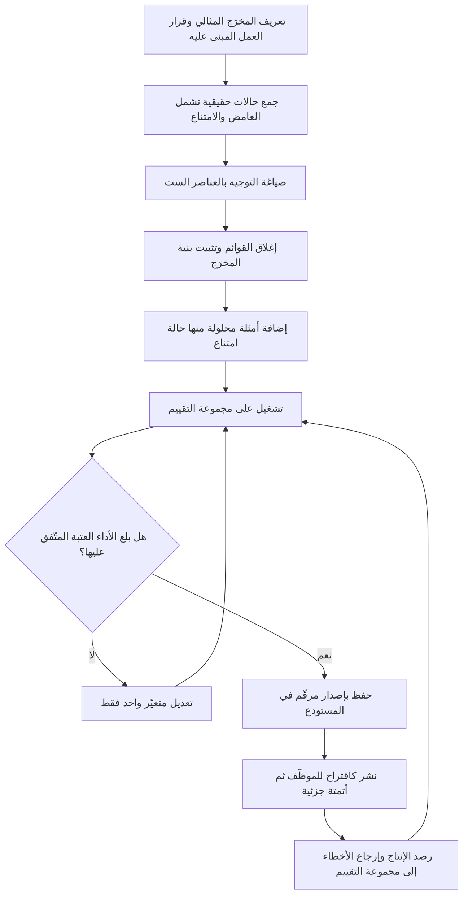

# هندسة التوجيه (Prompt Engineering)

> [!info] تعريف مختصر
> ممارسة تصميم ما يُعطى للنموذج اللغوي — الطلب، والسياق، والقيود، وشكل المخرَج المتوقّع — بحيث يصبح الناتج **مضبوطًا وقابلًا للفحص والتكرار**، لا مجرّد إجابة مقبولة في محاولة واحدة. جوهرها ليس العثور على «الكلمة السحرية»، بل تحويل نيّة عمل غامضة إلى مواصفة مكتوبة: من الجمهور، وما الغرض، وما المصادر المسموح بها، وما الذي يجب ألّا يُذكر، وبأي بنية يُسلَّم الناتج، وماذا يفعل النظام حين لا يعرف. بهذا المعنى فهي أقرب إلى **كتابة متطلّبات** منها إلى البرمجة — ولهذا هي مسؤولية مدير المنتج ومحلّل الأعمال بقدر ما هي مسؤولية المهندس، بل أكثر.

## الشرح العلمي والاحترافي
- **التوجيه مواصفة لا أمنية**: النموذج لا يقرأ ما في ذهنك عن «الاحترافية» أو «الاختصار» أو «نبرة العلامة». كل ما هو ضمني في ذهن فريقك يجب أن يصير صريحًا في النص، وإلا ملأه النموذج بالمتوسّط الإحصائي لما رآه في التدريب — أي بنبرة عامة لا تخصّك. الفارق بين مخرَج ركيك ومخرَج ممتاز يكون في أغلب الحالات فارقًا في **وضوح المواصفة**، لا في قوة النموذج.
- **العناصر الست لأي توجيه محترف**: (١) **الدور والسياق** — لمن يكتب النموذج ولحساب من؛ (٢) **المهمّة** بفعل واحد واضح لا بسلسلة نوايا؛ (٣) **المُدخلات والمصادر** المسموح الاعتماد عليها وحدها؛ (٤) **القيود** — الطول، ما يُمنع، ما لا يُخمَّن؛ (٥) **بنية المخرَج** — حقول محدّدة أو جدول أو صيغة بيانات تُقرأ آليًّا؛ (٦) **سلوك الفشل** — ماذا يفعل حين ينقص الدليل. العنصر السادس هو الأكثر إهمالًا والأعلى أثرًا في أنظمة الإنتاج.
- **الأمثلة تفوق الأوصاف**: وصف الأسلوب المطلوب بكلمات يترك مساحة تأويل واسعة؛ أما إعطاء مثال أو مثالين على مُدخل ومخرَجه المثالي فيضيّق المساحة بشكل حاسم. ومن الأنفع كثيرًا أن يكون أحد الأمثلة **حالة حدّية** أو حالة يجب أن تنتهي بامتناع، لا حالات ناجحة فقط.
- **تقييد شكل المخرَج يقيّد المحتوى**: حين يُطلب المخرَج في بنية محدّدة (حقول مسمّاة، جدول ثابت الأعمدة، صيغة بيانات) ينخفض الاستطراد ويصير الفحص الآلي ممكنًا: هل الحقل موجود؟ هل القيمة ضمن القائمة المسموحة؟ هل الاستشهاد مطابق للمصدر؟ البنية ليست ترفًا تنسيقيًّا بل **آلية تحقّق**.
- **طلب خطوات التفكير يحسّن المهام الاستدلالية ولا يجعلها صادقة**: مطالبة النموذج بتفصيل خطواته قبل النتيجة ترفع الدقّة في المسائل متعدّدة الخطوات بشكل ملموس. لكن الخطوات المعروضة ليست بالضرورة تسجيلًا أمينًا لما جرى داخليًّا؛ فقد تكون تبريرًا لاحقًا مقنعًا لنتيجة خاطئة. الخطوات أداة تحسين ومساعدة على المراجعة، لا برهان صحّة.
- **تفكيك المهمّة أقوى من إطالة التوجيه**: التوجيه الواحد الذي يطلب استخراجًا وتحليلًا وصياغةً وحكمًا نهائيًّا معًا يُنتج جودة متوسّطة في كل شيء. تقسيمه إلى مراحل — استخراج، ثم تحقّق، ثم صياغة — يرفع الجودة ويجعل كل مرحلة قابلة للقياس والإصلاح على حدة، تمامًا كتقطيع العمل إلى وحدات صغيرة ([[Task and Story Slicing]]).
- **التوجيه أصل من أصول المنتج لا رسالة عابرة**: التوجيه الذي يعمل في الإنتاج يجب أن يُخزَّن في مستودع، ويُراجَع كما تُراجَع الشيفرة، ويُوسَم بإصدار، ويُربط بنتيجة تقييمه ([[Docs as Code]]). تعديل كلمة فيه قد يغيّر سلوك النظام لآلاف المستخدمين، فمعاملته كقصاصة في ملف جانبي دَينٌ تقني مؤجّل ([[Technical Debt]]).
- **هشاشة التوجيه عبر الإصدارات**: توجيه مضبوط بدقّة لنموذج معيّن قد يتصرّف تصرّفًا مختلفًا مع إصدار أحدث من النموذج نفسه. لذلك ترقية النموذج تستوجب إعادة تشغيل التقييم لا افتراض التحسّن ([[Regression Testing]]).
- **الحدّ الذي لا يتجاوزه التوجيه**: التوجيه طبقة **إقناع** لا طبقة **إلزام**. ما يجب ألّا يحدث أبدًا — كشف بيانات، أو تجاوز صلاحية، أو الإفتاء في مسألة تنظيمية — يُمنع بضابط تقني خارج النموذج ([[Guard Rails]])، لأن أي نص داخل الطلب يبقى قابلًا للإزاحة بمُدخل خبيث أو بسياق طويل.

## أين ومتى يُستخدم
- **عند تحويل متطلّب عمل إلى ميزة ذكية**: التوجيه هو الترجمة العملية لبنود وثيقة المتطلّبات ([[PRD]]) إلى سلوك فعلي، وكل غموض في الوثيقة يظهر مباشرة في المخرَج.
- **في تعريف معايير القبول**: صياغة الشرط بأسلوب «إذا كان… وعندما… فإن…» ([[Given When Then]]) تُحوّل التوجيه إلى بنود قابلة للاختبار بدل «أن يكون الرد جيّدًا».
- **في بناء مجموعات التقييم ([[Evals]])**: كل تعديل في التوجيه يُقاس أثره على مجموعة الحالات المحفوظة، لا على انطباع من كتبه.
- **في توحيد نبرة العلامة والمحتوى**: تضمين قواعد النبرة والممنوعات اللغوية والمصطلحات المعتمدة ([[Brand Guidelines]]) داخل التوجيه بدل ترك كل فريق يصوغ على ذوقه.
- **في تقليل الهلوسة ([[Hallucination]])**: بإلزام النموذج بالاعتماد على مصدر محدّد، والاستشهاد الحرفي، والامتناع عند غياب الدليل.
- **في تصميم سلوك الفشل**: تحديد ما يقوله النظام وما يفعله حين يتعذّر الجواب، وهو مدخل مباشر إلى [[Graceful Degradation]].
- **في تشغيل العمليات المتكرّرة**: توليد ملخّصات اجتماعات، وتصنيف تذاكر الدعم، ومسوّدات تقارير الحالة ([[Project Health Report]]) — حيث يكون التوجيه المستقر بديلًا عن إجراء يدوي متفاوت الجودة ([[SOP]]).

## مثال وسيناريو تطبيقي
> [!example] جهة حكومية خليجية تستقبل نحو 900 شكوى إلكترونية أسبوعيًّا. كان موظّفان يقرآن كل شكوى ويصنّفانها يدويًّا إلى واحدة من 14 فئة ويحدّدان درجة الاستعجال، بمتوسّط 3.5 دقيقة للشكوى. أراد مدير المنتج أتمتة التصنيف.
> **المحاولة الأولى** كانت توجيهًا من سطر واحد: «صنّف الشكوى التالية وحدّد أولويتها». النتيجة على عيّنة 100 شكوى: تطابق مع تصنيف الموظّفين في 61 حالة فقط، وأسماء فئات مبتكرة من خارج القائمة الرسمية في 12 حالة، وأولويات بصيغ متباينة («عالية»، «مستعجل»، «Priority 1»).
> **إعادة الصياغة** جرت بيد مدير المنتج لا المهندس، وتضمّنت: تحديد الدور («أنت محلّل خدمات في جهة حكومية…»)؛ إلصاق القائمة الرسمية بالفئات الأربع عشرة **مع تعريف سطرين لكل فئة وحدود ما لا يدخل فيها**؛ إلزام المخرَج ببنية ثابتة من خمسة حقول (الفئة، درجة الثقة، الاستعجال من قائمة مغلقة من ثلاث قيم، الجملة الحرفية المقتبسة من الشكوى التي بُني عليها التصنيف، والقرار)؛ ثم القاعدة الحاسمة: **إن لم تنطبق الشكوى بوضوح على فئة واحدة، أو وردت فيها إشارة إلى إصابة أو نزاع قضائي أو بيانات شخصية حسّاسة، فالقرار «إحالة إلى موظّف» دون محاولة تصنيف**؛ وأخيرًا أربعة أمثلة محلولة، منها مثالان لحالات غامضة انتهيا بإحالة.
> بُنيت مجموعة تقييم من 250 شكوى تاريخية مصنّفة سلفًا، فيها 40 حالة يجب أن تنتهي بإحالة. نتيجة النسخة الثانية: تطابق 88% على الحالات القابلة للتصنيف، صفر فئة مخترَعة (لأن القائمة مغلقة ويُرفض أي مخرَج خارجها آليًّا)، وإمساك 34 من 40 حالة إحالة. أُعيد صياغة تعريف فئتين متداخلتين كان النموذج يخلط بينهما — وتبيّن عند المراجعة أن **الموظّفين البشريين أنفسهم كانوا يختلفان في تصنيفهما**، فكان التوجيه سببًا في اكتشاف غموض في الإجراء نفسه لا في النموذج فقط.
> النشر تمّ على مرحلتين: شهر بوضع «اقتراح» يظهر للموظّف مع إمكانية التعديل بضغطة، ثم أتمتة كاملة للفئات التي تجاوز تطابقها 90% فقط، مع بقاء البقيّة اقتراحًا. متوسّط زمن المعالجة انخفض داخليًّا من 3.5 دقيقة إلى نحو 50 ثانية للشكوى المصنّفة آليًّا.

## خطوات أو مخطّط
1. اكتب أولًا — بلا ذكر للنموذج — ما هو المخرَج المثالي: لمن، وبأي طول، وبأي بنية، وما القرار الذي سيُبنى عليه.
2. اجمع 20–30 حالة حقيقية من الإنتاج، وضمّنها حالات غامضة وحالات يجب أن تنتهي بامتناع، ولا تكتفِ بالحالات النموذجية.
3. صُغ النسخة الأولى بالعناصر الست: دور، مهمّة، مصادر، قيود، بنية مخرَج، سلوك عند الفشل.
4. أغلِق القوائم: أي حقل تصنيفي يجب أن تكون قيمه محصورة في قائمة معتمدة يُرفض ما خرج عنها آليًّا.
5. أضف مثالين إلى أربعة أمثلة محلولة، على أن يكون أحدها حالة امتناع.
6. شغّل النسخة على الحالات المجمّعة، وسجّل النتائج في جدول قابل للمقارنة لا في انطباع.
7. عدّل **متغيّرًا واحدًا في كل دورة** وأعد القياس، وإلا فلن تعرف أي تعديل أحدث الأثر.
8. خزّن التوجيه في المستودع بإصدار مرقّم مرتبط بنتيجة تقييمه ومالك محدّد.
9. انشر تدريجيًّا: اقتراح للموظّف أولًا، ثم أتمتة للفئات التي تجاوزت العتبة فقط ([[Pilot Launch]]).
10. أعِد تشغيل التقييم كاملًا عند أي ترقية للنموذج أو تعديل للتوجيه، واعتبره بوّابة إصدار لا تقريرًا اختياريًّا.

## ⚠️ مفاهيم خاطئة شائعة
> [!warning]
> - **«هندسة التوجيه مهارة تقنية تخصّ المبرمجين»**: أصعب جزء فيها هو تحديد ما هو المخرَج الصحيح ومتى يجب الامتناع ولمن يُكتب — وهذه أسئلة منتج وعمل. المهندس ينفّذ التوصيل والقياس؛ أما المواصفة فمن يملك المشكلة أولى بها.
> - **«الأمر مجرّد إيجاد صياغة ذكية»**: الصياغة الموفّقة قد تنجح مرة وتفشل في الحالة الحادية عشرة. القيمة الحقيقية في **الاستقرار عبر الحالات**، وهذا لا يُعرف إلا بالقياس المتكرّر على مجموعة محفوظة.
> - **«التوجيه الأطول أدقّ»**: بعد حدّ معيّن تبدأ التعليمات المتراكمة في التعارض، ويقلّ التزام النموذج ببعضها. الأنفع تفكيك المهمّة إلى مراحل أصغر، لا حشو تعليمات متزايدة في نصّ واحد.
> - **«يكفي أن أقول للنموذج ألّا يخترع»**: هذا يخفّض المعدّل ولا يمنعه. المنع الحقيقي يكون بحصر المصادر، وإلزام الاستشهاد الحرفي، ورفض المخرَج آليًّا حين لا يطابق المصدر.
> - **«التوجيه الذي عمل الشهر الماضي سيعمل اليوم»**: تغيّر إصدار النموذج، أو طول السياق، أو طبيعة المُدخلات الواردة من المستخدمين، كلّها تُغيّر السلوك. التوجيه أصل حيّ يحتاج صيانة ورصدًا.
> - **«التوجيه يُغني عن ضوابط الأمان»**: ما دام التوجيه نصًّا يجاور نص المستخدم، فهو عرضة للإزاحة والتلاعب. القيود الحرجة تُفرَض بالصلاحيات والفلاتر والتحقّق البرمجي، لا بالرجاء اللغوي.
> - **«ارتفاع درجة الثقة التي يعلنها النموذج يعني دقّة أعلى»**: الرقم الذي يكتبه النموذج عن ثقته هو نصّ مولَّد كبقيّة النص، وقد يكون مرتفعًا في إجابة خاطئة تمامًا. لا يُعتمد عليه إلا بعد معايرته مقابل نتائج فعلية.

## ❌ ممارسات خاطئة في المشاريع
> [!failure]
> - **تعديل التوجيه مباشرة في الإنتاج**: الخطأ أن يفتح أحدهم لوحة الإدارة ويغيّر جملة لأن مخرَجًا واحدًا لم يعجبه. لماذا يضرّ: تحسينٌ لحالة واحدة قد يكسر عشرات الحالات دون أن يلاحظ أحد، ولا سجلّ لمن غيّر ولا لماذا. الحل: التوجيه في مستودع بمراجعة أقران وإصدار مرقّم وبوّابة تقييم قبل النشر ([[Docs as Code]]).
> - **تعدّد نسخ التوجيه بين الفرق**: الخطأ أن يحتفظ كل فريق بنسخته «المحسّنة» في ملف خاص. لماذا يضرّ: تتباعد النبرة والسلوك، ويستحيل تتبّع سبب اختلاف تجربة العملاء. الحل: مصدر واحد للحقيقة للتوجيهات المشتركة ([[Single Source of Truth]]) مع طبقة تخصيص محدودة ومعلنة.
> - **الحكم على تعديل التوجيه بمثال واحد**: الخطأ «جرّبتها فصارت أفضل». لماذا يضرّ: التحسّن المرصود قد يكون تذبذبًا عشوائيًّا لا أثرًا حقيقيًّا، وقد يخفي تراجعًا في فئة أخرى. الحل: قِس على مجموعة ثابتة قبل/بعد وسجّل الفارق رقميًّا ([[Evals]]).
> - **إغفال سلوك الفشل**: الخطأ صياغة توجيه يحسن الحالات الناجحة فقط. لماذا يضرّ: عند نقص المعلومة سيملأ النموذج الفراغ باختلاق واثق بدل الامتناع. الحل: اجعل شرط الامتناع بندًا صريحًا في التوجيه وفي معايير القبول، واختبره بحالات مخصّصة.
> - **حشو معلومات الشركة كلها في التوجيه**: الخطأ اعتبار التوجيه مستودعًا للمعرفة. لماذا يضرّ: يرفع الكلفة وزمن الاستجابة، ويشتّت التزام النموذج بالتعليمات، ويصير تحديث سياسة واحدة تعديلًا في نصّ ضخم هشّ. الحل: افصل المعرفة (تُسترجَع عند الحاجة) عن التعليمات (تبقى قصيرة وثابتة).
> - **قياس نجاح التوجيه بمؤشّرات نشاط**: الخطأ الاحتفاء بعدد المخرجات المولَّدة أو نسبة التغطية. لماذا يضرّ: يدفع نحو الإجابة دائمًا ويخفي كلفة الأخطاء، وهو قياس للمُخرَج لا للأثر ([[Outcome vs Output]]). الحل: اربط القياس بالنتيجة العملية — دقّة التصنيف، انخفاض إعادة العمل ([[Rework Percentage]])، رضا المستخدم النهائي.
> - **الاعتماد على شخص واحد يعرف «كيف يُكلَّم النموذج»**: الخطأ تركيز المعرفة في فرد. لماذا يضرّ: خطر نقطة فشل واحدة، وتوقّف التحسين عند إجازته أو مغادرته. الحل: وثّق مبرّرات كل قيد في التوجيه، وأدرج مراجعته ضمن أصول العملية التنظيمية ([[Organizational Process Assets]]).

## 🔗 مصطلحات ومفاهيم ذات صلة
[[Hallucination]] | [[Evals]] | [[Graceful Degradation]] | [[Vibe Coding]] | [[PRD]] | [[Given When Then]] | [[Guard Rails]] | [[Docs as Code]] | [[Single Source of Truth]] | [[Technical Debt]]
