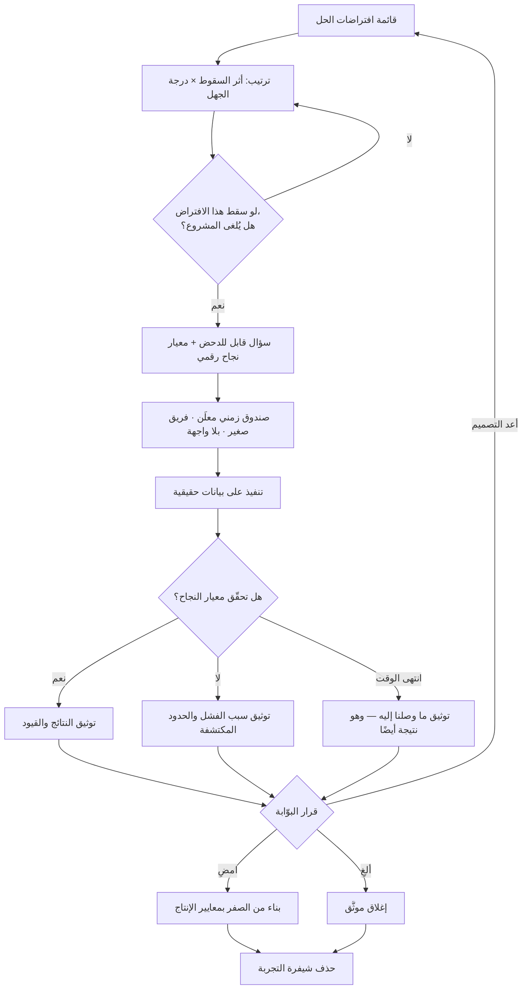

# إثبات المفهوم (Proof of Concept)

> [!info] تعريف مختصر
> تجربة تقنية **ضيّقة ومحدودة زمنيًّا** تُصمَّم لمهاجمة **أصعب افتراض** في الحل المقترح — الافتراض الذي إن سقط سقط المشروع كلّه — والإجابة عن سؤال واحد: هل هذا ممكن أصلًا، وبأي كلفة وقيود؟ مخرَجه ليس شيفرة صالحة للاستعمال، بل **معرفة موثّقة**: نتيجة قابلة للتكرار، وقياسات، وحدود مكتشَفة، وتوصية. وشرط صحّته أن يُرمى بعد توثيقه؛ فهو مبنيّ عمدًا بلا واجهة ولا أمان ولا معالجة أخطاء ولا قابلية توسّع، لأن كل جهد يُبذل في تلك الجوانب يشتّت التجربة عن سؤالها ويغري بترقيتها إلى إنتاج.

## الشرح العلمي والاحترافي

- **الأصل والمنشأ**: المصطلح قديم في الهندسة والبحث والتطوير والتصنيع الدفاعي، حيث كان يُطلق على تجربة مخبرية تُثبت أن مبدأً فيزيائيًّا أو تقنيًّا يمكن تحقيقه عمليًّا قبل تمويل التطوير الكامل. وقد ورث تخصّص إدارة المشاريع البرمجية هذا المعنى بحرفيّته: **فصل سؤال الإمكان عن سؤال المنتج**. وفي أدبيات البوّابات المرحلية (Stage-Gate) يُعدّ إثبات المفهوم بوّابة تقنية سابقة على أي التزام بالنطاق أو الجدول — أي مدخلًا مباشرًا لقرار [[Go or No-Go Decision]].

- **قاعدة «أخطر افتراض أولًا» (Riskiest Assumption First)**: القيمة كلّها في **اختيار** ما يُختبر، لا في تنفيذه. أي حل يقوم على عشرات الافتراضات، لكن واحدًا أو اثنين منها فقط هي التي **إن سقطت سقط كل شيء**. إثبات المفهوم يُنفق عليه بالكامل على ذلك الافتراض وحده. والاختبار العملي للاختيار الصحيح سؤال واحد: «لو فشل هذا، هل يُلغى المشروع؟» فإن كان الجواب لا، فأنت لا تختبر أخطر افتراض، بل تختبر شيئًا مريحًا.

- **ما يجيب عنه فعلًا**: أسئلة الإمكان والحدود، لا أسئلة الرغبة. أمثلة على أسئلة مشروعة: هل يمكن ربط هذا النظام القديم بواجهة برمجية دون تعديل قاعدته؟ هل يحتمل هذا المحرّك مليون سجلّ بزمن استجابة أقل من ثانيتين؟ هل تكفي دقّة هذا النموذج في التعرّف على النصوص العربية المكتوبة بخط اليد؟ ما السقف الفعلي لحدود الاستدعاء لدى هذا المزوّد؟ هل تسمح البنية القائمة بالتشفير المطلوب دون كسر التوافق؟

- **ما لا يجيب عنه إطلاقًا**: هل يريد الناس هذا؟ هل يدفعون؟ هل يفهمون الواجهة؟ هل يبقون؟ نجاح إثبات المفهوم يقول «يمكن بناؤه» — ولا يقول «يجب بناؤه». والخلط بين الجملتين هو الطريق الأقصر إلى [[Feature Factory]]: بناء متقن لشيء لا يحتاجه أحد.

- **التمييز عن `Prototype`**: يشتركان في أن كليهما يُرمى، ويفترقان في كل ما عداه. النموذج الأولي **مزيّف من الخلف حقيقي من الأمام**: واجهة مقنعة فوق بيانات وهمية، وجمهوره مستخدمون، وسؤاله سلوكي، ومقياسه إتمام المهمّة. وإثبات المفهوم **حقيقي من الخلف مزيّف من الأمام**: منطق يعمل فعلًا بلا واجهة تقريبًا، وجمهوره مهندسون ومعماريون، وسؤاله تقني، ومقياسه أرقام أداء ودقّة وتوافق. راجع [[Prototype]] لتفصيل سُلّم المخرَجات الأربعة (`Mockup` ← `Prototype` ← `Proof of Concept` ← [[MVP]]).

- **التمييز عن [[Pilot Launch]]**: الفرق أعمق من فرق الحجم. إثبات المفهوم يُجرى **قبل** قرار البناء، في بيئة معملية، بلا مستخدمين حقيقيين، وبلا بيانات حقيقية، ولا يُقاس إلا تقنيًّا، ومصيره الحذف. أما الإطلاق التجريبي فيُجرى **بعد** بناء منتج حقيقي، على مستخدمين حقيقيين وبيانات حقيقية في نطاق محدود، ويقيس التبنّي والتشغيل والدعم، ومصيره التوسّع لا الحذف. اختصارًا: إثبات المفهوم يسأل **«هل يمكن؟»**، والنموذج الأولي يسأل **«هل يُفهم ويُستعمل؟»**، والإطلاق التجريبي يسأل **«هل ينجح فعلًا في الواقع؟»**.

- **الصندوق الزمني شرط لا رفاهية**: إثبات المفهوم بلا [[Timeboxing]] يتحوّل إلى مشروع موازٍ بلا نهاية. الممارسة السليمة: مدّة مُعلنة (أسبوع إلى ثلاثة عادةً)، وفريق صغير (١–٣)، ومعيار نجاح رقمي مكتوب مسبقًا، وقرار مُلزم عند انقضاء المدّة — بما في ذلك خيار «انتهت المدّة ولم نصل، وهذه بحدّ ذاتها نتيجة».

- **الفشل مخرَج مشروع بل مربح**: إثبات مفهوم ينتهي بـ«لا يمكن ضمن قيودنا» يكون قد وفّر أضعاف كلفته. ولذلك فإن أخطر عطب ثقافي هو ربط تقييم المهندس بنجاح التجربة، لأنه يحوّل التجربة إلى مهمّة إثبات صحّة — وهو ما يفسده تمامًا. المطلوب توثيق **ما لم ينجح ولماذا** بالدقّة نفسها المعطاة لما نجح؛ فتلك المعرفة هي المخرَج.

- **علاقته بكلفة التجربة والمخاطر**: هو أحد أكفأ أدوات خفض [[Cost of Experimentation]] على الجانب التقني، وأحد أوضح مدخلات [[Risk Register]]: كل مخاطرة تقنية عالية الأثر ومجهولة الاحتمال مرشّحة لإثبات مفهوم يحوّلها من مجهول إلى معلوم مُقدَّر.

## أين ومتى يُستخدم

- **قبل اختيار مزوّد أو تقنية أساسية**: لاختبار الادّعاءات التسويقية على بياناتك الحقيقية وقيودك أنت، ولكشف قيود قد تُنتج [[Vendor Lock-in]] لاحقًا.
- **عند التكامل مع أنظمة قديمة (Legacy)**: أكثر مواضع الاستعمال إلحاحًا، لأن وثائق الأنظمة القديمة تكون قديمة أو مفقودة، والحقيقة لا تُعرف إلا بالتجربة المباشرة.
- **عند الالتزام بمتطلّبات أداء أو استجابة**: قبل كتابة [[SLO]] أو التعهّد بأرقام في [[SOW]]، يُختبر السقف الفعلي مخبريًّا بدل التعهّد بأرقام تفاؤلية.
- **في مسائل الامتثال والخصوصية**: مثل التحقّق من إمكانية إخفاء هوية البيانات أو حفظها داخل النطاق الجغرافي المطلوب بما ينسجم مع [[PDPL]] و[[Controller vs Processor]].
- **في تقليل عدم اليقين قبل التقدير**: إثبات مفهوم قصير يخفض [[Estimation Variance]] في البنود المجهولة أكثر من أي جلسة [[Planning Poker]] إضافية.
- **في حسم قرارات معمارية كبرى**: حين يتنازع خياران معماريان ولا يحسمهما نقاش، تُبنى تجربتان ضيّقتان متوازيتان وتُقارَن نتائجهما رقميًّا، ويُسجَّل القرار وسببه في [[Decision Log]].
- **في تقييم عرض مورّد**: كثير من عقود التوريد الناضجة تشترط إثبات مفهوم على بيانات العميل كبوّابة سابقة للتعاقد، ضمن ممارسات [[Vendor Management]].

## مثال وسيناريو تطبيقي

> [!example] جهة حكومية في دولة خليجية تريد أتمتة استقبال المعاملات الورقية: مسح ضوئي لنماذج مطبوعة تحوي حقولًا معبّأة **بخط اليد بالعربية**، واستخراجها آليًّا إلى نظامها. التقدير الأولي للمشروع الكامل: ٧ أشهر وميزانية كبيرة، والوعد المُقدَّم من مورّد: «دقّة تتجاوز ٩٥٪».
> الافتراض الأخطر كان واضحًا ومعزولًا: **دقّة الاستخراج على خط اليد العربي في نماذج ممسوحة بجودة مكاتبهم الفعلية**. إن سقط هذا، سقط المشروع بأكمله — لأن دقّة منخفضة تعني مراجعة بشرية لكل معاملة، وهو ما يُلغي مبرّر الأتمتة أصلًا.
> صمّم الفريق إثبات مفهوم بصندوق زمني **أسبوعين** ومهندسَين اثنين، ومعيار نجاح مكتوب قبل البدء: **«دقّة استخراج لا تقلّ عن ٩٠٪ على مستوى الحقل، في ٦ حقول حرجة، على عيّنة ٤٠٠ نموذج ممسوح من الأرشيف الحقيقي — لا من عيّنات المورّد»**. لا واجهة، لا قاعدة بيانات، لا مستخدمين: مجلّد صور، ونصوص برمجية، وجدول نتائج.
> النتيجة بعد ١١ يومًا: الدقّة الإجمالية ٧٣٪. لكن التفصيل كان أثمن من الرقم الإجمالي — الحقول الرقمية (التواريخ، أرقام الهوية، المبالغ) تجاوزت ٩٤٪، بينما حقول الأسماء والعناوين المكتوبة بخط حرّ لم تتجاوز ٥١٪. وتبيّن أيضًا أن ٢٢٪ من انخفاض الدقّة سببه جودة المسح نفسها (٢٠٠ نقطة/بوصة وميلان في التغذية) لا النموذج التقني.
> القرار الذي اتُّخذ لم يكن «نمضي» ولا «نلغي»، بل **إعادة تصميم الحل بناءً على معرفة لم تكن موجودة قبل أسبوعين**: أتمتة كاملة للحقول الرقمية، وتحويل الحقول الحرّة إلى قوائم اختيار في النموذج المطبوع نفسه، وترقية أجهزة المسح، وتصميم مسار مراجعة بشرية للحقول منخفضة الثقة. كما أُعيد التفاوض مع المورّد على أساس أرقام مقاسة لا وعود.
> الكلفة: ٢٢ يوم-عمل. المتجنَّب: التزام تعاقدي مبنيّ على وعد ٩٥٪ لم يكن ليتحقّق، وسبعة أشهر تنتهي بنظام يُنتج عملًا يدويًّا أكثر ممّا يوفّر. ثم حُذفت شيفرة التجربة، وبقيت وثيقة من ست صفحات فيها جدول النتائج ومنهج القياس والقيود المكتشفة — وهي المخرَج الحقيقي الوحيد.

## خطوات أو مخطّط

1. **اكتب قائمة الافتراضات** التي يقوم عليها الحل، ثم رتّبها بمحورين: أثر السقوط × درجة الجهل.
2. **اختر افتراضًا واحدًا** — الأعلى في المحورين — وتحقّق منه بسؤال: «لو سقط هذا، هل يُلغى المشروع؟».
3. **صُغ سؤالًا قابلًا للدحض ومعيار نجاح رقميًّا** قبل كتابة أي سطر: العتبة، وحجم العيّنة، وبيئة القياس، وطريقة الحساب.
4. **حدّد الصندوق الزمني والفريق والميزانية** وأعلنها، مع الاتفاق المسبق على أن انقضاء المدّة يُنهي التجربة.
5. **جرّد التجربة من كل ما لا يخدم السؤال**: لا واجهة، لا مصادقة، لا تحسين، لا معالجة أخطاء، لا اختبارات آلية.
6. **استخدم بيانات حقيقية أو أقرب ما يكون إليها** — التجربة على بيانات مثالية تُنتج ثقة زائفة هي أسوأ من الجهل.
7. **قِس ووثّق**: النتائج، والمنهج، والقيود، وما لم ينجح، وما لم يُختبر أصلًا (وهذا الأخير يُنسى غالبًا وهو الأخطر).
8. **احسم**: امضِ / أعد التصميم / ألغِ / مدّد بصندوق زمني جديد وسبب مكتوب.
9. **احذف الشيفرة**، وانقل النتيجة إلى [[Decision Log]] و[[Risk Register]] و[[PRD]]، ثم ابنِ الحل من الصفر بمعايير الإنتاج.

## ⚠️ مفاهيم خاطئة شائعة

> [!warning]
> - **الخلط بينه وبين [[Prototype]]**: النموذج الأولي واجهة حقيقية فوق منطق وهمي وجمهوره المستخدمون وسؤاله سلوكي؛ وإثبات المفهوم منطق حقيقي بلا واجهة وجمهوره المهندسون وسؤاله تقني. من يطلب «إثبات مفهوم» وهو يريد قياس تقبّل المستخدم يشتري إجابة عن سؤال لم يسأله.
> - **الخلط بينه وبين [[MVP]]**: إثبات المفهوم لا يُسلَّم لأحد ولا يُنتج قيمة ولا يُقاس بالتبنّي؛ والـMVP منتج حقيقي يُسلَّم ويُقاس بسلوك مستخدمين حقيقيين ويُبنى عليه.
> - **الخلط بينه وبين [[Pilot Launch]]**: الإطلاق التجريبي يأتي **بعد** بناء منتج حقيقي ويجري على مستخدمين وبيانات حقيقية في نطاق محدود؛ وإثبات المفهوم يأتي **قبل** قرار البناء وفي بيئة معملية بلا مستخدمين.
> - **«نجاحه يعني أن الفكرة صحيحة»**: لا. يعني أن الفكرة **ممكنة** فقط. أما صوابها فيقاس بأدوات القيمة: [[Jobs to be Done]] و[[Customer and Market Validation]] و[[Product-Market Fit]].
> - **«فشله يعني ضياع المال»**: بل هو أرخص عائد ممكن. الفشل المبكّر بكلفة أسبوعين يُجنّب فشلًا متأخّرًا بكلفة أشهر، وهو منطق [[Cost-of-Change Curve]] نفسه.
> - **«ما دام يعمل مخبريًّا فهو جاهز تقريبًا»**: التجربة تُثبت الإمكان في **ظرف محكوم واحد**. الفارق إلى الإنتاج (تزامن، وأخطاء، وأمان، ومراقبة، وصلاحيات، وتعافٍ) يُقاس عادةً بمضاعفات لا بنِسَب.
> - **«يمكن أن يبقى ليصبح أساس النظام»**: إثبات المفهوم مبنيّ بافتراض معلن أنه سيُرمى، ولذلك أُسقطت منه عمدًا كل خصائص الإنتاج. الاحتفاظ به هو الاحتفاظ بغيابها.
> - **«كل مشروع يحتاج إثبات مفهوم»**: لا. حين لا يوجد افتراض تقني مجهول حقًّا، يكون إثبات المفهوم تسويفًا مقنّعًا يستهلك السعة ويؤخّر [[Time to Value]].

## ❌ ممارسات خاطئة في المشاريع

> [!failure]
> - **اختبار الافتراض السهل بدل الأخطر**: الخطأ: تُختبر الأجزاء المألوفة لأنها مريحة وسريعة الإنجاز. لماذا يضرّ: تُنتج ثقة زائفة وتُبقي المخاطرة الحقيقية كامنة حتى منتصف التنفيذ حيث تصبح مكلفة. الحل: اشترط في اعتماد أي تجربة الإجابة كتابةً عن «لو فشلت، هل يُلغى المشروع؟»، ولا تعتمد تجربة إجابتها «لا».
> - **إجراء التجربة على بيانات نظيفة مُنتقاة**: الخطأ: عيّنة مثالية أو عيّنة يقدّمها المورّد. لماذا يضرّ: يقيس أفضل حالة ممكنة لا الحالة الواقعية، فتنهار النتائج عند أول اصطدام بالبيانات الفعلية. الحل: اشترط عيّنة عشوائية من الأرشيف الحقيقي، وضمّن فيها الحالات القبيحة و[[Edge Cases]] عمدًا.
> - **ترقية التجربة إلى إنتاج**: الخطأ: «الشيفرة تعمل، نضيف لها واجهة ونطلق». لماذا يضرّ: يبني النظام فوق شيفرة أُسقطت منها عمدًا كل خصائص الإنتاج، فيتحوّل الوفر الظاهري إلى [[Technical Debt]] بنيوي يصعب تفكيكه لاحقًا. الحل: اجعل «لا ترقية للتجارب» سياسة مكتوبة ضمن [[Guard Rails]]، وافصل مستودع التجربة عن مستودعات الإنتاج فصلًا تامًّا.
> - **تجربة بلا صندوق زمني ولا معيار نجاح**: الخطأ: «نجرّب ونشوف». لماذا يضرّ: تتحوّل إلى مشروع موازٍ يستهلك أفضل المهندسين شهورًا وينتهي بجدال حول تفسير النتيجة بدل حسمها. الحل: مدّة معلنة + عتبة رقمية مكتوبة قبل البدء + قرار مُلزم عند انقضاء المدّة.
> - **إخفاء النتائج السلبية**: الخطأ: يُعاد تعريف النجاح بعد رؤية النتائج، أو تُذكر الأرقام الجيّدة فقط. لماذا يضرّ: يُفسد الغرض كلّه ويُحوّل التجربة من أداة تعلّم إلى أداة تبرير، ويُبنى القرار على معلومة كاذبة. الحل: اكتب المعيار قبل التنفيذ ولا يُعدَّل بعده، واجعل التوثيق يشمل «ما لم ينجح» و«ما لم نختبره» في قسم مستقلّ إلزامي.
> - **إسناد التجربة إلى فريق منفصل تمامًا عن المنفّذين**: الخطأ: يجريها فريق ابتكار أو مورّد ثم تُسلَّم النتيجة ورقةً للفريق الذي سيبني. لماذا يضرّ: تضيع المعرفة الضمنية — القيود التي اكتُشفت أثناء العمل ولم تُكتب — وهي غالبًا أثمن من الوثيقة. الحل: أشرك مهندسًا واحدًا على الأقل من فريق التنفيذ في التجربة نفسها.
> - **عرض نتيجة التجربة على أنها تقدّم في المشروع**: الخطأ: يُبلَّغ الراعي بأن «٢٠٪ من النظام أُنجز». لماذا يضرّ: يخلق توقّع جدول زمني زائفًا ويجعل إلغاء المشروع لاحقًا مستحيلًا سياسيًّا. الحل: أبلغ بالتجربة على أنها **تخفيض مخاطرة** موثّق في [[Risk Register]]، لا نسبة إنجاز في [[Baseline]].
> - **إهمال قياس الكلفة التشغيلية أثناء التجربة**: الخطأ: يُقاس الإمكان فقط دون كلفة الاستدعاء أو المعالجة أو التخزين على النطاق الحقيقي. لماذا يضرّ: تُثبت الجدوى التقنية وتُكتشف لاحقًا استحالة الجدوى الاقتصادية بعد الالتزام. الحل: اجعل كلفة الوحدة عند الحجم المتوقّع أحد معايير النجاح المكتوبة، بمنطق [[TCO]].

## 🔗 مصطلحات ومفاهيم ذات صلة
[[Prototype]] | [[Cost of Experimentation]] | [[Non-Goals]] | [[MVP]] | [[Pilot Launch]] | [[Go or No-Go Decision]] | [[Risk Register]] | [[Timeboxing]] | [[Technical Debt]] | [[Vendor Management]] | [[Estimation Variance]] | [[Decision Log]] | [[TCO]]
