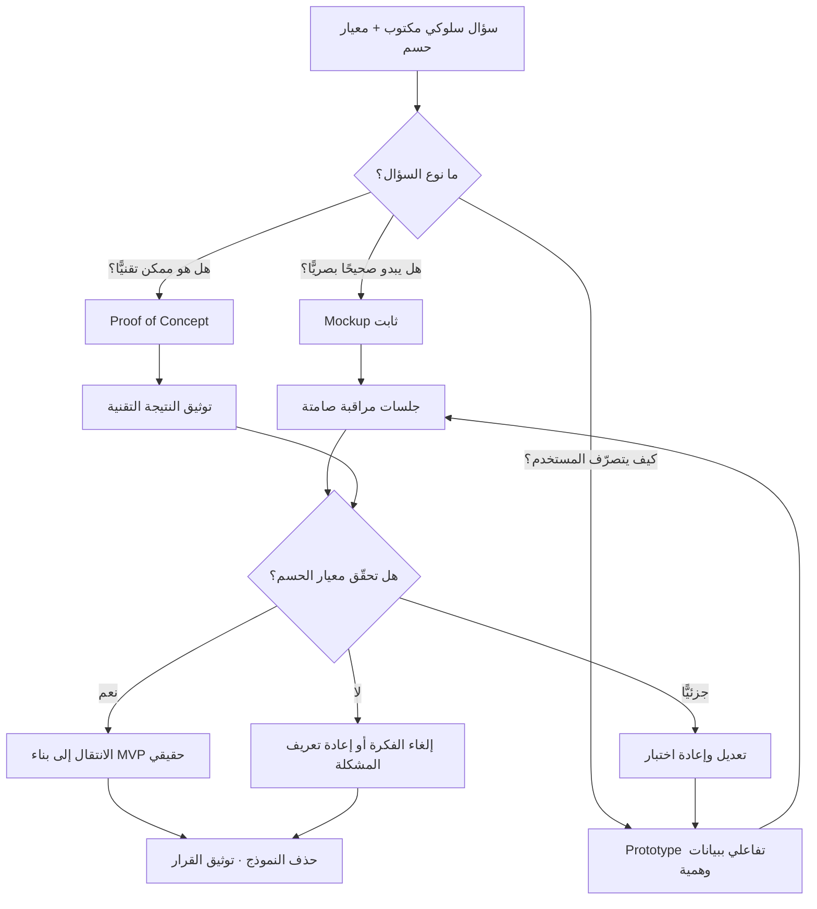

# النموذج الأولي (Prototype)

> [!info] تعريف مختصر
> مخرَج **تفاعلي** يُبنى ببيانات وهمية ومنطق مزيّف، غرضه الوحيد الإجابة عن **سؤال سلوكي محدّد** — هل يفهم المستخدم هذا المسار؟ هل يختار هذا الخيار؟ أين يتوقّف؟ — ثم يُحذف بعد أن يُجيب. النموذج الأولي ليس نسخة مبكّرة من المنتج ولا «مرحلة أولى» منه؛ هو **أداة قياس** مصنوعة من مادة قابلة للرمي، وقيمتها في المعلومة التي تنتجها لا في الشيفرة التي تتركها. الفرق الجوهري بينه وبين [[MVP]] أن الأخير منتج حقيقي يُسلَّم لمستخدمين حقيقيين ويعيش، بينما النموذج الأولي تجربة معمليّة تموت بانتهاء السؤال.

## الشرح العلمي والاحترافي

- **الأصل والمنشأ**: كلمة Prototype يونانية الأصل (prōtos = الأول، typos = الطبعة/النموذج)، وانتقلت من الهندسة الميكانيكية والتصنيع — حيث كان النموذج قطعة مادية تُصنع يدويًّا قبل فتح خط الإنتاج — إلى تصميم البرمجيات في السبعينيات والثمانينيات. النقلة المفهومية الحاسمة حدثت مع صعود مدرسة **التصميم المتمحور حول المستخدم (User-Centered Design)** وشيوع شعار «Fail fast, fail cheap»: أن تكتشف خطأ في التصميم على ورقة أو شاشة مزيّفة يكلّفك ساعة، وأن تكتشفه بعد الإطلاق يكلّفك إعادة بناء — وهي الفكرة نفسها التي يعبّر عنها [[Cost-of-Change Curve]] كميًّا.

- **سُلّم المخرَجات الأربعة**: أكثر ما يُربك الفرق أن أربعة أشياء مختلفة تمامًا تُسمّى كلها «نموذج». الترتيب الصحيح بحسب درجة الواقعية والقرار المُتَّخَذ:

  | المستوى | ما هو | ما يجيب عنه | مصيره |
  |---|---|---|---|
  | `Mockup` (نموذج ثابت) | صورة أو شاشة جامدة، لا نقر ولا تفاعل | هل يبدو صحيحًا؟ هل الترتيب البصري والتسلسل الهرمي مفهومان؟ | يُستبدل بالتصميم النهائي |
  | `Prototype` (نموذج أولي تفاعلي) | مسار قابل للنقر ببيانات وهمية | هل **يتصرّف** المستخدم كما توقّعنا؟ أين يتردّد ويخطئ؟ | يُحذف بعد جلسات الاختبار |
  | `Proof of Concept` (إثبات مفهوم) | تجربة تقنية ضيّقة بلا واجهة تُذكر | هل هذا **ممكن** تقنيًّا أصلًا؟ | يُوثَّق ثم يُرمى — انظر [[Proof of Concept]] |
  | `[[MVP]]` (منتج حقيقي) | أقل منتج صالح يُسلَّم لمستخدمين حقيقيين | هل يدفع الناس / يبقون / يعودون؟ | **يعيش** ويُبنى عليه |

  القاعدة: الثلاثة الأولى **مصيرها الحذف**، والرابع وحده مصيره الحياة. وأي التباس في هذا الجدول يتحوّل لاحقًا إلى [[Technical Debt]] لا يعترف به أحد.

- **درجات الدقّة (Fidelity)**: النموذج الأولي ليس نوعًا واحدًا، بل طيفًا: من **منخفض الدقّة (Low-Fidelity)** — رسم على ورق، صناديق رمادية بلا ألوان ولا نصوص نهائية — إلى **عالي الدقّة (High-Fidelity)** يكاد يُطابق المنتج بصريًّا. والقاعدة المهنية معكوسة عن الحدس: **كلما كان السؤال أبكر وأخطر، انخفضت الدقّة المطلوبة**. النموذج الخام يجرّئ المُختبِر على النقد؛ والنموذج المصقول يُخرِس النقد لأنه يبدو «قرارًا نهائيًّا» فيجامل المستخدم ويصمت المصمّم الزميل.

- **مبدأ «مزيّف من الخلف، حقيقي من الأمام»**: النموذج الأولي يعرض واجهة مقنعة فوق فراغ كامل — لا قاعدة بيانات، لا تحقّق من صحة الإدخال، لا معالجة أخطاء، لا صلاحيات، لا حالات فارغة، لا أداء. وهذا هو **مصدر قوّته ومصدر خطره** في آن: قوّته أنه يُبنى في ساعات، وخطره أن غير المتخصّص يرى الواجهة فيظنّ أن «٩٠٪ من العمل انتهى» بينما لم يبدأ شيء من الـ٩٠٪ الحقيقية.

- **النموذج الأولي أداة تفكير لا أداة عرض**: في أدبيات التصميم تُميَّز وظيفتان متباينتان: النموذج **للاستكشاف** (يُبنى ليُنقض، والفشل فيه نجاح) والنموذج **للإقناع** (يُبنى لعرض تقديمي أمام راعٍ أو مستثمر، ونجاحه في التصفيق). خلط الوظيفتين هو أصل معظم الكوارث: يُبنى للإقناع، فيُصفَّق له، فيُطلب تسليمه.

- **الاقتصاد وراءه**: النموذج الأولي وسيلة لخفض [[Cost of Experimentation]] عبر فصل **سؤال السلوك** عن **كلفة الهندسة**. ما تشتريه بالنموذج ليس شاشة، بل **حق التراجع رخيصًا**. ولذلك فإن أدقّ مقياس لنجاح ثقافة النماذج في فريق هو: كم فكرة قُتلت بعد اختبار نموذج؟ فريق لم يُلغِ فكرة قط بعد نموذج أولي لا يختبر — بل يوثّق قرارات اتُّخذت سلفًا.

- **⚠️ خطر «النموذج الذي صار منتجًا»**: هذا أشدّ أعطاب المصطلح كلّه، ويستحق تحذيرًا صريحًا. المسار المعتاد للكارثة: يُبنى النموذج في ٣ أيام بشيفرة مرتجلة ← يُعرض على الإدارة ← يُبهر لأنه «يعمل» ← يُسأل السؤال القاتل: «ما دام يعمل، لماذا نبنيه من جديد؟» ← يُطلب «فقط توصيله بقاعدة بيانات حقيقية» ← يُشحن ← يصير أساس المنتج لسنوات.
  والمشكلة ليست أن الشيفرة رديئة فحسب، بل أن **قرارات معمارية جوهرية اتُّخذت وهي تفترض أن الشيء سيُرمى**: لا نموذج بيانات، لا طبقة صلاحيات، لا اختبارات، لا معالجة أخطاء، أسماء مؤقّتة، اختصارات متعمّدة. وهذا الدَّين لا يظهر في أول شهرين — يظهر حين يُطلب أول تغيير حقيقي فيتبيّن أن لا شيء يحتمل التغيير. علاجه **تنظيمي لا تقني**: أن يكون مصير النموذج مُعلنًا ومكتوبًا **قبل** بنائه، وأن يُبنى بأدوات لا تسمح أصلًا بترقيته إلى إنتاج، وألّا يُعرض قط دون تسمية صريحة: «هذا نموذج، ولا سطر منه سيدخل الإنتاج».

## أين ومتى يُستخدم

- **في [[Product Discovery]] و[[Continuous Discovery]]**: لاختبار حلول مقترحة على فرصة مكتشفة قبل تخصيص سعة الفريق لها؛ ويُستعمل عادة لقصّ فروع [[Opportunity Solution Tree]] المكلفة قبل الالتزام بها.
- **قبل كتابة [[PRD]] أو تجميدها**: النموذج يكشف الغموض في المتطلّبات أسرع من أي مراجعة نصّية؛ فمسار قابل للنقر يُظهر الحالات الناقصة و[[Edge Cases]] التي لا تظهر في وثيقة مكتوبة.
- **في اختبار قابلية الاستخدام (Usability Testing)**: خمس إلى ثماني جلسات مراقَبة على نموذج أولي كافية عادةً لكشف أغلب عوائق الفهم الكبرى في مسار واحد.
- **في مواءمة أصحاب المصلحة قبل [[Sign-off]]**: عرض نموذج ملموس يحسم خلافات تدور شهورًا حول تفسير جملة في الوثيقة — بشرط الإعلان الصريح أنه نموذج.
- **في تقليل [[Scope Creep]] مبكرًا**: كثير من طلبات الإضافة تتبخّر حين يرى صاحبها المسار مجسَّدًا ويكتشف أن الميزة لا تخدم ما ظنّه.
- **في اختبار فرضيات التسعير والعرض**: صفحة وهمية لخطط الأسعار مع تتبّع النقرات تعطي إشارة سلوكية أصدق من سؤال «كم تدفع؟» في استبيان — وهو منطق [[Customer and Market Validation]] نفسه.
- **في تقدير الحجم**: نموذج مرئي يجعل [[Relative Estimation]] أدقّ بكثير من تقدير قائم على وصف نصّي مجرّد، فيقلّ [[Estimation Variance]].

## مثال وسيناريو تطبيقي

> [!example] شركة تقنية مالية في الرياض تبني تطبيقًا للمنشآت الصغيرة، وتريد إضافة ميزة «فوترة الدفعات المتكرّرة». التقدير الهندسي الأولي: ٩ أسابيع لفريق من أربعة مهندسين، أي ما يقارب ١٨٠ يوم-عمل.
> قبل الالتزام، خصّص الفريق **٤ أيام** وشخصين (مصمّم + مدير منتج) لبناء نموذج أولي تفاعلي في أداة تصميم: ١٤ شاشة قابلة للنقر، بيانات وهمية لسبعة عملاء مختلَقين، ولا سطر شيفرة واحد. السؤال السلوكي كان مكتوبًا في أعلى ملف النموذج بصيغة واحدة: **«هل يستطيع صاحب منشأة أن ينشئ جدول فوترة متكرّرة لعميل واحد دون مساعدة، في أقل من ٣ دقائق؟»**
> اختُبر النموذج مع ٧ أصحاب منشآت حقيقيين (٣ مطاعم، محل قطع غيار، مكتب محاسبة، عيادة، ورشة). النتيجة: ٢ فقط من ٧ أكملوا المهمّة. الأسوأ أن ٥ من ٧ توقّفوا عند الشاشة نفسها — شاشة تحديد «دورة التكرار» — وسأل ٤ منهم السؤال ذاته تقريبًا: «وإذا العميل تأخّر شهر، هل يتوقّف الجدول أم يتراكم؟» وهي حالة **لم تكن في [[PRD]] إطلاقًا**، ولم يكن لها إجابة في المنتج المخطَّط له.
> ما كشفه النموذج أعمق من ذلك: ٦ من ٧ قالوا إنهم لا يحتاجون «جدولة» بقدر ما يحتاجون **تذكيرًا بالتحصيل المتأخّر** — أي أن المشكلة الحقيقية تحصيلية لا فوترية.
> القرار: أُلغيت الميزة بصيغتها الأصلية، وأُعيد تعريف النطاق حول «متابعة التحصيل»، وحُذف ملف النموذج. الكلفة المدفوعة: ٨ أيام-عمل. الكلفة المتجنَّبة: ١٨٠ يوم-عمل على ميزة كانت ستُبنى صحيحة تقنيًّا وخاطئة تمامًا في جوهرها — وهي بالضبط الحالة التي يصفها [[Feature Factory]]: إنتاج مثالي لشيء لا يلزم أحدًا.
> ملاحظة على الهامش: في اجتماع العرض طلب أحد أعضاء اللجنة «إطلاق النموذج كما هو لعميلين تجريبيين فقط». رُفض الطلب وسُجّل الرفض وسببه في [[Decision Log]] — لأن النموذج لا يحتوي تحقّقًا من المدخلات ولا صلاحيات ولا سجلًّا ماليًّا، وإطلاقه على بيانات فوترة حقيقية ليس اختصارًا بل مخاطرة تشغيلية وقانونية.

## خطوات أو مخطّط

1. **اكتب السؤال أولًا**: جملة واحدة، سلوكية، قابلة للدحض («هل يُكمل المستخدم X دون مساعدة؟»). لا نموذج بلا سؤال مكتوب.
2. **حدّد معيار الحسم مسبقًا**: كم من المشاركين يجب أن ينجح حتى نعتبر الفرضية صامدة؟ يُكتب قبل الاختبار لا بعده.
3. **اختر أدنى دقّة تكفي للإجابة**: ورق أو صناديق رمادية إن كان السؤال عن الفهم؛ نموذج تفاعلي عالي الدقّة إن كان السؤال عن التفاصيل الدقيقة للتفاعل.
4. **أعلِن مصير النموذج كتابةً**: «يُحذف بعد الجلسات» — في العنوان، وفي رسالة العرض، وشفهيًّا في بداية كل عرض تقديمي.
5. **ابنِ المسار الواحد فقط**: لا تبنِ التطبيق كاملًا؛ ابنِ الطريق الذي يمرّ منه السؤال، ودع البقيّة معطّلة.
6. **اختبر بالمراقبة الصامتة**: أعطِ المشارك مهمّة واصمت. لا تشرح ولا تنقذ ولا تدافع؛ فكل تدخّل يُفسد القياس.
7. **سجّل السلوك لا الرأي**: أين توقّف، وكم استغرق، وماذا نقر بالخطأ — لا «هل أعجبك؟».
8. **احسم**: امضِ، أو عدّل وأعد الاختبار، أو ألغِ الفكرة. ثم **احذف النموذج فعليًّا** ووثّق النتيجة والقرار في [[Decision Log]].

## ⚠️ مفاهيم خاطئة شائعة

> [!warning]
> - **«النموذج الأولي نسخة مبكّرة من المنتج»**: خطأ جوهري. النموذج **ليس على مسار المنتج أصلًا**؛ هو أداة قياس جانبية. النسخة المبكّرة من المنتج اسمها [[MVP]]، وهي تعمل ببيانات حقيقية ومستخدمين حقيقيين ويُبنى عليها.
> - **الخلط بين `Mockup` و`Prototype`**: الأول ثابت ويجيب عن سؤال بصري («هل يبدو صحيحًا؟»)، والثاني تفاعلي ويجيب عن سؤال سلوكي («هل يتصرّف كما توقّعنا؟»). طلب «موك‌أب» حين تحتاج إلى إجابة سلوكية يعني أنك ستدفع ثمن الاكتشاف لاحقًا وبسعر أعلى.
> - **«كلما كان النموذج أجمل كان أفضل»**: عكس الصحيح في المراحل المبكرة. النموذج المصقول يقمع النقد ويحوّل الجلسة من اختبار إلى استعراض، ويجعل المشارك يجامل بدل أن ينتقد.
> - **«النموذج يثبت الجدوى التقنية»**: لا يثبت شيئًا تقنيًّا إطلاقًا — كل ما تحته وهمي. الجدوى التقنية شأن [[Proof of Concept]] وحده.
> - **«اختبار النموذج يغني عن الإطلاق التجريبي»**: النموذج يقيس الفهم والسلوك في بيئة معملية لدقائق؛ و[[Pilot Launch]] يقيس التبنّي والتشغيل والاستمرار في بيئة حقيقية لأسابيع. لا يعوّض أحدهما الآخر.
> - **«النموذج يحتاج عيّنة إحصائية كبيرة»**: لا. النموذج أداة **كيفية** تكشف عوائق الفهم، لا أداة كمّية تقيس نسبًا. خمس إلى ثماني جلسات تكفي لأغلب أسئلة المسار الواحد؛ ومن يريد أرقامًا ذات دلالة إحصائية فمكانها التجربة على مستخدمين حقيقيين لا على شاشة وهمية.
> - **«ما دام يعمل فلنُطلقه»**: هو لا «يعمل» — هو **يبدو** أنه يعمل. لا تحقّق من مدخلات، لا صلاحيات، لا حالات فشل، لا أمان، لا أداء. الفارق بين المظهر والعمل هو كامل تكلفة المنتج.

## ❌ ممارسات خاطئة في المشاريع

> [!failure]
> - **بناء نموذج بلا سؤال مكتوب**: الخطأ: «خلّونا نسوّي نموذج نشوف شكله». لماذا يضرّ: بلا سؤال لا يوجد جواب، فتنتهي الجلسة بآراء متضاربة عن الألوان ويُتَّخذ القرار بحسب أقوى صوت في الغرفة. الحل: اكتب السؤال ومعيار الحسم في أعلى ملف النموذج، واعتبر النموذج بلا سؤال طلبًا مرفوضًا.
> - **ترقية النموذج إلى إنتاج**: الخطأ: «الشيفرة موجودة، نوصّلها بقاعدة البيانات ونطلق». لماذا يضرّ: يبني المنتج فوق أساس صُمّم أصلًا ليُرمى — بلا نموذج بيانات ولا صلاحيات ولا اختبارات — فيتحوّل الوفر الظاهري (٣ أسابيع) إلى [[Technical Debt]] يُستنزف لسنوات. الحل: اكتب مصير النموذج قبل بنائه، وابنِه بأدوات تصميم لا تُنتج شيفرة قابلة للنشر، واجعل «لا ترقية للنماذج» سياسة معلنة ضمن [[Guard Rails]].
> - **عرض النموذج دون تسميته نموذجًا**: الخطأ: يُعرض على راعٍ أو عميل كأنه المنتج. لماذا يضرّ: يُبنى توقّع تسليم زائف، ويُعاد ضبط الجدول الزمني ذهنيًّا لدى الإدارة على أساس وهمي، ثم يُتَّهم الفريق بالتأخّر لاحقًا. الحل: عبارة تمهيدية إلزامية في أول شريحة وعلامة مائية على كل شاشة: «نموذج — بيانات وهمية — غير قابل للإطلاق».
> - **تحويل جلسة الاختبار إلى عرض تقديمي**: الخطأ: يشرح المصمّم كل شاشة ثم يسأل «واضح؟». لماذا يضرّ: يُلغي القياس تمامًا، لأن الشرح يعوّض عن العيب الذي جاء الاختبار ليكشفه. الحل: مهمّة مكتوبة تُسلَّم للمشارك، ثم صمت تام من الفريق حتى نهاية المهمّة.
> - **بناء نموذج لكل الميزات دفعةً واحدة**: الخطأ: نموذج بستّين شاشة يغطّي المنتج كاملًا. لماذا يضرّ: يستهلك أسابيع فيرتفع [[Cost of Experimentation]] حتى يفقد النموذج سبب وجوده، ويصبح إلغاؤه مستحيلًا عاطفيًّا وسياسيًّا. الحل: نموذج واحد لمسار واحد لسؤال واحد.
> - **إهمال الحالات القبيحة**: الخطأ: نموذج يعرض «المسار السعيد» فقط ([[Happy Path]]) ببيانات مثالية. لماذا يضرّ: المسار السعيد نادرًا ما يكشف عيبًا؛ العيوب تسكن الحالات الفارغة والأخطاء والقوائم الطويلة و[[Edge Cases]]. الحل: ضمّن في النموذج حالة فارغة وحالة خطأ وحالة بيانات ضخمة على الأقل.
> - **الاحتفاظ بالنموذج «للتوثيق»**: الخطأ: يُترك ملف النموذج حيًّا بعد انتهاء غرضه. لماذا يضرّ: يصبح مصدر حقيقة موازيًا يناقض [[PRD]] والتصميم النهائي، فيبني مطوّرٌ ما ميزةً بحسب نموذج مهجور عمره عام. الحل: احذف النموذج فعليًّا واحتفظ بالنتيجة والقرار فقط في [[Decision Log]] احترامًا لمبدأ [[Single Source of Truth]].
> - **اعتبار «أعجبني» نتيجةً**: الخطأ: تُلخَّص الجلسات بعبارات إعجاب. لماذا يضرّ: الإعجاب مجاملة اجتماعية لا تتنبّأ بالسلوك ولا تقبل الدحض. الحل: سجّل معدّل إتمام المهمّة، ومواضع التوقّف، وعدد طلبات المساعدة — وهي بيانات سلوكية تقبل المقارنة والحسم.

## 🔗 مصطلحات ومفاهيم ذات صلة
[[Proof of Concept]] | [[Cost of Experimentation]] | [[Non-Goals]] | [[MVP]] | [[PRD]] | [[Pilot Launch]] | [[Product Discovery]] | [[Continuous Discovery]] | [[Cost-of-Change Curve]] | [[Technical Debt]] | [[Feature Factory]] | [[Edge Cases]] | [[Happy Path]] | [[Decision Log]] | [[Customer and Market Validation]] | [[Opportunity Solution Tree]]
