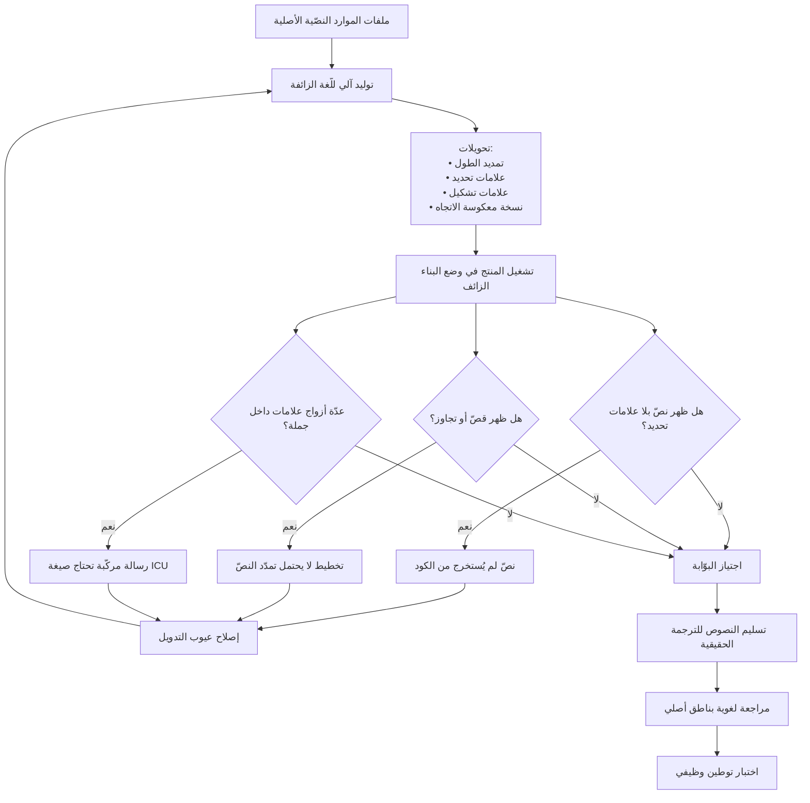

# الترجمة الزائفة (Pseudo-localization)

> [!info] تعريف مختصر
> أسلوب اختبار يولّد «لغة» اصطناعية آليًّا من نصوص المنتج الأصلية — بتمديد طولها، وإضافة محارف غير لاتينية وعلامات تشكيل، وتحديد بدايتها ونهايتها بعلامات ظاهرة، وأحيانًا عكس اتجاهها — بهدف كشف أعطال [[Internationalization|التدويل]] **قبل** إنفاق ريال واحد على ترجمة حقيقية. جوهر الفكرة أنها تبقى **مقروءة** لمن يعرف اللغة الأصلية، فيستطيع أي مطوّر أو مختبِر استخدام المنتج والحكم عليه دون معرفة أي لغة أجنبية. وهي بذلك أرخص وأسرع وأبكر وسيلة لتحويل عيوب التدويل من مفاجآت تُكتشف بعد الترجمة إلى إخفاقات بناء تُكتشف في نفس اليوم — تطبيق مباشر لمنطق [[Shift-Left and Shift-Right|الإزاحة إلى اليسار]] على مجال التوطين.

## الشرح العلمي والاحترافي

- **المشكلة التي تحلّها**: في المسار التقليدي تُكتشف عيوب التدويل متأخّرة جدًّا — بعد اكتمال التطوير، وبعد إرسال النصوص للترجمة، وبعد عودتها ودمجها. عندها يظهر أن الزرّ لا يتّسع للنصّ المترجم، وأن ثلاثين نصًّا لم تُستخرج أصلًا، وأن التخطيط ينكسر باتجاه معاكس. تصحيح هذه العيوب في تلك اللحظة يعني تعديلًا هندسيًّا تحت ضغط موعد الإطلاق، وغالبًا إعادة دورة ترجمة كاملة. الترجمة الزائفة تنقل هذا الاكتشاف إلى **لحظة كتابة الكود**، حين يكون التصحيح دقائق لا أسابيع.

- **التحويلات الأربعة الأساسية**: ① **التمديد (Expansion)**: إطالة النصّ بنسبة معتبرة (تُختار عادة نسبة أعلى للنصوص القصيرة وأقلّ للطويلة، محاكاةً لسلوك التمدّد الفعلي في الترجمة) لكشف القصّ والتجاوز وكسر التخطيط. ② **التزيين بالمحارف (Accenting)**: استبدال الحروف بنظائر مزخرفة أو مضافة إليها علامات تشكيل، لكشف مشكلات الترميز والخطوط وارتفاع السطر مع بقاء النصّ مقروءًا. ③ **علامات التحديد (Bracketing)**: إحاطة كل نصّ بعلامتين مميّزتين، فيصبح النصّ المقصوص واضحًا فورًا (علامة البداية ظاهرة والنهاية مفقودة)، ويُميَّز النصّ المركّب من عدّة أجزاء بوجود عدّة أزواج داخل جملة واحدة. ④ **عكس الاتجاه**: توليد نسخة تحاكي [[RTL]] لكشف افتراضات الاتجاه المدفونة في التخطيط.

- **ما تكشفه فعليًّا — قائمة العيوب**: نصّ مكتوب داخل الكود ولم يُستخرج (يظهر بلا تحويل وسط نصوص محوَّلة، فيبرز كالإصبع المكسور)؛ ونصّ مقصوص أو متجاوز لحدود عنصره؛ وتخطيط ينكسر عند الطول الزائد؛ ورسائل مركّبة بالتجميع النصّي (تظهر بعلامات تحديد متعدّدة داخل الجملة، وهي إشارة إلى ضرورة إعادة صياغتها بـ[[ICU Message Format]])؛ ومشكلات ترميز وخطوط لا تدعم محارف معيّنة؛ وارتفاع سطر غير كافٍ لعلامات التشكيل؛ وحقول إدخال ترفض محارف غير لاتينية؛ وقصّ نصوص بعدد بايتات خاطئ؛ وافتراضات اتجاه ثابتة.

- **ما لا تكشفه — وحدودها الصريحة**: الترجمة الزائفة **لا تحكم** على جودة الترجمة، ولا على ملاءمة المصطلح، ولا على صحّة قواعد الجمع في اللغة الهدف، ولا على المناسبة الثقافية للصور والأمثلة، ولا على صحّة صيغ التاريخ والعملة لسوق بعينه. هي أداة لكشف **الأعطال البنيوية** فقط. لذلك لا تُغني عن مراجعة لغوية بناطق أصلي ولا عن اختبار توطين وظيفي على اللغات الحقيقية؛ بل تسبقهما وترفع كفاءتهما بأن تصلهما بمنتج خالٍ من الأعطال البدائية، فيتفرّغ المراجع اللغوي للغة بدل الإبلاغ عن أزرار مقطوعة.

- **الأصل والانتشار**: الأسلوب نشأ في بيئات هندسة البرمجيات التي واجهت التوطين واسع النطاق مبكرًا، حين تبيّن أن الاختبار بترجمات حقيقية بطيء ومكلف ومتأخّر جدًّا في الدورة. وقد استقرّ لاحقًا كممارسة معيارية مدعومة داخل أطر التطوير الكبرى ومنصّات إدارة الترجمة وأنظمة التشغيل، بحيث صار تفعيلها في كثير من البيئات مسألة إعداد لا بناء أدوات من الصفر. تُنسب الفكرة عمومًا إلى ممارسات هندسة التوطين في الصناعة، ومن الأدقّ وصفها بأنها ممارسة صناعية متطوّرة لا اختراع شخص بعينه.

- **موضعها الصحيح: بوّابة جودة آلية لا اختبار يدوي عارض**: أعلى عائد للأسلوب يتحقّق حين يكون **وضع بناء دائمًا** (Build Configuration) متاحًا لكل مطوّر بضغطة واحدة، ومُدمجًا في أنبوب [[CI and CD]] مع لقطات شاشة آلية تُقارَن بين الإصدارات. عندها يكتشف المطوّر أن نصّه لم يُستخرج **قبل** أن يدفع الكود، لا بعد ثلاثة أشهر. تحويلها إلى «جولة اختبار» تُجرى مرّة قبل الإطلاق يقلّص قيمتها إلى جزء يسير مما تستحقّه.

- **علاقتها بالتكلفة**: الترجمة الزائفة مجانية عمليًّا بعد إعدادها الأول — لا سعر كلمة، ولا انتظار مورّد، ولا دورة مراجعة. وهذا يجعلها من أعلى أدوات الجودة عائدًا على الاستثمار في مسار التوطين: تكلفة إعداد تُقاس بالأيام، مقابل تفادي دورات إعادة عمل تُقاس بالأسابيع في كل لغة وكل إصدار. وهي تُرخِّص أيضًا القرار الاستراتيجي نفسه: فريق يستطيع اختبار جاهزيته للتوطين دون أن يلتزم بأي سوق بعد.

- **تنويعات متقدّمة**: بعض الفرق تولّد أكثر من «لغة زائفة»: واحدة بتمديد أقصى لاختبار حدود التخطيط، وواحدة معكوسة الاتجاه، وواحدة بمحارف من أنظمة كتابة متعدّدة لاختبار الخطوط، وواحدة «هوية» بلا تحويل سوى علامات التحديد لكشف النصوص غير المستخرجة وحدها بأقلّ ضجيج بصري. كما يمكن ضبط نسبة التمديد لتحاكي لغة هدف بعينها بدل نسبة عامّة.

## أين ومتى يُستخدم

- **أثناء التطوير اليومي**: كوضع بناء يشغّله المطوّر محلّيًّا للتحقّق من أن كل نصّ أضافه قابل للترجمة قبل أن يدفع تغييراته.
- **كبوّابة في أنبوب [[CI and CD]]**: فشل البناء أو تنبيه آلي عند رصد نصّ غير مستخرج، فتتحوّل قابلية التوطين من مراجعة بشرية إلى [[Explicit Policies|سياسة صريحة]] مؤتمتة.
- **قبل أي [[Localization|توطين]] فعلي**: كشرط قبول قبل تسليم حزمة النصوص إلى المورّد اللغوي، لأن تسليم منتج فيه أعطال بنيوية يعني دفع ثمن الترجمة مرّتين.
- **في تقييم جاهزية منتج قائم للتوسّع**: تشغيلها على منتج لم يُدوَّل بعد يعطي خلال ساعات جردًا واقعيًّا لحجم عمل التدويل المطلوب، وهو مدخل ممتاز لتقدير أدقّ يقلّل [[Estimation Variance]].
- **في [[Regression Testing|اختبار الانحدار]]**: مقارنة لقطات الشاشة الزائفة بين الإصدارات تكشف الارتداد في التخطيط مبكرًا.
- **في تدريب الفريق**: تشغيلها لمرّة واحدة أمام فريق لم يعمل على التوطين من قبل هو أسرع وسيلة لجعل المشكلة **مرئية وملموسة** بدل شرحها نظريًّا.
- **في مراجعة التصميم**: عرض التصميم بنصّ ممدَّد يكشف ضيق المساحات قبل بناء المكوّن أصلًا.

## مثال وسيناريو تطبيقي

> [!example] شركة برمجيات في الرياض تبني نظام موارد بشرية بالعربية، وتلقّت طلبًا من عميل إقليمي لإضافة الإنجليزية والفرنسية خلال ربع واحد. قدّر الفريق العمل بـ«ترجمة 3,100 نصّ» في 6 أسابيع.
> قبل إرسال أي شيء للترجمة، خصّص الفريق 3 أيام لبناء وضع بناء يولّد لغة زائفة: تمديد بنسبة 40% للنصوص الطويلة و80% للقصيرة، وإحاطة كل نصّ بعلامتين مميّزتين، وإضافة علامات تشكيل، مع نسخة ثانية معكوسة الاتجاه لمحاكاة الإنجليزية داخل منتج مبنيّ أصلًا على [[RTL]].
> ثم شغّل الفريق المنتج بالكامل في هذا الوضع ليوم واحد بثلاثة أشخاص. الحصيلة: **347 عيبًا** موزّعة كالتالي — 96 نصًّا لم يُستخرج أصلًا (ظهرت بلا علامات تحديد وسط نصوص محوَّلة، فكانت واضحة فورًا)؛ و134 موضع قصّ أو تجاوز في الأزرار والبطاقات وعناوين الجداول؛ و61 رسالة مركّبة بالتجميع النصّي (تعرّف عليها الفريق من تعدّد أزواج العلامات داخل الجملة الواحدة) أعيدت صياغتها بـ[[ICU Message Format]]؛ و38 موضعًا ينكسر عند عكس الاتجاه بسبب خصائص تنسيق اتجاهية صريحة؛ و18 حقل إدخال يرفض محارف غير عربية بتحقّق صارم غير مقصود.
> استغرق إصلاح هذه العيوب 4 أسابيع. بدت في حينها تأخيرًا صافيًا وواجه الفريق ضغطًا لتخطّيها. لكن ما وثّقه الفريق لاحقًا أن دورة الترجمة والدمج للّغتين معًا تمّت من المحاولة الأولى دون أي دورة إصلاح لاحقة، بينما كان مشروعهم السابق — الذي لم يستخدم الأسلوب — قد احتاج ثلاث دورات إصلاح ودورتَي إعادة ترجمة جزئية لسبب واحد فقط: نصوص لم تُستخرج فظهرت بعد الدمج.
> والأثر الأدوم أن وضع البناء الزائف بقي متاحًا، وأُدخل في أنبوب البناء بحيث ينبّه على أي نصّ جديد غير مستخرج، فتوقّف تراكم العيوب من جذره بدل معالجته دوريًّا.

## خطوات أو مخطّط

1. تجهيز أنبوب توليد آلي يقرأ ملفات الموارد الأصلية ويُنتج ملف لغة زائفة عند كل بناء (لا ملفًا يدويًّا يتقادم).
2. ضبط التحويلات: نسبة التمديد بحسب طول النصّ، علامات التحديد، علامات التشكيل، ونسخة معكوسة الاتجاه.
3. إتاحة وضع البناء الزائف لكل مطوّر محلّيًّا بضغطة واحدة، وتوثيق كيفية تشغيله في دليل الفريق.
4. تشغيل جولة استكشافية كاملة على المنتج في هذا الوضع، وتسجيل كل عيب في نظام تتبّع العيوب بتصنيف مستقلّ «عيب تدويل».
5. تصنيف العيوب إلى فئات: نصّ غير مستخرج، قصّ أو تجاوز، رسالة مركّبة، افتراض اتجاه، مشكلة ترميز أو خطّ، تحقّق إدخال صارم.
6. إصلاح الفئات بالترتيب: النصوص غير المستخرجة أولًا (لأنها تحجب كل ما بعدها)، ثم الرسائل المركّبة، ثم التخطيط.
7. دمج الوضع الزائف في أنبوب [[CI and CD]] مع لقطات شاشة آلية تُقارَن بين الإصدارات لكشف الارتداد.
8. جعل «اجتياز الترجمة الزائفة» شرطًا في [[Definition of Done]] لكل قصّة تُنتج نصًّا ظاهرًا.
9. تسليم النصوص إلى الترجمة الحقيقية بعد الاجتياز فقط.
10. بعد وصول الترجمات: تنفيذ المراجعة اللغوية واختبار التوطين الوظيفي — وهما مرحلتان مختلفتان لا تعوّضهما الترجمة الزائفة.

## ⚠️ مفاهيم خاطئة شائعة

> [!warning]
> - **«الترجمة الزائفة تختبر جودة الترجمة»**: لا تختبرها إطلاقًا. هي أداة لكشف الأعطال **البنيوية** فقط: نصّ غير مستخرج، قصّ، انكسار تخطيط، افتراض اتجاه. جودة اللغة والمصطلح والمناسبة الثقافية تحتاج مراجعًا بشريًّا ناطقًا باللغة.
> - **«تُغني عن الاختبار باللغات الحقيقية»**: لا. هي **تسبقه** وترفع كفاءته. صيغ التاريخ والعملة الصحيحة لكل سوق، وقواعد الجمع في اللغة الهدف، وطول النصّ الفعلي — كلّها لا تظهر إلا مع اللغة الحقيقية.
> - **«نصّ عشوائي غير مقروء يؤدّي الغرض»**: خاصية «بقاء النصّ مقروءًا» ليست ترفًا بل هي جوهر الأداة؛ فهي ما يمكّن أي مطوّر من استخدام المنتج والتنقّل فيه والحكم على شاشاته. نصّ غير مقروء يمنع الاختبار الوظيفي ويحوّل الأداة إلى فحص بصري سطحي.
> - **«تُشغَّل مرّة قبل الإطلاق»**: تشغيلها مرّة واحدة يكشف الدَّين المتراكم ولا يمنع تراكمه من جديد. قيمتها الحقيقية في كونها بوّابة دائمة في كل بناء، لأن كل إصدار يضيف نصوصًا جديدة معرّضة للمشكلة نفسها.
> - **«التمديد بنسبة ثابتة يكفي»**: نسبة التمدّد ليست واحدة؛ فالنصوص القصيرة جدًّا (كلمة على زرّ) تتمدّد نسبيًّا أكثر بكثير من الفقرات الطويلة. نسبة موحّدة منخفضة تُمرّر أخطر الحالات وهي الأزرار والتسميات القصيرة.
> - **«بناؤها مشروع كبير»**: أغلب أطر التطوير الحديثة ومنصّات إدارة الترجمة تدعم توليد اللغة الزائفة جاهزًا أو بإعداد بسيط. تقدير الأمر كمشروع أدوات ضخم عذر شائع لتأجيل أرخص أداة جودة في المسار كلّه.

## ❌ ممارسات خاطئة في المشاريع

> [!failure]
> - **تخطّي المرحلة والذهاب مباشرة إلى الترجمة**: الخطأ — تُرسل النصوص للمورّد بلا اختبار بنيوي مسبق. لماذا يضرّ — تُكتشف العيوب بعد الدمج، فيُدفع ثمن دورة ترجمة إضافية لكل نصّ لم يكن مستخرجًا، ويتأخّر الإطلاق تحت ضغط. الحل — اجعل اجتياز الترجمة الزائفة شرطًا لإصدار أمر الشراء للترجمة، لا خطوة استحسانية.
> - **إنشاء ملف لغة زائفة يدويًّا لمرّة واحدة**: الخطأ — يُولَّد الملف يدويًّا ويُحفظ في المستودع. لماذا يضرّ — يتقادم فورًا مع أول نصّ جديد، فيمرّر العيوب الجديدة تحديدًا وهي الأكثر احتمالًا. الحل — ولّده آليًّا من المصدر عند كل بناء، ولا تخزّنه أصلًا.
> - **معالجة نتائجها كملاحظات تجميلية**: الخطأ — تُسجَّل العيوب في قائمة «تحسينات لاحقة». لماذا يضرّ — نصّ غير مستخرج ليس تحسينًا بل عطل وظيفي مؤكّد سيظهر عند كل مستخدم غير ناطق باللغة الأصلية، ويتراكم بوصفه [[Technical Debt|دَينًا تقنيًّا]]. الحل — صنّف عيوب التدويل بفئة مستقلّة وبأولوية إصلاح واضحة وفق [[Severity vs Priority]].
> - **تشغيلها على شاشات مختارة فقط**: الخطأ — تُجرّب على الصفحات الرئيسية وتُترك المسارات الفرعية. لماذا يضرّ — النصوص غير المستخرجة تتركّز غالبًا في المسارات النادرة: رسائل الأخطاء، الحالات الفارغة، تدفّقات الاستثناء، شاشات الإدارة — وهي أشدّ المواضع حساسية عند المستخدم. الحل — غطِّ المسارات الكاملة بما فيها حالات الفشل و[[Edge Cases|الحالات الحديّة]].
> - **إهمال النسخة معكوسة الاتجاه**: الخطأ — يُكتفى بالتمديد والتزيين. لماذا يضرّ — تبقى افتراضات الاتجاه المدفونة في التنسيق غير مكتشفة حتى إطلاق أول لغة معاكسة، وعندها يظهر العطل بالجملة. الحل — ولّد نسخة زائفة معكوسة الاتجاه واختبر بها كل شاشة، وراجع قواعد ما ينعكس وما لا ينعكس في [[RTL]].
> - **عدم قياس الأثر**: الخطأ — تُستخدم الأداة بلا توثيق لما كشفته. لماذا يضرّ — تصير أول ما يُحذف عند ضغط الجدول لأن قيمتها غير مرئية للإدارة. الحل — سجّل عدد العيوب المكتشفة وفئاتها وقارنها بعيوب التوطين التي وصلت للإنتاج، فتتحوّل الأداة من كلفة مفترضة إلى وقاية موثّقة بالأرقام.
> - **تشغيلها بعد اكتمال التطوير بدل أثنائه**: الخطأ — تُجدوَل كمرحلة اختبار مستقلّة قرب النهاية. لماذا يضرّ — تُكتشف مئات العيوب دفعة واحدة في أضيق نقطة من الجدول، فيُضغط على الفريق لتأجيل أغلبها. الحل — اجعلها متاحة يوميًّا لكل مطوّر ومدمجة في أنبوب البناء، بحيث تُكتشف العيوب فرادى ساعة نشوئها.

## 🔗 مصطلحات ومفاهيم ذات صلة
[[Internationalization]] | [[Localization]] | [[RTL]] | [[Locale]] | [[ICU Message Format]] | [[Shift-Left and Shift-Right]] | [[Regression Testing]] | [[Definition of Done]] | [[Escaped Defect Rate]] | [[Severity vs Priority]]
