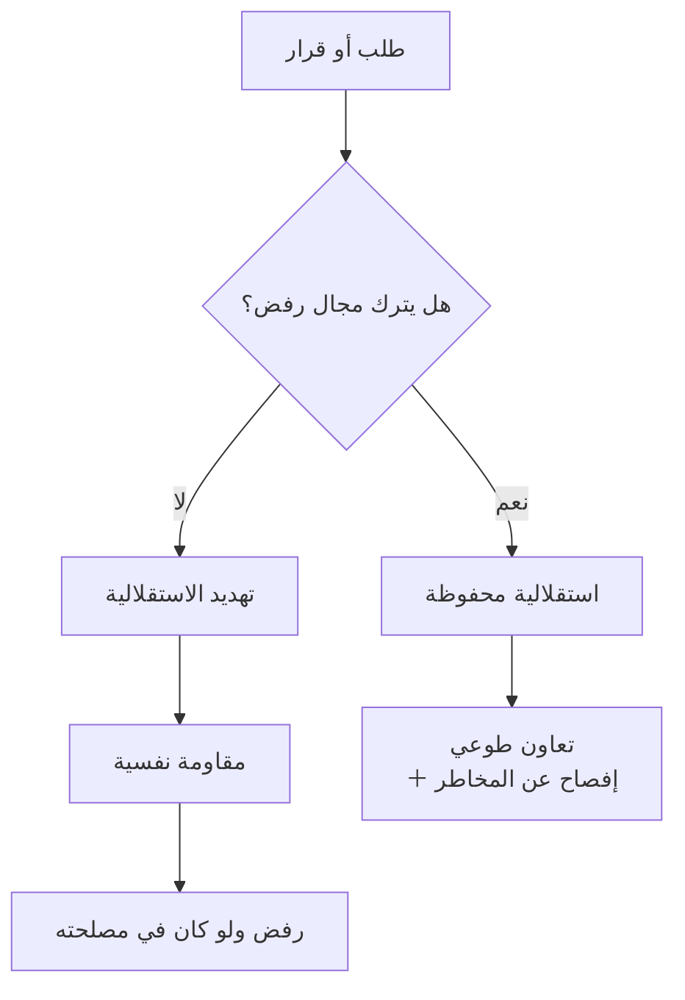

# المقاومة النفسية (Psychological Reactance)
> [!info] تعريف مختصر
> دافع ينشأ حين يشعر المرء بأنّ **حرّية اختياره مُهدَّدة**، فيسعى إلى استعادتها — غالبًا برفض ما يُقترَح عليه، **ولو كان في مصلحته**. وهي تُفسّر لماذا يُقاوَم اقتراح معقول تمامًا قُدِّم بصيغة لا تترك مجالًا للرفض.

## الشرح العلمي والاحترافي
صاغها **جاك بريم (Jack Brehm)** في *A Theory of Psychological Reactance* (1966). وتتقاطع مباشرةً مع **الاستقلالية (Autonomy)** بوصفها حاجة نفسية أساسية في **نظرية تقرير المصير** لـ**ديسي وريان**، ومع مجال `Autonomy` في نموذج [[SCARF Model|SCARF]].

**والتطبيق العملي الأشهر: قلب صياغة السؤال** بحيث يُجاب بـ«لا» لا بـ«نعم».

| السؤال الطالب لـ«نعم» | السؤال المُتيح لـ«لا» | ما تغيّر |
|---|---|---|
| «هل لديك وقت الآن؟» | «هل الوقت غير مناسب لنتكلّم دقيقتين؟» | التزام مفتوح ← التزام محدود قابل للرفض |
| «هل توافق على الخطّة؟» | «هل تعترض إن ركّزنا على الهدف الأوّل؟» | تبنٍّ كامل ← اعتراض على بند |
| «هل ستُنهيه غدًا؟» | «هل هناك ما قد يُعطّل إنهاءه غدًا؟» | وعد ← **استخراج مخاطر** |
| «متّفقون إذن؟» | «هل يرى أحد شيئًا قد يُعطّلنا؟» | إغلاق شكلي ← استدعاء الاعتراضات |

**والصفّ الثالث يجمع أداتين:** يُتيح «لا» **ويُنتج سجلّ مخاطر**؛ فمن يُسأل «هل ستُنهيه غدًا؟» يقول «حاضر» ويهرب، ومن يُسأل عن العائق يذكر التبعيّة التي كنتَ ستكتشفها بعد يومين.

**ولماذا يُريح ذلك؟** لأنّ طلب «نعم» يحمل التزامًا يشعر المرء أنّه مُحاصَر به — حتى لو كان الالتزام غير ضارّ؛ **وإتاحة الرفض تُعيد إليه الاستقلالية** فيتعاون طوعًا.

## أين ومتى يُستخدم
- طلب وقت أو التزام أو موافقة من شخص مشغول أو ذي مكانة.
- إغلاق قرار في اجتماع بحيث تُستدعى الاعتراضات قبل خروجها.
- تشخيص مقاومة غير مفهومة لسياسة أو أداة رغم وضوح فائدتها.
- إدارة التغيير والتحوّل الرشيق — حيث المقاومة غالبًا على **الطريقة** لا على الفكرة.

## مثال وسيناريو تطبيقي
> [!example] مدير سكرم يريد تغيير موعد الاجتماع اليومي من العاشرة إلى الحادية عشرة لسبب وجيه، فيُعلن: «من الغد سيكون الاجتماع في الحادية عشرة.» فيُقابَل بمقاومة حادّة: «مستحيل، سيُخرّب يومنا.» — **والمقاومة ليست على الساعة بل على أنّ القرار فُرِض.** والدليل أنّ الفريق نفسه، حين طُرح الأمر بصيغة أخرى — «الحادية عشرة تحلّ لنا مشكلة تداخل مع اجتماع الدعم؛ **هل يعترض أحد؟ وإن كان هناك خيار أفضل فأنا معه**» — اختار الحادية عشرة بنفسه خلال دقيقتين. **النتيجة واحدة والطريق مختلف — والفرق كلّه في من يملك القرار في نظره.**

## خطوات أو مخطّط
1. **قبل أن تطلب، اسأل: هل تركتُ له مجال رفض حقيقيًّا؟**
2. اقلب الصيغة إلى ما يُجاب بـ«لا».
3. في التغيير: اعرض **المشكلة** واطلب الحلّ منهم بدل أن تعرض الحلّ.
4. **أعطِ خيارين محدّدين** بدل خيار واحد — الاختيار بين بديلين يحفظ الاستقلالية ويحفظ الاتّجاه.
5. استخدمها **بحساب**: الإفراط في الصيغة السلبية يُلاحَظ فيُقرأ تكتيكًا.

## ⚠️ مفاهيم خاطئة شائعة
> [!warning]
> - **ليست عنادًا ولا سوء نيّة.** استجابة عامّة في البشر، وتشتدّ مع من يُقدّر استقلاليته أكثر.
> - **ليست دعوة إلى إلغاء القرار الإداري.** بعض القرارات لا تُناقَش؛ والمطلوب أن يُصرَّح بذلك وبسببه لا أن يُفرَض بصيغة تبدو تشاورية.
> - **قلب الصيغة أداة لا أسلوب دائم.** من يصوغ كلّ أسئلته سلبيًّا يُلاحَظ فيُقرأ نمطًا مقصودًا، وتفقد الأداة أثرها.

## ❌ ممارسات خاطئة في المشاريع
> [!failure]
> - **عرض قرار مُتَّخَذ بصيغة سؤال** («ما رأيكم؟» وأنت قرّرت) — أسوأ من الفرض الصريح، لأنّه يُضيف شعورًا بأنّ المشاركة كانت صورية.
> - **صياغة أسئلة الالتزام طلبًا لـ«نعم»** — تُنتج [[Fake Yes|«نعم» زائفة]] وتُفوّت فرصة استخراج المخاطر.
> - **معالجة المقاومة بمزيد من الإلزام** — يرفع المقاومة لا يخفضها؛ والعلاج إعادة الاستقلالية في **الطريقة** ولو بقي الهدف ثابتًا.
> - **تجاهل أنّ المقاومة قد تكون معلومة** — أحيانًا يكون الاعتراض على الجوهر لا على الصيغة، وقلب الصياغة عندها يُخفي مشكلة حقيقية.

## 🔗 مصطلحات ومفاهيم ذات صلة
[[Fake Yes]] | [[Positive Refusal]] | [[Calibrated Questions]] | [[SCARF Model]] | [[Empowerment]] | [[Self-Organizing Team]] | [[ADKAR Model]] | [[Evolutionary Change]]

> [!tip] 💡 إثراء عملي — كورس لعبة العقل
> جدول قلب الصياغة كاملًا، ولماذا تُريح «لا»: [[06 - قوّة لا وأنواع نعم الثلاثة]].
