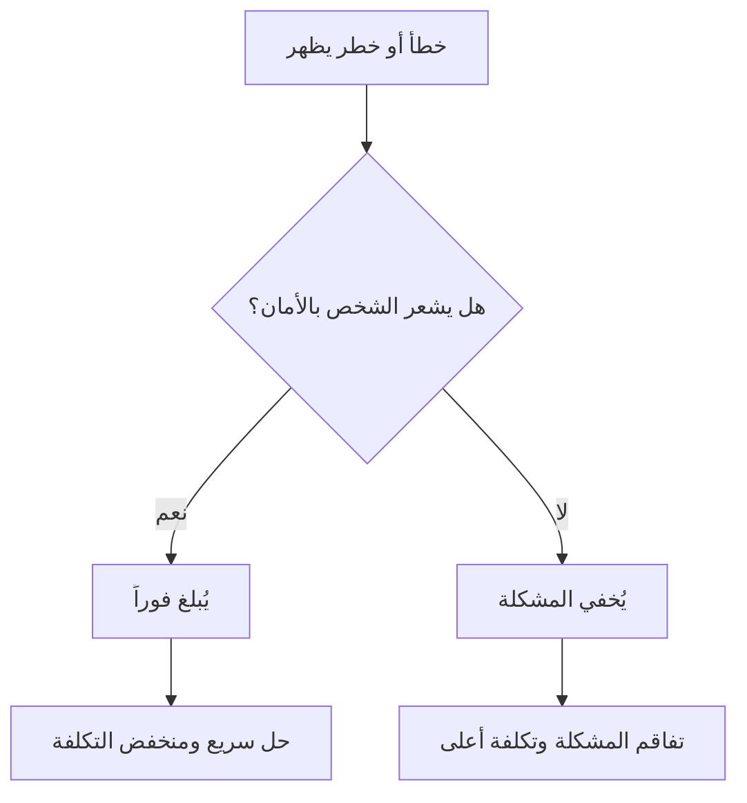

# الأمان النفسي (Psychological Safety)
> [!info] تعريف مختصر
> الأمان النفسي هو شعور أفراد الفريق بالطمأنينة الكافية للتحدث بصراحة، وطرح الأسئلة، والاعتراف بالأخطاء، ومخالفة الرأي السائد، دون خوف من العقاب أو الإحراج أو الإضرار بسمعتهم المهنية.

## الشرح العلمي والاحترافي
صاغت الباحثة الأمريكية إيمي إدموندسون (Amy Edmondson) هذا المفهوم بعد دراسة فرق طبية، ووجدت أن الفرق الأفضل أداءً هي التي تُبلّغ عن أخطائها أكثر لا أقل، لأنها تشعر بالأمان الكافي لذلك. لاحقاً أظهر مشروع أرسطو (Project Aristotle) في جوجل أن الأمان النفسي هو أهم عامل منفرد في نجاح الفرق، متفوقاً على الخبرة أو الذكاء الفردي.

كيف يعمل عملياً:
- الأعضاء يشاركون الأفكار غير الناضجة دون خوف من السخرية.
- يُبلّغون عن المخاطر والمشكلات (Blocker) مبكراً بدل إخفائها حتى تتفاقم.
- يختلفون مع القائد أو الأغلبية عند الضرورة دون خوف من الانتقام.
- يطلبون المساعدة والملاحظات (Feedback Loop) بصراحة.

لماذا يهم في إدارة المشاريع: في المنهجيات الرشيقة (Agile) يعتمد النجاح على الشفافية اليومية—في الوقفة اليومية (Daily Scrum) والاستعراض التعاوني (Sprint Retrospective). بدون أمان نفسي يتحول هذان الاجتماعان إلى تقارير سطحية بلا قيمة حقيقية، وتُخفى المشكلات حتى يفوت أوان حلّها بتكلفة منخفضة.

## أين ومتى يُستخدم
يُبنى الأمان النفسي بشكل خاص في:
- فرق سكرَم (Scrum) وكانبان، حيث الشفافية اليومية شرط أساسي للعمل.
- جلسات التقييم بعد نهاية السباق (Sprint Retrospective).
- الفرق ذاتية التنظيم (Self-Organizing Team) التي تتطلب استقلالية في اتخاذ القرار.
- أي بيئة عمل تعتمد على الابتكار والتجربة والخطأ السريع.

## مثال وسيناريو تطبيقي
> [!example] في شركة برمجيات، اكتشف مبرمج مبتدئ اسمه كريم قبل يومين من الإطلاق أنه نسي معالجة حالة خاصة (Edge Case) قد تُعطّل نظام الدفع لدى 5% من العملاء. في فريق يفتقر إلى الأمان النفسي كان سيخفي الخطأ خوفاً من اللوم. لكن بما أن قائد الفريق (Scrum Master) اعتاد أن يقول في كل استعراض تعاوني "الأخطاء المُبلَّغ عنها مبكراً هي هدايا لا كوارث"، بادر كريم بإبلاغ الفريق فوراً في اجتماع الوقوف اليومي. أُجّل الإطلاق يوماً واحداً، وتم إصلاح الخلل قبل أن يصل لأي عميل حقيقي، بدل أن يتحول إلى عطل حرج (Hotfix) بعد الإطلاق.

## خطوات أو مخطّط
1. القائد يعترف علناً بأخطائه الخاصة أولاً لتطبيع السلوك.
2. الاستجابة لأي خبر سيئ بالفضول ("ماذا تعلّمنا؟") لا باللوم.
3. دعوة الآراء المخالفة صراحة في الاجتماعات ("من يرى الأمر بشكل مختلف؟").
4. الاحتفاء بالإبلاغ المبكر عن المخاطر بدل معاقبته.
5. وضع قواعد واضحة في اتفاقية عمل الفريق (Team Working Agreement) تحمي حق الاعتراض.

## ⚠️ مفاهيم خاطئة شائعة
> [!warning]
> - الأمان النفسي ليس "لطفاً زائداً" أو تجنّباً للنقد؛ بل هو صراحة كاملة مع احترام الشخص لا مهاجمته.
> - لا يعني غياب المساءلة؛ الفرق الآمنة نفسياً غالباً أكثر مساءلة لأن المشكلات تُناقش علناً وبسرعة.
> - ليس مسؤولية الفرد فقط، بل ثقافة يبنيها القائد والمنظمة معاً عبر سلوك متكرر.

## ❌ ممارسات خاطئة في المشاريع
> [!failure]
> - معاقبة أول شخص يعترف بخطأ، مما يعلّم البقية إخفاء الأخطاء مستقبلاً — الحل: التعامل مع الأخطاء كفرص تعلّم في كل استعراض تعاوني (Sprint Retrospective).
> - السماح لصوت واحد (غالباً الأعلى مرتبة) بالسيطرة على كل نقاش — الحل: استخدام تيسير (Facilitation) يمنح الجميع فرصة الكلام، مثل جولة الكلام الدائرية.
> - الخلط بين "الأمان النفسي" و"الإدارة التفصيلية" (Micromanagement) المتساهلة؛ فالتساهل المفرط في الجودة ليس أماناً نفسياً بل تراخياً.

## 🔗 مصطلحات ومفاهيم ذات صلة
[[Servant Leadership]] | [[Team Working Agreement]] | [[Self-Organizing Team]] | [[Active Listening]] | [[Emotional Intelligence]] | [[10 - Sprint Retrospective]] | [[07 - Daily Standup]] | [[06 - Scrum Master]]

> [!tip] 💡 إثراء عملي — كورس الإنتاجية
> الأمان النفسي بوصفه **نظام إنذار مبكر** ضدّ الضربة العمياء، ومصفوفة إدموندسون، وعلاقته بكتابة الدَّين التقني: [[02 - المثلث الحديدي وانقلابه]] و[[04 - دوّامة الموت والدَّين التقني]].

> [!tip] 💡 إثراء عملي — كورس لعبة العقل
> الأمان النفسي **شرط** لكلّ أدوات التأثير لا نتيجة لها — وبدونه يُنتج السؤال الكاشف خططًا مُصطنَعة: [[Fake Yes]] و[[07 - إدارة الصراع - الطبقات الأربع والصراعات الخمسة]].

> [!tip] 💡 إثراء عملي — كورس الإنتاجية
> تعريف إدموندسون بأصله، ومصفوفة الأمان والمساءلة بمناطقها الأربع، وسبعة أسئلة تفحص وجوده بوقائع لا باستبيان: [[12 - نضج الفريق والأمان النفسي]].
