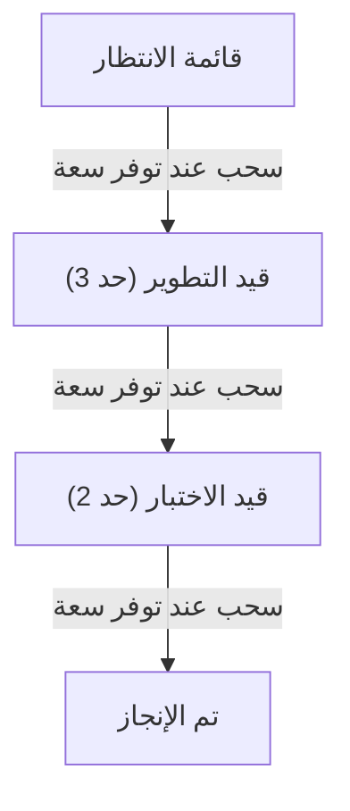

# نظام السحب (Pull System)

> [!info] تعريف مختصر
> نظام السحب هو أسلوب عمل لا يبدأ فيه أي شخص مهمة جديدة إلا عندما تصبح لديه سعة فعلية لإنجازها، بدلاً من أن تُدفَع المهام إليه من جهة أعلى بغضّ النظر عن انشغاله. العمل "يُسحب" من مرحلة إلى التي تليها حسب الطلب الحقيقي، لا حسب الخطة المسبقة.

## الشرح العلمي والاحترافي
- في المقابل يوجد "نظام الدفع" (Push System)، حيث تُوزَّع المهام حسب جدول زمني مسبق بغض النظر عمّا إذا كانت الفرق التالية جاهزة لاستقبالها، فتتكدّس المهام وتظهر الاختناقات (راجع [[Bottleneck]]).
- في نظام السحب، كل مرحلة لاحقة تسحب العمل من المرحلة السابقة فقط عندما تنتهي من عملها الحالي وتصبح لديها سعة (راجع [[Capacity]]).
- يعتمد نظام السحب عادة على حدود عمل قيد التنفيذ (راجع [[WIP Limit]])؛ فكل عمود أو مرحلة له سقف أقصى من المهام المسموح بوجودها فيه في آن واحد. عندما يمتلئ العمود، يتوقف السحب منه حتى يُفرَّغ مكان.
- الهدف الأساسي: تقليل العمل الجاري (WIP)، وتقليل التبديل بين المهام، وكشف الاختناقات مبكراً، وتحسين زمن الدورة (راجع [[Cycle Time]]) وزمن الاستجابة (راجع [[Lead Time]]).
- هذا المبدأ هو حجر الأساس في نظام إنتاج تويوتا (راجع [[Toyota Production System]]) وانتقل منه إلى تطوير البرمجيات عبر منهجية كانبان (راجع [[03 - Kanban]]).

## أين ومتى يُستخدم
- يُستخدم بشكل أساسي في كانبان، حيث تتحرك بطاقات المهام (راجع [[Kanban Card Structure]]) من عمود "قيد الانتظار" إلى "قيد التنفيذ" فقط عند توفر سعة.
- يُستخدم أيضاً في تدفقات "أعلى المصب وأسفل المصب" (راجع [[Upstream vs Downstream Kanban]]) لضبط تدفق المتطلبات إلى فرق التطوير.
- مفيد بشكل خاص في بيئات الدعم الفني، خطوط الإنتاج البرمجي المستمر (راجع [[CI and CD]])، وأي سياق يتطلب استقراراً في تدفق العمل بدلاً من دفعات كبيرة غير منتظمة.

## مثال وسيناريو تطبيقي
> [!example] فريق تطوير في شركة "بيانات السحاب" يستخدم لوحة كانبان بأعمدة: قائمة الانتظار، قيد التطوير (حد 3)، قيد الاختبار (حد 2)، تم الإنجاز.
> المطوّرة سارة تنهي مهمة برمجة واجهة الدفع وتنقلها إلى عمود "قيد الاختبار". بما أن هذا العمود يحتوي بالفعل على مهمتين (وصل إلى حده الأقصى 2)، لا يستطيع أحد إدخال مهمة سارة الجديدة فيه فوراً. بدلاً من ذلك، ينتظر المختبِر خالد حتى ينتهي من اختبار إحدى المهمتين الحاليتين، فيسحب مهمة سارة إلى عمود الاختبار. هذا يمنع تراكم مهام لا يستطيع أحد اختبارها، ويكشف أن فريق الاختبار هو نقطة الاختناق الحالية، فيقرر مدير المشروع إضافة مختبِر ثانٍ.

## خطوات أو مخطّط
1. حدّد مراحل تدفق العمل (مثل: انتظار، تطوير، اختبار، نشر).
2. ضع حد أقصى لعدد المهام في كل مرحلة (WIP Limit).
3. لا تبدأ مهمة جديدة في مرحلة ما إلا إذا كانت أقل من الحد الأقصى.
4. عندما تنتهي مرحلة من عملها، "تسحب" أقدم مهمة جاهزة من المرحلة السابقة.
5. راقب الاختناقات وعدّل الحدود أو الموارد بناءً على البيانات الفعلية.

## ⚠️ مفاهيم خاطئة شائعة
> [!warning]
> - الاعتقاد أن نظام السحب يعني "عدم وجود خطة"؛ في الواقع هو ضبط دقيق للتدفق وفق سعة حقيقية، وليس فوضى.
> - الخلط بين نظام السحب وبين مجرد استخدام لوحة كانبان؛ اللوحة أداة عرض، لكن السحب هو القاعدة السلوكية التي تحكم متى تتحرك المهام.
> - الظن أن حدود العمل الجاري (WIP Limit) عائق على الإنتاجية، بينما هي في الحقيقة ما يكشف الاختناقات ويحسّن التدفق الكلي.

## ❌ ممارسات خاطئة في المشاريع
> [!failure]
> - إدخال مهام جديدة إلى عمود ممتلئ "لأن المدير يريد ذلك بسرعة"، مما يُبطل فائدة النظام كله. الحل: الالتزام الصارم بحدود WIP ومناقشة الأولويات بدلاً من كسر الحد.
> - عدم تحديث حدود العمل الجاري مع تغيّر حجم الفريق، فتبقى الحدود قديمة وغير واقعية. الحل: مراجعة الحدود دورياً بالاعتماد على بيانات الأداء الفعلية.
> - استخدام السحب في المراحل الأولى فقط (مثل التطوير) وتجاهله في مراحل لاحقة كالنشر، فتظل الاختناقات مخفية. الحل: تطبيق مبدأ السحب على كامل تدفق القيمة (راجع [[Value Stream Mapping]]).

## 🔗 مصطلحات ومفاهيم ذات صلة
[[WIP Limit]] | [[Bottleneck]] | [[Cycle Time]] | [[Lead Time]] | [[Toyota Production System]] | [[Theory of Constraints]] | [[Upstream vs Downstream Kanban]] | [[Little's Law]] | [[03 - Kanban]] | [[16 - Task Boards]]
