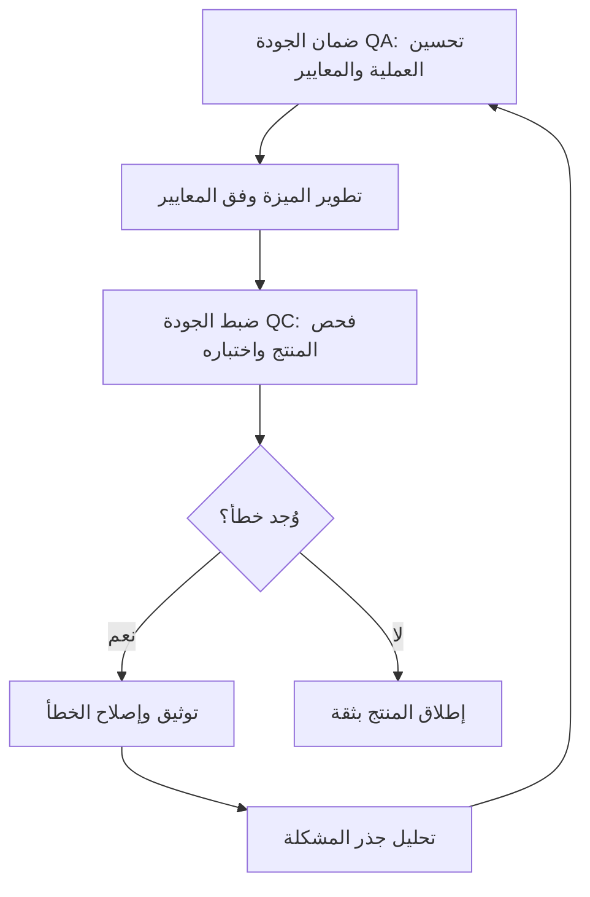

# ضمان الجودة مقابل ضبط الجودة (QA vs QC)
> [!info] تعريف مختصر
> ضمان الجودة مقابل ضبط الجودة (QA vs QC) مقارنة بين مفهومين مرتبطين لكنهما مختلفان جوهرياً: ضمان الجودة (Quality Assurance) نشاط وقائي يركّز على تحسين العملية لمنع الأخطاء، بينما ضبط الجودة (Quality Control) نشاط اكتشافي يركّز على فحص المنتج النهائي لإيجاد الأخطاء الموجودة فيه بالفعل.

## الشرح العلمي والاحترافي
- **ضمان الجودة (QA)**: نشاط "استباقي" (Proactive)، يهتم بـ"كيف نعمل؟". أمثلته: وضع معايير كتابة الكود، تعريف الجاهزية ([[Definition of Ready]])، مراجعات الكود، وتدريب الفريق. راجع [[Quality Assurance]] للتفصيل الكامل.
- **ضبط الجودة (QC)**: نشاط "رجعي" (Reactive)، يهتم بـ"هل هذا المنتج المحدد صحيح؟". أمثلته: تنفيذ حالات الاختبار (Test Cases)، اختبار الانحدار ([[Regression Testing]])، واختبار قبول المستخدم ([[UAT]]).
- تشبيه بسيط: ضمان الجودة يشبه وضع وصفة طبخ دقيقة وتدريب الطاهي عليها لمنع فساد الطبق من الأساس؛ ضبط الجودة يشبه تذوّق الطبق بعد طهيه للتأكد من أنه سليم قبل تقديمه للزبون.
- كلا النشاطين ضروريان ومكمّلان لبعضهما؛ فريق ناضج يستخدم ضبط الجودة (اكتشاف الأخطاء) كمصدر بيانات لتحسين ضمان الجودة (منع تكرار نفس نوع الخطأ مستقبلاً)، عبر تحليل جذر المشكلة ([[Root Cause Analysis]]).
- في الممارسة العملية، غالباً ما يُطلَق مصطلح "فريق QA" بشكل عام ليشمل الاثنين معاً، لكن التفريق الدقيق مهم عند تصميم عمليات الفريق وتوزيع المسؤوليات بوضوح.
- الاعتماد فقط على ضبط الجودة (اختبار مكثف في النهاية) دون ضمان جودة كافٍ يؤدي إلى دورة مكلفة من الاكتشاف والإصلاح المتكرر، بينما الاعتماد فقط على ضمان الجودة دون فحص فعلي قد يترك أخطاء غير متوقعة تصل للمستخدم.

## أين ومتى يُستخدم
- ضمان الجودة (QA) يبدأ من أول لحظة في المشروع، عند كتابة المتطلبات وصياغة معايير القبول بصيغة "إذا عندما فإن" ([[Given When Then]]).
- ضبط الجودة (QC) يُطبَّق في مراحل لاحقة ومحددة: بعد اكتمال تطوير الميزة، قبل الإطلاق، وأثناء اختبار الانحدار ([[Regression Testing]]) والاختبار الدخاني ([[Smoke Testing]]).
- يُستخدم هذا التمييز عند تصميم عمليات الجودة في المنظمة، لتحديد أي الأنشطة وقائية (تُدمَج في سير العمل اليومي) وأي منها اكتشافية (تُنفَّذ في نقاط تفتيش محددة).
- يُفيد أيضاً عند تحليل سبب تكرار مشكلة معيّنة: هل السبب ضعف في ضبط الجودة (لم يُكتشف الخطأ)، أم ضعف في ضمان الجودة (العملية نفسها تسمح بحدوث هذا النوع من الأخطاء)؟

## مثال وسيناريو تطبيقي
> [!example] سيناريو
> فريق يطوّر تطبيق حجوزات فنادق، وظهر خطأ متكرر: أسعار الغرف تُعرض أحياناً بعملة خاطئة للمستخدمين خارج الدولة.
> **من زاوية ضبط الجودة (QC)**: فريق الاختبار وجد الخطأ عبر تنفيذ حالة اختبار محددة "عرض السعر لمستخدم من دولة أخرى"، وأبلغ عنه، وأُصلح في نفس الإصدار.
> **من زاوية ضمان الجودة (QA)**: بعد ظهور هذا الخطأ للمرة الثالثة في ثلاثة إصدارات مختلفة، حلّل الفريق جذر المشكلة ووجد أن معايير القبول لأي ميزة تتعلق بالعملة لا تتضمن أبداً سيناريو "مستخدم خارج الدولة الافتراضية". فأضاف الفريق قالباً إلزامياً (Template) لمعايير القبول يتضمن هذا السيناريو تلقائياً في كل قصة مستخدم مستقبلية تتعلق بالأسعار، فمنع تكرار هذا النوع من الأخطاء من الأساس.

## خطوات أو مخطّط
1. تطبيق ضمان الجودة (QA) منذ كتابة المتطلبات: معايير قبول واضحة، تعريف جاهزية واكتمال دقيق.
2. تطوير الميزة وفق هذه المعايير المتفَق عليها.
3. تطبيق ضبط الجودة (QC): تنفيذ حالات اختبار فعلية لاكتشاف أي أخطاء موجودة في المنتج.
4. توثيق الأخطاء المكتشفة وتصنيفها حسب الشدة والأولوية ([[Severity vs Priority]]).
5. تحليل الأخطاء المتكررة (Root Cause) وتغذية النتائج مرة أخرى لتحسين إجراءات ضمان الجودة، لإغلاق الحلقة.

## ⚠️ مفاهيم خاطئة شائعة
> [!warning]
> - الاعتقاد أن QA وQC مصطلحان مترادفان تماماً؛ في الواقع الفرق جوهري: أحدهما وقائي يستهدف العملية، والآخر اكتشافي يستهدف المنتج.
> - الظن أن "فريق QA" يعني بالضرورة فريق ضمان الجودة فقط؛ في كثير من الشركات يقوم "فريق QA" فعلياً بمعظم مهام ضبط الجودة (الاختبار) وليس ضمان الجودة الحقيقي.
> - الاعتقاد أن الاستثمار في ضبط الجودة (اختبار أكثر) بديل كافٍ عن ضمان الجودة (تحسين العملية)؛ فحص أكثر لا يقلّل عدد الأخطاء المُنتَجة، بل يكتشفها فقط بعد حدوثها.

## ❌ ممارسات خاطئة في المشاريع
> [!failure]
> - الاعتماد الكامل على ضبط الجودة (اختبار مكثف قبل الإطلاق) دون أي استثمار في ضمان الجودة، مما يجعل كل إصدار مكلفاً ومتوتراً. التجنب: تخصيص وقت لتحسين معايير كتابة المتطلبات والكود، لا فقط زيادة عدد المختبرين.
> - عدم تحليل الأخطاء المتكررة التي يكتشفها ضبط الجودة، فتظل المشكلة الجذرية دون حل. التجنب: ربط كل خطأ متكرر بجلسة تحليل جذر مشكلة ([[Root Cause Analysis]]) دورية.
> - الخلط بين المسؤوليتين عند توزيع الأدوار، فيُطلَب من فريق الاختبار "ضمان" جودة لا يملكون صلاحية تغيير العملية من أجلها. التجنب: توضيح أن ضمان الجودة مسؤولية الفريق كله، بينما ضبط الجودة مهمة محددة لفريق الاختبار.

## 🔗 مصطلحات ومفاهيم ذات صلة
[[Quality Assurance]] | [[Regression Testing]] | [[UAT]] | [[Smoke Testing]] | [[Root Cause Analysis]] | [[Severity vs Priority]] | [[Given When Then]] | [[Escaped Defect Rate]] | [[Risk-Based Testing]] | [[20 - Quality Management]]
