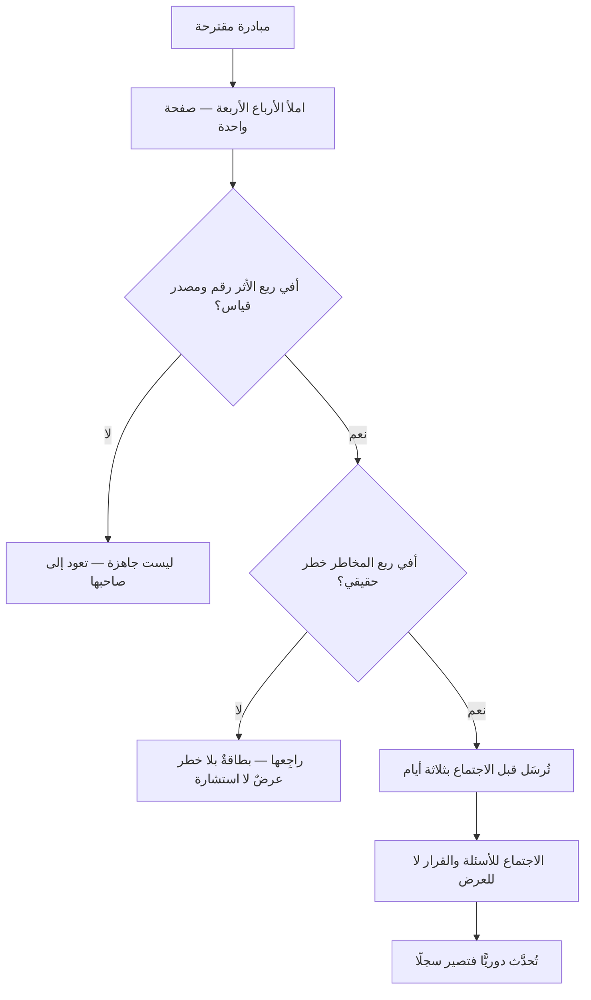

# البطاقة الرباعية (Quad Chart)

> [!info] تعريف مختصر
> **البطاقة الرباعية** صفحةٌ واحدة مقسومة أربعة أرباع، يحمل كلٌّ منها سؤالًا ثابتًا عن المبادرة: **المشكلة** · **المقاربة** · **الأثر المتوقّع** · **الحالة والمخاطر**. نشأت في التقارير البرامجية الحكومية والدفاعية، ثم شاعت أداةً لعرض المبادرات على القيادة.
> **وقيمتها في القيد لا في الشكل:** أن يُجبَر صاحب المبادرة على أن يقول كل ما يلزم في صفحة، **وأن تصير عشرون مبادرة قابلة للمقارنة** لأنها كُتبت جميعًا على القالب نفسه. فالمقارنة تحتاج صيغةً موحّدة، لا مزيدًا من التفصيل.

> [!info] إضافة مرجعية — «البطاقة الرباعية» لا «المخطّط الرباعي»
> يُترجَم `Quad Chart` أحيانًا «المخطّط الرباعي»، **وهو يلتبس في هذه الموسوعة بشيء آخر تمامًا**: **مخطّط الأرباع** (`quadrantChart`) — وهو رسمٌ بمحورين تُوضع عليه نقاط، وله في المستودع قاعدة مستقلّة (القاعدة 9/أ) وأداة فحص ترسمه وتقيس تراكب أسمائه.
> **والفرق جوهريّ:** ذاك **رسمٌ بيانيّ** يوزّع عناصر على محورين كمّيّين، وهذه **صفحةُ نصّ** مقسومة أربعة حقول لا محاور لها ولا قياس. فاعتُمد **«البطاقة الرباعية»** رفعًا للّبس، و«المخطّط الرباعي» مثبت في `aliases` ليجده الباحث.

## الشرح العلمي والاحترافي

**والأرباع الأربعة** تتغيّر عناوينها بحسب الجهة، والغالب المتداوَل:

| الرُّبع | سؤاله | ما يُفسده |
|---|---|---|
| **المشكلة والحاجة** | ما الوجع؟ ومن يشعر به؟ ومنذ متى؟ | أن يُكتب الحلّ في صيغة مشكلة («نحتاج نظامًا جديدًا») |
| **المقاربة** | ما الحلّ المقترح في جملتين؟ وما البدائل التي رُفضت؟ | أن يُملأ بتفاصيل تقنية لا تُغيّر القرار |
| **الأثر المتوقّع** | ماذا يتغيّر إن نجح؟ وبأيّ رقم يُعرف؟ | أن يُكتب المخرَج مكان [[22 - Outputs and Outcomes\|الأثر]] |
| **الحالة والمخاطر** | أين نحن؟ وما أخطر ما قد يوقفه؟ ومن يملك القرار العالق؟ | أن يُكتفى بالحالة وتُحذف المخاطر |

**والرُّبع الرابع هو مقياس صدق البطاقة كلّها.** فالبطاقة التي لا خطر فيها إمّا أن صاحبها لا يعرف مبادرته، وإمّا أنه يعرض لا يستشير. **والقيادة التي تعاقب على ذكر المخاطر تتلقّى بطاقاتٍ خضراء كلّها** حتى يقع ما كان معلومًا.

**ولماذا تنفع؟** لثلاثة أسباب لا صلة لها بالجمال:

1. **القيد يكشف الضعف.** فالفكرة التي لا تُشرح في صفحة، غالبًا لم تُفكَّر بعد. **والصفحة الواحدة تشخيصٌ قبل أن تكون عرضًا.**
2. **التوحيد يُتيح المقارنة.** عشرون مبادرة على قالب واحد تُقارَن في نصف ساعة؛ وعشرون عرضًا مختلف الشكل لا تُقارَن أصلًا.
3. **الأرباع تمنع الاختزال المعتاد.** فالعارض يميل إلى الحلّ والحالة، ويترك المشكلة والأثر. والقالب يمنعه.

**وموضعها من جيرانها** — ولكلٍّ غرض لا يؤدّيه غيره:

| ما تفعله | **البطاقة الرباعية** | **[[Working Backwards\|PR/FAQ]]** | **[[Business Case\|دراسة الجدوى]]** | **A3** |
|---|---|---|---|---|
| تُكتب لأجل | **المقارنة بين مبادرات** | اختبار الفكرة بلغة العميل | إثبات الجدوى المالية | حلّ مشكلة قائمة |
| شكلها | أربعة حقول | سرد ونشرة وأسئلة | نموذج مالي وسيناريوهات | صفحة بمنهج PDCA |
| تجيب عن | ما هذه؟ وأتستحقّ؟ | أيستحقّ أن يُبنى؟ | أيربح؟ | لماذا يقع الخلل؟ |
| مصدرها | التقارير البرامجية | أمازون | إدارة المشاريع | [[Toyota Production System\|تويوتا]] |

## أين ومتى يُستخدم

- **في استقبال المبادرات** ([[Project Intake]]): بطاقةٌ لكل طلب قبل أن يُدرَس، فتسقط الطلبات التي لا تملأ ربعها الأوّل.
- **في المراجعة الربعية للمحفظة**، حيث تُعرض المبادرات معًا فتُقارَن.
- **في [[Steering Committee|لجنة التوجيه]]** بديلًا عن عرضٍ من أربعين شريحة يخرج منه الحاضرون بلا قرار.
- **قبل طلب تمويل**، تمرينًا على التكثيف: من عجز عن ملء الأرباع لم يجهّز طلبه بعد.
- **في المتابعة الدورية**، إذ تُحدَّث البطاقة نفسها فتصير سجلًّا مقروءًا لتطوّر المبادرة.

> [!warning] متى لا تُستخدَم؟
> - **بديلًا عن التحليل.** هي **واجهة** لعمل تحتها؛ ومن ملأها بلا تحليل ملأها بالعبارات.
> - **في القرارات الكبيرة ذات الأثر المالي الثقيل.** تصلح مدخلًا، ولا تغني عن [[Business Case|دراسة جدوى]].
> - **في التفاصيل التنفيذية.** ليست خطّة ولا [[Functional Specification|مواصفة]].
> - **حيث تكون المبادرة واحدة لا مبادرات.** فقيمتها الأولى في المقارنة، وتقلّ حين لا يوجد ما يُقارَن.

## مثال وسيناريو تطبيقي

> [!example] «شركة نُهى» — تسع عشرة مبادرة، وثلاث ساعات بلا قرار
> **الوضع:** المراجعة الربعية: تسع عشرة مبادرة، كلٌّ يعرضها صاحبها بعرضٍ من صنعه. **ثلاث ساعات، واعتُمدت أربع، وأُجّلت خمس عشرة إلى «مراجعة إضافية»** — أي إلى لا شيء.
> **ما ظهر عند التحليل:** لم يكن العجز في القرار بل في **تعذّر المقارنة**: أصحاب المبادرات التقنية عرضوا المعمارية، وأصحاب مبادرات السوق عرضوا الأرقام، وثلاثة لم يذكروا خطرًا واحدًا.
> **ما فُعل في الربع التالي:** بطاقة رباعية واحدة لكل مبادرة، صفحةٌ واحدة، تُرسَل قبل الاجتماع بثلاثة أيام. ولا عروض.
> **ما وقع في الجلسة:**
> - **سقطت ستّ مبادرات قبل الاجتماع أصلًا**، لأن أصحابها عجزوا عن ملء ربع «الأثر» برقم.
> - وظهر أن مبادرتين تعالجان المشكلة نفسها بطريقين — **وما كان ذلك ليُرى في عرضين منفصلين**، وإنّما رُئي لأن ربع «المشكلة» كُتب بالصيغة نفسها في البطاقتين.
> - وانتهت الجلسة في خمس وسبعين دقيقة بأحد عشر قرارًا.
> **والدرس:** ما غيّر النتيجة ليس أن المعلومة زادت، **بل أنها صارت قابلة للاصطفاف**. والقرار المقارن يحتاج صيغةً موحّدة أكثر ممّا يحتاج تفصيلًا.

## خطوات أو مخطّط

1. **ثبّت الأرباع الأربعة** لمؤسّستك ولا تغيّرها بين المبادرات، فالتوحيد هو الأداة.
2. **ابدأ بالمشكلة**، واكتبها بلا ذكر الحلّ — واختبرها: أيفهمها من ليس من مجالك؟
3. **اكتب الأثر برقم** ومصدر قياس، ولا تكتب مخرَجًا مكانه.
4. **املأ ربع المخاطر بأصدق ما تعرف**، واذكر القرار العالق ومن يملكه.
5. **صفحة واحدة — بلا تصغير الخطّ.** فما لم يتّسع فليس صالحًا لهذا المستوى.
6. **أرسلها قبل الاجتماع**، واجعل الاجتماع للأسئلة والقرار لا للعرض.
7. **حدّثها دوريًّا** ولا تُنشئ غيرها، فتصير سجلًّا لا لقطة.

## ⚠️ مفاهيم خاطئة شائعة

> [!warning]
> - **الخلط بينها وبين مخطّط الأرباع البيانيّ** (`quadrantChart`) — كـ[[Eisenhower Matrix|مصفوفة أيزنهاور]] و[[Probability and Impact Matrix|مصفوفة الاحتمال والأثر]]. انظر صندوق الإضافة المرجعية أعلاه: هذه صفحة نصّ، وتلك رسمٌ بمحورين تُوضع عليه نقاط.
> - **حسبانها تقرير حالة.** الحالة رُبعٌ واحد من أربعة؛ ومن اختزلها فيه ألغى ما وُجدت له.
> - **الظنّ بأن الصفحة الواحدة تعني عملًا أقلّ.** التكثيف أشقّ من التوسّع، وأكثر ما يُكشف فيه ضعف الفكرة.
> - **تغيير الأرباع لكل مبادرة** — فتذهب القابلية للمقارنة، وهي القيمة الأولى.
> - **تصغير الخطّ ليتّسع كل شيء** — فتصير صفحةً واحدة شكلًا وثلاثًا مضمونًا، ولا تُقرأ.

## ❌ ممارسات خاطئة في المشاريع

> [!failure]
> - **كتابة الحلّ في ربع المشكلة** («نحتاج نظام تذاكر جديدًا») — فيُقفَل باب البدائل قبل أن يُفتح. **الحلّ:** المشكلة تُوصف بأثرها على من يعانيها.
> - **ملء ربع الأثر بمخرجات** («سنطلق ثلاث ميزات») — فلا يُعرف ماذا يتغيّر. **الحلّ:** رقم وأثر ومصدر قياس ([[22 - Outputs and Outcomes]]).
> - **تجميل ربع المخاطر** — فتُتّخذ القرارات على صورة غير صادقة. **الحلّ:** اجعل ذكر الخطر مطلوبًا لا محسوبًا على صاحبه.
> - **عرضها في الاجتماع بدل إرسالها قبله** — فيعود الاجتماع عرضًا. **الحلّ:** تُقرأ قبله، ويُخصّص الوقت للأسئلة.
> - **إنشاء بطاقة جديدة كل ربع** — فيضيع تاريخ المبادرة. **الحلّ:** بطاقة واحدة تُحدَّث، ويُحفظ تاريخ تحديثها.
> - **استعمالها لتبرير قرار متّخذ** — فتصير غطاءً إجرائيًّا. **الحلّ:** إن كان القرار متّخذًا فقُل ذلك، واستعملها لكشف المخاطر لا للتشاور الصوريّ.

## 🔗 مصطلحات ومفاهيم ذات صلة

[[Business Case]] | [[Working Backwards]] | [[Project Intake]] | [[Steering Committee]] | [[22 - Outputs and Outcomes]] | [[Project Health Report]] | [[RAG Status]] | [[Decision Log]] | [[Non-Goals]] | [[23 - Project Program Portfolio]] | [[WSJF]]
