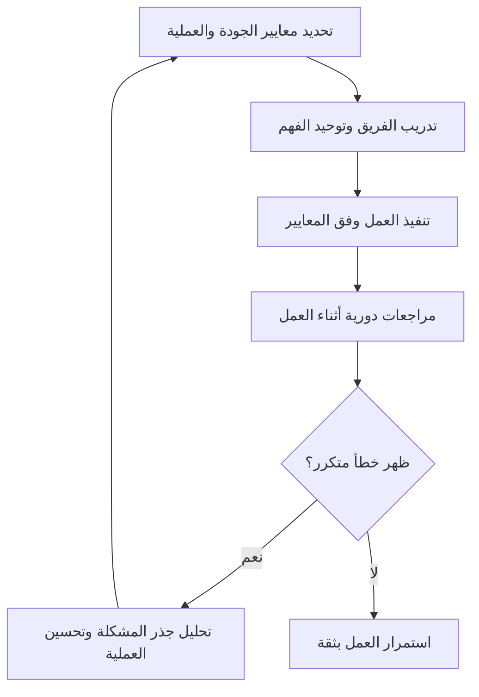

# ضمان الجودة (Quality Assurance)
> [!info] تعريف مختصر
> ضمان الجودة (Quality Assurance واختصاراً QA) هو مجموعة الأنشطة والعمليات الوقائية المنظَّمة التي تهدف إلى منع حدوث الأخطاء من الأساس، من خلال تحسين طريقة العمل نفسها وليس فقط فحص المنتج النهائي بعد اكتماله.

## الشرح العلمي والاحترافي
- ضمان الجودة يركّز على "العملية" (Process) وليس فقط على "المنتج"؛ فهو يسأل: هل طريقة عملنا صحيحة بما يكفي لتنتج منتجاً جيداً بشكل ثابت ومتكرر؟
- يشمل ذلك: وضع معايير كتابة الكود، مراجعات الكود (Code Reviews)، تحديد معايير القبول بوضوح، تدريب الفريق، واستخدام قوائم تحقق (Checklists) قبل كل مرحلة.
- يختلف جوهرياً عن ضبط الجودة (Quality Control واختصاراً QC)، الذي يركّز على فحص المنتج الفعلي بعد إنتاجه لاكتشاف الأخطاء الموجودة فيه؛ راجع [[QA vs QC]] للتفصيل الكامل في الفرق بينهما.
- من أدوات ضمان الجودة الشائعة: تعريف الجاهزية ([[Definition of Ready]]) وتعريف الاكتمال ([[Definition of Done]])، اللذان يمنعان دخول عمل غير مكتمل التعريف إلى مرحلة التطوير أو خروجه دون اكتمال حقيقي.
- تحليل جذر المشكلة ([[Root Cause Analysis]]) جزء مهم من ضمان الجودة؛ فبدلاً من إصلاح كل خطأ بشكل منفرد، يُحلَّل السبب الجذري لمنع تكرار نفس نوع الخطأ مستقبلاً.
- الإزاحة نحو اليسار (Shift-Left) هي فلسفة حديثة ضمن ضمان الجودة، تعني دمج التفكير في الجودة والاختبار في وقت مبكر جداً من دورة التطوير، بدلاً من تأجيله لمرحلة الاختبار النهائية فقط؛ راجع [[Shift-Left and Shift-Right]].
- في المنظمات الناضجة، ضمان الجودة مسؤولية الفريق بأكمله وليس فقط "قسم QA"؛ فكل مطوّر ومصمم ومدير منتج يساهم في منع الأخطاء من البداية.

## أين ومتى يُستخدم
- يُطبَّق طوال دورة حياة المشروع بدءاً من مرحلة التخطيط وكتابة المتطلبات، وليس فقط في مرحلة الاختبار النهائية.
- يظهر بوضوح عند صياغة تعريف الجاهزية ([[Definition of Ready]]) قبل قبول أي قصة مستخدم ([[11 - User Stories]]) في السبرنت.
- يُستخدم في مراجعات الكود، وفي وضع معايير قبول واضحة بصيغة "إذا عندما فإن" ([[Given When Then]]) قبل البدء بالتطوير.
- يُطبَّق في منهجيات أجايل ([[01 - Agile]]) عبر ممارسات مثل البرمجة القصوى ([[Extreme Programming]]) التي تدمج الجودة داخل عملية التطوير نفسها.

## مثال وسيناريو تطبيقي
> [!example] سيناريو
> شركة تطوّر منصة تعليم إلكتروني لاحظت أن 30% من الأخطاء المكتشفة في الاختبار سببها متطلبات غامضة كُتبت من البداية بشكل غير دقيق.
> بدلاً من الاستمرار في إصلاح الأخطاء واحداً تلو الآخر بعد ظهورها (وهذا ضبط جودة QC)، قرر مدير الجودة تطبيق إجراء ضمان جودة QA جديد: لن تُقبل أي قصة مستخدم في السبرنت ما لم تحتوِ على معايير قبول مكتوبة بصيغة "إذا عندما فإن" ([[Given When Then]]) ومُراجَعة من فريق الاختبار مسبقاً.
> بعد ثلاثة أشهر من تطبيق هذا الإجراء الوقائي، انخفضت الأخطاء الناتجة عن سوء الفهم بنسبة 70%، لأن المشكلة عُولجت من مصدرها بدلاً من إصلاح أعراضها المتكررة.

## خطوات أو مخطّط
1. تحديد معايير واضحة للعمل الجيد قبل البدء (مثل تعريف الجاهزية وتعريف الاكتمال).
2. تدريب الفريق على هذه المعايير وتوحيد الفهم بينهم.
3. دمج مراجعات دورية (مراجعة الكود، مراجعة المتطلبات) في سير العمل اليومي.
4. رصد الأخطاء المتكررة وتحليل جذرها لتحديد أين تفشل العملية نفسها.
5. تحديث العملية والمعايير باستمرار بناءً على الدروس المستفادة، لا الاكتفاء بإصلاح كل خطأ بمفرده.

## ⚠️ مفاهيم خاطئة شائعة
> [!warning]
> - الخلط بين ضمان الجودة وضبط الجودة؛ ضمان الجودة وقائي ويستهدف العملية، بينما ضبط الجودة اكتشافي ويستهدف المنتج النهائي. راجع [[QA vs QC]].
> - الاعتقاد أن ضمان الجودة مسؤولية "قسم QA" فقط؛ في الحقيقة هو مسؤولية جماعية تبدأ من صاحب المنتج والمطوّر وتنتهي بفريق الاختبار.
> - الظن أن تطبيق إجراءات ضمان الجودة يبطئ العمل؛ في الواقع هو يقلّل إعادة العمل (Rework) والوقت الضائع في إصلاح أخطاء كان يمكن منعها من الأساس.

## ❌ ممارسات خاطئة في المشاريع
> [!failure]
> - الاكتفاء بفريق اختبار منفصل يفحص المنتج في النهاية دون أي إجراءات وقائية مبكرة. التجنب: دمج معايير الجودة في كل مرحلة، بدءاً من كتابة المتطلبات وليس فقط قبل الإطلاق.
> - تجاهل تحليل جذر الأخطاء المتكررة والاكتفاء بإصلاحها سطحياً في كل مرة. التجنب: تخصيص وقت دوري لتحليل الأخطاء المتكررة وتحديث العملية بناءً على النتائج.
> - عدم إشراك فريق الجودة في مراحل التخطيط المبكرة، فيكتشفون المشاكل متأخراً جداً. التجنب: إشراك ممثل عن الجودة منذ اجتماعات تنقيح المتراكم ([[Backlog Refinement]]) الأولى.

## 🔗 مصطلحات ومفاهيم ذات صلة
[[QA vs QC]] | [[Definition of Ready]] | [[Definition of Done]] | [[Given When Then]] | [[Root Cause Analysis]] | [[Shift-Left and Shift-Right]] | [[Extreme Programming]] | [[Regression Testing]] | [[Escaped Defect Rate]] | [[20 - Quality Management]]
