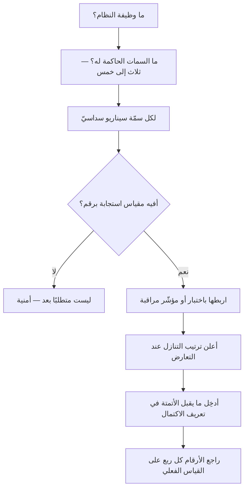

# سمات جودة النظام (Quality Attributes)

> [!info] تعريف مختصر
> **سمات جودة النظام** هي ما يصف **كيف** يؤدّي النظام وظيفته، لا **ما** الوظيفة: سرعته، وإتاحته، وأمنه، وقابليته للصيانة والتوسّع والاستعمال. وتُسمّى تقليديًّا **المتطلبات غير الوظيفية (Non-functional Requirements)**، ويجمعها المعيار **ISO/IEC 25010** في نموذج جودة المنتج.
> **وقاعدتها الحاكمة:** السمة لا تصير متطلبًا حتى **تُقاس**. فـ«يجب أن يكون النظام سريعًا» أمنيةٌ لا يُحاسَب عليها أحد ولا تُختبر؛ و«تحت 500 مستخدم متزامن، يعود 95٪ من طلبات البحث في أقلّ من 300 مِلّي ثانية» متطلبٌ يُبنى عليه ويُختبر ويُقبَل أو يُرفض.

## الشرح العلمي والاحترافي

**وأثرها المعماريّ هو ما يميّزها:** فالمتطلب الوظيفي يمكن أن يُضاف بعد البناء غالبًا، أمّا سمّة الجودة فتُقرّر **بنية النظام** — وتغييرها بعد الإطلاق يعني في الغالب إعادة بناء لا تعديلًا. ولهذا يقال في هندسة المعمارية إن المعمارية إنما تُصمَّم لسمات الجودة لا للوظائف.

**والسمات تتنازع فيما بينها**، وهذا وجهها الذي يُغفَل: فزيادة الأمن تُنقص السرعة والسهولة، وزيادة قابلية التوسّع تُنقص البساطة وتُغلي الكلفة. **فليس المطلوب أن تُعظَّم كلّها**، بل أن يُعلَن أيّها يُقدَّم عند التعارض — **والقرار الذي لم يُتّخذ صراحةً يُتّخذ ضمنًا عند أوّل مفاضلة، ويتّخذه المطوّر وحده في الساعة الثالثة صباحًا**.

### نموذج ISO/IEC 25010 — وما تغيّر فيه

| النسخة | السمات |
|---|---|
| **2011** — ثماني سمات | الملاءمة الوظيفية · كفاءة الأداء · التوافقية · **قابلية الاستعمال** · الموثوقية · الأمن · قابلية الصيانة · **قابلية النقل** |
| **2023** — تسع سمات | الملاءمة الوظيفية · كفاءة الأداء · التوافقية · **قابلية التفاعل** · الموثوقية · الأمن · قابلية الصيانة · **المرونة** · **السلامة** |

**وثلاثة تغييرات تستحقّ البيان** (والقارئ يلقى النسخة القديمة في مراجع كثيرة، فمعرفته بأنها **سابقة** لا **خاطئة** توفّر عليه حيرة):

1. **أُضيفت السلامة (Safety)** سمّةً مستقلّة — لأن الأنظمة صارت تقود مركبات وتدير أجهزة طبية، فلم يعد ضرر الفشل ماليًّا فحسب.
2. **صارت «قابلية الاستعمال» قابليةَ تفاعل (Interaction Capability)** — توسيعًا يشمل تفاعل من ليس إنسانًا سويّ الحواس، ويضمّ إمكانية الوصول ضمنًا.
3. **وصارت «قابلية النقل» مرونةً (Flexibility)** — إذ لم يعد الأمر نقلًا بين بيئات فحسب، بل قابليةً للتكيّف والتوسّع والتعديل.

### السيناريو: كيف تصير السمّة قابلة للاختبار

أنفع ما وُضع لتحويل السمّة إلى متطلب هو **سيناريو سمّة الجودة** عند **باس وكليمنتس وكازمان** في *Software Architecture in Practice*، وهو ستّة أجزاء:

| الجزء | سؤاله | مثاله |
|---|---|---|
| المصدر | من أو ما الذي يولّد المثير؟ | مستخدم مسجَّل |
| المثير | ما الحدث؟ | يطلب بحثًا في الكتالوج |
| المصنوع | أيّ جزء من النظام؟ | خدمة البحث |
| البيئة | في أيّ حال؟ | تحت 500 مستخدم متزامن |
| الاستجابة | ماذا يجب أن يقع؟ | تعود النتائج كاملة |
| **مقياس الاستجابة** | **بأيّ رقم يُحكم؟** | **95٪ منها في أقلّ من 300 مِلّي ثانية** |

**والجزء السادس هو الفارق كلّه.** فالخمسة الأولى تصف موقفًا، والسادس وحده يجعل السمّة **قابلة للقبول أو الردّ** — وبه يُكتب اختبار، ويُبنى بند في [[Definition of Done|تعريف الاكتمال]]، وتُصاغ [[SLA|اتّفاقية مستوى الخدمة]].

> [!info] إضافة مرجعية — «غير وظيفية» تسمية مضلِّلة
> جرى الاصطلاح على **«المتطلبات غير الوظيفية»**، والتسمية منتقَدة بحقّ: فالنظام الذي لا يستجيب **لا يؤدّي وظيفته** عند المستخدم، ولا فرق عنده بين ميزة ناقصة وميزة بطيئة إلى حدّ العطل. ولهذا صار المتداوَل في أدبيات المعمارية **«سمات الجودة»**، وهي التي اعتُمدت هنا.
> **ونُبقي «المتطلبات غير الوظيفية» في `aliases` لا نُسقطها**، لأن القارئ يلقاها في كل كرّاسة متطلبات وفي `PRD` وفي عقود التوريد، ومنعُها يقطعه عن مراجعه. **فهذا اختيارُ لفظٍ مفضَّل لا حظرُ لفظٍ شائع** (القاعدة 6/ب-٢).

## أين ومتى يُستخدم

- **في وثيقة المتطلبات وعقود التوريد**، حيث يكون غيابها أشيع سبب لنزاعٍ لا يُحسم: المورّد سلّم الوظائف، والعميل يقول إن النظام «لا يصلح للعمل».
- **قبل اختيار المعمارية**، فهي مدخلها لا مخرجها.
- **في [[Definition of Done|تعريف الاكتمال]]**: بند أداء وبند أمن مقيسان يمنعان أن تُعدّ الميزة منجزةً وهي لا تحتمل الحمل.
- **في المفاضلة عند ضيق الوقت**: الترتيب المعلن مسبقًا هو الذي يجعل التنازل قرارًا لا تسريبًا.
- **في تقدير الكلفة**: أكثر انفجارات التقدير مصدرها سمّة لم تُذكر — كأن يُقدَّر النظام لمئة مستخدم ثم يُطلب لعشرة آلاف.

> [!warning] متى لا يُستخدَم؟
> - **استيفاءً لقائمة المعيار كلّها.** تسع سمات بأرقام لكل نظام تكلّفٌ يُنتج أرقامًا لا يقيسها أحد. **والقاعدة: ثلاث إلى خمس سمات حاكمة، والباقي يُذكر بلا رقم.**
> - **في نموذج أوّلي (`Prototype`) أو إثبات مفهوم**، فغرضه التعلّم لا التشغيل، وتحميله سمات الإنتاج يقتل سرعته.
> - **بلا بيانات مرجعية.** الرقم المخترع أسوأ من غيابه: يُبنى عليه، ويُختبر عليه، ولا يمثّل شيئًا. فإن لم تعرف، فاكتب «يُقاس خطّ الأساس في الأسبوع الأوّل ثم يُثبَّت».

## مثال وسيناريو تطبيقي

> [!example] «منصّة عافية» — النظام مسلَّم كاملًا ومرفوض كاملًا
> **الوضع:** كرّاسة متطلبات فيها 210 متطلبًا وظيفيًّا مفصّلًا، وسطران عن الأداء: «يجب أن يكون النظام سريعًا وآمنًا».
> **عند التسليم:** الوظائف كلّها تعمل. ورفض العميل الاستلام.
> **وأسبابه ثلاثة، ولا واحد منها وظيفيّ:**
> - شاشة المواعيد تستغرق تسع ثوانٍ في ذروة الصباح — و«سريع» لم تُعرَّف.
> - النظام لا يحتمل أكثر من 80 مستخدمًا متزامنًا، والعيادة فيها 300.
> - لا سجلّ وصول إلى بيانات المرضى — وهو مطلوب نظاميًّا، ولم يرد في الكرّاسة.
> **وموضع الخلل:** لا المورّد خالف الكرّاسة، ولا العميل طلب ما لم يكتبه. **بل كُتبت الوظائف ولم تُكتب سمّات الجودة**، فبُنيت المعمارية على أضعف احتمال — وهو الاحتمال الوحيد المتّسق مع نصّ الكرّاسة.
> **ما كان يمنعه:** ثلاثة أسطر مقيسة — زمن الاستجابة عند الذروة، وعدد المستخدمين المتزامنين، وسجلّ الوصول ومدّة حفظه.
> **والدرس:** ما لم يُقس لم يُبنَ؛ ولن يتطوّع مورّد ببناء سعةٍ لم تُطلب ولم تُدفَع.

## خطوات أو مخطّط

1. **اختر ثلاثًا إلى خمس سمات حاكمة** لهذا النظام بعينه، وسمِّ من طلبها.
2. **اكتب لكلٍّ سيناريو سداسيًّا**، والسادس رقمٌ لا صفة.
3. **أعلن ترتيب التنازل**: إن تعارض الأمن والسرعة، أيّهما يُقدَّم؟ **واكتبه قبل أن يقع التعارض.**
4. **اربط كلًّا باختبار** — اختبار حمل، أو فحص أمن، أو مؤشّر مراقبة في الإنتاج.
5. **أدخِل ما يقبل الأتمتة في [[Definition of Done|تعريف الاكتمال]]**، فما بقي خارجه يُنسى.
6. **راجع الأرقام كل ربع** على القياس الفعليّ لا على التقدير الأوّل.

## ⚠️ مفاهيم خاطئة شائعة

> [!warning]
> - **الظنّ بأنها ثانوية.** هي التي تقرّر المعمارية، وتغييرها بعد البناء إعادةُ بناء غالبًا.
> - **حسبان «غير وظيفية» تعني «لا يراها المستخدم».** بل هي أظهر ما يراه: البطء والانقطاع أوّل ما يشكو منه.
> - **الخلط بينها وبين [[SLA|اتّفاقية مستوى الخدمة]].** السمّة **متطلب هندسيّ** يُبنى عليه النظام، والاتّفاقية **التزام تعاقديّ** له جزاء — وقد تكون الثانية أرخى من الأولى عمدًا.
> - **الظنّ بأن المعيار يوجب استيفاء سمّاته كلّها.** هو **نموذج تصنيف** يعينك على ألّا تنسى بابًا، لا قائمة إلزام.
> - **الخلط بين قابلية الاستعمال وإمكانية الوصول.** الثانية جزء من الأولى في تصنيف المعيار، ولها مرجعها المستقلّ ومتطلباتها النظامية.
> - **الاكتفاء بذكرها في وثيقة المتطلبات** بلا اختبار يقيسها — فتُكتب وتُنسى ولا يُكتشف إخلافها إلا في الإنتاج.

## ❌ ممارسات خاطئة في المشاريع

> [!failure]
> - **كتابة صفات بلا أرقام** («سريع · آمن · قابل للتوسّع») — فلا يُقبَل ولا يُرفَض شيء. **الحلّ:** رقم وبيئة قياس ونسبة مئوية.
> - **نسخ الأرقام من نظام آخر** — فتُبنى سعةٌ لا تلزم أو تنقص سعةٌ تلزم. **الحلّ:** اشتقّها من الاستعمال المتوقّع، وقِس خطّ الأساس مبكّرًا.
> - **تأجيلها إلى ما بعد الوظائف** — «نُشغّله أوّلًا ثم نحسّن الأداء». **الحلّ:** الحاكمة منها تُقرَّر قبل المعمارية؛ وما بعدها ترميم.
> - **إهمال إعلان ترتيب التنازل** — فيُتّخذ القرار ضمنًا تحت الضغط وبلا توثيق. **الحلّ:** الترتيب مكتوب في [[Decision Log|سجلّ القرارات]].
> - **إغفال السمات النظامية** (حفظ السجلّات · مكان استضافة البيانات · مدّة الاحتفاظ) — وهي التي تُوقف الاستلام في القطاعات المنظَّمة. **الحلّ:** مراجعة نظامية مبكّرة تُدخِلها في الكرّاسة لا في محضر التسليم.
> - **قياسها في بيئة الاختبار وحدها** — فتُخالف الإنتاج في الحمل والبيانات. **الحلّ:** مؤشّر مراقبة في الإنتاج لكل سمّة حاكمة.

## 🔗 مصطلحات ومفاهيم ذات صلة

[[Software Requirements Specification]] | [[Functional Specification]] | [[CTQ]] | [[BRD]] | [[Definition of Done]] | [[SLA]] | [[Uptime]] | [[Technical Debt]] | [[INVEST Criteria]] | [[PRD]] | [[Risk-Based Testing]] | [[Quality Assurance]] | [[Ishikawa Diagram]] | [[Decision Log]]
