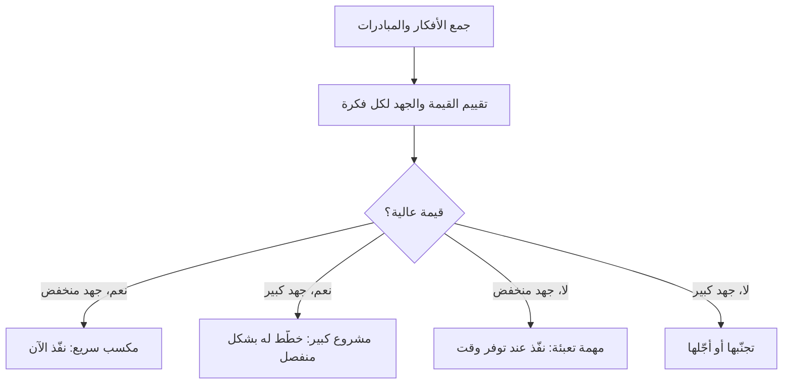

# المكاسب السريعة والانفجارات الكبرى (Quick Wins vs Big Bangs)
> [!info] تعريف مختصر
> المكاسب السريعة (Quick Wins) هي مبادرات ذات قيمة عالية وجهد منخفض يمكن تنفيذها بسرعة لإظهار نتائج ملموسة مبكرًا. أما الانفجارات الكبرى (Big Bangs) فهي مبادرات ذات قيمة عالية لكنها تتطلب جهدًا كبيرًا ووقتًا طويلًا. تُستخدم مصفوفة الجهد مقابل القيمة (Effort vs Value Matrix) لتصنيف المبادرات وترتيب أولويات التنفيذ بينها.

## الشرح العلمي والاحترافي
- مصفوفة الجهد مقابل القيمة تقسّم المبادرات إلى أربع فئات على محورين: القيمة (Value) والجهد (Effort):
  1. **مكاسب سريعة (Quick Wins)**: قيمة عالية، جهد منخفض — تُنفَّذ أولًا.
  2. **مشاريع كبرى (Big Bangs / Major Projects)**: قيمة عالية، جهد كبير — تحتاج تخطيطًا واستثمارًا طويل المدى.
  3. **مهام تعبئة (Fill-ins)**: قيمة منخفضة، جهد منخفض — تُنفَّذ عند توفر وقت فائض.
  4. **مهام يجب تجنبها (Thankless Tasks / Money Pits)**: قيمة منخفضة، جهد كبير — يُفضَّل تجنبها أو تأجيلها.
- الهدف من هذا التصنيف هو بناء الزخم (Momentum) وثقة أصحاب المصلحة مبكرًا عبر تسليم قيمة ملموسة بسرعة، بينما تُدار المشاريع الكبرى بشكل منفصل ضمن خطة أطول أمدًا مع مراحل ومعالم واضحة.
- يرتبط هذا المفهوم بمبدأ [[Cost of Delay]] و[[Outcome vs Output]]: المكاسب السريعة تولّد قيمة ملموسة الآن، بينما الانفجارات الكبرى قد تكون ضرورية استراتيجيًا رغم بطء عائدها.
- الخطر في الاعتماد الكامل على المكاسب السريعة فقط هو إهمال التحسينات الجوهرية طويلة المدى (مثل إعادة الهيكلة التقنية) لصالح نتائج سريعة الظهور فقط.

## أين ومتى يُستخدم
- في ورش تحديد الأولويات (Prioritization Workshops) عند بداية مشروع أو ربع سنوي (Quarterly Planning).
- عند تقديم مقترح تحسين لأصحاب المصلحة، لإظهار نتائج مبكرة تبني الثقة قبل تنفيذ المبادرات الكبرى.
- في إدارة المنتجات لتحديد ترتيب الميزات في خارطة الطريق ([[15 - Roadmap]]).
- عند إدارة الديون التقنية ([[Technical Debt]])، لفصل الإصلاحات السريعة عن إعادة الهندسة الكبرى.

## مثال وسيناريو تطبيقي
> [!example] فريق منتج في شركة توصيل طلبات "سريع" جمع 12 فكرة تحسين بعد تحليل شكاوى العملاء. باستخدام مصفوفة الجهد مقابل القيمة، صنّفوا "إضافة إشعار تأخير الطلب" كمكسب سريع (قيمة عالية، جهد يوم واحد فقط)، ونفّذوه خلال أسبوع فقط ليخفض شكاوى العملاء بنسبة 20%. في المقابل، صنّفوا "إعادة بناء نظام التوصيل بالكامل باستخدام خوارزمية تحسين المسارات" كمشروع كبير (Big Bang) يتطلب 4 أشهر وفريقًا مخصصًا، فتم جدولته كمبادرة ربع سنوية منفصلة مع خط أساس ([[Baseline]]) ومعالم واضحة.

## خطوات أو مخطّط
1. اجمع كل الأفكار والمبادرات المقترحة من الفريق وأصحاب المصلحة.
2. قيّم كل مبادرة على محور القيمة (تأثيرها على العميل أو العمل).
3. قيّم كل مبادرة على محور الجهد (الوقت والموارد اللازمة).
4. ضع كل مبادرة في الربع المناسب من المصفوفة.
5. ابدأ بتنفيذ المكاسب السريعة فورًا لبناء الزخم.
6. خطّط للمشاريع الكبرى بشكل منفصل مع مراحل وموارد مخصصة.
7. راجع المصفوفة دوريًا لأن القيمة والجهد قد يتغيران مع الوقت.

## ⚠️ مفاهيم خاطئة شائعة
> [!warning]
> - الاعتقاد أن المكاسب السريعة تُغني عن الحاجة للمشاريع الكبرى الاستراتيجية.
> - تقدير "الجهد" بناءً على شعور شخصي دون تحليل فعلي، مما يؤدي لتصنيف خاطئ.
> - الظن بأن كل ما يبدو "سريعًا" له بالضرورة قيمة عالية؛ قد يكون مجرد مهمة تعبئة.

## ❌ ممارسات خاطئة في المشاريع
> [!failure]
> - التركيز الدائم على المكاسب السريعة فقط لإرضاء الإدارة، مما يؤدي لتراكم الديون التقنية وتجاهل المشاريع الجوهرية.
> - إطلاق مشروع كبير (Big Bang) دون تجزئته إلى مراحل قابلة للقياس، فيصعب تتبع تقدمه أو تصحيح مساره.
> - عدم إعادة تقييم المصفوفة بعد تغيّر ظروف السوق أو أولويات العمل، فتبقى القرارات قديمة وغير دقيقة.

## 🔗 مصطلحات ومفاهيم ذات صلة
[[Cost of Delay]] | [[Outcome vs Output]] | [[MoSCoW Prioritization]] | [[Technical Debt]] | [[15 - Roadmap]] | [[Stretch Goal]] | [[Pilot Launch]]
