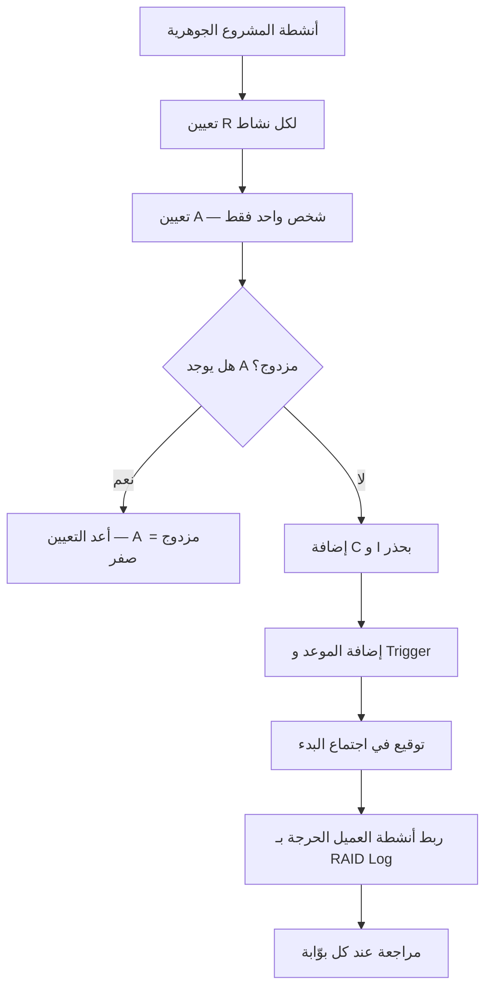

---
title: "RACI — مصفوفة المسؤوليات"
aliases: [RACI, مصفوفة المسؤوليات, Responsibility Assignment Matrix, Client Responsibility Matrix]
type: مصطلح
area: "[[Project Management]]"
tags:
  - إدارة-المشاريع
  - معجم
  - حوكمة
status: لم يبدأ
---
# مصفوفة المسؤوليات (RACI)

> [!info] تعريف مختصر
> **`RACI`** مصفوفة تُسند لكل نشاط في المشروع أربعة أدوار محدّدة: **`Responsible`** من ينفّذ · **`Accountable`** من يُحاسَب على النتيجة (**شخص واحد فقط**) · **`Consulted`** من يُستشار قبل التنفيذ · **`Informed`** من يُبلَّغ بعده. وقيمتها في مشاريع الأنظمة المؤسسية أكبر منها في غيرها، لأن **معظم أسباب فشل هذه المشاريع لا يملكها المورّد** — البيانات والقرارات والحوكمة وجاهزية المستخدمين كلّها عند العميل. وهذه المصفوفة هي الأداة الوحيدة التي تسمّي مالكها صراحةً وتغلق باب «ظننت أنكم ستفعلونها».

## الشرح العلمي والاحترافي

- **الأدوار الأربعة بدقّة**:
  | الرمز | الدور | التعريف الدقيق | العدد |
  |---|---|---|---|
  | **R** | `Responsible` | **ينفّذ** العمل بيده | واحد أو أكثر |
  | **A** | `Accountable` | **يُحاسَب** على النتيجة ويملك القرار النهائي | **واحد فقط — دائماً** |
  | **C** | `Consulted` | يُستشار **قبل** التنفيذ (حوار في اتّجاهين) | حسب الحاجة |
  | **I** | `Informed` | يُبلَّغ **بعد** التنفيذ (اتّجاه واحد) | حسب الحاجة |

- **قاعدة `A` الواحد**: وجود اثنين في خانة `Accountable` يساوي عملياً **صفراً**، لأن كلاً منهما يفترض أن الآخر يتابع. وهذا ليس تفصيلاً نظرياً: «تعدّد أصحاب القرار» هو أكثر الأسباب تكراراً في سجلّات [[Lessons Learned|الدروس المستفادة]] لمشاريع الأنظمة المؤسسية.

- **الفرق بين `R` و`A`**: `R` يفعل، و`A` يضمن أن يُفعل. وقد يجتمعان في شخص واحد في المهام الصغيرة، لكن فصلهما ضروري حين تكون الجهة المنفّذة غير الجهة المتحمّلة للأثر — وهذا هو حال معظم أنشطة مشروع `ERP` بين المورّد والعميل.

- **الفرق بين `C` و`I` أثر تشغيلي لا شكلي**: `Consulted` يعني أن العمل **لا يمضي** قبل أخذ رأيه — أي أنه نقطة انتظار محتملة في التدفّق. أمّا `Informed` فلا يوقف شيئاً. ولهذا فإن الإكثار من `C` يُنتج تأخيراً مقنّعاً: كل `C` إضافي هو `Handoff` إضافي في [[Time to Value]].

- **الاكتشاف الذي يقلب افتراضات العميل**: في مشروع `ERP` نموذجي يكون **العميل هو `Responsible`** في أنشطة جوهرية: اعتماد الإجراءات · تجهيز البيانات · تنفيذ اختبار القبول. أي أن **العميل ينفّذ لا يستلم**. ومعظم العملاء يدخلون المشروع بافتراض معاكس تماماً، والمصفوفة تصحّحه **قبل** أن يتحوّل إلى نزاع في الأسبوع العاشر.

- **الانقلاب في صفّ الإطلاق**: في أغلب الصفوف يكون العميل `R` ومدير التسليم `A`. وفي صفّ `Go-Live` **ينقلب الوضع**: العميل `A` ومدير التسليم `R`. والمعنى دقيق ومقصود: **المورّد ينفّذ الإطلاق، والعميل يُحاسَب على قرار الإطلاق** — وهذا التجسيد العملي لقاعدة «الإطلاق قرار لا تاريخ»، إذ القرار ملك من يتحمّل نتيجته.

- **العمود المفقود من معظم المصفوفات — الموعد**: «تجهيز البيانات = `R` للعميل» بلا موعد يعني عملياً بلا التزام. والمصفوفة المكتملة تحمل عمودين إضافيين: **الموعد** و**`Trigger` عند التأخّر** (ماذا يحدث إن لم يُنجَز في موعده؟) — وبهما تتّصل بـ[[RAID Log]] و[[Early Warning Dashboard]].

## أين ومتى يُستخدم
- يُوقَّع مع [[11 - Delivery Plan|خطة التسليم]] **قبل** بدء مرحلة الاستكشاف.
- في **اجتماع بدء المشروع** كأداة تصحيح توقّعات — يُعرض ثم يُصمَت.
- عند **كل نزاع حول المسؤولية**: المصفوفة الموقَّعة تحسم دون جدل.
- في **تخطيط أنشطة البيانات والاختبار** تحديداً، وهي أكثر ما يُفترض خطأً أنه على المورّد.
- عند **إدخال مورّد ثالث** إلى المشروع، لتوضيح موقعه من كل نشاط.
- في **مراجعة ما بعد المشروع**: مقارنة المصفوفة بالواقع تكشف أين انهارت الملكية.

## مثال وسيناريو تطبيقي
> [!example] مشروع نظام مؤسسي — خمسة أنشطة تغيّر فهم العميل لدوره
> | النشاط | العميل | المورّد | `Delivery Lead` |
> |---|---|---|---|
> | اعتماد الإجراءات | **R** | C | A |
> | تجهيز البيانات | **R** | C | A |
> | تنفيذ اختبار القبول | **R** | C | A |
> | **اعتماد الإطلاق** | **A** | C | **R** |
> | الرعاية المكثّفة | C | **R** | A |
>
> **الملاحظة الأولى:** العميل `Responsible` في **ثلاثة من خمسة أنشطة**. وحين عُرض هذا الصفّ في اجتماع البدء، كان أول تعليق: «ظننّا أن الشركة ستنفّذ». وهذا بالضبط سبب وجود المصفوفة — تصحيح الافتراض قبل أن يصير نزاعاً.
>
> **الملاحظة الثانية — انقلاب صفّ الإطلاق:** العميل يصير `A` والمورّد `R`. أي أن المورّد ينفّذ والعميل يوقّع ويتحمّل. وهذا ما يمنع أن يوقّع مدير التسليم قراراً تشغيلياً لا يملك عواقبه.
>
> **الملاحظة الثالثة — صفّ الرعاية المكثّفة:** هو الصفّ الوحيد الذي يكون المورّد فيه `R`. والمعنى أن الاستقرار بعد الإطلاق **التزام تنفيذي استباقي** على المورّد لا انتظاراً لبلاغات — وهذا ما يفرّق [[Hypercare]] عن الدعم العادي.
>
> **ما نقص المصفوفة:** لا مواعيد. وحين أضيفت (`تجهيز البيانات — الأسبوع الخامس — `Trigger`: جاهزية < 80% ⇒ غرفة بيانات`) صارت أداة إدارة لا وثيقة تعريف.

## خطوات أو مخطّط
1. اكتب الأنشطة الجوهرية للمشروع — لا كل المهام، بل ما ينهار المشروع بانهياره.
2. لكل نشاط عيّن `R` ثم `A` — وتحقّق أن `A` **شخص واحد**.
3. أضِف `C` بحذر: كل `C` نقطة انتظار محتملة.
4. أضف عمودَي **الموعد** و**`Trigger` عند التأخّر**.
5. اعرض المصفوفة في اجتماع البدء ووقّعها.
6. اربط كل نشاط عميل حرج ببند في [[RAID Log]].
7. راجعها عند كل بوّابة مرحلية — الأدوار تتغيّر بتغيّر المرحلة.

## ⚠️ مفاهيم خاطئة شائعة
> [!warning]
> - **تعيين أكثر من `A` لنشاط واحد**: يساوي صفراً عملياً — كلٌّ يفترض أن الآخر يتابع.
> - **الخلط بين `R` و`A`**: الأول ينفّذ، والثاني يضمن التنفيذ ويملك القرار.
> - **الظنّ بأن `C` و`I` متكافئان**: `C` يوقف العمل حتى يُستشار، و`I` لا يوقف شيئاً.
> - **الإكثار من `C` ظنّاً أنه شمول**: كل `C` إضافي تأخير إضافي في التدفّق.
> - **افتراض أن المصفوفة تخصّ فريق المشروع فقط**: أهمّ صفوفها هي التي يكون العميل فيها `R`.
> - **اعتبارها ثابتة طوال المشروع**: الأدوار تتغيّر بين الاستكشاف والاختبار والإطلاق.

## ❌ ممارسات خاطئة في المشاريع
> [!failure]
> - **مصفوفة بلا مواعيد**: تُعرّف الأدوار ولا تُلزم بها. الحلّ: عمود موعد و`Trigger` لكل نشاط.
> - **إعدادها دون حضور العميل**: تنتج مصفوفة يرفضها من عليه تنفيذها. الحلّ: تُبنى في جلسة مشتركة وتُوقَّع.
> - **حشو المصفوفة بعشرات المهام التفصيلية**: تصير غير قابلة للقراءة فتُهمَل. الحلّ: اقتصر على الأنشطة الجوهرية.
> - **عدم ربط أنشطة العميل الحرجة بسجلّ المخاطر**: يترك التزامات العميل بلا رصد. الحلّ: كل نشاط عميل حرج = بند `Assumption` أو `Dependency` في [[RAID Log]].
> - **الاحتجاج بها بأثر رجعي فقط**: استخدامها للّوم بعد الفشل يهدر غرضها الوقائي. الحلّ: راجعها استباقياً في كل بوّابة.
> - **إبقاء `A` عند المورّد في قرار الإطلاق**: يحمّل من لا يملك العواقب مسؤوليتها. الحلّ: `A` للراعي في صفّ الإطلاق.

## 🔗 مصطلحات ومفاهيم ذات صلة
[[Steering Committee]] | [[RAID Log]] | [[Go or No-Go Decision]] | [[Hypercare]] | [[UAT]] | [[Readiness Assessment]] | [[Time to Value]] | [[17 - Client Responsibility RACI]] | [[PARIS Matrix]] | [[DACI]] | [[SPADE]] | [[Chain of Command]]
