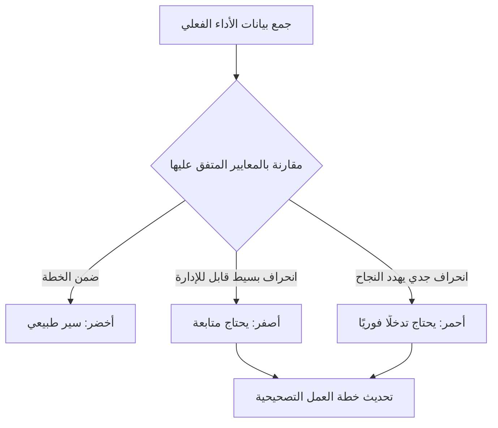

# حالة إشارة المرور (RAG Status)
> [!info] تعريف مختصر
> حالة إشارة المرور (RAG Status) هي طريقة بصرية بسيطة لتلخيص صحة المشروع أو مهمة معينة باستخدام ثلاثة ألوان: أحمر (Red) للخطر أو التعثر الجاد، أصفر/كهرماني (Amber) للتحذير أو وجود مخاطر تحتاج متابعة، وأخضر (Green) للسير الطبيعي دون مشاكل. تُستخدم على نطاق واسع في تقارير الحالة الأسبوعية والشهرية لأصحاب المصلحة.

## الشرح العلمي والاحترافي
- تقوم فكرة RAG على تبسيط معلومات معقدة (جدول زمني، ميزانية، مخاطر، جودة) إلى إشارة لونية واحدة يسهل فهمها في ثوانٍ من قبل الإدارة العليا وأصحاب المصلحة الذين لا وقت لديهم لقراءة تقارير مفصلة.
- **أخضر (Green)**: المشروع يسير وفق الخطة، لا توجد مخاطر جوهرية، الجدول والميزانية والنطاق ضمن الحدود المقبولة.
- **أصفر/كهرماني (Amber)**: توجد مشكلات أو مخاطر محتملة تستدعي الانتباه، لكنها لا تزال قابلة للإدارة داخليًا دون تدخل خارجي عاجل.
- **أحمر (Red)**: توجد مشكلة جدية تهدد نجاح المشروع (تأخر كبير، تجاوز ميزانية حاد، خطر عالي التأثير) وتتطلب تدخلًا فوريًا من الإدارة العليا أو صاحب المشروع.
- غالبًا ما تُطبَّق حالة RAG على عدة أبعاد منفصلة في نفس التقرير: الجدول الزمني، الميزانية، النطاق، الجودة، والمخاطر، بحيث يمكن أن يكون المشروع أخضر في الميزانية لكنه أحمر في الجدول الزمني مثلًا.
- تُستخدم أحيانًا نسخة موسّعة تضيف الأزرق (Blue) للدلالة على أن المشروع اكتمل بنجاح، أو تدرجات إضافية بين الأصفر والأحمر.

## أين ومتى يُستخدم
- في تقارير حالة المشروع الأسبوعية أو الشهرية (Status Reports) المقدَّمة لأصحاب المصلحة والإدارة العليا.
- في لوحات معلومات إدارة المحافظ (Portfolio Dashboards) لمقارنة صحة عدة مشاريع دفعة واحدة بسرعة.
- في اجتماعات المراجعة (Steering Committee Meetings) لتوجيه النقاش نحو المشاريع الأكثر خطورة أولًا.
- في إدارة المخاطر ([[Risk Register]]) لتصنيف شدة كل خطر بصريًا.

## مثال وسيناريو تطبيقي
> [!example] مديرة مشروع في شركة "دلتا سوفت" تُعِد تقرير الحالة الشهري لثلاثة مشاريع متزامنة. المشروع الأول (تطبيق جوال) حالته خضراء لأن كل شيء يسير وفق الخطة. المشروع الثاني (ترحيل بيانات) حالته صفراء لأن هناك تأخرًا بسيطًا قدره 3 أيام بسبب نقص موارد، لكنه لا يزال قابلًا للتعويض. المشروع الثالث (تكامل مع نظام دفع خارجي) حالته حمراء لأن المورّد الخارجي تأخر شهرًا كاملًا في تسليم واجهة برمجية (API) حرجة، مما يهدد موعد الإطلاق النهائي. بفضل هذا التصنيف، ركّز الاجتماع التنفيذي معظم وقته على المشروع الثالث فقط.

## خطوات أو مخطّط
1. حدد الأبعاد التي ستُقيَّم (الجدول، الميزانية، النطاق، الجودة، المخاطر).
2. ضع معايير واضحة ومتفقًا عليها مسبقًا لكل لون (مثلًا: تأخر أقل من 5% = أخضر، بين 5-15% = أصفر، أكثر من 15% = أحمر).
3. قيّم كل بُعد بموضوعية بناءً على بيانات فعلية وليس شعورًا شخصيًا.
4. لخّص الحالة الإجمالية في تقرير مرئي بسيط.
5. أرفق مبررًا نصيًا مختصرًا لكل حالة صفراء أو حمراء مع خطة عمل تصحيحية.
6. حدّث الحالة دوريًا وتتبّع اتجاهها (هل تتحسن أم تتدهور).

## ⚠️ مفاهيم خاطئة شائعة
> [!warning]
> - الاعتقاد أن اللون الأخضر يعني عدم وجود أي مخاطر إطلاقًا؛ في الواقع يعني فقط أن المخاطر الحالية مُدارة جيدًا.
> - استخدام معايير غامضة أو شخصية لتحديد اللون، مما يجعل التقييم غير متسق بين المشاريع.
> - الاعتماد على اللون وحده دون قراءة السياق والمبررات المرفقة به.

## ❌ ممارسات خاطئة في المشاريع
> [!failure]
> - تلوين المشروع بالأخضر دائمًا لتجنّب الأسئلة الصعبة من الإدارة، وهي ممارسة تُعرف بـ"التلوين المتفائل الزائف" وتؤدي لمفاجآت لاحقة.
> - الانتقال المفاجئ من أخضر إلى أحمر دون مرور بمرحلة أصفر تحذيرية، مما يدل على غياب رصد مستمر للمخاطر.
> - عدم إرفاق خطة عمل تصحيحية واضحة عند الإبلاغ عن حالة صفراء أو حمراء، فيتحول التقرير لمجرد إعلان مشكلة دون حل.

## 🔗 مصطلحات ومفاهيم ذات صلة
[[Risk Register]] | [[RAID Log]] | [[Probability and Impact Matrix]] | [[Baseline]] | [[Stakeholder Map]] | [[Go or No-Go Decision]] | [[21 - Stakeholder Communication]]
