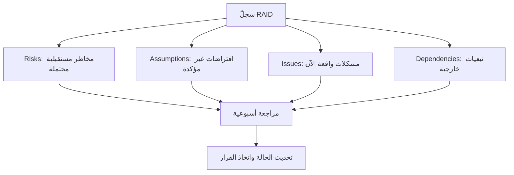

# سجلّ RAID (RAID Log)
> [!info] تعريف مختصر
> سجلّ RAID (RAID Log) هو وثيقة واحدة تجمع أربعة عناصر أساسية لإدارة المشروع: المخاطر (Risks)، والافتراضات (Assumptions)، والمشكلات (Issues)، والتبعيات (Dependencies). يوفّر لمدير المشروع رؤية شاملة وموحّدة لكل ما قد يؤثر على سير المشروع.

## الشرح العلمي والاحترافي
اسم RAID اختصار لأربع كلمات إنجليزية، وكل عنصر منها له دور مختلف:
- **R - Risks (المخاطر)**: أحداث محتملة الوقوع مستقبلاً وقد تؤثر سلباً أو إيجاباً على المشروع إن وقعت. تُدار عادة بتفصيل أكبر في [[Risk Register]] المستقل، لكنها تُلخّص هنا أيضاً.
- **A - Assumptions (الافتراضات)**: أشياء يفترضها الفريق صحيحة دون دليل مؤكد بعد، ويُبنى عليها التخطيط. مثال: "نفترض أن العميل سيوفر بيانات الاختبار خلال الأسبوع الأول."
- **I - Issues (المشكلات)**: مشاكل حقيقية وقعت بالفعل الآن وتحتاج حلاً فورياً، بخلاف المخاطر التي لم تقع بعد. مثال: "الخادم التجريبي معطّل منذ يومين."
- **D - Dependencies (التبعيات)**: عناصر يعتمد عليها المشروع من جهات خارجية أو فرق أخرى، ولا يستطيع الفريق التحكم بها مباشرة. مثال: "الانتظار لحصول فريق الأمن على شهادة SSL جديدة."

الفكرة الأساسية من دمج هذه العناصر الأربعة في سجل واحد هي توفير "لوحة تحكم" واحدة مبسطة، خصوصاً في المشاريع الصغيرة والمتوسطة التي لا تحتاج أربع وثائق منفصلة. يراجعها مدير المشروع والفريق بانتظام (أسبوعياً غالباً) لمتابعة الحالة واتخاذ القرارات.

## أين ومتى يُستخدم
- في **المشاريع الصغيرة والمتوسطة** حيث لا يُبرَّر إنشاء أربع وثائق منفصلة (سجل مخاطر، سجل افتراضات، سجل مشكلات، سجل تبعيات).
- في منهجيات **Agile وWaterfall على حد سواء**، وغالباً كأداة عملية بغض النظر عن المنهجية الرسمية المتبعة.
- خلال **الاجتماعات الأسبوعية لمتابعة المشروع (Status Meetings)**، حيث يُستعرض السجل بندًا بندًا لتحديث الحالة.
- عند إعداد **تقارير الحالة (RAG Status)** للإدارة العليا أو العميل، حيث يُستخرج ملخص من سجل RAID.

## مثال وسيناريو تطبيقي
> [!example] فريق مشروع "منصة تعليمية" لدى شركة "معرفة" يحتفظ بسجل RAID واحد يُحدَّث أسبوعياً. في الأسبوع الخامس يحتوي السجل على: **خطر**: "قد يتأخر مزوّد الاستضافة السحابية في توفير خوادم إضافية قبل الإطلاق." **افتراض**: "نفترض أن عدد المستخدمين المتزامنين لن يتجاوز 5000 مستخدم في الشهر الأول." **مشكلة**: "واجهة تسجيل الدخول تفشل حالياً على متصفح Safari - أُبلغ عنها اليوم من فريق الاختبار." **تبعية**: "لا يمكن إطلاق ميزة الدفع قبل حصول الشركة على ترخيص بوابة الدفع من البنك المركزي، والمتوقع خلال أسبوعين." في اجتماع المتابعة الأسبوعي، يستعرض مدير المشروع السجل بندًا بندًا: يُصعّد مشكلة Safari فوراً لفريق التطوير لحلها خلال يومين، يتابع حالة التبعية مع البنك أسبوعياً، ويراقب الخطر المتعلق بالاستضافة عبر التواصل الدوري مع المزوّد. هذا السجل الواحد يمنحه صورة شاملة دون الحاجة لأربع وثائق منفصلة.

## خطوات أو مخطّط
1. أنشئ جدولاً واحداً بأربعة أقسام (أو أعمدة تصنيف): مخاطر، افتراضات، مشكلات، تبعيات.
2. لكل بند، سجّل: الوصف، تاريخ الرصد، صاحب المتابعة (Owner)، الأولوية أو الحالة، والإجراء المطلوب.
3. راجع السجل في كل اجتماع دوري (أسبوعي غالباً) وحدّث حالة كل بند.
4. حوّل أي افتراض ثبت خطؤه إلى مشكلة أو خطر فوراً.
5. أغلق البنود التي انتهت (تم حل المشكلة، انتفى الخطر، تحققت التبعية) مع توثيق كيفية إغلاقها.

## ⚠️ مفاهيم خاطئة شائعة
> [!warning]
> - **الخلط بين "المخاطر" و"المشكلات"**: الخطر لم يقع بعد وهو احتمالي، أما المشكلة فهي واقعة فعلاً وتحتاج حلاً عاجلاً. كثير من المبتدئين يسجلون مشكلة واقعة تحت بند "مخاطر".
> - **إهمال متابعة الافتراضات**: الافتراض غير المُتحقَّق منه قد يتحول فجأة إلى مشكلة كبيرة إذا ثبت خطؤه متأخراً، لذا يجب مراجعته دورياً لا كتابته فقط مرة واحدة.
> - **الظن بأن سجل RAID يغني تماماً عن سجل مخاطر مفصّل**: في المشاريع الكبيرة أو عالية المخاطر، يُفضَّل الاحتفاظ بسجل مخاطر مستقل أكثر تفصيلاً بجانب RAID.

## ❌ ممارسات خاطئة في المشاريع
> [!failure]
> - **إنشاء السجل مرة واحدة وعدم تحديثه أبداً**، فيتحول إلى وثيقة ميتة لا تعكس واقع المشروع. الحل: اجعل تحديثه جزءاً ثابتاً من أجندة الاجتماع الأسبوعي.
> - **عدم تعيين صاحب متابعة (Owner) واضح لكل بند**، فتبقى البنود معلّقة دون أحد مسؤول عن حلها. الحل: كل بند يجب أن يحمل اسم شخص مسؤول وتاريخاً مستهدفاً للمتابعة.
> - **خلط كل شيء في عمود واحد دون تصنيف واضح بين الأنواع الأربعة**، مما يجعل السجل مربكاً وصعب القراءة. الحل: التزم بتصنيف كل بند بدقة تحت نوعه الصحيح (خطر، افتراض، مشكلة، تبعية).

## 🔗 مصطلحات ومفاهيم ذات صلة
[[Risk Register]] | [[Issue Log]] | [[Dependency]] | [[RAG Status]] | [[Blocker]] | [[Probability and Impact Matrix]] | [[19 - Risk Management]]
