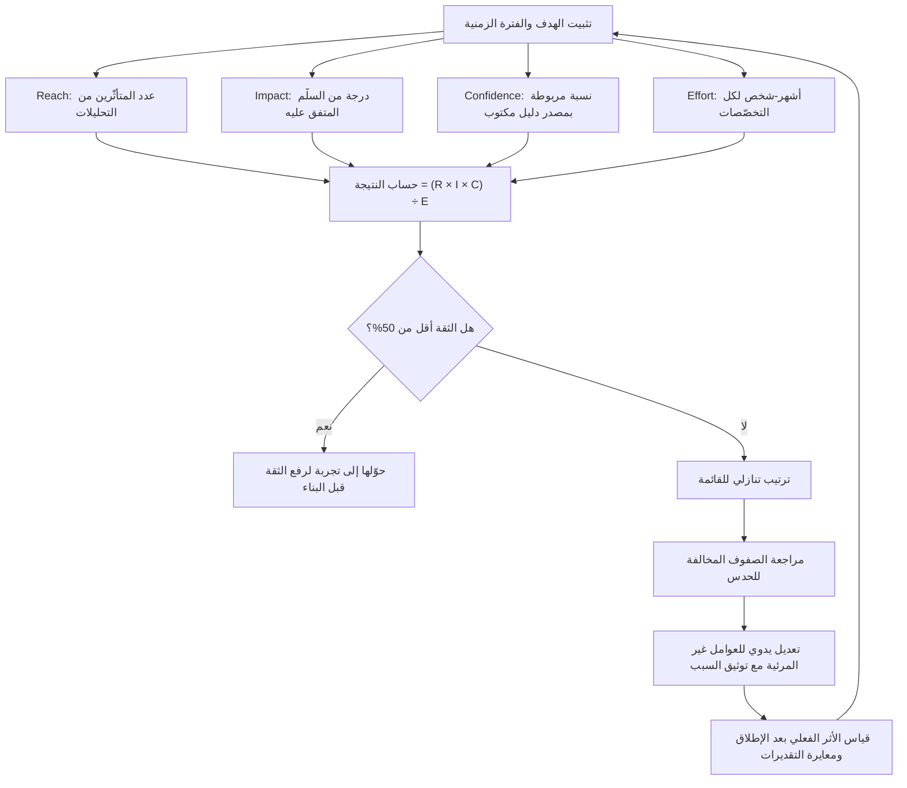

# ترتيب الأولويات بـ RICE (RICE Prioritization)

> [!info] تعريف مختصر
> إطار كمّي لترتيب مبادرات المنتج، يحسب لكل مبادرة درجة واحدة قابلة للمقارنة عبر المعادلة: **النتيجة = (Reach × Impact × Confidence) ÷ Effort**. أي أن قيمة المبادرة تتحدّد بعدد من تصلهم، وشدّة أثرها عليهم، ومدى ثقتنا بهذا التقدير، مقسومًا على تكلفتها. طُوّر الإطار داخل فريق منتج في شركة **Intercom** ونُشر علنًا، وانتشر لاحقًا كأحد أشهر أطر ترتيب الأولويات في إدارة المنتجات الرقمية.

## الشرح العلمي والاحترافي
قوّة RICE لا تكمن في دقّة رقمه، بل في أنه **يجبر الفريق على تفكيك الحدس إلى أربعة أسئلة منفصلة** يمكن مناقشة كل منها على حدة. فحين يقول أحدهم «هذه الميزة مهمّة جدًّا»، يكشف التفكيك أي حدّ من الحدود الأربعة يقصده فعلًا — وغالبًا ما يتبيّن أن الخلاف بين شخصين ليس على الأولوية بل على تقدير حدّ واحد فقط.

### الحدود الأربعة ووحداتها
- **Reach (المدى)**: عدد **المستخدمين أو الأحداث** المتأثّرين بالمبادرة **خلال فترة زمنية محدّدة ومعلنة** (شهر أو ربع مثلًا). الوحدة عدد صريح، لا نسبة مبهمة. مثال: «1,200 مستخدم نشط شهريًّا يمرّون بشاشة الدفع». الشرط المنهجي الحاسم أن تكون الفترة **موحّدة عبر كل المبادرات المُقارَنة**، وإلّا فقدت المقارنة معناها. ويُفضَّل اشتقاق هذا الرقم من بيانات التحليلات الفعلية لا من التخمين.
- **Impact (الأثر)**: شدّة تأثير المبادرة على المستخدم الواحد الذي وصلها. لا يمكن قياسه بوحدة موضوعية، فيُستخدم **سلّم تقديري متفق عليه**، شائعه: **3 = هائل · 2 = عالٍ · 1 = متوسط · 0.5 = منخفض · 0.25 = ضئيل**. السلّم غير خطّي عمدًا، فهو يعكس مضاعفًا لا رتبة. ويجب تثبيت **الهدف** الذي يُقاس الأثر بالنسبة إليه (تحويل؟ احتفاظ؟ تقليل تذاكر الدعم؟)، لأن نفس المبادرة قد تكون هائلة لهدف وضئيلة لآخر.
- **Confidence (الثقة)**: نسبة مئوية تعكس **قوّة الدليل** خلف تقديرَي المدى والأثر معًا. وظيفتها كبح المبادرات المبنية على الحماس وحده. القيم الشائعة: 100% · 80% · 50%، مع اعتبار ما دون 50% إشارة إلى أن المطلوب ليس بناء المبادرة بل إجراء تجربة أو بحث لرفع الثقة أولًا.
- **Effort (الجهد)**: التكلفة الكلّية بوحدة **أشهر-شخص (Person-Months)**، شاملة كل التخصّصات المشاركة: منتج، تصميم، هندسة، اختبار، وأي عمل تشغيلي لازم للإطلاق. اختزال الجهد في زمن البرمجة وحده هو أكثر مصادر التشويه شيوعًا في المعادلة. ولأن الجهد في المقام، فإن خطأً بمقدار الضعف فيه يعادل خطأً بمقدار الضعف في البسط كلّه.

### قراءة النتيجة
الناتج ليس مالًا ولا وقتًا، بل **وحدة أثر لكل شهر-شخص** — أي مقياس كفاءة نسبي لا معنى له إلّا بالمقارنة مع بقية عناصر القائمة نفسها. لذلك لا يصحّ الحديث عن «عتبة RICE جيدة» بشكل مطلق، ولا مقارنة درجات محسوبة بافتراضات مختلفة أو فترات زمنية مختلفة.

### النقد الجوهري: حدّ الثقة هو الذي يُزوَّر
أضعف حلقة في RICE ليست الحساب بل **الحدّ الثالث**. فمن بين الحدود الأربعة، هو الوحيد الذي لا يملك أي مرجع خارجي يُدقَّق مقابله: المدى يمكن مراجعته ببيانات التحليلات، والجهد يمكن مراجعته بتقديرات الهندسة وبالمقارنة مع أعمال سابقة، والأثر مقيّد بسلّم ضيّق. أمّا الثقة فهي رقم يكتبه صاحب المبادرة عن مبادرته الخاصة، بلا أي كلفة على المبالغة.

والنتيجة العملية المتكرّرة في الفرق: **يضع الجميع 80% لكل شيء**. حين تتقارب قيم حدٍّ ما عبر جميع الصفوف، يصبح ذلك الحدّ **ثابتًا رياضيًّا لا متغيّرًا**، ويسقط من المعادلة فعليًّا — فيتحوّل RICE بهدوء إلى معادلة ثلاثية: (Reach × Impact) ÷ Effort. وبذلك تفقد المبادرات المبنية على تخمين محض الكابح الوحيد المصمَّم لها، وتنافس على قدم المساواة مبادرات مسنودة ببيانات حقيقية.

**العلاج** أن تُنزع النسبة من يد التقدير الشخصي وتُربط بمصدر دليل صريح مُصنَّف مسبقًا، مثل هذا السلّم:
- **100%** — بيانات فعلية من منتجنا أو نتيجة تجربة مضبوطة سابقة.
- **80%** — بحث مستخدم منهجي أو دليل كمّي غير مباشر.
- **50%** — رأي خبير أو قياس على حالة مشابهة في السوق.
- **20%** — حدس أو طلب داخلي بلا سند.

مع قاعدة تحريرية بسيطة وحاسمة: **يُكتب مصدر الدليل نصًّا بجانب الرقم في نفس الصف**. صفٌّ مكتوب فيه «80% — بحث مستخدم» يمكن الاعتراض عليه بسؤال «أين هذا البحث؟»، بينما «80%» وحدها لا يمكن الاعتراض عليها. هذا التغيير الصغير في الشكل هو ما يعيد للحدّ وظيفته.

### RICE أداة لتنظيم النقاش لا لإنهائه
الاستعمال السليم لـ RICE هو أن يكون **مولّدًا لأسئلة جيّدة**، لا حَكَمًا نهائيًّا. الدرجة الرقمية تعطي انطباعًا زائفًا بالموضوعية، بينما ثلاثة من حدودها الأربعة تقديرات بشرية. ولهذا فإن المخرج الأنفع من الجدول ليس الترتيب النهائي، بل **الأسطر التي انقلب ترتيبها عن الحدس** — فهي تشير إلى موضع الاختلاف الحقيقي في افتراضات الفريق. كما أن الإطار **أعمى بنيويًّا** تجاه أمور لا تظهر في حدوده: الاعتماديات التقنية، والالتزامات التنظيمية، والدين التقني، والقيمة الاستراتيجية طويلة الأجل، والمواعيد الخارجية الملزمة. ومبادرة أساسية للامتثال القانوني قد تحصل على درجة متدنّية وتظلّ إلزامية التنفيذ.

### مقارنة بأطر أخرى
- **[[WSJF]]**: يقسّم **تكلفة التأخير ([[Cost of Delay]])** على حجم العمل، فيدخل البعد الزمني صراحةً — أي كم نخسر مقابل كل أسبوع تأخير. لذلك يتفوّق حين تكون النافذة الزمنية أو الموسمية أو الالتزام التعاقدي عاملًا حاسمًا، وهو الأشيع في السياقات الكبيرة والمقيّاسة (Scaled). بينما RICE لا يرى الزمن أصلًا: مبادرة تخسر قيمتها بعد شهرين ومبادرة قيمتها ثابتة تحصلان على نفس الدرجة عند تطابق باقي الحدود.
- **[[MoSCoW Prioritization]]**: تصنيف نوعي إلى (إلزامي / ينبغي / يمكن / لن) لا يُنتج ترتيبًا داخل الفئة الواحدة. أبسط وأسرع وأنسب لتحديد نطاق إصدار محدّد أو للتفاوض مع أصحاب المصلحة، لكنه عرضة لتضخّم فئة «إلزامي». يُستعمل الإطاران معًا كثيرًا: MoSCoW لتحديد ما يدخل الإصدار، وRICE لترتيب ما بداخله.
- والفرق الجوهري: RICE يقيس **الكفاءة** (أثر لكل وحدة جهد)، وWSJF يقيس **الإلحاح الاقتصادي**، وMoSCoW يقيس **الإلزام التفاوضي**.

## أين ومتى يُستخدم
- **في تنقية الـ [[13 - Backlog]] دوريًّا**، خصوصًا حين تتراكم عشرات الطلبات المتنافسة من مصادر مختلفة.
- **في التخطيط الربعي وبناء [[15 - Roadmap]]**، لتبرير سبب دخول مبادرة وخروج أخرى بلغة قابلة للمراجعة.
- **عند التفاوض مع أصحاب المصلحة**: الجدول ينقل النقاش من «رأيي مقابل رأيك» إلى «أي حدّ نختلف عليه بالضبط؟».
- **حين تكون المبادرات المقارَنة متجانسة الحجم نسبيًّا**؛ فمقارنة مهمّة تستغرق أسبوعًا بمشروع يستغرق سنة عبر نفس المعادلة تنتج ترتيبًا مضلّلًا.
- **غير مناسب** للأعمال الإلزامية (الامتثال، الأمن، إصلاح عطل حرج)، ولا للرهانات الاستراتيجية الطويلة التي يكون فيها المدى المبدئي صغيرًا بطبيعته.

## مثال وسيناريو تطبيقي
> [!example] فريق منتج SaaS يوازن بين ثلاث مبادرات لربع واحد، والهدف المشترك المتفق عليه: رفع تحويل التجربة المجانية إلى اشتراك مدفوع. المدى يُقاس بعدد المستخدمين المتأثّرين **شهريًّا**.
>
> | المبادرة | Reach | Impact | Confidence (المصدر) | Effort | النتيجة |
> |---|---|---|---|---|---|
> | أ — إعادة تصميم شاشة الدفع | 4,000 | 1 (متوسط) | 80% (بحث مستخدم على 12 جلسة) | 4 أشهر-شخص | **800** |
> | ب — تبسيط رسالة الترحيب الأولى | 9,000 | 0.5 (منخفض) | 100% (تجربة A/B سابقة مشابهة) | 1 شهر-شخص | **4,500** |
> | ج — تكامل مع منصّة خارجية كبرى | 1,500 | 3 (هائل) | 50% (رأي خبير، لا بيانات) | 8 أشهر-شخص | **281** |
>
> **الحساب**: أ = (4,000 × 1 × 0.8) ÷ 4 = 800 · ب = (9,000 × 0.5 × 1.0) ÷ 1 = 4,500 · ج = (1,500 × 3 × 0.5) ÷ 8 ≈ 281.
>
> الترتيب الحدسي في اجتماع الفريق كان: ج ثم أ ثم ب — لأن التكامل الخارجي هو الأكثر إثارة، ولأن «تبسيط رسالة ترحيب» بدا عملًا تجميليًّا صغيرًا. لكن الحساب قلب الترتيب تمامًا إلى: **ب ثم أ ثم ج**. والسبب واضح عند التفكيك: المبادرة (ب) تجمع أوسع مدى، وأقوى دليل، وأقل جهد بفارق كبير — فأثرها المتواضع لكل مستخدم يُضرب في جمهور ضخم ويُقسم على تكلفة زهيدة. أمّا (ج) فأثرها الفردي هائل لكنه محصور في جمهور صغير، ومسنود بأضعف دليل، ومكلّف ثمانية أضعاف.
>
> القرار الذي اتّخذه الفريق لم يكن «نفّذ ب واحذف ج»، بل: نفّذ (ب) فورًا، وأدخل (أ) في نفس الربع، **وحوّل (ج) من مبادرة بناء إلى تجربة استكشاف** بجهد أسبوعين هدفها الوحيد رفع الثقة من 50% إلى مستوى مسنود ببيانات، ثم يُعاد حسابها. وهذا هو الاستخدام الأنضج للإطار: الثقة المنخفضة لا تعني الرفض، بل تعني أن العمل التالي هو **شراء الدليل** لا بناء الحل.

## خطوات أو مخطّط
1. تثبيت **الهدف الواحد** الذي سيُقاس الأثر بالنسبة إليه، وتوحيد **الفترة الزمنية** للمدى عبر كل المبادرات.
2. الاتفاق مسبقًا على سلّم الأثر وسلّم الثقة وتعريف وحدة الجهد، وتوثيقها في مكان مشترك.
3. تقدير **Reach** من بيانات التحليلات الفعلية قدر الإمكان، لا من التخمين.
4. تقدير **Impact** من السلّم المتفق عليه، مع كتابة مبرّر مختصر لاختيار الدرجة.
5. تحديد **Confidence** بربطها بمصدر الدليل، **وكتابة المصدر نصًّا في نفس الصف**.
6. تقدير **Effort** بأشهر-شخص شاملة كل التخصّصات، بمشاركة من سينفّذ العمل فعلًا.
7. حساب الدرجة لكل مبادرة وترتيب القائمة تنازليًّا.
8. مراجعة الصفوف التي **خالف فيها الترتيب حدس الفريق** ومناقشة سبب المخالفة — هنا تكمن القيمة الحقيقية للجدول.
9. تعديل الترتيب النهائي يدويًّا بإدخال العوامل التي لا يراها الإطار (الاعتماديات، الإلزام التنظيمي، الرهان الاستراتيجي)، **مع توثيق سبب التعديل**.
10. مراجعة التقديرات بعد الإطلاق: مقارنة الأثر الفعلي بالمتوقّع لمعايرة تقديرات الفريق مستقبلًا ([[Estimation Variance]]).

## ⚠️ مفاهيم خاطئة شائعة
> [!warning]
> - **اعتبار الدرجة رقمًا موضوعيًّا**: ثلاثة من الحدود الأربعة تقديرات بشرية، والعملية الحسابية لا تُنتج دقّة من مدخلات تقريبية — بل تُخفي تقريبيتها خلف مظهر رقمي.
> - **مقارنة درجات محسوبة بافتراضات مختلفة**: جدولان بفترتين زمنيتين مختلفتين للمدى، أو بسلّمَي أثر مختلفين، غير قابلين للمقارنة إطلاقًا.
> - **الظنّ بأن الدرجة الأعلى تعني وجوب التنفيذ أولًا دائمًا**: الاعتماديات التقنية والالتزامات التنظيمية والمواعيد الخارجية تتجاوز الترتيب مهما كانت الدرجة.
> - **الخلط بين المدى وحجم السوق الكلّي**: المدى هو من **يمرّ فعلًا** بالتجربة التي ستتغيّر خلال الفترة المحدّدة، لا كل من يملك حسابًا.
> - **إهمال أن الجهد في المقام**: تقدير جهد متفائل بمقدار الضعف يضاعف الدرجة، ولهذا فإن أكثر ما يشوّه ترتيب RICE عمليًّا هو التفاؤل الهندسي لا المبالغة في الأثر.
> - **افتراض أن RICE يُغني عن أطر أخرى**: هو أداة كفاءة، ولا يحلّ محلّ منطق تكلفة التأخير في [[WSJF]] ولا محلّ التفاوض النوعي في [[MoSCoW Prioritization]].

## ❌ ممارسات خاطئة في المشاريع
> [!failure]
> - **وضع 80% ثقة لكل صف بلا استثناء**: يُلغي الحدّ رياضيًّا ويجرّد الإطار من كابحه الوحيد. الحل: اربط النسبة بسلّم دليل معلن (بيانات 100% · بحث 80% · رأي خبير 50% · حدس 20%)، واشترط كتابة المصدر نصًّا بجانب الرقم.
> - **ترك صاحب المبادرة يقدّر ثقته بنفسه دون مراجعة**: تعارض مصالح مباشر يدفع الدرجات صعودًا. الحل: راجِع حدّ الثقة جماعيًّا في جلسة الترتيب، واجعل أي رقم بلا مصدر مكتوب يُخفَّض تلقائيًّا.
> - **تقدير الجهد بزمن البرمجة فقط**: يُسقط التصميم والاختبار والترحيل والتوثيق والدعم، فترتفع درجات المبادرات الأثقل تشغيليًّا زورًا. الحل: عرّف الجهد بأنه كل عمل حتى الإطلاق الكامل، وقدّره بمشاركة كل التخصّصات.
> - **حساب المدى بفترات زمنية مختلفة بين الصفوف**: صف بالشهر وآخر بالسنة يفسد الترتيب كلّه بصمت. الحل: ثبّت الفترة في رأس الجدول واجعلها شرط قبول لأي صف جديد.
> - **معاملة الجدول كقرار نهائي يُغلق النقاش**: يتحوّل الإطار إلى أداة لإسكات الاعتراض بدل استخراجه. الحل: اجعل الجدول مُدخلًا للجلسة لا مخرجًا منها، وخصّص وقتًا صريحًا لمراجعة الصفوف المخالفة للحدس.
> - **إدخال مبادرات متباينة الحجم في نفس القائمة**: مقارنة تحسين بسيط بمشروع بنية تحتية كبير تُنتج ترتيبًا بلا معنى. الحل: رتّب داخل مستويات حجم متقاربة، أو خصّص حصة ثابتة من طاقة الفريق للأعمال الكبيرة والاستراتيجية خارج المنافسة.
> - **عدم مراجعة التقديرات بعد التنفيذ**: يبقى الفريق يقدّر بنفس التحيّزات إلى الأبد. الحل: سجّل التقدير الأصلي والنتيجة الفعلية، وراجعهما دوريًّا لمعايرة سلالم الأثر والجهد ([[Relative Estimation]]).
> - **استخدام RICE في سياق تحكمه المواعيد النهائية**: الإطار لا يرى الزمن، فيؤجّل عملًا تنتهي قيمته بانتهاء نافذته. الحل: انتقل إلى [[WSJF]] أو أضف عامل تكلفة تأخير صريحًا حين تكون الحساسية الزمنية عالية.

## 🔗 مصطلحات ومفاهيم ذات صلة
[[WSJF]] | [[MoSCoW Prioritization]] | [[Cost of Delay]] | [[Relative Estimation]] | [[Estimation Variance]] | [[13 - Backlog]] | [[Outcome vs Output]]
