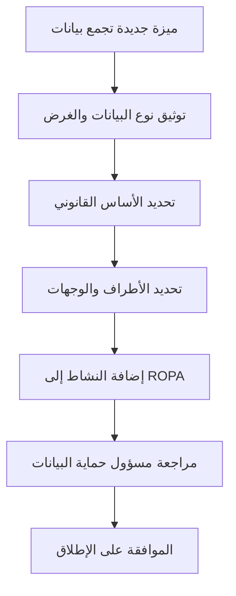

# سجل معالجة البيانات (ROPA)

> [!info] تعريف مختصر
> سجل معالجة البيانات (Records of Processing Activities - ROPA) هو وثيقة رسمية توثّق كل عملية تعالج فيها المؤسسة بيانات شخصية: ما هي البيانات، لماذا تُجمع، من يصل إليها، وأين تُخزَّن. تفرضه أغلب قوانين حماية البيانات مثل [[PDPL]] والـ GDPR الأوروبي.

## الشرح العلمي والاحترافي
- ROPA هو سجل مركزي يجيب على أسئلة أساسية عن كل نشاط معالجة بيانات شخصية داخل المؤسسة: نوع البيانات (اسم، بريد، رقم هوية، بيانات دفع...)، الغرض من جمعها، الأساس القانوني للمعالجة، مدة الاحتفاظ بها، وأطراف ثالثة تشاركها معهم.
- الهدف منه ليس البيروقراطية، بل إثبات المساءلة (Accountability): أن المؤسسة تعرف بالضبط أين تتدفق بيانات عملائها وموظفيها، وتستطيع الإجابة فوراً عند طلب هيئة تنظيمية أو عند وقوع خرق بيانات.
- يُعِدّه عادة مسؤول حماية البيانات (Data Protection Officer) أو فريق الامتثال، لكنه يعتمد على مدخلات من فرق المشاريع والتطوير، لأن أي ميزة جديدة تجمع بيانات شخصية يجب أن تُضاف إلى السجل.
- يرتبط ROPA مباشرة بمفهوم [[Controller vs Processor]]؛ فالسجل يوضّح متى تكون المؤسسة "المتحكم" في البيانات ومتى تكون مجرد "معالج" نيابة عن طرف آخر، وهذا يغيّر الالتزامات القانونية.
- في المشاريع التقنية، يُستخدم ROPA كمرجع عند تصميم أي ميزة جديدة تجمع بيانات مستخدمين، وعند إجراء تقييم أثر الخصوصية (Privacy Impact Assessment)، وعند التفاوض مع بائعين خارجيين تُطبَّق عليهم [[Standard Contractual Clauses]].

## أين ومتى يُستخدم
- يُستخدم في أي مؤسسة تعالج بيانات شخصية وتخضع لقانون حماية بيانات مثل [[PDPL]] السعودي أو GDPR الأوروبي، بغض النظر عن المنهجية الإدارية المتبعة.
- يُنشأ ويُحدَّث عند بدء أي مشروع جديد يجمع بيانات شخصية (تطبيق جديد، نظام CRM، حملة تسويقية تجمع بيانات عملاء)، وليس بعد الإطلاق.
- يُراجَع دورياً (سنوياً على الأقل) وعند كل تغيير جوهري في تدفق البيانات، مثل إضافة مزوّد خدمة سحابي جديد أو ميزة تحليلات جديدة.
- يُطلَب أثناء عمليات التدقيق (Audit) من الجهات التنظيمية، وأثناء [[KYC]] عند التعاقد مع عملاء أو شركاء مؤسسيين كبار.

## مثال وسيناريو تطبيقي
> [!example] سيناريو ملموس في مشروع برمجي حقيقي
> شركة "نبض" تطوّر تطبيق توصيل طلبات في الرياض. يقرر الفريق إضافة ميزة جديدة: "تتبّع الموقع الحي للطلب على الخريطة".
> قبل إطلاق الميزة، يطلب مسؤول حماية البيانات من فريق المشروع تعبئة نموذج ROPA للميزة الجديدة، فيوثّق فيه: نوع البيانات المجمّعة (إحداثيات GPS للعميل والسائق)، الغرض (عرض موقع الطلب حياً)، الأساس القانوني (تنفيذ العقد مع العميل)، مدة الاحتفاظ (30 يوماً بعد التسليم ثم الحذف)، الأطراف التي تصل للبيانات (فريق الدعم الفني ومزوّد خرائط خارجي طرف ثالث).
> يكتشف الفريق أن مزوّد الخرائط شركة أجنبية، فيضاف هذا التدفق إلى قسم "النقل الدولي للبيانات" في السجل، ويُطلب توقيع [[Standard Contractual Clauses]] معه قبل تفعيل الميزة فعلياً.

## خطوات أو مخطّط
1. حصر كل الأنظمة والميزات التي تجمع أو تعالج بيانات شخصية داخل المؤسسة.
2. لكل نشاط معالجة: توثيق نوع البيانات، الغرض، الأساس القانوني، ومدة الاحتفاظ.
3. تحديد الأطراف الداخلية والخارجية التي تصل إلى البيانات، وتصنيف دور المؤسسة كـ [[Controller vs Processor]].
4. مراجعة السجل مع مسؤول حماية البيانات أو فريق الامتثال قبل إطلاق أي ميزة جديدة تمس البيانات الشخصية.
5. تحديث السجل عند أي تغيير في تدفق البيانات، ومراجعته دورياً.

## ⚠️ مفاهيم خاطئة شائعة
> [!warning]
> - الاعتقاد أن ROPA وثيقة قانونية بحتة لا تخص فرق التطوير؛ في الواقع كل ميزة تجمع بيانات مستخدمين تحتاج تحديثاً في السجل، فهو مسؤولية مشتركة.
> - الظن أن إعداد السجل مرة واحدة يكفي؛ الصحيح أنه وثيقة حية يجب تحديثها مع كل تغيير في المنتج أو مزوّدي الخدمة.
> - الخلط بين ROPA وسياسة الخصوصية المعروضة للمستخدم؛ فالأولى وثيقة داخلية تفصيلية للامتثال، والثانية ملخص عام موجّه للعملاء.

## ❌ ممارسات خاطئة في المشاريع
> [!failure]
> - إطلاق ميزات جديدة تجمع بيانات حساسة دون تحديث السجل أولاً، مما يعرّض المؤسسة لمخالفات قانونية عند التدقيق. التجنب: جعل تحديث ROPA خطوة إلزامية ضمن [[Definition of Done]] لأي ميزة تمس البيانات الشخصية.
> - الاعتماد على ذاكرة الفريق بدل التوثيق الرسمي، فتضيع تفاصيل تدفقات بيانات قديمة مع دوران الموظفين. التجنب: تعيين مالك واضح للسجل ومراجعته دورياً كجزء من [[SOP]].
> - نسخ سجل مؤسسة أخرى دون تخصيصه فعلياً لتدفقات البيانات الحقيقية في المشروع. التجنب: بناء السجل من مقابلات فعلية مع كل فريق تقني يعالج بيانات شخصية.

## 🔗 مصطلحات ومفاهيم ذات صلة
[[PDPL]] | [[Controller vs Processor]] | [[Standard Contractual Clauses]] | [[KYC]] | [[Risk Register]] | [[SOP]] | [[Sign-off]] | [[Business Case]]
