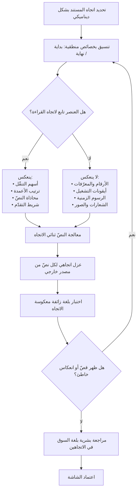

# التخطيط من اليمين إلى اليسار (RTL)

> [!info] تعريف مختصر
> نمط عرض تسير فيه الكتابة والتخطيط من اليمين إلى اليسار، وهو الأصل في العربية والعبرية والفارسية والأردية. الـRTL ليس «قلب الشاشة» كما يُتصوَّر غالبًا، بل **انعكاس انتقائي محكوم بقواعد**: بعض العناصر تنعكس لأنها تتبع اتجاه القراءة (ترتيب الأعمدة، محاذاة النصّ، أسهم التنقّل، شريط التقدّم، مسار القوائم)، وبعضها **يجب ألّا ينعكس أبدًا** لأن اتجاهه محكوم بمعنى مستقلّ عن اللغة: الأرقام نفسها، وأيقونات التشغيل والصوت والفيديو، والرسوم الزمنية والبيانية ذات محور الزمن، والشعارات، وأكواد البرمجة، وصور المنتجات الحقيقية. ويرتبط به مفهوم لصيق هو **النصّ ثنائي الاتجاه (Bidirectional Text / BiDi)**: الحالة الشائعة جدًّا التي يختلط فيها نصّ عربي بنصّ لاتيني أو بأرقام أو رموز داخل الفقرة الواحدة، فتتداخل الاتجاهات وتظهر أشهر أعطال العرض العربي على الإطلاق.

## الشرح العلمي والاحترافي

- **الاتجاه خاصية عرض لا خاصية تخزين**: النصّ يُخزَّن في الذاكرة بترتيب منطقي (بترتيب النطق والكتابة)، ثم تتولّى خوارزمية عرض تحويله إلى ترتيب بصري على الشاشة. هذا الفصل بين الترتيب المنطقي والترتيب البصري هو أساس فهم كل مشكلات الاتجاه: النصّ المخزَّن سليم في الغالبية العظمى من الأعطال، والخلل يقع في طبقة العرض أو في افتراضات التخطيط. ولذلك «إصلاح» النصّ بعكس محارفه عند التخزين خطأ فادح يفسد البيانات نفسها.

- **خوارزمية BiDi في Unicode والمستويات**: يعرّف معيار Unicode خوارزمية معيارية للنصّ ثنائي الاتجاه، تسند إلى كل محرف اتجاهًا أصيلًا (العربية والعبرية من اليمين لليسار، اللاتينية من اليسار لليمين، الأرقام لها سلوك خاص، وعلامات الترقيم **محايدة** تكتسب اتجاهها من جوارها). ثم تُرتَّب المقاطع في «مستويات» متداخلة. وأشهر أعراض الخلل تنبع من المحارف المحايدة: علامة استفهام أو قوس أو نقطة في نهاية جملة عربية تحوي كلمة لاتينية قد تقفز إلى الطرف الخاطئ. العلاج المعياري ليس الحيل النصّية، بل تعليم النظام **الاتجاه الأساسي للفقرة** صراحةً، واستخدام محارف التحكّم والعزل المخصّصة لذلك عند إدراج نصّ بلغة مجهولة الاتجاه.

- **مشكلة المحتوى المُدخَل من المستخدم**: أصعب حالات BiDi عمليًّا ليست الواجهة الثابتة — فهي معروفة الاتجاه — بل المحتوى الذي يكتبه المستخدمون: اسم عربي بين أسماء إنجليزية، أو تعليق عربي يحوي رابطًا، أو اسم ملف مختلط. القاعدة العملية: أي نصّ تُدرجه من مصدر مجهول الاتجاه يجب أن يُعزل اتجاهيًّا كي لا «يسرّب» اتجاهه إلى ما حوله. وهذه مسألة أمنية أيضًا في حالات معروفة: محارف التحكّم الاتجاهي قادرة على إظهار اسم ملف أو نصّ بترتيب مغاير لترتيبه الحقيقي، وهو ما يُستغلّ للتضليل.

- **الأرقام لا تنعكس أبدًا**: الرقم في العربية يُقرأ من اليسار إلى اليمين حتى داخل نصّ يسير من اليمين إلى اليسار. لذلك «1,250» تبقى «1,250» ولا تصبح «052,1». وهذا يمتدّ إلى: أرقام الهواتف، وأرقام الحسابات البنكية والآيبان، ورموز التتبّع، والإصدارات، ونسب المئوية. مسألة منفصلة عنها تمامًا هي **شكل** الأرقام (اللاتينية 0123 مقابل العربية-الهندية ٠١٢٣)، وهذه تُحسم في إعدادات [[Locale|الـLocale]] لا في الاتجاه، وتختلف بين الأسواق العربية نفسها.

- **ما يجب ألّا ينعكس — قائمة عملية**: ① **أيقونات التشغيل والوسائط** (زرّ التشغيل يبقى متّجهًا لليمين لأنه يرمز إلى شريط ينساب لا إلى قراءة، وكذلك ترتيب أزرار الترجيع والتقديم في مشغّلات كثيرة). ② **الرسوم البيانية ذات محور الزمن**: محور الزمن يبقى من اليسار لليمين في الأعراف المستقرّة لعرض البيانات، وعكسه يربك القراءة ويخالف توقّع المستخدم المهني. ③ **الأرقام والمعادلات وأكواد البرمجة**. ④ **الشعارات والعلامات التجارية** المعرَّفة في [[Brand Guidelines]]. ⑤ **الصور الفوتوغرافية الحقيقية** (عكسها يقلب كل نصّ ومعلم داخلها). ⑥ **أيقونات ليس لها معنى اتجاهي** كالساعة أو الترس. في المقابل تنعكس بوضوح: أسهم «التالي/السابق»، وأسهم الرجوع، وترتيب أعمدة الجداول، ومحاذاة النصّ، ومسار خطوات المعالج، واتجاه امتلاء شريط التقدّم، وأيقونات المسافة البادئة والقوائم المرقّمة.

- **الأثر الهندسي: الخصائص المنطقية بدل الاتجاهية**: البناء الصحيح لا يستخدم «يسار» و«يمين» في التنسيق، بل «بداية» و«نهاية» — فتتحوّل هذه تلقائيًّا بحسب اتجاه المستند. هذا يلغي الحاجة إلى ملف تنسيق موازٍ للعربية، وهو الفارق بين منتج يدعم الاتجاهين بملف واحد ومنتج يصون نسختين تتباعدان مع كل تعديل. والقاعدة نفسها تنطبق على الرسوم المتحرّكة (اتجاه انزلاق اللوحات الجانبية) وعلى إيماءات السحب.

- **الاتجاه ليس دالّة اللغة بالضرورة**: الخلط بين «اللغة عربية» و«الاتجاه من اليمين لليسار» يبدو صحيحًا حتى تظهر حالات مركّبة: مستخدم يريد واجهة إنجليزية داخل منتج عربي أصلًا، أو محرّر نصّ يجب أن يسمح بتغيير اتجاه فقرة بعينها بغضّ النظر عن لغة الواجهة، أو لوحة تحكّم عربية تعرض سجلات نظام لاتينية يجب أن تُقرأ باتجاهها الأصلي. لذلك يُبنى الاتجاه كخاصية مستقلّة قابلة للضبط على مستوى المستند وعلى مستوى العنصر.

- **الطباعة والخطوط ليست تفصيلًا تجميليًّا**: العربية متّصلة الحروف، ولكل حرف أشكال تختلف بحسب موضعه، وارتفاع السطر فيها يحتاج مساحة أكبر بسبب النقاط والتشكيل. استخدام خطّ لاتيني «يدعم العربية» شكليًّا يُنتج نصًّا رديء الاتّصال ضعيف المقروئية. كذلك أوزان الخطّ العربي لا تقابل نظيرتها اللاتينية بالضرورة، وتصغير حجم الخطّ العربي إلى ما يناسب اللاتينية يضرّ المقروئية بشكل ملموس. وهذه كلّها قرارات تصميم يجب أن تُوثَّق في نظام التصميم لا أن تُترك لكل شاشة.

- **RTL مسألة إتاحة وصول أيضًا**: قارئات الشاشة تحتاج تحديدًا صحيحًا للغة والاتجاه لتنطق النصّ صحيحًا؛ ونصّ مختلط بلا وسوم لغة يُنطق بلكنة خاطئة أو يُقرأ بترتيب مربك. كما أن ترتيب التنقّل بمفتاح الجدولة يجب أن يتبع الترتيب المنطقي للقراءة، لا ترتيب العناصر في الشيفرة إن اختلفا.

## أين ومتى يُستخدم

- **في أي منتج يستهدف السوق العربي**: سواء بُني عربيًّا من البداية أو أُضيفت إليه العربية لاحقًا ضمن مشروع [[Localization|توطين]].
- **في نظام التصميم ومكتبة المكوّنات**: يجب أن يُوثَّق لكل مكوّن سلوكه في الاتجاهين، مع تحديد صريح لما ينعكس وما لا ينعكس — فهذا أكفأ موضع لحسم القرار مرّة واحدة بدل تكراره في كل شاشة.
- **في تقييم منتج جاهز أو مورّد**: بند «دعم RTL أصيل» في [[Fit-Gap Analysis]] يجب أن يُختبر عمليًّا لا أن يُؤخذ من ورقة المواصفات، لأن كثيرًا من المنتجات تعلن الدعم وتعني به ترجمة النصوص فقط.
- **في مراجعة التصميم قبل التطوير**: تُراجَع مخرجات التصميم في الاتجاهين معًا؛ تصميم صُمّم في اتجاه واحد ثم «قُلب» آليًّا ينتج دائمًا أعطالًا في المكوّنات المختلطة.
- **في خطة الاختبار**: اختبار الاتجاه واختبار النصّ ثنائي الاتجاه بندان منفصلان في خطة [[Quality Assurance]]، ويُغذَّيان بحالات من [[Edge Cases]] مثل اسم مختلط أو تعليق يحوي رابطًا.
- **في مرحلة ما قبل الترجمة**: [[Pseudo-localization]] بلغة معكوسة الاتجاه تكشف أعطال التخطيط قبل وجود أي محتوى عربي حقيقي.
- **في المخرجات المطبوعة والمصدَّرة**: الفواتير وملفات PDF والتقارير غالبًا تُبنى بمحرّك مختلف عن الواجهة، وتحتاج اختبار اتجاه مستقلًّا تمامًا.

## مثال وسيناريو تطبيقي

> [!example] بنك خليجي أطلق تطبيقًا جديدًا للأفراد، وأُنجزت النسخة العربية بعد الإنجليزية بأسبوعين عبر «قلب الواجهة» آليًّا وترجمة النصوص. مرّت مراجعة الجودة على يد فريق لا يقرأ العربية، فلم يُرصد شيء يُذكر. وخلال أسبوعين من الإطلاق تجمّعت شكاوى من فئات متباينة كشفت أن المشكلة بنيوية:
> **الأولى**: أرقام الآيبان في شاشة التحويل ظهرت معكوسة بصريًّا لأن الحقل عومل كنصّ عربي عادي داخل تخطيط منعكس. لم تكن البيانات تالفة، لكن العملاء كانوا ينسخونها ويقارنونها يدويًّا فيرونها مختلفة عن كشوفهم، فتوقّف عدد منهم عن إتمام التحويل ظنًّا أن الحساب خاطئ.
> **الثانية**: الرسم البياني لتطوّر الرصيد الشهري انعكس بالكامل، فصار محور الزمن يبدأ من اليمين. اشتكى عملاء من أن «الرصيد يبدو هابطًا» بينما كان صاعدًا — قراءة معكوسة لاتجاه المنحنى.
> **الثالثة**: أيقونة تشغيل الفيديو التعريفي انعكست فصارت تشبه زرّ الترجيع، فانخفضت نسبة مشاهدة الفيديو التعريفي انخفاضًا حادًّا في النسخة العربية مقارنةً بالإنجليزية.
> **الرابعة والأكثر تكرارًا**: أسماء المستفيدين المختلطة (اسم عربي متبوع باسم شركة لاتيني) ظهرت بترتيب مضطرب، وقفزت علامات الترقيم إلى مواضع خاطئة — عطل BiDi كلاسيكي سببه أن النصّ أُدرج بلا عزل اتجاهي.
> عالج الفريق ذلك على أربعة مستويات: تحديد الاتجاه صراحةً على مستوى الحقل للأرقام والمعرّفات البنكية بدل توريثه من الصفحة؛ واستثناء الرسوم البيانية وأيقونات الوسائط من الانعكاس عبر قائمة صريحة في نظام التصميم؛ وعزل كل نصّ مُدخَل من المستخدم اتجاهيًّا عند العرض؛ وإعادة بناء طبقة التنسيق بخصائص منطقية بدل ملف مقلوب. ثم أُضيف شرط ثابت في [[Definition of Done]]: لا تُعتمد أي شاشة قبل مراجعتها في الاتجاهين بواسطة مراجع يقرأ العربية.
> النتيجة التي سجّلها الفريق: تراجعت تذاكر الدعم المصنَّفة «مشكلة عرض» بمقدار كبير خلال دورتين، وعادت نسبة مشاهدة الفيديو التعريفي في النسخة العربية إلى مستوى مقارب للإنجليزية بعد تصحيح الأيقونة وحدها.

## خطوات أو مخطّط

1. اعتماد الاتجاه كخاصية مستقلّة قابلة للضبط على مستوى المستند وعلى مستوى العنصر، لا كنتيجة ضمنية للّغة.
2. إعادة بناء طبقة التنسيق بخصائص منطقية (بداية/نهاية) بدل يسار/يمين، وإلغاء أي ملف تنسيق مقلوب موازٍ.
3. إعداد **قائمة صريحة موثّقة** في نظام التصميم بما ينعكس وما لا ينعكس، واعتمادها مرجعًا للمصمّمين والمطوّرين.
4. تحديد اتجاه أساسي واضح لكل كتلة نصّية، وعزل كل نصّ وارد من المستخدم أو من مصدر خارجي عزلًا اتجاهيًّا.
5. استثناء الأرقام والمعرّفات (الحسابات، الهواتف، الأكواد) من سياق الاتجاه المحيط وضبط اتجاهها صراحةً.
6. اختيار خطّ عربي أصيل ذي أوزان كافية، وضبط ارتفاع السطر والحجم بما يناسب الطباعة العربية لا نظيرتها اللاتينية.
7. تشغيل [[Pseudo-localization]] بلغة معكوسة الاتجاه لكشف أعطال التخطيط قبل الترجمة.
8. مراجعة كل شاشة في الاتجاهين بواسطة مراجع يقرأ اللغة، وجعل ذلك شرط قبول لا خطوة اختيارية.
9. اختبار المخرجات غير التفاعلية بشكل مستقلّ: البريد، الفواتير، ملفات PDF، التقارير المصدَّرة.
10. التحقّق من الإتاحة: نطق قارئ الشاشة، وسوم اللغة، وترتيب التنقّل بمفتاح الجدولة.

## ⚠️ مفاهيم خاطئة شائعة

> [!warning]
> - **«RTL يعني قلب كل شيء»**: الانعكاس انتقائي محكوم بقواعد. قلب الرسوم الزمنية وأيقونات التشغيل والأرقام يُنتج واجهة تبدو «مترجمة آليًّا» ويربك المستخدم بدل أن يخدمه. التصحيح: قائمة صريحة موثّقة لما ينعكس وما لا ينعكس، تُعتمد على مستوى نظام التصميم.
> - **«الأرقام تنعكس مع النصّ»**: لا. الرقم يُقرأ من اليسار إلى اليمين حتى داخل نصّ عربي. ومسألة **شكل** الأرقام (لاتينية أم عربية-هندية) منفصلة تمامًا وتُحسم في [[Locale|الـLocale]] بحسب السوق.
> - **«العطل في النصّ المخزَّن»**: في الغالبية العظمى من حالات BiDi يكون النصّ سليمًا تمامًا، والخلل في طبقة العرض أو في غياب تحديد الاتجاه الأساسي. «إصلاحه» بعكس المحارف عند التخزين يفسد البيانات ويجعل المشكلة دائمة وغير قابلة للتراجع.
> - **«ملف تنسيق منفصل للعربية هو الحل»**: هو حلّ يعمل يوم كتابته ثم يتحوّل إلى عبء صيانة دائم: كل تعديل في الأصل يجب تكراره، ويتباعد الملفان تدريجيًّا حتى تصير النسخة العربية متأخّرة بصريًّا. الحل البنيوي هو الخصائص المنطقية.
> - **«الاتجاه = اللغة»**: قد يحتاج المنتج عرض محتوى لاتيني داخل واجهة عربية والعكس، ومحرّرات النصّ تحتاج ضبط اتجاه الفقرة مستقلًّا عن لغة الواجهة. بناء الاتجاه كدالّة للّغة يمنع هذه الحالات كلّها.
> - **«الخطّ الذي يعرض العربية يكفي»**: عرض الحروف شيء وجودة الطباعة شيء آخر. خطّ لاتيني بدعم عربي هامشي يُنتج اتّصالًا رديئًا وارتفاع سطر غير كافٍ ومقروئية أضعف، وأثر ذلك يظهر في إرهاق القراءة لا في تقرير أخطاء.
> - **«اختبار RTL يمكن أن يقوم به أي مختبِر»**: مختبِر لا يقرأ العربية سيرى واجهة تبدو مقبولة وهي تحوي نصًّا مقلوبًا أو مقطوعًا أو ترقيمًا في موضع خاطئ. هذه فئة عيوب **غير مرئية** لغير الناطق بالكامل.

## ❌ ممارسات خاطئة في المشاريع

> [!failure]
> - **«قلب» الواجهة آليًّا واعتباره دعمًا للعربية**: الخطأ — تُطبَّق أداة عكس شاملة على التخطيط ثم يُعلن دعم RTL. لماذا يضرّ — تنعكس عناصر يجب ألّا تنعكس (رسوم زمنية، أيقونات وسائط، أرقام)، فتظهر أخطاء دلالية تُضلّل المستخدم لا مجرّد أخطاء شكلية. الحل — اعتمد قائمة استثناءات صريحة في نظام التصميم، وراجع كل مكوّن يدويًّا في الاتجاهين قبل اعتماده.
> - **تصميم الشاشات في اتجاه واحد فقط**: الخطأ — يسلّم المصمّم مخرجاته بالاتجاه الأصلي ويُترك الاتجاه الآخر للمطوّر. لماذا يضرّ — تظهر قرارات بصرية لم يتّخذها أحد (موضع الأيقونة داخل الزرّ، اتجاه الظلال، انزلاق اللوحات)، فيرتجلها المطوّر وتتباين بين الشاشات. الحل — اشترط تسليم النماذج في الاتجاهين للشاشات المركّبة على الأقل، واجعله بندًا في [[Definition of Ready]].
> - **إدراج محتوى المستخدم بلا عزل اتجاهي**: الخطأ — يُعرض اسم أو تعليق وارد من المستخدم مباشرةً داخل جملة واجهة. لماذا يضرّ — يتسرّب اتجاه النصّ إلى ما حوله فتضطرب الجملة ويقفز الترقيم، وقد يُستغلّ ذلك لإظهار نصّ بترتيب مضلّل. الحل — اعزل كل نصّ من مصدر خارجي اتجاهيًّا عند العرض، واجعلها قاعدة في مكوّن العرض لا مسؤولية كل مطوّر.
> - **إهمال المخرجات المطبوعة والمصدَّرة**: الخطأ — تُختبر الواجهة فقط وتُترك الفواتير وملفات PDF والبريد. لماذا يضرّ — هذه المخرجات تُبنى غالبًا بمحرّك مختلف بدعم اتجاهي أضعف، وهي تحديدًا ما يصل إلى العميل والجهات الرقابية. الحل — أدرج كل مخرَج مطبوع أو مصدَّر في نطاق اختبار الاتجاه صراحةً وفي [[RTM|مصفوفة التتبّع]].
> - **تأجيل دعم الاتجاهين إلى ما بعد اكتمال المنتج**: الخطأ — «نبني بالإنجليزية أولًا ثم نضيف العربية». لماذا يضرّ — تتراكم آلاف القرارات الاتجاهية في التنسيق والمكوّنات، فيصير الدعم اللاحق إعادة بناء لطبقة العرض لا إضافة، وترتفع الكلفة وفق منطق [[Cost-of-Change Curve]]. الحل — ابنِ بخصائص منطقية من اليوم الأول حتى لو لم تُطلق العربية بعد؛ الكلفة الإضافية عندها شبه معدومة.
> - **الاعتماد على مراجعة جودة بلا ناطق باللغة**: الخطأ — يُقبل الإصدار العربي بمراجعة فريق لا يقرأ العربية. لماذا يضرّ — يمرّ نصّ مقطوع أو مقلوب أو ترجمة خاطئة بلا ملاحظة، ويظهر عند المستخدم كـ[[Escaped Defect Rate|عيب متسرّب]] مكلف في الثقة. الحل — اشترط مراجعًا يقرأ اللغة في مسار [[Sign-off]]، واعتبر غيابه سببًا لحجب الاعتماد.
> - **تجاهل الخطوط والطباعة في نظام التصميم**: الخطأ — تُستخدم الأحجام وارتفاعات السطر نفسها في اللغتين. لماذا يضرّ — يبدو النصّ العربي مضغوطًا وضعيف المقروئية، فتنخفض جودة التجربة بشكل يصعب على المستخدم تسميته لكنه يظهر في زمن الإنجاز ومعدّل الخطأ. الحل — عرّف مقاييس طباعة مستقلّة لكل نظام كتابة داخل نظام التصميم، ووثّقها في [[Brand Guidelines]].

## 🔗 مصطلحات ومفاهيم ذات صلة
[[Internationalization]] | [[Localization]] | [[Locale]] | [[Pseudo-localization]] | [[ICU Message Format]] | [[Brand Guidelines]] | [[Definition of Done]] | [[Edge Cases]] | [[Quality Assurance]] | [[Fit-Gap Analysis]]
