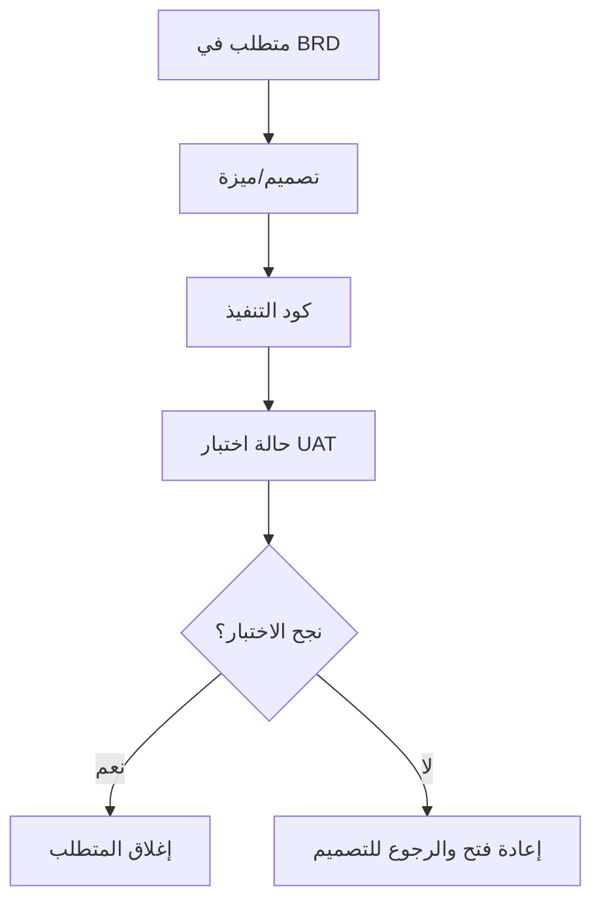

# مصفوفة تتبّع المتطلبات (RTM)

> [!info] تعريف مختصر
> مصفوفة تتبّع المتطلبات (Requirements Traceability Matrix - RTM) هي جدول يربط كل متطلب في المشروع بمصدره (لماذا طُلب) وبمخرجاته (أين نُفِّذ وكيف اختُبِر)، لضمان أن لا متطلب يُنسى ولا عمل يُنجَز دون سبب موثّق.

## الشرح العلمي والاحترافي
- RTM جدول يضع عادة كل متطلب في صف، وأعمدة توضّح: رقم المتطلب، مصدره (وثيقة متطلبات العمل [[BRD]] أو طلب عميل)، الميزة أو التصميم الذي يحققه، الكود الذي نفّذه، وحالة الاختبار الذي يثبت أنه يعمل (UAT).
- الفائدة الأساسية هي "التتبّع في الاتجاهين": يمكن الانطلاق من متطلب والوصول إلى الكود والاختبار الذي يحققه (تتبّع أمامي)، أو الانطلاق من حالة اختبار فاشلة والرجوع لمعرفة أي متطلب تأثّر (تتبّع خلفي).
- يمنع RTM ظاهرتين شائعتين: متطلبات "تتبخّر" ولا يُنفَّذ لها شيء رغم الاتفاق عليها، وميزات تُبنى دون أن يطلبها أحد فعلياً (وهو أحد أشكال [[Scope Creep]] الخفي).
- يُستخدم بكثرة في المشاريع التي تتبع منهجية الشلال ([[04 - Waterfall]]) والمشاريع التنظيمية أو الحكومية التي تتطلب إثبات الامتثال، لأن التوثيق الرسمي فيها جزء أساسي من التسليم.
- في بيئات أجايل، تُستبدل غالباً بأدوات ربط تلقائية بين قصص المستخدم وحالات الاختبار داخل أدوات مثل Jira، لكن المبدأ نفسه (التتبّع) يبقى قائماً.

## أين ومتى يُستخدم
- يُستخدم في مشاريع الشلال ([[04 - Waterfall]]) بعد اعتماد [[BRD]] و[[Software Requirements Specification]]، لضمان تغطية كل متطلب بالتصميم والتنفيذ والاختبار.
- يُلجأ إليه في المشاريع الخاضعة لتنظيمات صارمة (مالية، صحية، حكومية) حيث يجب إثبات أن كل متطلب مُنفَّذ ومُختبَر رسمياً قبل [[Sign-off]] النهائي.
- يُستخدم أثناء اختبار قبول المستخدم ([[UAT]]) للتأكد من أن كل حالة اختبار مرتبطة فعلياً بمتطلب موثّق، وليس اختباراً عشوائياً.
- في أجايل، مفهوم مشابه يظهر عبر ربط قصص المستخدم بمعايير القبول وحالات الاختبار الآلية، دون الحاجة لجدول منفصل رسمي بالضرورة.

## مثال وسيناريو تطبيقي
> [!example] سيناريو ملموس في مشروع برمجي حقيقي
> شركة تطوّر نظام إدارة مستشفيات لصالح وزارة صحية. تحتوي وثيقة [[BRD]] على 40 متطلباً، منها المتطلب رقم REQ-12: "يجب أن يستطيع الطبيب عرض تاريخ حساسية المريض قبل وصف أي دواء".
> يُنشئ محلل الأعمال صفاً في RTM لهذا المتطلب: المصدر BRD-قسم 4.2، التصميم المرتبط شاشة "ملف المريض الطبي"، الكود المسؤول ملف PatientAllergyService، وحالة الاختبار TC-045 التي تتحقق من ظهور تنبيه عند وصف دواء يتعارض مع حساسية مسجّلة.
> عند اختبار [[UAT]]، تفشل حالة TC-045 لأن التنبيه لا يظهر لبعض أنواع الأدوية. يرجع فريق الجودة إلى RTM، يجد أن المتطلب REQ-12 لم يُغطَّ بالكامل، ويُعاد فتح المهمة في الكود المرتبط بدلاً من البحث العشوائي عن سبب الخلل.

## خطوات أو مخطّط
1. جمع كل المتطلبات الموثّقة من [[BRD]] أو [[Software Requirements Specification]] وترقيمها.
2. إنشاء صف لكل متطلب، وربطه بالتصميم أو الميزة التي تحققه.
3. ربط كل متطلب بالكود أو المكوّن التقني المسؤول عن تنفيذه.
4. ربط كل متطلب بحالة اختبار واحدة أو أكثر ضمن [[UAT]] أو الاختبار الوظيفي.
5. تحديث حالة كل صف (منفَّذ، قيد التنفيذ، مُختبَر، فشل) طوال دورة المشروع حتى [[Sign-off]].

## ⚠️ مفاهيم خاطئة شائعة
> [!warning]
> - الاعتقاد أن RTM مجرد وثيقة إدارية شكلية تُملأ بعد التسليم؛ في الواقع قيمتها الحقيقية تظهر أثناء المشروع لمنع فقدان المتطلبات أو تنفيذ عمل غير مطلوب.
> - الظن أن مشاريع أجايل لا تحتاج أي شكل من التتبّع؛ الصحيح أنها تحتاجه أيضاً، لكن بأدوات أخف مثل ربط قصص المستخدم بمعايير القبول مباشرة في أداة إدارة العمل.
> - الخلط بين RTM وخطة الاختبار (Test Plan)؛ فـ RTM يربط المتطلبات بالاختبارات، بينما خطة الاختبار تحدد كيفية تنفيذ الاختبارات نفسها.

## ❌ ممارسات خاطئة في المشاريع
> [!failure]
> - إنشاء RTM مرة واحدة في بداية المشروع وعدم تحديثه عند تغيّر المتطلبات لاحقاً، فيصبح غير موثوق. التجنب: تحديث المصفوفة عند كل [[Change Request]] معتمد.
> - ترك بعض المتطلبات دون ربط بأي حالة اختبار، فتُسلَّم الميزة دون التحقق الفعلي من تحقيقها للمتطلب. التجنب: جعل اكتمال RTM شرطاً ضمن [[Definition of Done]] قبل [[Sign-off]].
> - استخدام RTM كأداة عقاب أو محاسبة للأفراد بدل أداة شفافية جماعية، مما يدفع الفريق لإخفاء الفجوات بدل الإبلاغ عنها. التجنب: تعزيز ثقافة [[Radical Transparency]] حول حالة كل متطلب.

## 🔗 مصطلحات ومفاهيم ذات صلة
[[BRD]] | [[Software Requirements Specification]] | [[UAT]] | [[04 - Waterfall]] | [[Sign-off]] | [[Change Request]] | [[Scope Creep]] | [[Single Source of Truth]] | [[Definition of Done]]
