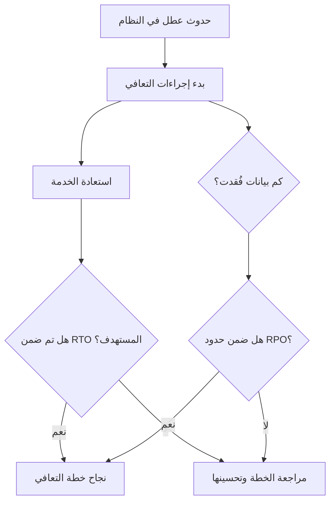

# هدف زمن التعافي وهدف نقطة التعافي (RTO and RPO)

> [!info] تعريف مختصر
> هدف زمن التعافي (Recovery Time Objective - RTO) هو أقصى وقت مقبول لإعادة تشغيل نظام بعد عطل كبير، بينما هدف نقطة التعافي (Recovery Point Objective - RPO) هو أقصى كمية بيانات مقبول فقدانها، مقاسة بالزمن منذ آخر نسخة احتياطية سليمة.

## الشرح العلمي والاحترافي
- RTO يجيب عن سؤال "كم من الوقت يمكننا تحمّل توقف النظام قبل أن نعتبره كارثة؟"، مثل "يجب استعادة الخدمة خلال 4 ساعات كحد أقصى".
- RPO يجيب عن سؤال مختلف تماماً: "كم من البيانات نقبل خسارتها؟"، مثل "يمكننا تحمّل فقدان آخر 15 دقيقة من البيانات فقط قبل آخر نسخة احتياطية".
- يهم هذا التمييز لأن كلا المقياسين يوجّه قرارات تقنية ومالية مختلفة تماماً؛ RTO يوجّه الاستثمار في سرعة الاستعادة (خوادم احتياطية جاهزة، أتمتة الاستعادة)، بينما RPO يوجّه تردد أخذ النسخ الاحتياطية (كل دقيقة، كل ساعة، كل يوم).
- كلما قصُر الوقت المستهدف في كلا المقياسين، ارتفعت التكلفة بشكل كبير؛ فتحقيق RTO بدقائق معدودة أو RPO بثوانٍ يتطلب بنية تحتية مكرَّرة ومكلفة (Redundancy)، بعكس نظام يقبل ساعات من التوقف أو فقدان بيانات يوم كامل.
- يرتبط المفهومان مباشرة بخطة التعافي من الكوارث (Disaster Recovery Plan) وبمؤشرات التوفر ([[Uptime]])، وغالباً ما تُحدَّد أرقامهما ضمن اتفاقيات مستوى الخدمة ([[SLO]]).
- يُستخدمان أيضاً لتقييم المخاطر ماليًا؛ فكل ساعة توقف إضافية أو كل دقيقة بيانات مفقودة لها تكلفة فعلية على العمل يجب موازنتها بتكلفة الاستثمار في التعافي.

## أين ومتى يُستخدم
- يُحدَّدان في مرحلة التخطيط لأي نظام حساس، خصوصاً الأنظمة المالية والصحية التي لا تحتمل فقدان بيانات أو توقفاً طويلاً.
- يُستخدمان في ممارسات إدارة استمرارية الأعمال (Business Continuity) وضمن إطار ITIL 4 عند تصميم خطط التعافي من الكوارث.
- يظهران في سجل المخاطر ([[Risk Register]]) كمقاييس كمية توضّح مدى استعداد المؤسسة للتعامل مع كارثة تقنية محتملة.
- يُراجعان دورياً من فرق موثوقية المواقع ([[SRE]]) عند تصميم أنظمة النسخ الاحتياطي والتعافي التلقائي (Failover).

## مثال وسيناريو تطبيقي
> [!example] سيناريو
> منصة "دفعتي" للتجارة الإلكترونية حدّدت لنظام الدفع الخاص بها: RTO = ساعة واحدة، وRPO = 5 دقائق. هذا يعني أنه إذا تعطّل النظام، يجب استعادته خلال ساعة كحد أقصى، وأقصى بيانات مقبول فقدانها هي آخر 5 دقائق من المعاملات.
> في أحد الأيام، تعطّل مركز البيانات الرئيسي الساعة 3:00 عصراً بسبب عطل كهربائي. بفضل نظام نسخ احتياطي مستمر كل 5 دقائق، لم تُفقَد سوى معاملات آخر 4 دقائق (ضمن حدود RPO المحدد). وبفضل خادم احتياطي جاهز في منطقة أخرى، استعاد الفريق الخدمة الساعة 3:35 عصراً، أي خلال 35 دقيقة فقط - وهذا أقل من ساعة RTO المستهدفة، مما اعتُبر نجاحاً للخطة رغم العطل.

## خطوات أو مخطّط
1. تصنيف الأنظمة حسب الأهمية: تحديد أي الأنظمة حرجة (مثل الدفع) وأيها أقل حساسية (مثل صفحة "من نحن").
2. تحديد RTO لكل نظام: الاتفاق مع أصحاب المصلحة على أقصى وقت توقف مقبول لكل نظام.
3. تحديد RPO لكل نظام: تحديد أقصى كمية بيانات (بالزمن) يمكن قبول فقدانها.
4. تصميم البنية التقنية: بناء أنظمة نسخ احتياطي واستعادة تحقق الأهداف المحددة (مثل تكرار الخوادم أو النسخ الاحتياطي المستمر).
5. الاختبار الدوري: إجراء محاكاة كوارث فعلية (Disaster Recovery Drill) للتأكد من أن النظام يحقق RTO وRPO المستهدفين عملياً لا نظرياً فقط.
6. المراجعة والتحديث: تعديل الأهداف بناءً على نمو الأعمال وتغيّر أهمية الأنظمة بمرور الوقت.

## ⚠️ مفاهيم خاطئة شائعة
> [!warning]
> - الخلط بين RTO وRPO؛ RTO يقيس "الزمن حتى استعادة الخدمة"، بينما RPO يقيس "كمية البيانات المفقودة" - وهما مقياسان مستقلان تماماً قد يختلفان كثيراً لنفس النظام.
> - الاعتقاد بأن تحديد RTO وRPO صفراً (أي بلا توقف وبلا فقدان بيانات إطلاقاً) هدف واقعي دائماً؛ في الواقع هذا مكلف جداً تقنياً ومالياً، ويُحجَز عادة للأنظمة الأكثر حرجية فقط.
> - الظن بأن مجرد وجود نسخة احتياطية يعني تحقق RPO المطلوب تلقائياً؛ يجب التأكد من أن تردد أخذ النسخ الاحتياطية يطابق فعلياً الهدف المحدد.

## ❌ ممارسات خاطئة في المشاريع
> [!failure]
> - تحديد RTO وRPO طموحين جداً على الورق دون اختبارهما فعلياً، فتُكتشف الفجوة فقط أثناء كارثة حقيقية. التجنب: إجراء محاكاة تعافي دورية (Disaster Recovery Drill) للتحقق من الأرقام الفعلية.
> - تطبيق نفس معايير RTO وRPO الصارمة على كل الأنظمة دون تمييز، مما يرفع التكلفة دون داعٍ للأنظمة الأقل أهمية. التجنب: تصنيف الأنظمة حسب الأهمية وتخصيص أهداف تعافي مختلفة لكل فئة.
> - عدم تحديث خطة RTO/RPO بعد نمو حجم البيانات أو تغيّر أهمية النظام، فتصبح الخطة القديمة غير كافية. التجنب: مراجعة الأهداف دورياً كل ربع أو نصف سنة أو عند أي تغيير جوهري في النظام.

## 🔗 مصطلحات ومفاهيم ذات صلة
[[Uptime]] | [[SLO]] | [[SLI]] | [[MTTR]] | [[ITIL 4]] | [[SRE]] | [[Risk Register]] | [[19 - Risk Management]] | [[Hotfix]]
