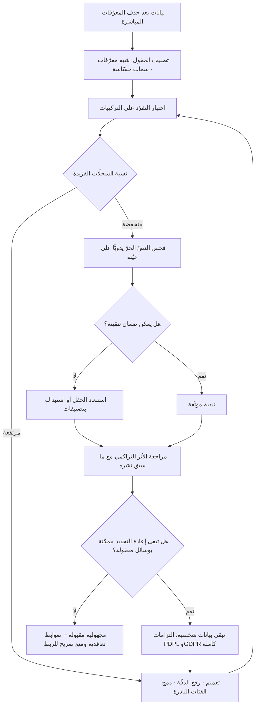

# إعادة تحديد الهوية (Re-identification)

> [!info] تعريف مختصر
> استدلال هوية شخص بعينه من مجموعة بيانات جرى «تمويهها» بحذف المعرّفات المباشرة (الاسم، رقم الهوية، الهاتف)، وذلك عبر **تقاطع سماته غير المباشرة** بعضها مع بعض أو مع مصادر خارجية متاحة. الفكرة المضادّة للحدس التي تحكم الموضوع كله: الهوية ليست حقلًا في جدول يمكن حذفه، بل **خاصّية ناشئة عن تفرّد التركيبة**. فالمهنة وحدها لا تدلّ على أحد، والحيّ وحده لا يدلّ، وتاريخ الميلاد وحده لا يدلّ — لكن اجتماعها الثلاثي قد لا ينطبق إلا على شخص واحد في مدينة كاملة. ومن هنا فإن السؤال الصحيح ليس «هل حذفنا الأسماء؟» بل «كم شخصًا في العالم تنطبق عليه هذه التركيبة من السمات؟».

## الشرح العلمي والاحترافي
- **مبدأ التفرّد التركيبي (Quasi-identifiers)**: تُقسَم الحقول إلى معرّفات مباشرة تُحذف عادةً، و**شبه معرّفات** لا تدلّ منفردة لكنها تُضيّق الفضاء بسرعة هائلة عند التقاطع: الرمز البريدي، تاريخ الميلاد، الجنس، المسمّى الوظيفي، الجنسية، حالة الإعاقة، عدد الأبناء، تاريخ أول زيارة. كل حقل يُضاف لا يجمع بل **يضرب**؛ ولذلك تنهار المجهولية أسرع بكثير ممّا يتوقّع من يصمّم الجدول.
- **الأصل الأكاديمي والدراسة المؤسِّسة**: يعود ترسيخ المفهوم عمليًّا إلى أعمال الباحثة **لاتانيا سويني (Latanya Sweeney)** في تسعينيات القرن الماضي، حيث بيّنت أن مجموعة صغيرة من شبه المعرّفات — الرمز البريدي وتاريخ الميلاد الكامل والجنس — تكفي لتمييز نسبة كبيرة جدًّا من السكّان في الولايات المتحدة تمييزًا فريدًا، وأظهرت عمليًّا إمكان ربط سجلّات صحّية «مجهولة» منشورة بسجلّات ناخبين متاحة للعموم للوصول إلى أفراد بأعيانهم. هذا العمل هو الذي حوّل المسألة من قلق نظري إلى مسلّمة تصميمية، وأنتج لاحقًا مفهوم **k-anonymity** كمعيار كمّي.
- **معيار k-anonymity وما بعده**: المعيار يقول إن أي سجلّ يجب أن يكون غير مميَّز عن **k-1** سجلًّا آخر على الأقل في شبه معرّفاته (فإن كانت k=5، فكل تركيبة سمات تنطبق على خمسة أشخاص على الأقل). ويُحقَّق ذلك بالتعميم (سنة الميلاد بدل تاريخه، والمنطقة بدل الحيّ) والحذف. لكن المعيار وحده لا يكفي: إن كان الخمسة كلهم يحملون **القيمة الحسّاسة نفسها** (كلهم مصابون بالمرض ذاته مثلًا)، فقد عرفتَ الحقيقة عن أي منهم دون أن تميّزه — وهذه الثغرة عالجتها معايير لاحقة مثل l-diversity. الدرس الإداري: المجهولية خاصّية **متدرّجة وقابلة للقياس**، لا حالة ثنائية.
- **ثلاثة مسارات لإعادة التحديد**، ومن المفيد التفريق بينها عند تقدير الخطر:
  ① **الربط (Linkage)**: مطابقة الجدول المموّه بمصدر خارجي يشترك معه في شبه معرّفات — سجلّ عام، أو تسريب سابق، أو بيانات اشتُريت.
  ② **الاستدلال (Inference)**: استنتاج قيمة حسّاسة عن فرد من خصائص المجموعة دون تمييزه بالضرورة.
  ③ **التفرّد بالسلوك (Behavioral Fingerprinting)**: أنماط الزمن والموقع والتسلسل تصنع بصمة بالغة التفرّد؛ فمسار تنقّل يومي أو تسلسل نقرات قد يكون أشدّ تمييزًا من الاسم نفسه.
- **الأثر التراكمي للنشر (Composition Effect)**: كل إصدار جديد من البيانات، ولو كان مموّهًا بمعيار سليم، **يقلّص الفضاء** حين يُقارَن بإصدارات سابقة. فمجموعتان آمنتان كلٌّ على حدة قد تكشفان الهوية عند دمجهما. ولهذا لا يمكن تقييم التمويه لمجموعة بيانات بمعزل عمّا سبق نشره أو مشاركته.
- **البعد الخاصّ بالذكاء الاصطناعي — وهو ما يجعل الموضوع أشدّ إلحاحًا اليوم**: النماذج اللغوية غيّرت اقتصاديات الهجوم جذريًّا. ما كان يحتاج محلّل بيانات وأسابيع عمل صار ممكنًا بسؤال واحد على نصّ غير منظّم. والأخطر أن أخطر ما في البيانات لم يعد الجداول بل **النصّ الحرّ**: تذكرة دعم فنّي أو ملاحظة سريرية أو تقييم أداء قد تُمحى منها الأسماء ويبقى فيها ما يكفي («المدير الإقليمي الجديد للفرع الشرقي الذي التحق الشهر الماضي») لتحديد شخص واحد بلا لبس. ثم يزيد الطين بلّة أن هذا النصّ حين يدخل قاعدة معرفة لنظام [[Retrieval-Augmented Generation]] يصير قابلًا للاستخراج بسؤال بلغة طبيعية من أي مستخدم يملك وصولًا.
- **الموقع التنظيمي الحاسم**: في [[PDPL]] و[[GDPR]]، إن كانت إعادة تحديد الهوية **ممكنة بوسائل معقولة**، فالبيانات لا تزال بيانات شخصية وتنطبق عليها الالتزامات كاملةً — بما فيها الأساس القانوني للمعالجة، وحقوق أصحاب البيانات، وقيود النقل عبر الحدود ([[Data Residency]])، والإبلاغ عند الاختراق. أي أن تسمية الملف «مجهول» لا تنقله من دائرة التنظيم؛ التقييم الفعلي لخطر إعادة التحديد هو ما ينقله، وهذا هو الفارق العملي بين [[Anonymization]] الحقيقي وما دونه.

## أين ومتى يُستخدم
- **قبل مشاركة أي بيانات مع طرف خارجي**: مورّد، أو شريك تحليلات، أو نموذج ذكاء اصطناعي عام — يُجرى تقييم خطر إعادة التحديد لا مجرّد حذف الأسماء ([[Vendor Management]]).
- **عند تجهيز بيانات اختبار للبيئات غير الإنتاجية ([[Staging vs Production Environment]])**: نسخ الإنتاج «بعد حذف الأسماء» ممارسة شائعة وخطرة، ويكشفها اختبار تفرّد بسيط.
- **في تقييم أثر الخصوصية قبل إطلاق أي ميزة تعالج بيانات أفراد**، ويُوثَّق التقييم إلى جانب تدفّقات المعالجة في [[ROPA]].
- **في نشر التقارير والإحصاءات المجمّعة**: الخلايا الصغيرة في الجداول التقاطعية تكشف أفرادًا؛ ولذلك تُطبَّق حدود دنيا لحجم الخلية قبل النشر.
- **عند بناء قواعد معرفة للمساعدات الداخلية ([[Grounding]])**: النصّ الحرّ داخل التذاكر والملاحظات هو أكثر ما يُغفَل وأكثر ما يكشف.
- **في تصميم ضوابط الوصول إلى البيانات التحليلية ([[Least Privilege]])**: تقييد التقاطعات الممكنة لا الحقول فقط، لأن الخطر في الجمع لا في الحقل المفرد.

## مثال وسيناريو تطبيقي
> [!example] جهة صحّية خليجية أرادت مشاركة مجموعة بيانات مع فريق بحثي جامعي لدراسة أنماط مراجعة العيادات. المجموعة: 82,000 زيارة خلال سنتين. أُزيلت قبل المشاركة: الاسم، ورقم الهوية، ورقم الملف، ورقم الجوّال. وبقيت الحقول التالية باعتبارها «غير معرّفة»: تاريخ الميلاد الكامل، والجنس، والجنسية، والحيّ، وتخصّص العيادة، وتاريخ الزيارة، والمهنة كما سجّلها الموظّف، وحقل ملاحظات نصّي حرّ.
> أجرى فريق الالتزام — قبل التسليم بأسبوع — اختبار تفرّد بسيطًا: كم سجلًّا ينفرد بتركيبة (تاريخ الميلاد + الجنس + الحيّ)؟ النتيجة: **31,400 سجلًّا فريدًا تمامًا**، أي أكثر من ثلث المجموعة يمكن تمييز صاحبه بثلاثة حقول لا يعدّها أحد معرّفات. وعند إضافة الجنسية ارتفع العدد إلى ما يقارب النصف.
> ثم فُحص حقل الملاحظات النصّي بأخذ عيّنة من 500 سجلّ: في 68 منها وردت عبارات تحدّد الشخص عمليًّا مثل «المريضة معلّمة في المدرسة الابتدائية الوحيدة بالقرية» أو «الوالد موظّف في الشركة س بالقسم ص». حذف الأسماء لم يمسّ هذه العبارات إطلاقًا لأنها لا تتضمّن اسمًا.
> ما نُفِّذ قبل المشاركة: ① استُبدل تاريخ الميلاد بفئات عمرية خماسية، وأُلغيت الفئات التي يقلّ عدد أفرادها عن حدّ أدنى بدمجها في فئة «65 فأكثر». ② استُبدل الحيّ بالمنطقة الإدارية. ③ أُزيلت الجنسية كليًّا لأنها في بعض التقاطعات كانت تكفي وحدها للتمييز، ولم تكن ضرورية لسؤال البحث. ④ أُزيح تاريخ الزيارة عشوائيًّا ضمن نافذة أسبوع لكل مريض بالإزاحة نفسها حفاظًا على تسلسل الزيارات. ⑤ أُخرج حقل الملاحظات النصّي من النطاق كليًّا بعد أن تعذّر ضمان تنقيته آليًّا، واستُعيض عنه بحقول مصنّفة اشتُقّت منه يدويًّا. ⑥ وُقّع اتفاق يمنع صراحةً محاولة إعادة تحديد الهوية أو الربط بأي مصدر خارجي، ويلزم بالإتلاف بعد انتهاء الدراسة.
> بعد التعديلات أُعيد اختبار التفرّد: انخفض عدد السجلّات الفريدة إلى 210 سجلًّا، عولجت بالحذف. الكلفة الإجمالية: 11 يوم عمل. والملاحظة التي دوّنها الفريق في [[Decision Log]]: **لولا اختبار التفرّد لكانت المجموعة سلّمت وهي تحمل صفة «مجهولة» في كل مراسلاتها الرسمية** — والوصف وحده كان سيغلق باب أي مراجعة لاحقة.

## خطوات أو مخطّط
1. صنّف كل حقل: معرّف مباشر / شبه معرّف / سمة حسّاسة / غير ذي صلة، واحذف كل ما لا يخدم الغرض المعلن.
2. حدّد نموذج التهديد صراحةً: من الطرف المتلقّي؟ وما البيانات الخارجية التي يمكن أن يربط بها واقعيًّا؟
3. أجرِ اختبار تفرّد كمّيًّا: احسب نسبة السجلّات الفريدة على تركيبات شبه المعرّفات المحتملة، لا على حقل واحد.
4. طبّق التعميم ورفع الدقّة: فئات عمرية بدل تواريخ، مناطق بدل أحياء، فترات بدل طوابع زمنية دقيقة.
5. عالج القيم المتطرّفة والفئات النادرة بالدمج أو الحذف، فهي أول ما يكشف.
6. افحص النصّ الحرّ يدويًّا على عيّنة قبل الاعتماد على أي تنقية آلية، واستبعده كليًّا إن تعذّر ضمانه.
7. راجع الأثر التراكمي: ما الذي سبق نشره أو مشاركته من هذه البيانات، وماذا يكشف الدمج؟
8. أضف ضوابط تعاقدية وتنظيمية: منع صريح لمحاولة إعادة التحديد، وحدّ للاحتفاظ، والتزام بالإتلاف، وقيود على إعادة المشاركة.
9. وثّق التقييم وأعد إجراءه دوريًّا، فما كان آمنًا قبل سنتين قد لا يكون كذلك بعد تسريب جديد أو مصدر عام جديد.

## ⚠️ مفاهيم خاطئة شائعة
> [!warning]
> - **«حذفنا الأسماء وأرقام الهوية فصارت البيانات مجهولة.»** المعرّفات المباشرة أقلّ ما يكشف؛ التفرّد ينشأ من تقاطع شبه المعرّفات. التصحيح: قِس التفرّد كمّيًّا بدل الاستدلال بوجود الحقول أو غيابها.
> - **«التجزئة أو التشفير للمعرّف تجعل البيانات مجهولة.»** استبدال المعرّف برمز ثابت يبقي القدرة على تتبّع الفرد عبر السجلّات، وهو **إخفاء الهوية بالترميز (Pseudonymization)** لا تمجيهلًا؛ والبيانات تبقى شخصية بحكم التنظيم. التصحيح: ميّز الترميز عن التمويه الحقيقي في التوثيق وفي القرار.
> - **«الخطر نظري ولا أحد سيبذل هذا الجهد.»** انخفضت كلفة الهجوم انخفاضًا حادًّا مع توفّر البيانات المسرّبة وأدوات المطابقة والنماذج اللغوية القادرة على استخراج الدلالات من نصّ حرّ. التصحيح: قدّر الخطر بالوسائل المتاحة **اليوم** لا بما كان متاحًا حين كُتبت السياسة.
> - **«البيانات المجمّعة والإحصاءات آمنة دائمًا.»** الخلايا الصغيرة في الجداول التقاطعية، والفروق بين إصدارين من التقرير نفسه، تكشف أفرادًا. التصحيح: افرض حدًّا أدنى لحجم الخلية، وتتبّع ما نُشر سابقًا قبل نشر تحديث.
> - **«التقييم يُجرى مرّة واحدة.»** خطر إعادة التحديد يتزايد مع الزمن كلما ظهرت مصادر عامة أو تسريبات جديدة يمكن الربط بها. التصحيح: أعد التقييم دوريًّا وعند كل نشر جديد، واعتبره حالة متغيّرة لا شهادة دائمة.
> - **«النصّ الحرّ أقلّ خطرًا لأنه غير منظّم.»** العكس تمامًا: النصّ الحرّ هو أغنى مصدر لشبه المعرّفات وأصعبها ضبطًا، ولا تكفي فيه المرشّحات الآلية. التصحيح: عامل النصّ الحرّ كأعلى فئات المخاطرة، واستبعده ما لم تُثبت تنقيته على عيّنة مراجَعة بشريًّا.

## ❌ ممارسات خاطئة في المشاريع
> [!failure]
> - **استخدام نسخة من بيانات الإنتاج في بيئات الاختبار بعد حذف الأسماء.** الخطأ: «بيانات واقعية للاختبار». لماذا يضرّ: البيئات غير الإنتاجية أوسع وصولًا وأضعف حماية، فتصير أسهل نقطة تسريب لبيانات لا تزال شخصية فعليًّا. الحل: ولّد بيانات صناعية، أو طبّق تمويهًا مُختبَرًا بمقياس تفرّد قبل النسخ، ووثّق النتيجة.
> - **الاكتفاء بأداة تنقية آلية للنصّ الحرّ.** الخطأ: تمرير الملاحظات على أداة تكشف الأسماء والأرقام. لماذا يضرّ: الأدوات تكشف الأنماط الصريحة وتترك الأوصاف السياقية التي تحدّد الشخص بلا لبس. الحل: راجع عيّنة يدويًّا لتقدير معدّل التسرّب، واستبعد الحقل إن تجاوز حدًّا مقبولًا.
> - **تجاهل نموذج التهديد عند تحديد مستوى التمويه.** الخطأ: المستوى نفسه للنشر العام وللمشاركة مع شريك متعاقد. لماذا يضرّ: يُفرِط في التمويه حيث لا يلزم فيُتلف قيمة البيانات، ويُفرّط حيث يلزم فيُنشئ مخاطرة. الحل: اربط مستوى التمويه بالمتلقّي وبما يمكنه الربط به واقعيًّا، ووثّق الافتراض.
> - **إغفال حقول الزمن والموقع.** الخطأ: الاحتفاظ بطوابع زمنية بالثانية وبإحداثيات دقيقة بوصفها «بيانات تقنية». لماذا يضرّ: التسلسل الزمني والمكاني من أقوى بصمات التفرّد على الإطلاق، وقد يفوق الاسم في قدرته على التمييز. الحل: اخفض الدقّة إلى أدنى مستوى يفي بالغرض التحليلي، وأزح الطوابع الزمنية حيث يمكن.
> - **الاعتماد على الوصف بدل الاختبار.** الخطأ: كتابة «مجهولة الهوية» في مراسلات المشروع دون قياس. لماذا يضرّ: يوقف الوصف كل مراجعة لاحقة ويُسقط المسؤولية عن سلسلة الموافقات كلها. الحل: اجعل إرفاق نتيجة اختبار التفرّد شرطًا في [[Definition of Done]] لأي مشاركة بيانات.
> - **إدخال سجلّات تشغيلية نصّية في قاعدة معرفة مساعد داخلي بلا فحص.** الخطأ: توصيل نظام التذاكر مباشرة بمحرّك الاسترجاع. لماذا يضرّ: يصير استخراج بيانات أفراد ممكنًا بسؤال بلغة طبيعية من أي موظّف له وصول. الحل: افحص المحتوى قبل الفهرسة، وطبّق أذونات المستخدم على طبقة الاسترجاع ([[Least Privilege]]).
> - **إهمال الأثر التراكمي عبر الإصدارات.** الخطأ: نشر تحديث سنوي للمجموعة نفسها بمعايير التمويه ذاتها. لماذا يضرّ: مقارنة الإصدارات تكشف التغيّرات وتضيّق الفضاء حتى تنهار المجهولية دون خرق أي إصدار منفرد. الحل: قيّم كل إصدار في ضوء مجموع ما نُشر قبله، لا في ذاته.

## 🔗 مصطلحات ومفاهيم ذات صلة
[[Anonymization]] | [[Shadow AI]] | [[Least Privilege]] | [[Grounding]] | [[PDPL]] | [[GDPR]] | [[Data Residency]] | [[ROPA]] | [[Controller vs Processor]] | [[Standard Contractual Clauses]] | [[Master Data]] | [[Staging vs Production Environment]]
