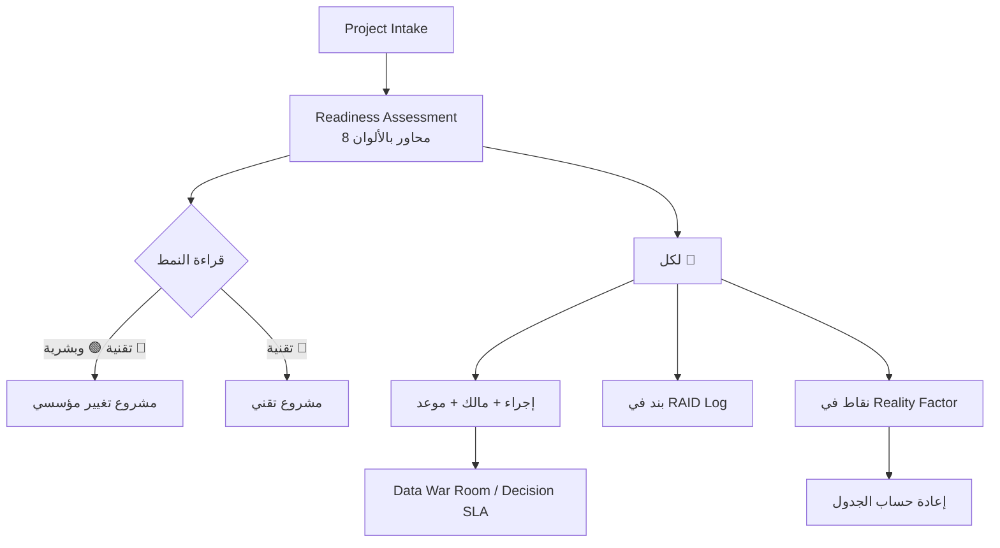

# تقييم الجاهزية (Readiness Assessment)

> [!info] تعريف مختصر
> **`Readiness Assessment`** أداة تحوّل الشعور الجماعي بأن «العميل ليس جاهزاً» إلى **جدول مرئي بألوان** يُعرض على الإدارة ويمكن التصعيد به. تُقيّم فيه ثمانية محاور — الرعاية التنفيذية، وجاهزية البيانات، وتوفّر المستخدمين الرئيسيين، وحوكمة القرار، والبنية التحتية، والشبكة، والأمان، وجاهزية التقارير — بمقياس ثلاثي (أخضر/أصفر/أحمر). وقيمتها ليست في التقييم بل في **الترجمة**: كل بند أحمر يجب أن يقابله إجراء وقائي مُسمّى وبند في [[RAID Log]]، وأن يُسعَّر في [[Reality Factor]].

## الشرح العلمي والاحترافي

- **جذر المشكلة — الجاهزية التجارية ≠ الجاهزية التشغيلية**: قد يكون العقد موقَّعاً والميزانية معتمدة والفريق مخصَّصاً — ومع ذلك تكون المؤسسة غير جاهزة تشغيلياً: بياناتها موزّعة، وقرارها متعدّد الملّاك، ولا مؤشّرات لديها تُقاس. والفجوة بين الجاهزيتين هي مقبرة مشاريع الأنظمة المؤسسية.

- **لماذا الألوان لا الدرجات؟** لأن اللون يفرض قراراً بينما الدرجة تسمح بالتفاوض. «7 من 10» عبارة قابلة للتأويل؛ أمّا 🔴 فتستدعي إجراءً. والقاعدة العملية: **كل 🔴 يقابله إجراء وقائي مكتوب ومالك مُسمّى، وإلا فاللون بلا معنى.**

- **قراءة النمط لا الصفوف**: القيمة الحقيقية في توزيع الألوان لا في كل صفّ منفرداً:
  | النمط | التشخيص | العلاج |
  |---|---|---|
  | التقنية 🟢 والبشرية/التنظيمية 🔴 | **مشروع تغيير مؤسسي متنكّر في هيئة مشروع تقني** | حوكمة وتدريب وتنظيف بيانات — لا مزيد من التطوير |
  | التقنية 🔴 والبشرية 🟢 | مشروع تقني حقيقي | تعزيز الفريق الفنّي والبنية |
  | الكلّ 🟡 | **الغليان البطيء**: لا شيء يستدعي إنذاراً وكل شيء يتأخّر | ارفع بنداً إلى 🔴 صراحةً واجعل له مالكاً |

- **الترجمة الرقمية — الجاهزية تُسعَّر**: هذا ما يميّز الأداة عن أي قائمة فحص. البنود الحمراء تدخل مباشرة في حساب [[Reality Factor]]:
  - `Decision Governance` 🔴 ⇒ **+0.4**
  - `Data Readiness` 🔴 ⇒ **+0.4**
  - تعقيد التكامل متوسط ⇒ **+0.2**
  - $$RF = 1.2 + 1.0 = 2.2$$
  
  أي أن ثلاثة بنود في جدول من ثمانية **تضاعف مدّة المشروع كاملاً**. وهذا الرقم هو ما يجعل الإدارة تتصرّف — لا اللون.

- **الإجراءات الوقائية القياسية**:
  | البند الأحمر | الإجراء |
  |---|---|
  | `Data Readiness` | **`Data War Room`** — فريق تنظيف من طرف العميل يبدأ قبل التنفيذ + [[Data Dry Run]] مرّتين |
  | `Decision Governance` | **`Decision SLA`** (48 ساعة) + مالك قرار وحيد + مسار تصعيد |
  | `Reporting Readiness` | تعريف مؤشّرات بـ`Baseline` و`Target` قبل التصميم |
  | `Key Users` | تثبيت نسبة تفرّغ متعاقَد عليها لا وعداً شفهياً |

- **`Data War Room` — ما هو؟** ليس اجتماعاً بل **بنية مؤقتة**: فريق مخصّص من طرف العميل (شخصان غالباً) بمهمّة واحدة هي تنظيف البيانات وتوحيد الأكواد وإزالة التكرار، بقوالب تحميل ثابتة وتاريخ تجميد معلن، ويجتمع يومياً مع فريق التسليم حتى تتجاوز الجاهزية 80%.

- **الفرق عن [[Project Intake]]**: `Intake` يجمع المعطيات (كم فرعاً؟ ما النظام الحالي؟)، و`Readiness` يصدر الحكم (🔴 على البيانات). الأول وصف والثاني تشخيص.

## أين ومتى يُستخدم
- بعد [[Project Intake]] مباشرة وقبل بناء أي جدول زمني أو التزام بتاريخ إطلاق.
- في **اجتماع بدء المشروع** كأداة تفاوض شفافة: عرض الجدول يحوّل النقاش من «لماذا أنتم بطيئون؟» إلى «ما الذي نغيّره معاً؟».
- كمدخل مباشر لحساب [[Reality Factor]] ضمن [[PFRE]].
- عند **كل بوّابة مرحلية** لإعادة التقييم — فالجاهزية تتحسّن أو تسوء، والجدول المتبقّي يُحدَّث تبعاً لها.
- في **مراجعة ما بعد المشروع**: مقارنة التقييم الأول بالدروس المستفادة تكشف أي الأحمر عولج وأيّه أُهمل.

## مثال وسيناريو تطبيقي
> [!example] شركة توزيع — ثلاثة أحمر قبل أن يبدأ شيء
> | المحور | الحالة | الملاحظة |
> |---|---|---|
> | `Executive Sponsorship` | 🟢 | دعم قوي من الرئيس التنفيذي للعمليات |
> | **`Data Readiness`** | 🔴 | تكرار المنتجات واختلاف الأكواد |
> | `Key Users Availability` | 🟡 | محدودية الوقت |
> | **`Decision Governance`** | 🔴 | لا يوجد `SLA` للقرارات |
> | `Infrastructure` | 🟢 | جاهز سحابياً |
> | `Network Stability` | 🟢 | مستقرّة |
> | `Security` | 🟡 | المصادقة الثنائية غير مكتملة |
> | **`Reporting Readiness`** | 🔴 | لا مؤشّرات موحّدة |
>
> **النمط واضح:** كل ما هو تقني أخضر، وكل ما هو بشري وتنظيمي أحمر. والاستنتاج المباشر: **لن يُنقذ المشروعَ مطوّرٌ إضافي.**
>
> **الترجمة الرقمية:** البندان الأحمران الأولان + التكامل المتوسط ⇒ `RF = 2.2` ⇒ مشروع مدّته النظرية 15.5 أسبوعاً يصير **34 أسبوعاً**.
>
> **الأثر بعد عام:** سجلّ الدروس المستفادة للمشروع نفسه سجّل أربعة دروس — تكرار المنتجات، وكثرة طلبات التغيير، وضعف مشاركة الاختبار، وتأخّر اعتماد التقارير بسبب تعدّد أصحاب القرار. **ثلاثة من الأربعة كانت مرصودة في هذا الجدول في الأسبوع الأول.**
>
> **الدرس الحقيقي إذاً:** الأداة لم تفشل — بل مُلئت ولم يُتصرَّف بموجبها. **والأداة التي تُملأ ولا تُنفَّذ أخطر من الأداة الغائبة، لأنها تمنح شعوراً زائفاً بالسيطرة.**

## خطوات أو مخطّط
1. حدّد المحاور الثمانية (أو عدّلها بما يناسب القطاع).
2. قيّم كل محور بدليل لا بانطباع: اطلب عيّنة بيانات، واسأل عن مدّة آخر قرار مماثل.
3. اكتب ملاحظة تفسيرية لكل لون — اللون بلا سبب غير قابل للمناقشة.
4. اقرأ **النمط** العام قبل الصفوف.
5. لكل 🔴: إجراء وقائي + مالك + موعد + بند مقابل في [[RAID Log]].
6. ترجم الأحمر إلى نقاط في [[Reality Factor]] وأعد حساب الجدول.
7. اعرض الجدول والمعامل معاً على الراعي كأساس تفاوض.
8. أعد التقييم عند كل بوّابة مرحلية.

## ⚠️ مفاهيم خاطئة شائعة
> [!warning]
> - **اعتباره حكماً على العميل**: هو تشخيص لبيئة العمل لا اتّهام؛ ويجب أن يُعرض بلغة «كيف نُسرِع معاً».
> - **الظنّ بأن الأخضر في البنية التحتية يعني جاهزية**: البنية أسهل المحاور وأقلّها أثراً على نجاح المشروع.
> - **الاكتفاء بالتقييم دون ترجمة رقمية**: الجدول الملوّن بلا [[Reality Factor]] وثيقةٌ للأرشيف.
> - **الخلط بينه وبين [[RAID Log]]**: التقييم لقطة أولية لبيئة العميل، والسجلّ نظام متابعة مستمرّ. الأول يُغذّي الثاني.
> - **افتراض ثبات التقييم**: الجاهزية متغيّرة — عميل حسّن بياناته يستحقّ جدولاً أقصر فعلياً.
> - **تقييم البيانات بسؤال «هل بياناتكم جاهزة؟»**: الإجابة دائماً نعم. اطلب عيّنة وافحصها بنفسك.

## ❌ ممارسات خاطئة في المشاريع
> [!failure]
> - **إخفاء التقييم عن العميل**: يفقدك أقوى أداة تفاوض ويحوّل الجدول الطويل إلى تعسّف بلا سبب. الحلّ: أدرجه في وثيقة بدء المشروع.
> - **ملؤه ثم عدم التصرّف بموجبه**: أخطر ممارسة على الإطلاق — وهي التي تُنتج «دروساً مستفادة» كانت معروفة من اليوم الأول. الحلّ: لا يُغلق التقييم قبل أن يقابل كل 🔴 بندٌ في `RAID` بمالك وموعد.
> - **تقييم كل شيء أصفر تجنّباً للمواجهة**: يُنتج مشروعاً بلا إنذارات وبتأخير مزمن. الحلّ: اشترط أن يكون في كل تقييم لون واحد على الأقلّ حاسم في اتّجاه أو آخر.
> - **إسناد معالجة البنود الحمراء لفريق التسليم وحده**: أغلبها بيد العميل (بيانات، قرارات، مستخدمون). الحلّ: [[RACI]] صريح لكل إجراء وقائي.
> - **عدم إعادة التقييم بعد المعالجة**: يحرم العميل من مكافأة تحسّنه ويُبقي الجدول متضخّماً. الحلّ: مراجعة عند كل بوّابة وتحديث المعامل علناً.

## 🔗 مصطلحات ومفاهيم ذات صلة
[[Project Intake]] | [[Reality Factor]] | [[RAID Log]] | [[Data Dry Run]] | [[PFRE]] | [[RACI]] | [[SLA]] | [[Lessons Learned]] | [[02 - Readiness Assessment]]
