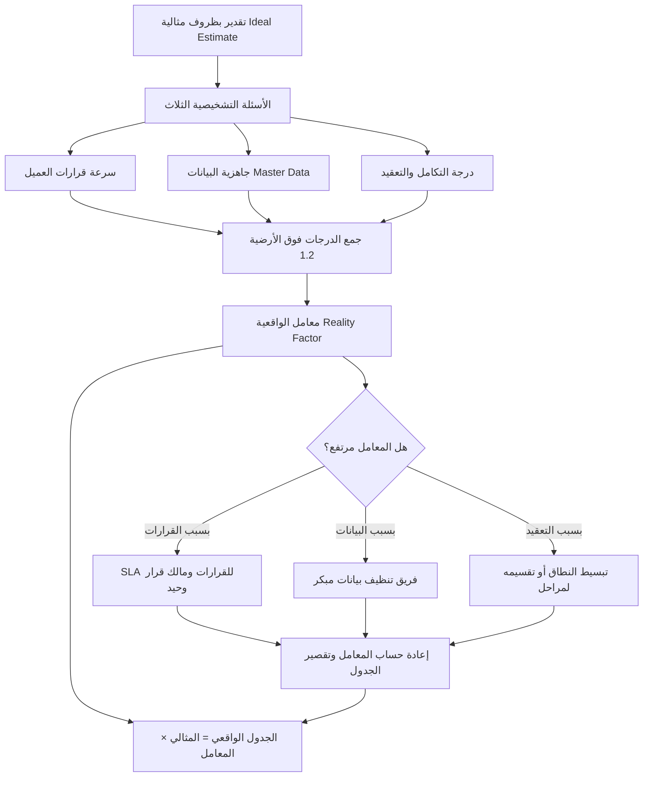

# معامل الواقعية (Reality Factor)

> [!info] تعريف مختصر
> معامل الواقعية (Reality Factor) هو مُضاعِف رقمي يُطبَّق فوق التقدير المبني على "الظروف المثالية" (Ideal-Conditions Estimate) ليعكس واقع بيئة العميل الفعلية: سرعة اتخاذ القرار، وجاهزية البيانات، ودرجة التكامل والتعقيد. لا يُشتقّ هذا المعامل من الحدس، بل من أسئلة تشخيصية محدّدة تُقيَّم وتُجمَع، فيتحوّل التقدير المثالي إلى جدول زمني قابل للتنفيذ. وفائدته مزدوجة: هو في آنٍ واحد أداة تصحيح للتقدير وأداة كشف مبكّر للمخاطر.

## الشرح العلمي والاحترافي
- **جذر المشكلة**: كل فريق تقني يُقدّر العمل افتراضًا أن كل شيء سيسير بسلاسة — العميل يجيب فورًا، البيانات جاهزة ونظيفة، الأنظمة تتكامل من المحاولة الأولى. هذا التقدير المثالي (Ideal Estimate) صحيح تقنيًا وخاطئ عمليًا، لأنه يقيس الجهد لا الزمن المُنقضي (Effort vs Elapsed Time).
- **الفكرة الجوهرية**: بدل تضخيم التقدير عشوائيًا، نُقدّر أولًا بظروف مثالية، ثم نضربه في معامل واقعية مُشتقّ من تشخيص بيئة العميل. الصيغة العملية:
  `التقدير الواقعي = التقدير المثالي × معامل الواقعية`
- **أرضية واقعية دنيا (Realistic Floor)**: لا يكون المعامل 1.0 أبدًا، لأن أي مشروع حقيقي يحمل احتكاكًا لا مفرّ منه (اجتماعات، مراجعات، إجازات، تبديل السياق). الأرضية العملية ≈ **1.2**، ثم يُضاف عليها ما ينتج عن الأسئلة التشخيصية.
- **الأسئلة التشخيصية الثلاث** (كل سؤال يُقيَّم على سلّم من ثلاث درجات: 0.0 / 0.2 / 0.4):
  1. **سرعة قرارات العميل (Client Decision Velocity)**: كم يستغرق العميل ليعتمد قرارًا أو يوقّع على وثيقة؟ يوم واحد → 0.0، أسبوع → 0.2، أسبوعان فأكثر أو لجنة قرار متعددة الأطراف → 0.4.
  2. **جاهزية البيانات (Data Readiness / `Master Data`)**: هل بيانات الأصناف والعملاء والحسابات موجودة، نظيفة، ومُهيكلة بصيغة قابلة للتحميل؟ جاهزة ومُطابَقة → 0.0، موجودة لكن تحتاج تنظيفًا → 0.2، متفرّقة في ملفات Excel وأوراق ودفاتر بلا معيار موحّد → 0.4.
  3. **درجة التكامل والتعقيد (Integration & Complexity)**: كم نظامًا خارجيًا يجب الربط معه، وكم عملية غير قياسية تتطلّب تخصيصًا (Customization)؟ نظام واحد قياسي → 0.0، تكاملان أو تخصيص محدود → 0.2، تكاملات متعدّدة أو أنظمة قديمة (Legacy) بلا واجهات → 0.4.
- **الحساب**: `معامل الواقعية = 1.2 + مجموع درجات الأسئلة الثلاثة`. الحد الأدنى العملي 1.2 والحد الأقصى 2.4. وفي أغلب مشاريع الأنظمة المؤسسية لدى عملاء متوسطي النضج يستقر المعامل حول **2.0** تقريبًا — أي أن الجدول الواقعي ضعف الجدول المثالي.
- **الفائدة المزدوجة (Double Benefit)** — وهي جوهر قيمة الأداة:
  1. **تصحيح التقدير**: يحوّل وعدًا غير قابل للتحقيق إلى التزام يمكن الوفاء به، فيحمي الثقة مع العميل ويحمي الفريق من الإرهاق.
  2. **كشف المخاطر مبكرًا (Early Risk Detection)**: المعامل المرتفع ليس رقمًا نهائيًا بل **إشارة تشخيصية** تدلّك على الرافعة (Lever) الواجب سحبها. المعامل هنا "لوحة عدّادات" لا "وسادة أمان":
     - ارتفاع ناتج عن **بطء القرارات** → الحل: [[SLA]] تعاقدي للقرارات (مثلًا: ردّ خلال 3 أيام عمل وإلا اعتُبر الخيار المقترح معتمَدًا)، وتعيين مالك قرار وحيد (Single Decision Owner).
     - ارتفاع ناتج عن **عدم جاهزية البيانات** → الحل: تشكيل فريق تنظيف بيانات (Data Cleansing Team) من طرف العميل يبدأ العمل بالتوازي قبل انطلاق التنفيذ، مع قوالب تحميل (Templates) وتاريخ تجميد للبيانات.
     - ارتفاع ناتج عن **التعقيد والتكامل** → الحل: تبسيط النطاق أو تقسيمه إلى مراحل ([[Phasing]])، وتأجيل التكاملات غير الحرجة إلى مرحلة لاحقة.
- **الفرق عن الـ [[Buffer]] الأعمى**: الـ Buffer أو [[Contingency Reserve]] هو نسبة إضافية تُضاف غالبًا بلا تفسير ("نضيف 20% احتياطًا")، وهي غير قابلة للدفاع أمام العميل وغير قابلة للتخفيض لأن أحدًا لا يعرف مصدرها. أما معامل الواقعية فهو **تشخيصي ومبني على أدلة (Evidence-Based)**: كل جزء منه مرتبط بسبب مُسمّى، ولذلك يمكن التفاوض عليه وخفضه فعليًا إذا عالج العميل السبب. جملة المفاوضة النموذجية: «المعامل 2.0 لأن قراراتكم تستغرق أسبوعين وبياناتكم غير مُهيّأة؛ عالِجوا الاثنين ويصبح 1.6 ويقصر الجدول شهرًا كاملًا.»
- علاقته بالسرعة الفعلية للفريق: معامل الواقعية يعالج الاحتكاك القادم من **خارج** الفريق، بينما [[18 - Velocity]] يقيس القدرة **الداخلية** على الإنجاز. الخلط بينهما يؤدي إلى معاقبة الفريق على تأخير سببه العميل.

## أين ومتى يُستخدم
- عند إعداد عرض فني ومالي (Proposal) لمشروع تطبيق نظام مؤسسي (ERP/CRM)، لتحويل تقدير الفريق التقني إلى جدول زمني تعاقدي قابل للالتزام.
- في مرحلة ما قبل البيع (Pre-Sales) وأثناء [[Fit-Gap Analysis]]، حيث تكون الأسئلة التشخيصية الثلاث جزءًا من استبيان تقييم جاهزية العميل (Readiness Assessment).
- عند التخطيط لمراحل المشروع (Phase Planning) وتوزيع الجدول الزمني على مراحل، لأن المعامل قد يختلف بين مرحلة وأخرى (مثلًا: مرحلة الترحيل تتأثر بجاهزية البيانات أكثر من مرحلة التدريب).
- في اجتماع بدء المشروع (Kick-off) كأداة تفاوض شفافة مع رعاة المشروع: عرض المعامل ومكوّناته يحوّل النقاش من "لماذا أنتم بطيئون؟" إلى "ما الذي يجب أن نغيّره معًا لنُسرِع؟".
- كمصدر لتغذية [[RAID Log]] وسجل المخاطر: كل بند رفع المعامل يُسجَّل مخاطرة صريحة لها مالك وخطة استجابة ضمن [[19 - Risk Management]].
- عند مراجعة الأداء بعد المشروع (Retrospective / [[Estimation Variance]])، لمقارنة المعامل المُقدَّر بالمعامل الفعلي وتحسين المعايرة في المشاريع القادمة.

## مثال وسيناريو تطبيقي
> [!example] شركة تنفيذ أنظمة تعمل على تطبيق نظام ERP لعميل صناعي متوسط الحجم. قدّر الفريق التقني العمل بظروف مثالية: **المرحلة الأولى** (المالية والمشتريات) = 6–7 أسابيع، و**المرحلة الثانية** (المخازن والإنتاج والتكامل مع نظام الحضور) = 9–10 أسابيع. أي إجمالي مثالي ≈ 15–17 أسبوعًا (نحو 4 أشهر) — وهو الرقم الذي كاد مدير المبيعات أن يَعِد به العميل.
>
> طبّق مدير المشروع الأسئلة التشخيصية الثلاث:
> - **سرعة القرارات**: كل اعتماد يمرّ على لجنة تجتمع كل أسبوعين → **0.4**
> - **جاهزية البيانات**: بيانات الأصناف موزّعة على 11 ملف Excel بترميزات مختلفة، وأرصدة افتتاحية غير مُطابَقة → **0.4**
> - **التكامل والتعقيد**: تكامل مع نظام حضور قديم بلا واجهة برمجية، وتخصيص لدورة اعتماد مشتريات غير قياسية → **0.4**
>
> **المعامل = 1.2 + 0.4 + 0.4 + 0.4 = 2.4** — وبعد التفاوض على تخفيف بند التعقيد (تأجيل تكامل الحضور) استقرّ عمليًا عند **2.0**.
>
> **إعادة الحساب**: المرحلة الأولى 6–7 أسابيع × 2 = **12–14 أسبوعًا**؛ المرحلة الثانية 9–10 أسابيع × 2 = **18–20 أسبوعًا**؛ الإجمالي 30–34 أسبوعًا ≈ **7–8 أشهر**.
>
> **الأثر المزدوج**: العميل لم يُصدَم بالرقم لأنه رأى من أين جاء. والأهم أن الجدول تحوّل إلى خطة عمل مشتركة: وُقِّع ملحق يُلزم العميل بردّ خلال 3 أيام عمل ([[SLA]] للقرارات)، وشُكّل فريق تنظيف بيانات من موظفَين لدى العميل بدأ قبل الانطلاق بأربعة أسابيع، وأُجِّل تكامل الحضور إلى مرحلة ثالثة. عند المراجعة بعد ستة أشهر، كان المعامل الفعلي 1.9 — أي أن التقدير أصاب، والمشروع سُلِّم دون تمديد تعاقدي.

## خطوات أو مخطّط
1. تقدير العمل بظروف مثالية أولًا، دون أي إضافات دفاعية أو احتياطات مخفية (تقدير الجهد الصافي).
2. طرح الأسئلة التشخيصية الثلاث على العميل بأدلة لا بانطباعات: اطلب عيّنة بيانات، واسأل عن مدة اعتماد آخر قرار مماثل، واحصر الأنظمة المطلوب الربط معها.
3. تسجيل درجة كل سؤال (0.0 / 0.2 / 0.4) وتوثيق سبب الدرجة كتابيًا.
4. حساب المعامل: `1.2 + مجموع الدرجات`.
5. ضرب تقدير كل مرحلة في المعامل للحصول على الجدول الزمني الواقعي.
6. قراءة المعامل تشخيصيًا: تحديد البند الأعلى وتسمية الرافعة العلاجية المقابلة له (SLA للقرارات / فريق تنظيف بيانات / تبسيط أو تقسيم النطاق).
7. تحويل كل بند مرتفع إلى مخاطرة مُسجَّلة في [[RAID Log]] لها مالك وخطة استجابة.
8. عرض المعامل ومكوّناته على العميل كأساس تفاوض: خفض السبب يخفض المعامل ويقصر الجدول.
9. إعادة معايرة المعامل عند نهاية كل مرحلة بمقارنته بالواقع الفعلي، وتغذية المشاريع القادمة بالنتيجة.

## ⚠️ مفاهيم خاطئة شائعة
> [!warning]
> - **الظن بأن معامل الواقعية مجرد "تضخيم للتقدير" لحماية الفريق**: هو عكس ذلك تمامًا؛ التضخيم يخفي الأسباب، بينما المعامل يكشفها ويجعلها قابلة للمعالجة والتخفيض.
> - **الخلط بينه وبين الـ [[Buffer]] أو [[Contingency Reserve]]**: الاحتياطي يغطي مخاطر غير معروفة بنسبة عامة، أما معامل الواقعية فيعالج احتكاكًا **معروف السبب ومُسمّى**. وهما لا يلغيان بعضهما: يمكن أن يبقى احتياطي صغير للمجهول بعد تطبيق المعامل.
> - **اعتبار المعامل رقمًا ثابتًا يُطبَّق على كل العملاء**: المعامل خاصية بيئة العميل لا خاصية الفريق؛ نفس الفريق قد يعمل بمعامل 1.4 مع عميل ناضج و2.4 مع عميل غير مُهيّأ.
> - **الاعتقاد أن المعامل يساوي 1.0 مع عميل ممتاز**: لا يوجد مشروع بلا احتكاك؛ الأرضية 1.2 تمثّل التكلفة الحتمية للتنسيق والمراجعة وتبديل السياق.
> - **قراءة المعامل كحكم على العميل**: هو تشخيص لبيئة العمل لا اتهام لأحد، ويجب أن يُعرض بلغة "كيف نُسرِع معًا" لا بلغة اللوم.
> - **الظن بأنه بديل عن التخطيط التفصيلي**: المعامل يعاير التقدير ولا يصنعه؛ تقدير مثالي رديء مضروبًا في معامل دقيق يبقى تقديرًا رديئًا.

## ❌ ممارسات خاطئة في المشاريع
> [!failure]
> - **الوعد بالتقدير المثالي أمام العميل لكسب الصفقة**: يُنتج جدولًا يسقط في الشهر الثاني ويستهلك رصيد الثقة كاملًا. الحل: عرض التقدير المثالي والمعامل معًا في العرض الفني، وشرح أن الرقم النهائي هو الالتزام التعاقدي الوحيد.
> - **تطبيق المعامل سرًّا دون إطلاع العميل على مكوّناته**: يفقدك أقوى ورقة تفاوض ويجعل الجدول يبدو تعسفيًا. الحل: إظهار جدول الدرجات الثلاث وأسبابها في وثيقة بدء المشروع.
> - **حساب المعامل مرة واحدة ثم نسيانه**: الظروف تتغيّر — قد يتحسّن العميل أو يسوء. الحل: مراجعة المعامل عند كل بوابة مرحلية (Stage Gate) وتحديث الجدول المتبقّي بناءً عليه.
> - **استخدام المعامل كغطاء لتأخير سببه الفريق نفسه**: خلط الاحتكاك الخارجي بضعف الأداء الداخلي يمنع علاج المشكلة الحقيقية. الحل: الفصل الصريح بين معامل الواقعية (خارجي) و[[18 - Velocity]] (داخلي) في تقارير الحالة.
> - **رفع المعامل بدل معالجة سببه**: قبول معامل 2.4 دون محاولة خفضه يعني بيع الوقت بدل حل المشكلة. الحل: لكل بند تجاوز 0.2، خطة علاجية مُسمّاة ومالك من طرف العميل.
> - **إهمال توثيق المعامل الفعلي بعد التسليم**: يحرم المؤسسة من قاعدة معايرة تراكمية. الحل: تسجيل المعامل المُقدَّر مقابل الفعلي ضمن [[Estimation Variance]] لكل مشروع مُنجَز.

## 🔗 مصطلحات ومفاهيم ذات صلة
[[Fit-Gap Analysis]] | [[Buffer]] | [[Contingency Reserve]] | [[Estimation Variance]] | [[18 - Velocity]] | [[RAID Log]] | [[19 - Risk Management]]
