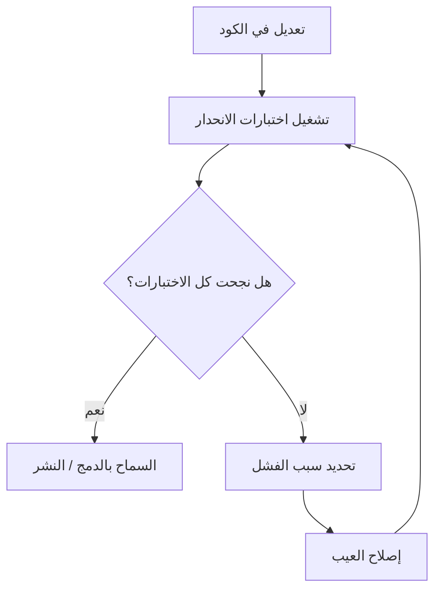

# اختبار الانحدار (Regression Testing)
> [!info] تعريف مختصر
> اختبار الانحدار هو إعادة تشغيل اختبارات سبق أن نجحت، بعد أي تعديل على الكود، للتأكد من أن التعديل الجديد لم يُفسد وظائف كانت تعمل بشكل صحيح من قبل.

## الشرح العلمي والاحترافي
- الفكرة الأساسية: أي تغيير في الكود (إصلاح عيب، إضافة ميزة، تحسين أداء، تحديث مكتبة) قد يُحدث أثرًا جانبيًا غير مقصود في جزء آخر من النظام لم يكن الهدف من التغيير.
- اختبار الانحدار لا يبحث عن عيوب جديدة، بل يتحقق من أن "ما كان يعمل ما زال يعمل".
- يُبنى عادة على مجموعة اختبارات (Regression Suite) تتراكم مع الوقت: كل مرة يُكتشف فيها عيب ويُصلَح، يُضاف اختبار جديد لهذه المجموعة كي لا يتكرر نفس العيب مستقبلًا (عيب يُعاد ظهوره يُسمى Regression Bug).
- كلما كبر المشروع كبرت مجموعة اختبارات الانحدار، لذلك يصعب تشغيلها يدويًا باستمرار، وهنا تظهر أهمية الأتمتة (Test Automation) ودمجها ضمن خطوط CI/CD (انظر [[CI and CD]]) بحيث تُشغَّل تلقائيًا مع كل تغيير في الكود.
- يرتبط ارتباطًا وثيقًا بمفهومي [[QA vs QC]] و[[Shift-Left and Shift-Right]]: كلما بُدئ الاختبار مبكرًا وتكرر بشكل متكرر، انخفضت كلفة اكتشاف الانحدار.

## أين ومتى يُستخدم
- في جميع المنهجيات تقريبًا، لكنه أساسي في Agile وScrum حيث تتكرر التسليمات كل Sprint (انظر [[14 - Sprint]])، فكل سبرنت جديد قد يُدخل تغييرات تكسر ميزات سابقة.
- يُنفَّذ عادة في المراحل التالية:
  1. بعد إصلاح أي عيب (Bug Fix).
  2. قبل كل إصدار (Release) أو نشر جديد.
  3. ضمن كل تشغيل لخط CI/CD تلقائيًا عند كل Commit أو Pull Request.
  4. قبل [[UAT]] كبوابة تأكيد أن النظام مستقر.

## مثال وسيناريو تطبيقي
> [!example] في تطبيق تجارة إلكترونية، عمل فريق التطوير على إضافة خاصية "الدفع بالتقسيط". أثناء التطوير، عدّل أحد المبرمجين ملف حساب الأسعار (Pricing Service) المشترك بين شاشة السلة وشاشة الدفع. بعد الدمج، شغّل فريق الجودة مجموعة اختبارات الانحدار الآلية المكوّنة من 340 اختبارًا، فاكتشفوا أن حساب الخصم عند استخدام كوبونات الخصم في السلة أصبح خاطئًا رغم أن أحدًا لم يقصد المساس بهذه الميزة. تم إصلاح الخطأ قبل الإصدار للعملاء، وأُضيف اختبار جديد خاص بحالة "كوبون + تقسيط" إلى مجموعة الانحدار لمنع تكرارها.

## خطوات أو مخطّط
1. بناء مجموعة اختبارات انحدار تغطي الوظائف الحرجة (Critical Path) في النظام.
2. عند أي تعديل في الكود، تشغيل المجموعة كاملة أو جزء منها حسب المخاطر (انظر [[Risk-Based Testing]]).
3. تحليل النتائج: أي اختبار فشل يجب تصنيفه (عيب حقيقي أم اختبار قديم غير محدَّث؟).
4. إصلاح العيوب المكتشَفة، وإضافة اختبار جديد لكل عيب انحداري تم اكتشافه لاحقًا.
5. دمج مجموعة الانحدار ضمن خط CI/CD لتشغيلها تلقائيًا مع كل تغيير.

## ⚠️ مفاهيم خاطئة شائعة
> [!warning]
> - يظن البعض أن اختبار الانحدار هو نفسه [[Smoke Testing]]؛ في الحقيقة الدخان اختبار سريع وسطحي للتأكد أن النظام "يعمل أصلًا"، بينما الانحدار أشمل وأعمق ويغطي الوظائف الحرجة تفصيليًا.
> - يظن البعض أنه يكفي اختبار الميزة الجديدة فقط دون التأكد من الميزات القديمة، وهذا خطأ لأن معظم الأعطال في الإنتاج تنتج عن آثار جانبية غير متوقعة.
> - الاعتقاد بأن اختبار الانحدار اليدوي كافٍ للمشاريع الكبيرة؛ في الواقع يصبح مكلفًا وبطيئًا مع الوقت، ولهذا تُفضَّل الأتمتة.

## ❌ ممارسات خاطئة في المشاريع
> [!failure]
> - عدم تحديث مجموعة اختبارات الانحدار بعد اكتشاف عيوب جديدة، فتتكرر نفس الأخطاء في إصدارات لاحقة. الحل: قاعدة "كل عيب مُصلَح = اختبار جديد يُضاف".
> - تشغيل اختبارات الانحدار فقط قبل الإصدار النهائي بدلًا من تشغيلها باستمرار، ما يجعل اكتشاف المشاكل متأخرًا ومكلفًا. الحل: دمجها في CI/CD لتشغيل تلقائي متكرر.
> - تضخّم مجموعة الاختبارات دون مراجعة، فتصبح بطيئة جدًا ويتجاهلها الفريق. الحل: مراجعة دورية وحذف أو دمج الاختبارات المكررة أو غير المجدية.

## 🔗 مصطلحات ومفاهيم ذات صلة
[[QA vs QC]], [[Smoke Testing]], [[CI and CD]], [[Risk-Based Testing]], [[UAT]], [[Shift-Left and Shift-Right]], [[Reopen]], [[Rework Percentage]], [[20 - Quality Management]]
