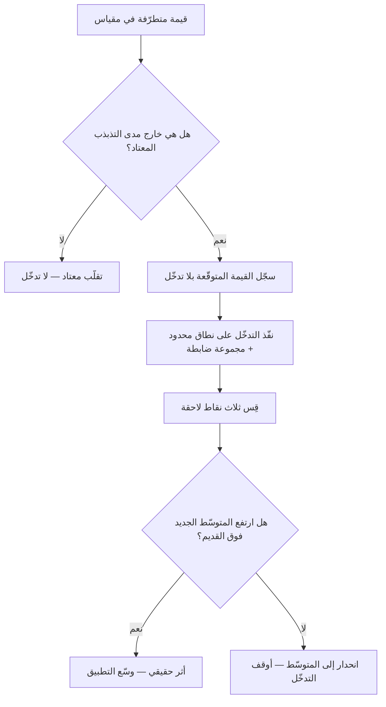

# الانحدار إلى المتوسّط (Regression to the Mean)

> [!info] تعريف مختصر
> **الانحدار إلى المتوسّط** ظاهرة إحصائية مؤدّاها أن القياس المتطرّف — الأعلى بكثير أو الأدنى بكثير — يميل في المرّة التالية إلى الاقتراب من متوسّطه المعتاد، لا لأن شيئًا أُصلح أو فسد، بل لأن جزءًا من تطرّفه كان **حظًّا** لا مهارةً ولا خللًا، والحظّ لا يتكرّر بالقدر نفسه. وخطره على الإدارة أنه **يصنع أدلّة زائفة على نجاعة التدخّلات**: فمن تدخّل عند أسوأ نتيجة رأى تحسّنًا حتميًّا ونسبه إلى تدخّله، ومن تدخّل عند أفضل نتيجة رأى تراجعًا ونسبه إلى تدخّله أيضًا.

## الشرح العلمي والاحترافي

- **الأصل التاريخي:** رصد فرانسيس جولتون في القرن التاسع عشر أن أبناء الآباء الطوال أقصر من آبائهم في المتوسّط، وأبناء القصار أطول — وسمّى ذلك «الانحدار نحو الوسط». ثم صار أحد أعمدة القراءة الإحصائية، وشرحه دانيال كانمان في *التفكير السريع والبطيء* بمثال صار مشهورًا في أدبيات الإدارة: مدرّبو الطيران الذين لاحظوا أن الثناء على الطيّار بعد أدائه الممتاز يُتبَع بأداء أسوأ، وأن التوبيخ بعد أدائه السيّئ يُتبَع بأداء أفضل — فاستنتجوا أن التوبيخ أنفع من الثناء، **وهو استنتاج لا يلزم من البيانات أصلًا**، لأن كلتا الحركتين تقع بلا تدخّل.
- **الشرط الذي يُنتج الظاهرة:** أن يحمل القياس **مكوّنًا عشوائيًّا** — وكل مقاييس الأداء البشري والتنظيمي تحمله. فقيمة أي قياس = مستوى حقيقي مستقرّ + تقلّب عارض. والتطرّف يقع غالبًا حين يجتمع المستوى الحقيقي المرتفع **مع** تقلّب عارض في الاتّجاه نفسه؛ وفي المرّة التالية لا يتكرّر التقلّب العارض غالبًا، فتظهر «عودة».
- **مقدار الانحدار يتناسب عكسًا مع ثبات المقياس.** فالمقياس عالي الضجيج ينحدر كثيرًا، والمقياس المستقرّ ينحدر قليلًا. ولذلك تكون **العيّنات الصغيرة أشدّ عرضة له**: سرعة فريق في سبرنت واحد أشدّ تقلّبًا من متوسّط ثلاثة أشهر.
- **لماذا يُعدّ فخًّا إداريًّا تحديدًا؟** لأن التدخّل الإداري يُطلَق بطبيعته **عند الطرف**: يُراجَع الفريق حين تنهار سرعته، ويُكافأ حين تقفز. فالتوقيت نفسه يضمن أن يُتبَع التدخّل بحركة نحو المتوسّط، فيبدو كل تدخّل عند الأسوأ ناجحًا وكل تدخّل عند الأفضل مُفسدًا. **وهذه أخطر آثاره: أنه يمنح أدلّة مطمئنّة لممارسات لا أثر لها، ويُشكّك في ممارسات نافعة.**
- **علاقته بالسببية:** هو صورة خاصّة من [[Correlation vs Causation|الخلط بين الارتباط والسببية]]، مصدرها أن **زمن التدخّل مرتبط بقيمة القياس** — وهذا انحياز اختيار في التوقيت لا في العيّنة.
- **كيف يُعزَل أثره؟** بمجموعة ضابطة تُقاس في الفترة نفسها بلا تدخّل، أو بمقارنة القيمة اللاحقة **بالمتوسّط التاريخي** لا بالقيمة المتطرّفة، أو بتأخير الحكم إلى عدّة قياسات. وأبسطها عمليًّا: **قِس ثلاث نقاط لا نقطتين.**

## أين ومتى يُستخدم

- عند قراءة سرعة الفريق ([[Velocity]]) بعد سبرنت شاذّ صعودًا أو هبوطًا، وقبل بناء أي قرار على السبرنت الواحد.
- في تقييم أثر أي تدخّل أُطلق **ردًّا على أزمة**: تغيير في العملية بعد شهر عيوب مرتفع، أو إعادة هيكلة بعد ربع ضعيف.
- في مراجعات الأداء الفردية، حيث يُقارَن الموظّف بربعه الأفضل أو الأسوأ لا بمستواه المعتاد.
- عند تقييم مورّد بعد حادثة انقطاع كبيرة، أو بعد شهر أداء استثنائي — وهو موضع أشيع مما يُظنّ في [[Vendor Scorecard|بطاقات تقييم المورّدين]].
- في قراءة أي مقياس ذي تباين عالٍ: [[Escaped Defect Rate|معدّل العيوب المُفلتة]]، وزمن الاستجابة للحوادث، ومعدّلات التحويل في فترات قصيرة.

## مثال وسيناريو تطبيقي

> [!example] سيناريو ملموس
> فريق يعمل بسبرنتات من أسبوعين، ومتوسّط سرعته المعتاد نحو 32 نقطة، ويتذبذب بين 26 و38 بحكم اختلاف طبيعة العمل والإجازات والحوادث الطارئة.
> في السبرنت الحادي عشر هبطت السرعة إلى **19 نقطة** — بسبب انقطاع في بيئة الاختبار يومين، وإجازة مطوّرَين تصادفتا.
> استدعى المدير الفريق، وأدخل «اجتماع متابعة يومي إضافي مع الإدارة» و«لوحة التزام أسبوعية». وفي السبرنت التالي ارتفعت السرعة إلى **34 نقطة**. فأُعلن نجاح التدخّل، وعُمّم على ثلاثة فرق أخرى.
> **والحقيقة أن 34 هي المتوسّط المعتاد تقريبًا**، وأن الرقم كان سيرتفع بلا أي تدخّل لأن سببي الهبوط — الانقطاع والإجازتان — قد زالا. ولمّا عُمّم الإجراء على فرق كانت تعمل عند متوسّطها، لم ترتفع سرعتها، بل نقص من وقتها اجتماعان أسبوعيًّا.
> **والفحص الذي كان يكشف هذا قبل التعميم سؤال واحد:** هل ارتفعت السرعة فوق المتوسّط التاريخي، أم عادت إليه؟

## خطوات أو مخطّط

1. **احسب المتوسّط التاريخي ومدى التذبذب المعتاد** لكل مقياس تراقبه — ولا تكتفِ بآخر قيمة.
2. **عند رؤية قيمة متطرّفة، اسأل أوّلًا: كم يبعد هذا عن المدى المعتاد؟** فما دخل ضمن التذبذب المعتاد ليس حدثًا.
3. **افصل التوقيت عن القرار:** لا تُطلق تدخّلًا في اليوم الذي رأيت فيه القيمة المتطرّفة؛ انتظر قياسًا ثانيًا يؤكّد أنّ ما تراه اتّجاه لا نتوء.
4. **إن لزم التدخّل فورًا، فسجّل توقّعك مكتوبًا**: ما القيمة التي تتوقّعها بلا تدخّل؟ ثم قارن بها لا بالقيمة المتطرّفة.
5. **قارن بالمتوسّط لا بالطرف**: نجاح التدخّل أن يرتفع **المتوسّط الجديد** فوق القديم، لا أن تعود قيمة واحدة.
6. **استعمل مجموعة ضابطة حيث أمكن**: فريق مشابه لم يُطبَّق عليه التدخّل في الفترة نفسها.
7. **راقب ثلاث نقاط فأكثر** قبل إعلان النتيجة، وانظر [[Control Chart|مخطّط التحكّم]] لتمييز التقلّب المعتاد من التغيّر الحقيقي.

## ⚠️ مفاهيم خاطئة شائعة

> [!warning]
> - **الظنّ أنه قوّة تجذب الأمور إلى الوسط**: لا توجد آلية فيزيائية تسحب القيم؛ الظاهرة نتيجة حسابية لوجود عشوائية في القياس، لا سبب فاعل.
> - **الظنّ أنه يعني أن الجميع سيصير متوسّطًا**: الانحدار يقع على **القياس** لا على **المستوى الحقيقي**. فالفريق المتميّز يبقى فوق المتوسّط العام، وإنما ينحدر قياسه المتطرّف نحو متوسّطه هو.
> - **الخلط بينه وبين [[Regression Testing|اختبار الانحدار]]**: التشابه في اللفظ العربي والإنجليزي محض؛ فذاك اختبار يتحقّق من أن التغيير لم يكسر ما كان يعمل، ولا صلة له بهذا.
> - **الظنّ أنه يُبطل كل تقييم للتدخّلات**: لا يُبطلها، بل يشترط لها تصميمًا أفضل — مجموعة ضابطة، أو مقارنة بالمتوسّط، أو عدّة قياسات.
> - **حصره في الأرقام الكبيرة**: أثره **أشدّ** في العيّنات الصغيرة والفترات القصيرة، وهي أكثر ما يُقرأ في إدارة المشاريع.

## ❌ ممارسات خاطئة في المشاريع

> [!failure]
> - **إطلاق مبادرة تحسين فور أسوأ قياس ثم إعلان نجاحها بعد قياس واحد**: التحسّن كان واقعًا بلا المبادرة، فتُعمَّم ممارسة بلا أثر وتُستهلك بها طاقة الفرق. **التجنّب:** سجّل التوقّع بلا تدخّل قبل التنفيذ، وقارن به.
> - **مكافأة الفريق أو الموظّف على القياس الاستثنائي وحده**: القياس التالي سينخفض غالبًا، فتُقرأ العودة الطبيعية عقوبةً على التراخي أو أثرًا للاغترار. **التجنّب:** اربط التقدير بالمتوسّط عبر فترة، أو بجودة القرار لا بنتيجته المفردة.
> - **إعادة هيكلة فريق بعد ربع واحد ضعيف**: أعلى الإجراءات كلفةً يُبنى على أقلّ الأدلّة ثباتًا، ثم تُنسب العودة الطبيعية إلى الهيكلة فتتكرّر. **التجنّب:** اشترط ثلاثة قياسات متتابعة قبل قرار بنيوي.
> - **استبدال المورّد بعد حادثة واحدة كبيرة**: الحوادث الكبيرة نادرة بطبعها، واحتمال تكرارها في الفترة التالية منخفض أصلًا. **التجنّب:** قيّم المورّد بسجلّ فترة كاملة، وافصل شدّة الحادثة عن تكرارها.
> - **قراءة لوحات المقاييس نقطةً نقطةً في اجتماع أسبوعي**: يُنتج هذا سلسلة تدخّلات متعاكسة تلاحق الضجيج فتزيده. **التجنّب:** اعرض المقياس خطًّا مع حدود التذبذب المعتاد، لا رقمًا مفردًا.

## 🔗 مصطلحات ومفاهيم ذات صلة

[[Correlation vs Causation]] | [[McNamara Fallacy]] | [[Control Chart]] | [[Percentiles and Median vs Average]] | [[Estimation Variance]] | [[Cognitive Bias]] | [[Base Rate]] | [[18 - Velocity]] | [[Simpson's Paradox]]
